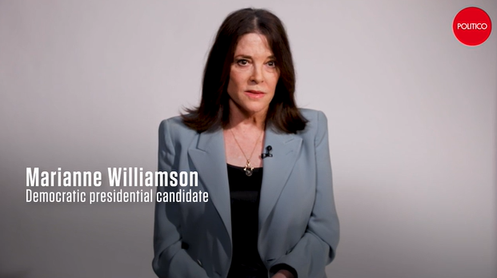

# 美总统参选人：中国周边有313个美军基地，到底谁对全球安全威胁更大

（观察者网讯）自6月初，美媒和美政客便联合炒作“中国在古巴搞间谍活动”话题。近日，2024年美国总统选举民主党籍参选人玛丽安娜·威廉森（Marianne
Williamson）参加节目时被问及相关问题。对于若当选总统将如何回应的提问，威廉森反问道：“你知道，美国在中国周围有多少个军事基地吗？313个！”

威廉森表示，美国在南海搞了那么多事情，“中国当然会不高兴，就像我们不希望他们来古巴一样”，“看看世界其他国家是如何看待这一点的，各国都在关注伊拉克和阿富汗……他们是会将中国视作全球安全的更大威胁者，还是美国？”

她认为，当今世界已是多极世界，“曾几何时，美国可以为所欲为，但如此行为让美国挥霍了自己的军事权威和道德权威”，“现在的美国不能再满世界充当教师爷了”。

视频来源：@CCTV国际时讯

**威廉森：美国人，该醒醒了**

根据美国广播公司（ABC）旗下WMUR频道发布视频，当地时间6月30日，民主党籍总统参选人玛丽安娜·威廉森参加电视节目“与参选人对话”，同现场选民进行沟通。

期间，有人就所谓“中国在古巴搞间谍活动”话题询问威廉森，如果当选总统，将采取什么策略来应对传闻中的“中国和古巴正就在古巴新建联合军事训练设施进行谈判”？

“你知道，美国在中国周围有多少个军事基地吗？”威廉森告诉提问者，“足足313个”，且美国在80个国家有大约750处军事设施。

_威廉森（左）回答选民提问，视频截图（下同）_

她强调：“美国人该醒醒了，这个世界已经不一样了。事实上，其他国家会说，‘既然你要这样对我们，我们也会开始这么对你’。这就是我们现在生活的世界。”

“我意识到，我相信布林肯国务卿和拜登总统也意识到，这是一个崭新的世界，”威廉森继续称，现在的美国“不能再满世界充当教师爷（can't just go
around telling people what to
do）”。她认为，美国在全世界存在很多“不应存在的”军事设施，“我不相信拥有这么多军事基地可以让我们更安全”。

威廉森承认，美国在南海搞了那么多事情，“中国当然会不高兴，就像我们不希望他们来古巴一样”。

当提问者试图辩驳“美国军事基地并不存在安全威胁意图”时，威廉森的回答直截了当：“看看世界其他国家是如何看待这一点的，各国都在关注伊拉克和阿富汗……你觉得，他们是会将中国视作全球安全的更大威胁者，还是美国？”

威廉森称，若她当选美国总统，她将帮助美国“照镜正冠”。她说：“美国人并不愚蠢……但两党政治体系并不想让美国人看到事情真相。”

威廉森向在场选民表示，如今美国身处一个多极世界，而非单极世界。“曾几何时，美国可以为所欲为，但如此行为让美国挥霍了自己的军事权威和道德权威，并让美国和全世界民众付出了安全和生命的代价。”

“美国必须后退一步，变得更加谦逊。美国不能再继续与世界为敌了。”威廉森如此说道。

**“一名游离在华盛顿主流之外的参选人”**

公开资料显示，玛丽安娜·威廉森出生于1952年，现年70岁。

作为美国知名畅销书作家的威廉森，于2014年投入政坛，以无党派人士身份竞选美国加州第33国会选区美国众议院议员，但未能成功。2019年，威廉森投入美国2020年总统大选，竞争民主党提名资格，后于2020年转而支持民主党参选人桑德斯。2023年3月，威廉森成为首个宣布参加2024年美国总统选举的民主党籍参选人，将与现总统拜登竞争党内初选。

威廉姆森的总统纲领包括，呼吁提高联邦最低工资、对种族不公正进行赔偿、应对气候变化、推进建立全民学前教育和免费大学系统，以及创建“美国和平部”等。

美媒广泛认为威廉森“是一位胜算不大的候选人”。美国《新闻周刊》3月末曾援引一份民调数据指出，威廉姆森的支持率很可能在两位数以下：至多有10%的民主党选民表示，他们“可能”或“肯定”支持她；而支持拜登的比例为73%。

威廉森已经习惯了自己游离于华盛顿主流之外。她5月份接受美国政治新闻网“Politico”采访时称，自己关于竞选公职的想法已经酝酿了几十年。她说，约20年前生活在底特律时，她“看到很多人的生活由于糟糕的公共政策而陷入深深的痛苦”，认为他们是“被操纵”的经济体系的受害者。

威廉森还将自己定位为“局外参选人”，但同时认为，恰恰是因为自己缺乏在华盛顿特区任职的经验，也多了一份“改变制度的勇气”。

《新闻周刊》提到，尽管威廉森的支持率不具备优势，但3月末的民调结果显示，约有52%的民主党初选选民更希望拜登以外的人成为民主党的2024年大选提名人。当前，越来越多的民主党人对于拜登“相对温和的政治立场”感到沮丧，他们希望民主党可以在应对气候变化和经济平等方面推出更强有力的议程。

_威廉森5月接受Politico采访，视频截图_

自《华尔街日报》6月9日最初报道“中国在古巴搞间谍活动”后，美国媒体和政客、议员便联合炒作，并为渲染“中国威胁论”多次更换说辞。对此，我方和古巴方面已多次做出有力驳斥。

在美国，无中生有“中国建设海外军事基地”早就不是什么稀罕事儿。但事实声明，一直痴迷于扩大军事存在、提升武力、为维护霸权不择手段、所作所为严重危害世界和平和地区稳定的国家正是美国自己。

“我们（美国）有约800个海外军事基地，为此花费了数额难以想象的金钱。谁是世界上最不折不扣的‘麻烦制造者’？”美国记者、普利策奖得主西摩·赫什去年在接受媒体采访时问道。在他看来，答案不言而喻：美国。

美国智库昆西负责任治国研究会2021年数据显示，美国在海外80个国家和地区设有750个军事基地，几乎是美国驻外使领馆和使团数量的3倍，遍布亚洲、欧洲、中东、非洲、拉美各个地区，每年运行成本或高达550亿美元。另据半岛电视台报道，这些海外基地中，驻有200名以上军事人员的大型基地有约400个。

**本文系观察者网独家稿件，未经授权，不得转载。**

