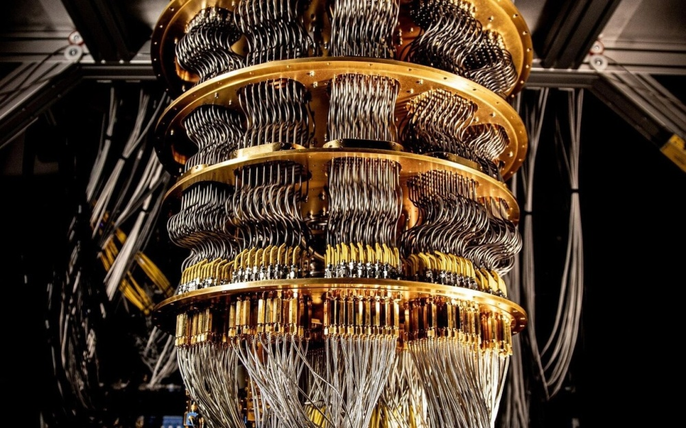
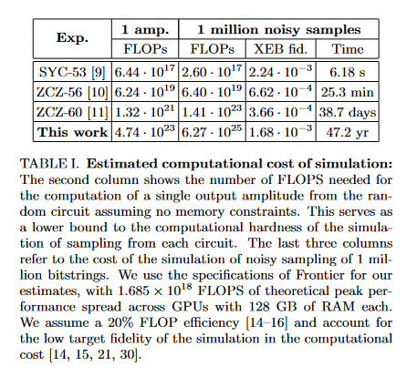

# 谷歌宣布量子计算机新突破：经典超算需47年的任务可在几秒内完成

IT之家 7 月 5 日消息，谷歌科学家近日在 ArXiv 平台上发布预印本论文，表示在量子计算机方面取得重大突破，可以在几秒内完成了一台经典超级计算机需要
47 年才能完成的计算任务。

_图源：谷歌_

谷歌于 2019 年推出了 53 量子位的 Sycamore 处理器，而本次实验进一步升级了 Sycamore 处理器，已提升达到 70 个量子位。

谷歌表示升级 Sycamore 处理器之后，虽然受到相干时间等其它因素的影响，其性能是此前版本的 2.41 亿倍。

在实验中，科学家们执行了随机电路采样任务。在量子计算中，这涉及通过运行随机电路和分析结果输出来测试量子计算机的性能，以评估其在解决复杂问题方面的能力和效率。

谷歌表示业内最先进的超级计算机 Frontier 需要 47.2 年才能计算完成的任务 **，53 个量子位的 Sycamore 处理器只需要 6.18
秒就能完成，而新版 70 个量子位的 Sycamore 处理器速度更快。**

