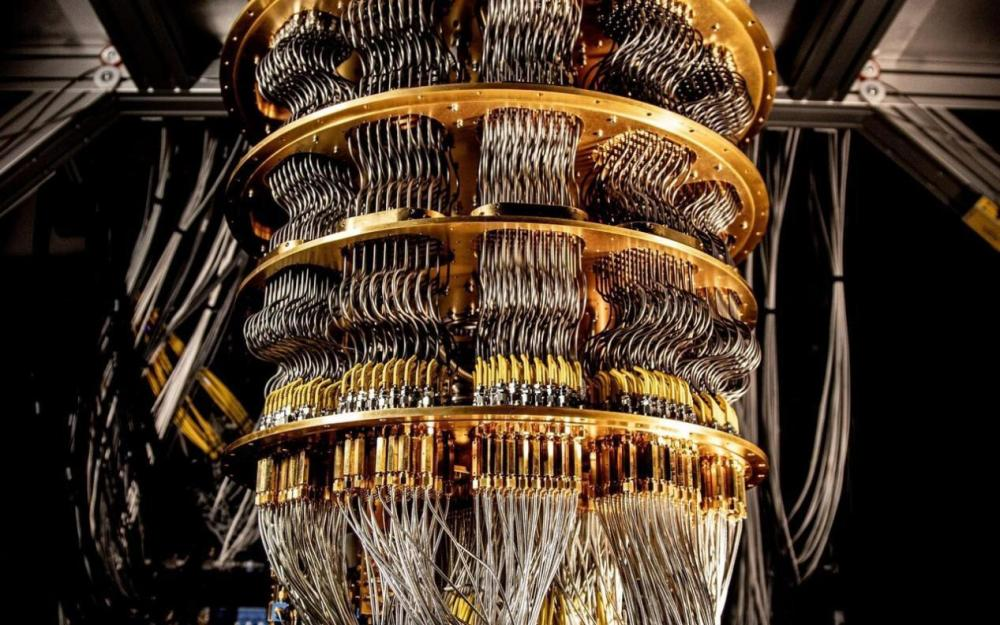

# 谷歌披露量子计算机新突破：比世界最快的超级计算机快“47年”

**划重点**

  * _1_ 谷歌宣布其在量子计算领域取得新突破，其量子计算机可以在短短几秒内完成传统超级计算机47年的计算量。
  * _2_ 谷歌最新的量子计算机名为Sycamore量子处理器，目前拥有70个量子比特。而早期版本只有53个量子比特。
  * _3_ IBM、谷歌和微软等科技巨头以及众多初创公司都在量子计算研究方面取得了重大进展。

腾讯科技讯
谷歌近日宣布其在量子计算领域取得重大突破，其设计的量子计算机可在短短几秒钟内，完成世界上最先进超级计算机需要47年才能完成的计算量。这可能标志着，量子计算技术迎来了里程碑时刻。

量子计算是一门利用量子物理学奇异之处的科学，它仍然是一个快速发展且存在争议的领域。量子计算机在气候科学和药物发现等领域拥有巨大潜力，它们提供的计算速度远远超过传统的同类产品。

**潜在缺点**

然而，这种先进技术并非没有潜在的缺点。量子计算机对当代加密系统构成了重大挑战，因此其也被视为最重要的国家安全问题之一。

争议性的讨论仍在继续。批评者认为，尽管取得了令人印象深刻的里程碑，但这些量子机器仍然需要在学术研究之外展示更多的实用性。

**量子计算机算力惊人**

四年前，谷歌声称自己是第一家实现“量子霸权”的公司，这是量子计算机超越传统计算机的一个里程碑。这在当时受到了竞争对手的质疑，他们认为谷歌夸大了其机器与传统超级计算机之间的区别。

谷歌最新的量子计算机名为Sycamore量子处理器，目前拥有70个量子比特。与早期版本的53个量子比特相比，这是一个巨大的飞跃。增加更多的量子比特可以成倍地提高量子计算机的性能，这使得新处理器的健壮性大约是以前机型的2.41亿倍。

由于每个量子比特可以同时以0、1或两者的状态存在，因此其存储和处理这种量子信息水平的能力，即使是最快的超级计算机也无法匹敌。

谷歌团队在arXiv平台上发布的预印本论文中表示：“量子计算机有望执行超出传统计算机能力的任务。我们根据改进的传统方法估计了计算成本，并证明我们的实验超出了现有传统超级计算机的能力。”

即使是目前最快的传统计算机，如田纳西州的超级计算机Frontier，也无法与量子计算机的潜力相媲美。这些传统超级计算机在二进制代码语言上运行，被限制在0和1的双状态现实中。然而，量子范式超越了这一限制。

**变革性力量**

目前还不确定谷歌量子计算机的制造成本是多少。但无论如何，这一发展肯定会给计算能力带来巨大变化。

例如，根据谷歌团队的说法，Frontier超级计算机只需6.18秒就能完成谷歌53量子比特计算机的计算。然而，同样的机器需要47.2年才能完成谷歌最新70量子比特机器执行的计算。

**量子霸权**

量子计算领域的许多专家都赞扬了谷歌取得的重大进步。总部位于剑桥的量子公司Riverlane的首席执行官史蒂夫·布里尔利(Steve
Brierley)称，谷歌的突破是一个“重大里程碑”。

他还补充说：“关于我们是否已经达到或确实能够达到量子霸权的争论，现在已经解决了。”

同样，苏塞克斯量子技术中心主任温弗里德·亨辛格教授（Winfried Hensinger）也称赞说，谷歌解决了一个难以在传统计算机上计算的特定学术问题。

亨辛格教授说：“他们最近的演示再次有力地证明了，量子计算机正在以稳定的速度发展。”但他强调，即将到来的关键一步将是创造能够纠正其固有操作错误的量子计算机。

虽然IBM尚未对谷歌最近的突破发表评论，但很明显，量子计算领域的这一进展已经引起了全球研究人员和公司的注意。这将为计算技术的发展开辟新的前景和竞争。

**量子计算基础**

量子计算是技术进步的一次显著飞跃，它有可能重新定义我们的计算能力。利用量子物理奇怪而迷人的定律，它可以在解决某些类型的问题上明显优于传统计算机。

传统计算机基于比特运行，比特可以是0或1的状态。另一方面，量子计算机在量子比特上运行，称为量子比特。与传统比特不同，量子比特可以同时以两种状态存在，这要归功于一种被称为叠加的量子原理。

叠加使量子计算机的计算能力呈指数级增长。例如，两个量子比特可以同时存在于四种状态(00、01、10、11)，三个量子比特可以同时存在于八种状态，以此类推。这使得量子计算机可以同时处理大量的可能性。

量子计算机利用的另一个关键量子原理是纠缠。纠缠的量子比特紧密相连，改变一个量子比特的状态，与它纠缠的伙伴的状态也会瞬间改变，不管距离有多远。这一特性使量子计算机能够更有效地处理复杂的计算。

**量子计算机的应用**

量子计算的独特特性使其成为解决传统计算机难以解决的复杂问题的理想选择。

密码学是量子计算可以产生重大影响的一个值得注意的领域。快速分解大数的能力使量子计算机对当前的加密系统构成威胁，但也为开发更安全的量子加密方法打开了大门。

在医学领域，量子计算可以实现复杂分子结构的建模，加速药物的发现。量子模拟可以提供对新材料和新工艺的见解，此前这些新材料和工艺可能需要数年时间才能通过实验发现。

**量子计算面临的挑战**

尽管潜力巨大，但量子计算并非没有挑战。量子态非常微妙，在一段时间内保持这种状态是一个重大挑战，也就是量子相干性。最轻微的环境干扰都会导致量子比特失去状态，这种现象被称为退相干。

量子纠错是另一个艰巨的挑战。由于量子比特的脆弱性，量子计算比传统计算更容易出现错误。开发既不需要大量量子比特、又具备有效纠错方法的量子计算机，仍然是量子计算研究的焦点。

总部位于布莱顿的初创企业通用量子(Universal Quantum)的首席执行官塞巴斯蒂安·威特(Sebastian
Weidt)表示，量子计算机需要展示更多实用功能。

他说:“这是量子霸权的一个很好的证明。虽然在学术上是一个伟大的成就，但所使用的算法并没有真正在现实世界中得到实际应用。我们真的必须进入实用量子计算时代。在这个时代，拥有数千个量子比特的量子计算机实际上开始以传统计算机永远无法实现的方式为社会提供价值。”

**量子计算的未来**

虽然量子计算仍处于起步阶段，但创新的快速步伐预示着一个充满希望的未来。IBM、谷歌和微软等科技巨头以及众多初创公司都在量子计算研究方面取得了重大进展。

在未来几年，我们可以预期量子计算机在功率和可靠性方面继续得到改进。量子霸权（量子计算机在计算能力上超越传统计算机）可能比我们想象的更容易实现。

量子计算代表了一个激动人心的前沿领域，有望帮助我们重塑解决复杂问题的方式。随着研究和开发的持续进行，我们离释放这项变革型技术的全部潜力越来越近。（文/金鹿）

