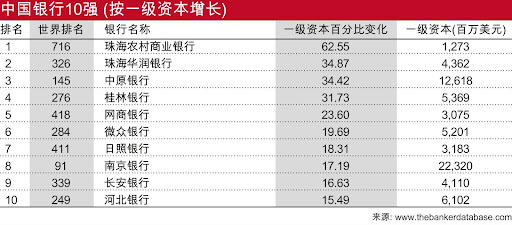

# 2023全球银行1000强排名公布！招商银行榜首，中信银行排名降幅明显

界面新闻记者 | 安震

界面新闻编辑 |

近日，英国《银行家》杂志发布了2023年全球银行1000强排行榜。

总体来看，中国有140家银行上榜，数量与去年相同。尽管受强势美元影响，中国银行的资产总额仍增长1.12%达到42万亿美元，贷款总额增长1.57%达到24.8万亿美元，存款总额增长0.87%达到31.3万亿美元。按总量计算，中国银行业持有全球32.67%的一级资本和27.69%的资产。

具体来看，按照综合排名，招商银行2023年表现最佳，排名第一，工商银行、兴业银行、中国银行、建设银行分列第二至第五位。

相比2022年，排名上升最快的为中国银行，上升了2位，位居第4位；此外，兴业银行、农业银行、浦发银行也分别上升了1位。

相比2022年，排名下降幅度明显的银行是中信银行，综合表现排名从2022年的第三位，下降到了2023年的第7位，下降了4名。

在8项细分排名中，招行夺得盈利能力、风险回报、稳健性、杠杆情况等4项第一；邮储银行获得资产质量、流动性等2项第一；农业银行获得增长规模第一；工商银行获得运营效率第一。

如果按照银行经营核心指标一级资本排名，中国工商银行以4973亿美元的一级资本，连续11年位居榜首，和中国建设银行、中国农业银行及中国银行连续六年蝉联前四名。

值得注意的是，排名中的小型银行正在以更快的速度增长。例如，珠海农村商业银行在2022年的一级资本增长了62.6%，而作为挑战者银行的网商银行和微众银行均增长了20%左右。

从世界银行业整体情况来看，上榜银行总一级资本下降2.08%降至10.2万亿美元，总资产下降1.65%降至151.7万亿美元，而综合税前利润下降6.46%降至1.3万亿美元。

此外，进入2023年排名所需的最少一级资本仅增加了100万美元至5.57亿美元，这是有史以来最小的增幅。

《银行家》总编辑马克奈特表示：“乍看之下，全球银行业似乎经历了艰难的一年，不过增长放缓很大程度上可归因于2022年的强势美元。资产、贷款和存款水平稳定，世界各地的银行资本充足，并为接下来的情况做好了准备。”

自1970年以来，《银行家》杂志公布的一直是比较权威的行业排名，界面新闻注意到，不少银行都会在官网基本情况介绍或招聘启示中写明该行的上年度排名情况。

过去十年，中国银行业一直是全球银行业增长的引擎，但其一级资本总额在2022年减少了1.56%至3.3万亿美元。但如果使用人民币作为基准计算货币，资本总额同比增长了8%左右。

马克奈特表示，尽管美元强势效应显著，但中国在一级资本和资产增长方面仍然继续超越其最接近的竞争对手美国。然而受到宏观形势影响，中国大型银行的增长速度有所放缓。

