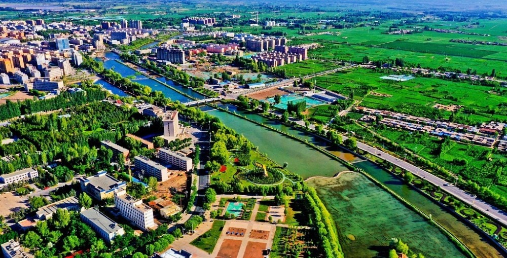
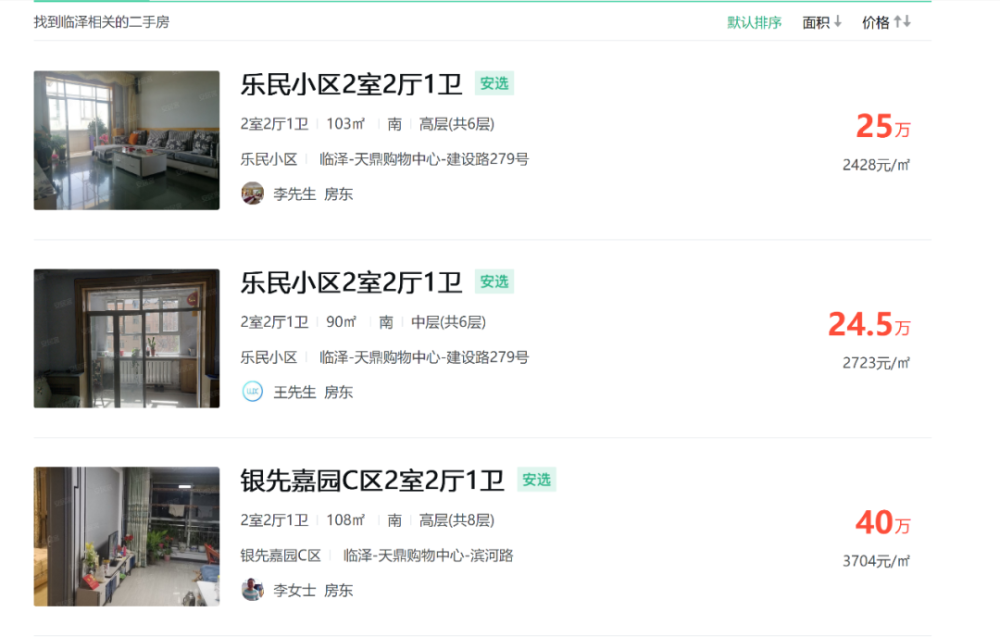

# 一座西部小县的“催生”实践：生二三孩买房送“卧室”，有效果吗

甘肃省张掖市临泽县曾在2021年三孩政策落地后较早地推出一系列生育支持政策，包括发放现金补助、实施购房补贴等。同年12月，中国人口与发展研究中心课题组赴临泽县开展调研，相关调研报告近期刊发在期刊《人口与健康》。

真金白银鼓励生育，有效果吗？课题组在调研中注意到，部分政策的导向性已有成效，比如政策出台后的两个月在县人民医院的分娩人数已经超过了政策出台前九个月的总和。

但亦有部分问题需要正视，如生育养育补贴对最有潜力的一孩生育缺乏有效激励；部分政策“叫好不叫座”，最高4万元的住房奖励在调研时尚无人申请。

**负增长解析：九成为人口外流，低生育只占其一**

临泽县地处河西走廊中部，是典型的西部流出型人口负增长地区。

_临泽县 视觉中国 资料图_

这份报告指出，受经济发达地区尤其是大城市落户政策宽松导致的人口虹吸效应的影响，临泽县人口外流明显，成为临泽县人口负增长的主要成因。第七次人口普查数据显示，临泽县常住人口为11.59万人，比2010年第六次人口普查时的13.43万人减少了1.84万人。由于临泽县大学升学率较高，大量年轻大学生迁出，加上婚嫁迁出，由此导致临泽县户籍人口和常住人口均呈现下降趋势。2020年12月1日至2021年11月30日，全县迁入3751人，迁出4263人，迁出人口较迁入人口多512人。

同时，临泽县面临较为严重的低生育水平问题。第七次人口普查数据显示，2020年临泽县粗出生率为6.5‰，略低于同期全国粗出生率8.52‰，自然增长率为2.01‰，略高于全国的自然增长率1.45‰。这主要因为临泽县的粗死亡率明显要比全国低。

文章作者贺丹、袁涛、黄匡时在报告中分析道，临泽县面临人口外流和低生育率双重压力，其中10%是低生育率因素，90%是人口净迁出因素。因此，制约临泽县人口发展的关键因素是人口外流因素。当然，随着人口老龄化日趋严重，粗死亡率会逐渐增加，人口自然增长率因此转变为负增长，加上日益突出的人口净迁出，人口负增长会日益加剧。

2021年9月，临泽推出系列举措鼓励生娃，如一孩0~3岁能领取到2000元的一次性生育补助，二孩0~3岁总共可以领取1.8万元补助，三孩0~3岁总共可以领取3.5万元补助。此外，临泽县规定生育二孩、三孩的临泽户籍常住家庭，在临泽县城区购买商品房时给予4万元的政府补助等，在各中心集镇、屯泉小镇、丹霞康养村等集中居住区购买商品房时给予3万元的政府补助。

参照当时临泽县城的房价，上述举措还被形容为政府补贴一个卧室。

为何从住房等角度切入？临泽县卫生健康局相关负责人曾于2021年解释，通过分析发现，影响群众生育意愿的主要因素一是住房压力大，二是教育投入大，三是“80后”“90后”夫妻表示，孩子生下来后0~3岁这个时间没有人看管，专门照看小孩的话经济压力又比较大。

中国人口与发展研究中心课题组在报告中认为，临泽县委、县政府的优化生育政策有效地减轻了多子女家庭的养育负担，群众获得感增强，得到社会和当地人民群众的好评。课题组在临泽县调研中发现，部分政策的导向性已经发挥作用，比如政策出台后回到临泽县人民医院分娩的人数有明显增加。在政策出台后的两个月（10~11
月）在县人民医院的分娩人数之和已经超过了政策出台前9个月（1~9
月）的总和。不过，这些出生大多只是分娩地的变化（即分娩地由张掖市的其他区县转移到临泽县），而不是由于政策新增的出生，政策是否带来新增出生还需要持续观察。

澎湃新闻注意到，2018年，临泽县全年出生人口1497人，出生率达到9.98‰；2021全年出生人口817人，出生率降至5.41‰。在前述生育支持措施出台后的2022年，临泽出生人口844人，人口出生率止跌回升至5.63‰。

而在2022年10月1日至2023年4月30日，临泽县卫健局共为240名在该县公立医疗机构分娩的产妇，审核生育津贴70.8万元；为174户在该县公立医疗机构生育二孩、三孩的家庭，审核育儿补贴100.5万元；为173名二孩、三孩家庭审核第二年度育儿补贴95.5万元，累计审核预发放各项优生优育政策资金266.8万元。

**现实问题：住房奖励为何会无人申请**

这篇报告亦指出，临泽县的生育支持政策仍有不少问题值得关注。

首先，其政策覆盖面广但缺乏针对性，推动实现适度生育水平的效果有待观察。

报告提到，临泽县人均可支配收入在全省名列前茅，生活成本较低，人口负增长的主因是人口快速城镇化过程中外出青年生育观念的转变，但当地在引导青年婚育观念、吸引留住外出人口方面还没有针对性政策。这次生育养育补贴采取孩次倒序激励（孩次越高激励越多）的措施主要减轻了现有多子女家庭的生育养育教育负担，而对最有潜力的一孩生育缺乏有效激励。临泽县最近3年（2019~2021年）的一孩生育占比平均只有39.67%，二孩占比平均为
52.4%，三孩占比平均为
7.93%。还有些政策“叫好不叫座”，比如针对二孩和三孩的住房奖励政策，由于很多年轻夫妇在结婚和生育一孩时已经购置商品房，在生育二孩和三孩时几乎很少再购置新房，由此导致针对二孩和三孩的住房奖励出现无人申请的尴尬。

其次，财政投入的可持续性值得关注。经课题组粗略核算，在现行补贴政策下，孩子的生育、托育、幼儿园等费用基本不需要家庭承担。不过，高福利生育支持政策将给临泽县带来较大的财政压力。根据临泽县政府的测算，政策实施5年期间，合计需要1.05亿元，平均每年支付2102万元。对每年财政收入增幅只有1000万元的临泽县而言，财政压力非常大，而“十四五”时期每年需要拿出2000万元左右财政来支持优化生育政策。

调研还发现，临泽县属于农业大县，农忙时节托育机构的需求率非常高，据托育机构介绍，夏忙季节高峰时每天收到200~300个婴幼儿，而冬闲时每天收到的婴幼儿较少。因此，出现“夏忙时照料拥挤而冬闲时资源闲置”的问题；全县幼儿需求向城区集中，导致城区和农村分别出现超额与浪费托位问题。托位和学位需求具有明显区域和季节不均衡的特征。

基于我国不同地区的人口形势、人口负增长的影响因素和财政状况，这份报告认为，应根据不同区域特征挑选一些地区开展优化生育政策试点，确保优化生育政策有针对性，并取得
实效，为全国优化生育政策提供参考。临泽县可作为西部县代表纳入全国试点。

报告呼吁，由于优化生育政策是一项长期性、前瞻性和基础性的系统工程，需要在制度设计上进行顶层设计，避免政策碎片化和区域差异，引导各地在大的政策框架下因地制宜，推动政策落地。

课题组调研还发现，临泽县之所以能出台优化生育政策，主要靠县委书记和县长等党政“一把手”的推动和支持。

“当前和未来的优化生育政策是一个专业性、技术性和政策性很强的系统，绝不是简单的津补贴等激励政策就可以解决的。”课题组表示，因此，亟需开展人口国情教育和优化生育政策培训，提高党政干部的人口管理决策能力。

