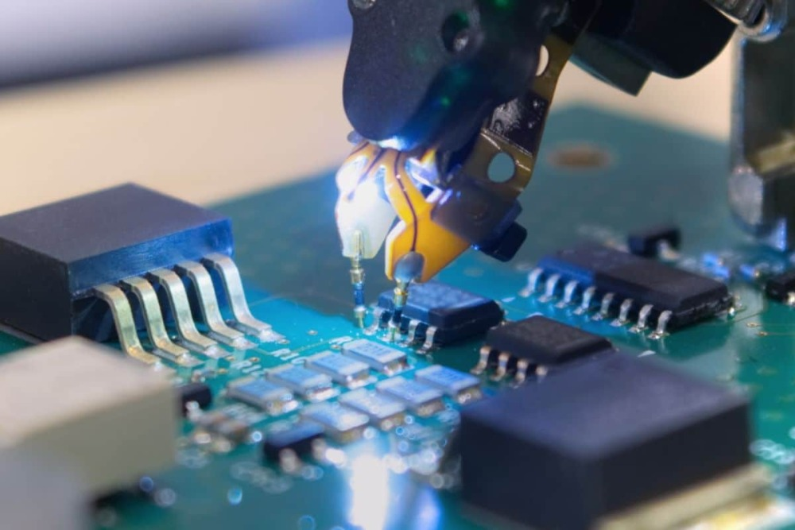

# 下个月建组装厂，印度计划在明年底生产出第一批国产芯片

腾讯科技讯
据媒体报道，援引一位负责新德里100亿美元芯片制造计划的高级政府官员消息，印度将于下个月开始建设其首个半导体组装厂，并将在2024年底之前开始生产该国首批国产的微芯片。

印度电子和信息技术部长阿什温·瓦西诺（Ashwini Vaishnaw）表示，美国半导体公司美光科技（Micron
Technology）正在古吉拉特邦建立一家芯片组装和测试工厂，该项目将于8月开始实施，耗资27.5亿美元。

瓦西诺表示，由莫迪政府牵头的“印度半导体计划”也在做“大量工作”，以争取其他供应链合作伙伴的支持，包括化学品、气体和制造设备的供应商，以及有兴趣设立硅晶圆制造厂的公司。

“这是一个国家建立新产业最快的速度。”瓦西诺在接受媒体采访时说，“我不仅仅是在说成立一家新公司，而是建立整个国家的新产业。”

他补充道：“我们设定的目标是18个月后生产出首批产品，也就是2024年12月。”

这位部长的言论为莫迪政府设定了一个艰巨的任务。近年来，莫迪政府正在努力增强印度在生产智能手机、电池、电动汽车和其他电子产品方面的能力。

新德里最近重新启动了针对芯片制造商的100亿美元补贴计划的竞标，此前包括Vedanta工业集团和富士康在内的三个申请者未能获得政府的支持。

在重新启动申请流程时，印度调整了规格，以寻求生产40纳米或以上的“成熟节点”的厂商的投资，这比它之前要求的更昂贵的28纳米芯片还要大。

瓦西诺表示，官员们正在与十几个申请者进行谈判。“在与我们进行讨论的约14家公司中，有两家非常好，应该能够成功。”但他拒绝提供详细信息。

Vedanta补充说，它和富士康正在“共同努力，以满足政府修订后的指导方针”。富士康拒绝置评。

一些批评者认为，印度政府试图复制整个高要求的行业，设定的门槛太高，而日本和美国等国家已经在该行业占据绝对领先地位。他们表示，相反，印度应该专注于价值链的特定部分，在这些部分，印度已经拥有经过验证的专业知识，包括设计。

瓦西诺驳斥了这一判断，他说印度有“5万多名”半导体设计师，世界上“几乎每一款复杂的芯片”都已经在印度设计。

“这个生态系统已经存在，”他补充道。“下一步是获得晶圆厂，这也是我们的重点。与美光合作是一个非常大的成功。”

美国正在加强与印度在芯片领域的合作，这是在莫迪上个月对华盛顿进行国事访问期间巩固和扩大伙伴关系的一部分。除了美光集团将斥资8亿美元的交易之外，芯片设备制造商Applied
Materials还宣布计划投资4亿美元在班加罗尔建立一个新的工程中心。

审校：小汤

