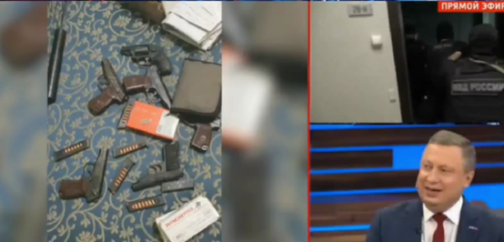
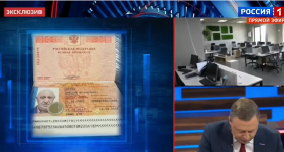
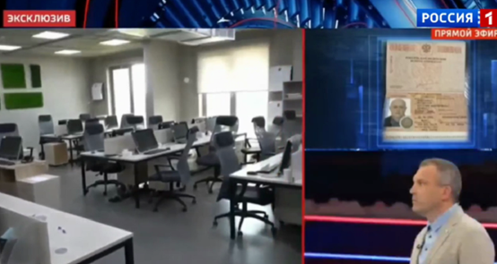
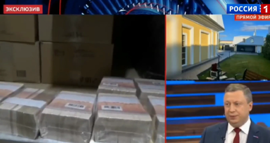
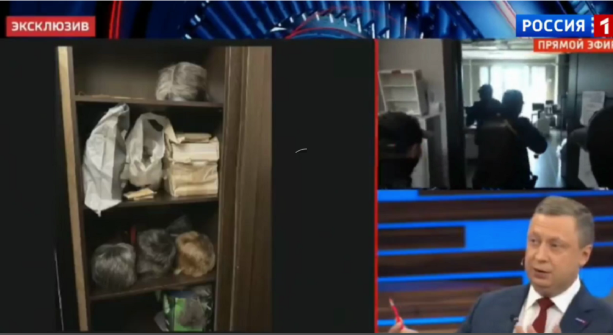

# 俄安全局搜查普里戈任住所办公地画面曝光！“找到假发、大量现金等”

【环球网报道】据俄新社、《俄罗斯商业咨询日报》网站等多家俄媒5日报道，“俄罗斯1”电视台“60分钟”节目播出俄罗斯执法部门搜查“瓦格纳”创始人普里戈任在圣彼得堡住所和办公室的画面，执法人员搜查到假发、大量现金等物品。

_“俄罗斯1”电视台播出执法部门搜查普里戈任在圣彼得堡住所和办公室的画面_

_“俄罗斯1”电视台播出执法部门搜查普里戈任在圣彼得堡住所和办公室的画面_

_“俄罗斯1”电视台播出执法部门搜查普里戈任在圣彼得堡住所和办公室的画面_

_“俄罗斯1”电视台播出执法部门搜查普里戈任在圣彼得堡住所和办公室的画面_

《俄罗斯商业咨询日报》网站描述说，画面显示，俄联邦安全局执法人员进入普里戈任办公室，发现装满钱的纸箱。他们还在搜查地点找到武器和弹药筒、几本护照、假发、金条、现金。

俄罗斯圣彼得堡新闻网站“Fontanka.ru”媒体早些时候消息称，普里戈任被邀请返回俄罗斯，他当地时间4日出现在俄罗斯国家安全局圣彼得堡办公室，取走了此前被没收的武器，其中包括一支俄国防部长绍伊古送给他的手枪。但这一消息尚未得到俄罗斯官方证实。

