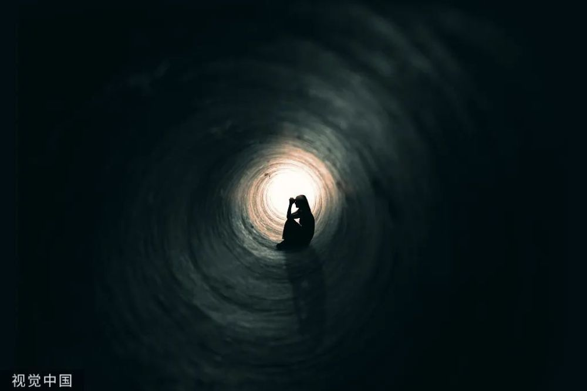

# 媒体曝光李玟轻生细节引争议：报道自杀事件，怎样减少二次伤害？

​歌手李玟因抑郁症不幸去世的消息，让无数网友感到惋惜悲痛。同样令人遗憾乃至愤怒的是，很快就有港媒曝光其轻生细节，其中不乏自杀场景、使用的工具和受伤部位等，这些信息可能会对喜欢李玟的人造成二次伤害，目前在网上引发了新的争议。

_一些学者的讨论和提醒_

自杀事件报道，一直是新闻伦理问题的“重灾区”，《美联社新闻写作指南》中讲得十分明白：“在写作自杀新闻时，不应该详细描述所使用的方法。”

**但在自杀事件中，真相与速度、商业主义与专业主义、公众知情权与个人隐私权的博弈，一直考验着广大媒体和记者。**

_媒体报道来自家属的回应，呼吁外界不要再猜测死因。_

2019年4月17日晚，上海浦东新区一名男孩和母亲争吵后，在卢浦大桥跳桥身亡。在这件事情的报道中，大部分媒体直接放出了整个跳桥身亡的影片资料，没有任何的马赛克。更有极端的自媒体，直接通过揣测，还原了母子二人在车内争吵的整个过程。

2015年，一位14岁的姑娘在自己手臂上割了几十刀。之后，她在家人陪伴下，来到医院就诊。此时记者问她：“你为什么要在自己手臂上弄出这么多的伤，难道不觉得痛吗？”女孩平静地回答：“很舒服！”这则报道几经转发，在网络中的标题就不约而同变成了“自杀很舒服”。

这样的例子数不胜数，近十年来最令人无法理解的案例，也许来自韩国。2013年7月25日，一名韩国男子在社交网站上预告自己将要投江自杀，并于第二日下午跳入汉江身亡。得到消息的韩国某电视台记者，竟然用摄像机“直播”了他投江的整个过程，却没有任何的阻拦行为……

对于自杀事件的报道准则，你可能已经听过许多来自新闻界和学界的总结与反思。本期全媒派整理了国内外一些自杀干预机构、记者协会、媒体机构的报道准则和调查结论，希望提供更多来自专业背景的报道建议，降低因新闻报道不当而产生的二次伤害隐患。

一、报道自杀事件，应该主张或避免的事情

**1.考虑新闻报道可能对受众带来的影响**

你的故事可能会对易受伤害的人或与死者有联系的人产生影响。在新闻报道中，如果你可以提供获取支持的方式，或者鼓励有自杀念头的人寻求帮助，你也许可以拯救生命。

**2.在提及自杀的方法和背景时要谨慎**

研究证实，报道中的自杀方法细节会促使有自杀念头的人模仿这一行为，因此要做到以下几点：

**避免给出太多细节。**
实际上，在给出自杀方法的任何细节时，记者都应该小心。在报道中，虽然说出自杀者的死因仍属于可以接受的范畴，但有关割腕工具、上吊结绳方式、药片类型和数量的细节却是不可接受的。

**避免在标题中提到自杀方法。** 因为这会无意中促进和延续这种自杀方式，造成模仿效应。

**在报道以前不为人所知的自杀方法时要格外小心。**
研究发现，使用不寻常的自杀方法的自杀者在被广泛报道后，模仿者会迅速增加。这种报道还可能促使人们到互联网上搜索更多有关这些方法的信息。

**请记住，有轻生念头的人可能会出于“过度认同”去模仿这一自杀行为。** 脆弱的人很可能会对自杀者产生共情，或是向往这个人结束自己生命的场景。

**永远不要说一种自杀方法是快速的、简单的、无痛的，或是肯定会导致死亡的。** 尽量避免描绘任何容易模仿的东西——特别是当所涉及的工具很容易获得时。

_图片来源：视觉中国_

**3.避免过于简单化**

约90%的自杀死亡者在死亡时有已确诊或未确诊的精神健康问题。因此在报道中，记者应该注意：

过分简化自杀的原因可能会产生误导，也不太可能准确反映自杀的复杂性。例如，在当事方没有正式回应前，记者应该避免暗示某一事件是自杀的原因，如失业、关系破裂或丧亲。

同样重要的是，不要忽视自杀的复杂现实以及对其亲人的破坏性影响。

避免将自杀未遂描述为可以很快恢复的事情。不要在几小时、几天或下一集节目中表现人物恢复正常的生活。

**4.不要用夸张的方式描述自杀或其后果**

记者不要过分强调社会人士对自杀者表达的哀伤。这样做可能会令人认为，他们是在纪念自杀行为，而不是悼念死者。把自杀说成是一种可以避免的损失，对防止更多人死亡更有好处。

一篇探讨自杀对家人和朋友带来的情感伤害的报道，可能会促使有自杀想法的人重新考虑或寻求帮助。

**5.应该以无轰动效应的报道为目标**

不要将自杀者经常选择的地点标注为“热点”，也不要将某一特定地点或群体中可能出现的自杀率上升称为“流行”。例如，两个或两个以上自杀的人有着相似的背景，抑或生活在相似的地理区域，但这可能只是巧合。因此，记者应该避免暗示那些可能没有联系的联系。

记者应该注意，不要宣扬“自杀会有结果”的观点。例如，某人自杀后，一个恶霸被揭发或被要求道歉。

在写标题的时候，要仔细考虑标题内容的潜在影响，例如，标题是否过度戏剧化？是否详细描述了自杀方法？是否使用了耸人听闻的语言？检查一下是否使用了不恰当的语言。

此外，请尽量避免报道遗书中的内容。短视频报道中，在选择和使用音乐时要仔细考虑，一些不太适宜的情绪化的音乐可能会导致过度渲染或耸人听闻。

**6.仔细考虑报道的位置和配图**

一些自杀事件会受到媒体的密切关注，但是，在可能的情况下，不要把一篇报道放在过于显眼的位置，因为这可能会对弱势群体产生不适当的影响。

在选择和放置与自杀相关的图片时要格外小心。例如，记者应该再三考虑，是否有必要放置一张死者的大幅照片。

另外，请尽量避免重复使用逝者的照片，这对死者家属来说是非常痛苦的，也应避免戏剧性或情绪化的图像和镜头。

尽量不要在报道中提及具体的地点。比如一座桥或一个悬崖，特别是如果这是一个人们经常自杀的地方。

_图片来源：视觉中国_

**7.进行必要的教育与告知**

只要有可能，就尽量在报道中提及与自杀有关的、更广泛的问题。例如滥用酒精、精神健康问题和贫困等风险因素。还要考虑自杀对那些因自杀而失去亲人的人可能产生的终身影响。讨论这些问题可以促使人们更好地理解这一主题。

如果可能的话，记者应该强调自杀是可以预防的，以及有自杀念头的人应该从哪里获取支持。

**8.对死者家属的采访要慎重**

请确保家属已经了解媒体报道可能会产生的后果。例如，记者可能不会在报道中使用家属在采访中说的每句话；其他媒体机构可能会与家属联系；社交媒体可能会收集、编辑和分发原始报道，以及任何附带的图片或视频。

核实是否错过了什么信息。如果可能的话，在刊发报道之前，对那些你交谈过的人做再一次的交叉检查。突然的丧亲之痛会影响人们的短期记忆，他们可能很难回忆起基本的事实，比如日期。自杀者的家属对报道的准确性经常会有抱怨，所以反复检查是值得做的。

在悲伤中所作的陈述可能会被夸大。因此，在权衡使用哪些引语或采访记录时，尽量考虑到这一点。

要有耐心。一个悲伤的人可能需要更长时间来处理问题、或完全理解问题的含义。同时，记者要准备好根据丧亲者当天的感受来改变采访的日期和时间。

**如果一家人拒绝接受媒体采访，请尊重他们的意愿。在正常情况下，记者的坚持可能会被理解为骚扰。**

与失去亲人的家庭成员交流时，不要表达“过度认同”，尤其不要对失去亲人的家属表现出极端的同情。不要无意中增加一个人的痛苦，或者给人留下你理解他们正在经历什么的印象。对一个过度同情的记者，家属可能会产生不健康的情感依恋——特别是如果接触时间长的话。

如果一个家庭中没有人愿意接受采访，那么请记住，“间接”的评论或意见（例如来自邻居的说法）可能会让自杀者家属感到不安。如果邻居对事件的原因进行猜测，这种情况尤其严重。

二、报道名人时，这些细节问题容易被放大

**1.再次强调，名人的家属是普通人，要保护其隐私，尊重其意愿**

和普通人相比，名人的很多个人信息是公开的，在自杀事件发生后，网上可能到处都是她的生平信息。
**但这个时候，记者要多提醒自己，严格区分名人和名人家属的各自隐私边界。**
当报道中涉及非公众人物时，在未获得对方同意的情况下，不宜自行披露有关的真实姓名以及涉及个人隐私的细节。不要因为报道对象是名人，就认定与其相关的所有人与事都可以公开。

也有专家曾指出，保护当事人信息不仅仅是不说出真实姓名的问题。记者需要明确知道，哪些细节可能会明确披露当事人身份，比如他们在哪里上学，有多少姐妹兄弟，是否来自单亲家庭，或者参加了哪个运动队等，这些信息综合起来都可能让公众识别出相关信息。

美国国家残疾与新闻中心在对困难群体的报道原则中也规定：在条件允许的情况下，描述各方之前应询问他们的意见。如果无法与各方直接沟通，应询问其值得信赖的家庭成员、辩护人、专业人士及相关组织。

事实上，无论一方是盲人、残疾人、老年人、极端事件受害者还是在某种关系中处于弱势的一方，这种事先确认都是有必要的。这不仅包括对上述的描述，也包括对人物性格、社会关系、行为动机等其他方面的描述，这在某种程度上也能降低信源过度单薄而产生失实报道的风险。

**2.控制尺度，将潜在伤害最小化**

无论报道对象是普通人还是名人，在自杀事件中，控制报道的范围或尺度，都是必要的。不过在名人自杀事件中，这种尺度的边界可能更难把控，一旦掌握不好，造成的影响可能也更大。

**比如李玟自杀的很多细节，以及她患抑郁症的具体原因追踪等，其实不宜刨根问底、穷追不舍，也不要发展成为对抑郁症患者的猎奇。**
这不仅伤害其家人，也会加剧更广泛的粉丝群体和抑郁症患者群体的负面情绪。

记者不能为了让新闻更吸引眼球而报道这些细节，而应仔细权衡哪些信息是必要的。

例如，对于能够激发公众重视、鼓励相关机构介入的有用信息可以保留；对那些显然会给受害者及其家庭造成伤害的信息应该予以删除。

专业新闻记者协会（Society of Professional
Journalists，简称SPJ）关于新闻工作的道德规范中列有“伤害最小化”原则，认为新闻工作者应尊重消息来源、报道对象和公众。例如做到以下几点：

（1）平衡公众对信息的需求和可能对配件造成的潜在危害；

（2）对可能受到报道影响的人怀有同情心和同理心；

（3）避免迎合观众的猎奇心理，甚至在其他人也这样做的时候；

（4）考虑报道发布后可能会产生的扩大化、持续性影响。

**3.核验报道内容，确保信息的准确性**

媒体对于名人逝世这样的事件，一般会更加追求时效性，这种情况下，确保报道内容的准确性非常关键，即使这意味着错过优先发稿的时机，但耐心一点也是明智的选择。

《理解媒体与文化：大众传播导论》中对准确性的实现有两个建议：一是对来自可靠来源的信息的准确展示；二是对一个问题提出多种观点而不压制重要信息的展示。

_图片来源：视觉中国_

专业新闻记者协会在新闻工作道德规范中列有“真实性报道”原则，要求新闻记者在收集、报道和解释信息时要廉洁和勇敢。对新闻工作者提出的具体要求如下：

（1）对工作的准确性负责。在发布新闻之前需要验证信息，明确识别来源，并要求使用最原始的来源；

（2）应提供上下文。在叙述事件时要特别注意不要歪曲报道或过度简化，速度和格式都不能成为不准确的借口；

（3）在新闻报道的整个生命周期中持续收集、更新和修正信息。

美国国家公共广播电台（National Public Radio，简称N
PR）在其道德手册中也对新闻报道的准确性做出了规定和指引：一是对于事件的报道，要寻求不同的观点；二是优先考虑使用原始来源；三是严格使用已在线发布的图片；四是使用数据时要保持警惕。

**4.不偏不倚，确保客观性，但也应展示人文关怀**

在报道名人自杀事件时，不仅要注意事实的准确性，还要做到不偏袒任何组织、机构和团体，给予所有群体发声的机会。

专业新闻记者协会同时新闻工作道德规范中也指出：记者要避免刻板印象，防止自身价值观和人生经历影响报道。另外，避嫌也是很重要的一点。如果存在潜在的冲突，新闻工作者应主动避嫌。

当报道对象是名人时，媒体编辑可能尤其要注意，尽量不选择对相关当事人有潜在敌意的记者，当然，最好也不要选择正处在强烈伤心情绪中的记者。李玟多年来的形象一直很好，外界评价正面积极，而如果是某位充满争议的名人，报道时对客观性的维护则非常有必要。

值得提醒的是，确保客观性与展示人文关怀并不冲突。记者也是人，也有情感，特别是当报道对象已经去世，应当给予记者用文字表达自己人文关怀的空间。

**当然，以上这些提示或要求，也适用于对于普通人自杀事件的报道。只是，由于名人的影响力更大，媒体或记者更容易在这些细节问题上出错，后续波及的人也可能更多。**

三、结语

在各类报道规范中，保护当事人及相关人士，均占据了核心位置。但即便如此，每年新闻伦理失范案例依然引人注目。

一个原因在于，从记者的实操来看，很多报道规范在具体实践中很容易受到内外部影响而产生变形。例如同题竞争的压力、热点时效的要求，抑或是媒体、记者自身对流量的追求等。虽然这些都无法作为报道出问题的借口，但记者在业务中面临的复杂环境，应该被考虑到。

同时，当媒体和记者在凝视社会时，社会也在凝视他们。一篇报道的发布，如箭离开弦，后续产生的连锁反应，好的坏的，最终都会反馈回来。

总而言之，在突然发生的悲剧事件面前，保持基本的克制和理性，胜过千言万语。

（注：本文部分资料来源于公众号新传研读社，已获授权，详见下列参考资料。）

**参考资料：**

1.新传研读社：《记者应该如何报道自杀？》

https://mp.weixin.qq.com/s/Z_r-dd995P88MJ6DynSSlQ

2.全媒派：《媒体做新闻时如何保护弱势群体？》

https://mp.weixin.qq.com/s/vw555AgUoNZQU_oOHsMm7Q

