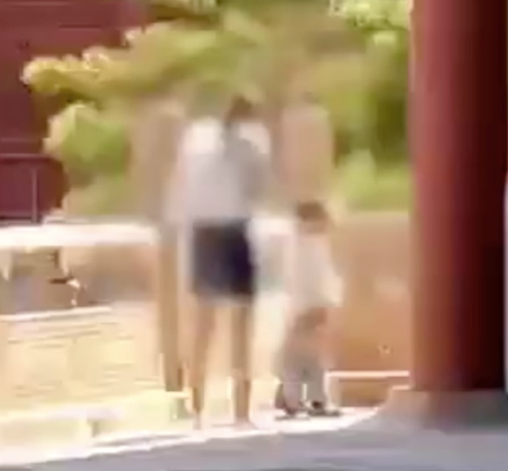
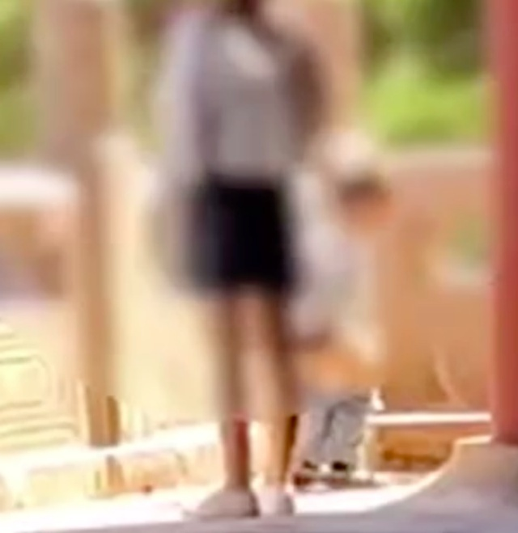

# 故宫博物院回应家长带孩子随地小便：故宫内有很多卫生间，正核实处理

据百姓关注报道，7月6日，一位家长带着孩子在故宫博物院内随地小便的视频在网络流传。

画面显示，一名小男孩在角落小便，孩子家长站在一侧照看。该视频引发大量网友讨论，部分网友认为此举不当，其他网友则认为情有可原。

14时许，故宫博物院客服工作人员回应称，目前博物院正倡导文明旅游，因为公共卫生间很多。十分重视此事，暂时还没有结果，正在核实处理中。

**【来源：百姓关注】**

