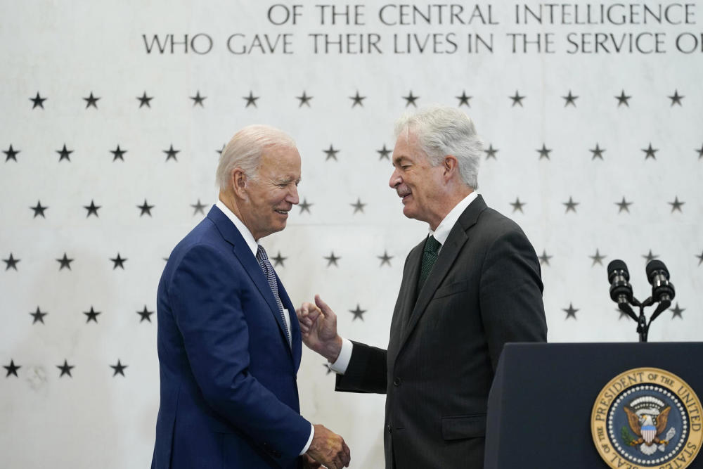

# 泽连斯基没有完全控制乌克兰军队？美情报官员爆料CIA在乌秘密运作

“CIA（美国中情局）在乌克兰境内有行动人员吗？当然有。”这是美国一位匿名情报官员对美国媒体的爆料。

美国新闻周刊杂志历时三个月的调查发现，尽管美国总统拜登再三声明，美国军事人员不会进入乌克兰境内，但CIA的存在让美方长期在“灰色地带”介入俄乌冲突。

_美国总统拜登（左）与CIA局长伯恩斯_

这份调查报告还称，美方人员认为俄方“大体上遵守心照不宣的行事底线”，但乌方却时常打破“默契”，对俄境内目标发起袭击。由于CIA难以摸透乌克兰总统泽连斯基的真实想法，他们很难判断哪些袭击是由泽连斯基直接下令，哪些是乌军指挥官授意的。

**“秘密规则”：**

**援乌不得参与谋划俄政坛变局**

拜登政府一名高级情报官员接受美国新闻周刊采访时表示，“乌克兰正在发生的一切都是一场‘秘密战争’，有着‘秘密的规则’。”这位直接参与乌克兰事务策略规划的官员要求保持匿名。而许多美国国家安全官员表示，华盛顿和莫斯科在制定这些“秘密规则”方面拥有数十年的经验，在打交道的过程中他们感觉俄罗斯人“大体上还是遵守一些共同底线，虽然这些底线并没有什么明文规定”。

另一位不愿透露姓名的美国高级情报官员表示：“CIA在乌克兰的任务是保持一个困难的平衡，既要在冲突中积极出力，同时又不违背拜登政府的核心承诺，即俄乌冲突战区的地面上不能有美国军队出现。”

此前，除了美国在基辅的大使馆内曾有数十名军人把守外，乌克兰境内并没有美方军事人员，而一些此前常由军方承担的任务就落在了CIA头上。用一位情报人员的话形容，“除了100%纯军事的行动和100%纯民间的行动，其他的灰色地带就是CIA运作的空间。”

_美国驻乌克兰大使馆_

这位情报专家还表示，这场冲突的独特之处在于，美国支持乌克兰，但两国并非战略盟友。尽管美国正在帮助乌克兰对抗俄罗斯，但它并没有与俄罗斯正式交战。因此华盛顿方面援助乌克兰的大部分行动都是保密的，都必须遵守拜登政府制定的限制条件，如不得参与直接军事行动、不得参与谋划俄罗斯政坛变局等。

一位已退休的美方高级军事情报官员表示，“许多人认为CIA参与了袭击俄罗斯将军或击沉莫斯科号旗舰的行动，这种看法在基辅并不受欢迎。我们需要提醒自己，赢得冲突的主角是乌克兰人，而不是我们。”

**波兰遭导弹袭击背后：**

**情报分析避免触发北约集体防卫条款**

新闻周刊的调查还指出，乌克兰周边的邻国中很多不愿意与俄罗斯为敌，并且一些邻国的政府对自己国内压倒性的反俄浪潮感到忧虑，但是英国和波兰则是“抗俄”最为积极的国家。北约在波兰成立了应急响应中心，波兰不仅负责疏解难民、集散援助物资，更是成为地下情报网络活跃的中心。

比如在军援方面，美国维持着两个庞大的军事物资输送网络，一个是公开的，另一个是秘密的。船只会将军援物资通过一系列欧洲国家运送到波兰，然后通过卡车、火车和空运将这些物资运往乌克兰。此外还有一支“灰色机队”秘密地穿梭于中欧和东欧，向乌克兰运送武器并支持CIA的行动。

去年4月，CIA局长伯恩斯飞到波兰会见了波兰情报部门负责人卡明斯基，确立了更加紧密的合作关系，CIA在波兰基地部署大量人员，并且在波兰境内他们也方便见到包括俄乌在内的20多个国家的情报人员。

_俄罗斯对外情报局局长谢尔盖·纳雷什金（左）与CIA局长伯恩斯_

去年11月，伯恩斯秘密会见俄对外情报局局长谢尔盖·纳雷什金，正准备去基辅向泽连斯基汇报情况，波兰境内就发生了导弹袭击事件（注：去年11月15日，两枚导弹落入波乌边境的波兰境内，造成两人死亡，北约、美国和波兰此后称事件系乌防空导弹“误击”）。如果此事系俄罗斯所为，将触发北约集体防卫条款，俄乌冲突的规模可能会迅速升级。

由于美方在波兰境内设置了严密的监控网络，从热成像结果分析这枚导弹来自乌克兰境内。伯恩斯立即将此情报通知白宫以及波兰总统杜达，避免了冲突进一步升级。

**CIA的困惑：**

**无法摸透泽连斯基，不确定其参与跨境袭击的程度**

调查还称，在冲突之初，泽连斯基曾承诺遵守拜登制定的“红线”，即不对俄罗斯本土境内发动袭击，以换得拜登政府更大力度的支援。但随着时间的推移，俄罗斯境内的袭击事件愈演愈烈。

_一个乌克兰特别作战小组透露称，其通过使用CIA提供的卫星数据来选择目标_

CIA官员认为，这与美国支持乌克兰的基本前提条件背道而驰。CIA得出的结论是，其中一些袭击源自俄国国内，由新生的俄罗斯反对派发动，但其他一些则是乌克兰所为。不过分析人士不确定泽连斯基参与这些袭击的程度有多深。

去年9月至10月间，北溪管道和克里米亚刻赤大桥接连被炸。在北溪管道事件中，泽连斯基办公室的一位高级负责人表示乌方对发生的一切毫不知情，并且拒绝接受“阴谋论”。在刻赤大桥遇袭之后，俄罗斯方面对乌克兰境内几个目标发动了袭击，称这是对炸桥“恐怖主义行为”的报复。

当时白宫在谈到俄报复性袭击时表示：“这些袭击只会进一步强化我们与乌克兰人民站在一起的承诺。”然而在幕后，拜登政府命令CIA搜集信息，确定事件的来龙去脉。一位CIA官员称，“CIA对克里米亚大桥袭击事件了解到的情况是，泽连斯基要么没有完全控制自己的军队，要么是他不想知道某些行动而刻意放权。”另一位匿名官员认为，“基辅开始品尝到了一些胜利的甜头，因此行事作风越来越大胆。”

一名波兰政府高级官员对新闻周刊表示，“在我看来，CIA未能理解乌克兰国家的本质，以及乌克兰政府内部存在的一些非常草莽的派系分子。”

作为回应，一位美国高级国防情报官员表示“我不愿意承认CIA已经失败了”，但他同意乌克兰跨境的袭击可能造成了全新的复杂局面，“可能会造成灾难性后果。”

红星新闻记者 郑直

编辑 张寻 责任编辑 魏孔明

