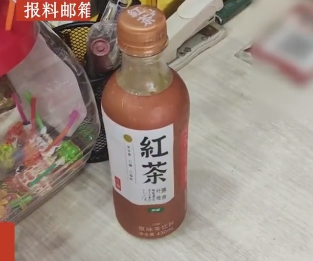
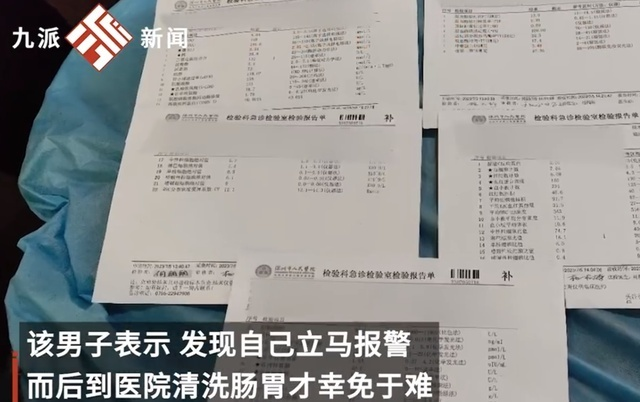
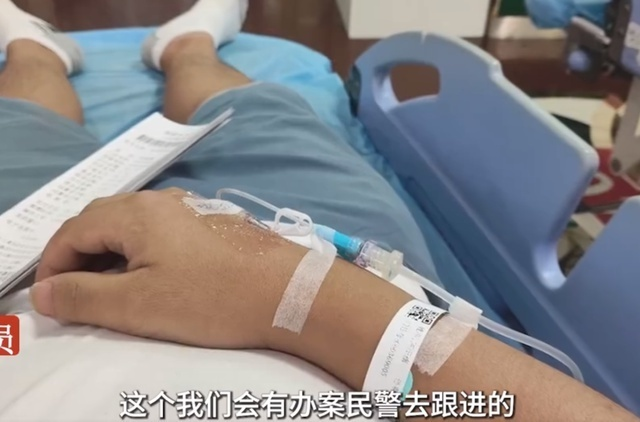

# 男子称在便利店喝到掺农药的饮料，警方：当事人已洗胃，饮料已送检

7月6日，据九派新闻视频报道，7月5日在广东深圳，一男子称在一便利店内购买一瓶饮料 ，饮用之后才发现瓶子内并非饮料，而是农药。

该男子表示，发现自己立马报警，而后到医院清洗肠胃才幸免于难。

该辖区派出所一工作人员表示，已将饮料样本送检，具体结果以检测报告为准。

该工作人员称：“这个我们会有办案民警去跟进，饮料要送去检验才能确定有没有存在这个问题，以检验报告为准。报案男子已经洗了肠胃。”

**【来源：九派新闻视频】**

