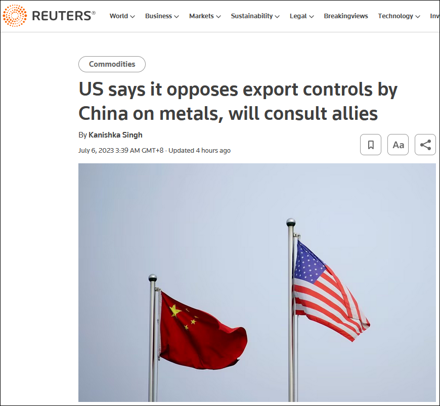
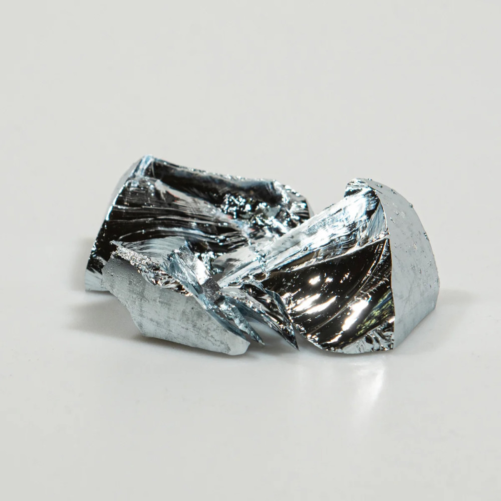
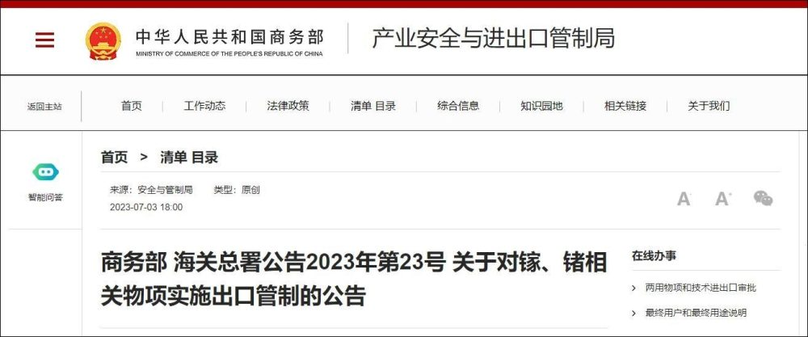

# 美国商务部回应中国出口管制镓和锗：将与盟友伙伴协商解决

【文/观察者网
熊超然】为维护国家安全和利益，中国商务部、海关总署于7月3日发布公告，决定自2023年8月1日起对镓和锗两种关键金属实行出口管制。对于这一决定，美国政府方面终于作出回应。

据路透社当地时间7月5日报道，美国商务部发言人当天表示，美国“坚决反对”中国宣布对生产半导体和其他电子产品所需的关键金属镓和锗实施出口管制，并补充称，美国将与盟友和合作伙伴协商解决这一问题。

“这些行动突显了供应链多元化的必要性。美国将与我们的盟友和合作伙伴一起解决这个问题，并在关键的供应链中建立弹性。”美国商务部发言人在一份电子邮件声明中这样表示。

_路透社报道截图_

镓、锗等都是芯片制造的重要原材料，这两种金属矿产无论是在储量还是在出口上，中国均在全球占据领先地位。路透社也补充介绍称，锗用于高速计算机芯片，塑料制品和军事应用领域，如夜视设备以及卫星图像传感器；镓用于雷达及无线电通信设备、卫星和LED。

中国地质科学院矿产资源研究所2020年的一份报告显示，目前镓的世界总储量约23万吨，中国的镓金属储量居世界第一，约占世界总储量的80%-85%。美国地质调查局2016年发布的一份统计显示，全球已探明的锗保有储量仅为8600金属吨，其中美国占全球的45%，其次是中国，占全球锗储量的41%。

《南华早报》称，中国还是镓、锗两种元素的最大生产国，其镓产量占全球95%以上，锗产量占全球67%以上。路透社注意到，根据海关数据，2022年，中国镓产品的最大进口国是日本、德国和荷兰；锗产品的最大进口国是日本、法国、德国和美国。

一家中国锗生产商就透露，他们在限制令出台后收到了大量来自美国、日本和欧洲买家的咨询，产品报价也在一夜之间飙升。另一方面，在中国发布出口管制措施后，部分国家企业和政府的反应值得注意。

_资料图：重要稀有金属镓_

据报道，总部位于美国加利福尼亚州的AXT公司在中国设有生产设施，该公司7月3日在官网发布声明说，其中国子公司北京通美晶体技术股份有限公司将立即着手申请许可证，以继续从中国出口镓和锗基板产品。公司将在8月3日举行二季度报电话会议时，公布进一步详情。

而作为两种金属的主要进口国，日本、韩国政府均对此做出反应，表示正寻求应对措施。日本经济产业大臣西村康稔称，日方不认为中方此举是针对5月日本管制半导体制造设备出口的反制措施。韩国工业部亦召开紧急会议评估此事的影响，希望同中方协商沟通。

同时，近期不顾中方反对、将部分半导体设备纳入出口管制的荷兰似乎也坐不住了。荷兰政府在7月4日声称，欧盟必须对中国的出口管制做出回应。欧盟当天早些时候表示，希望中国出于“明确的安全考虑”来实施出口管制。德国副总理兼经济和气候保护部长罗伯特·哈贝克（Robert
Habeck）声称，任何扩大对锂等材料的管制都将是“有问题的”。

路透社指出，中方已经言明此举出于保护国家安全的考虑，但一些经济分析人士却认为，此举是中国对美国不断升级遏制本方技术发展进步的回应，时间点正好就选在美国财政部长耶伦访华前夕。

报道认为，这标志着近年来在贸易关税、新冠病毒溯源、网络安全、间谍指控和技术竞争等问题上不断升级之后，中美关系的紧张局面“又翻开了新的一页”。

中国外交部发言人毛宁7月4日已指出，中国始终致力于维护全球产供链的安全稳定，始终执行公正、合理、非歧视的出口管制措施。中国政府依法对相关物项实施出口管制是国际的通行做法，不针对任何特定的国家。

中国外交部发言人汪文斌7月5日也进一步强调，镓、锗相关物项具有明显的军民两用属性，对镓、锗相关物项实施出口管制是国际通行做法。欧盟成员也对部分物项实施出口管制，中国政府依法对相关物项实施出口管制，确保其用于合法用途，不针对任何特定国家。

**本文系观察者网独家稿件，未经授权，不得转载。**

