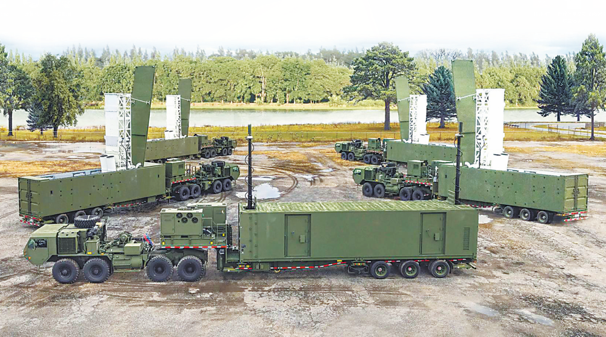

# 美陆军“中程导弹武器”形成战力，未来将部署在中国周边？

【环球时报特约记者 魏齐 环球时报记者
马俊】作为2019年美国宣布退出《中导条约》后的直接产物，美国陆军最新陆基中程能力系统（“堤丰”系统）近日正式宣布“形成战斗力”。按照美国陆军的规划，未来“堤丰”系统将部署到中国周边地区以“对抗解放军中程导弹威胁”。中国军事专家张学峰5日接受《环球时报》采访时表示，从“堤丰”系统的性能特征看，与其说美国陆军打算用它“对抗中国”，不如说是“对抗美国海空军”。

**“重大里程碑事件”**

印度《欧亚时报》4日称，美国陆军发表的声明显示，美国陆军第一多域特遣部队和美国海军无人机和打击武器项目执行办公室合作，于6月27日使用“堤丰”系统成功发射了“战斧”巡航导弹。此前“堤丰”系统已于今年早些时候成功发射一枚“标准-6”导弹。美国陆军的声明称，最近的这次成功测试证实了该系统“已经具备全部作战能力”。《欧亚时报》网站等多家媒体也都将“堤丰”系统发射“战斧”巡航导弹称为美国陆军在中程导弹领域取得的“重大里程碑事件”。

_美国陆军对“堤丰”系统寄予厚望。_

“堤丰”是古希腊神话中可以发射火焰的残暴蛇形巨人，美国陆军用“堤丰”来命名新研制的陆基中程导弹系统，可见对其火力打击能力的高度期待。按照设计，“堤丰”主要用于发射“战斧”巡航导弹或“标准-6”导弹攻击地面目标。据介绍，该系统配备的“战斧”导弹为携带常规战斗部的“战术战斧”，最大射程达1800公里；而“标准-6”最初是作为防空导弹而设计的，但同样具备一定的对地攻击能力，它以“准弹道”模式发射时，射程达460公里。去年12月初，美国洛克希德·马丁公司向美国陆军交付了首批4套“堤丰”系统原型中的第一套。这些陆基发射装置是美国陆军增强远程精确火力打击能力的一部分。而美国陆军的目标是在今年9月之前，让第一个中程导弹连实现一定水平的实战能力。

**基于海军导弹系统研制**

据美国“动力”网站报道，作为美国中程导弹的最新成果，“堤丰”系统将弥补美国陆军射程482公里的精确打击导弹（PrSM）和射程2776公里的远程高超音速武器之间的火力空缺，它能攻击最远1800公里外的目标。

“动力”网站称，根据美国陆军此前提供的信息，完整的“堤丰”导弹连包括四个发射器、一个指挥所以及重装和支援车辆，所有这些都部署在轮式拖车上，可以快速机动。“堤丰”发射器是在美国海军Mk41垂直发射系统的基础上改进而成。如果使用“战斧”巡航导弹，“堤丰”系统能覆盖约1600公里的陆上目标；“标准-6”的射程较短，但是提高了整个系统的“多功能性”。

《欧亚时报》也暗示称，陆基发射的“标准-6”具备防空反导能力。报道称，使用陆基发射装置发射“标准-6”的意义更为重大，因为它是美军现有防空反导系统中唯一有可能拦截高超音速导弹的型号。

中国军事专家张学峰认为，“标准-6”属于防空反导导弹，采用雷达末制导。如果美国陆军要用“标准-6”打击地面目标，必须要对其制导系统进行大幅改进，能否同时保留防空能力和反舰能力存疑。在美国陆军拥有“爱国者”防空系统的情况，这种必要性不大。所以美国陆军的“标准-6”很可能主要是借用了海军“标准-6”的弹体，改进其制导系统，利用高速优势打击地面目标。

**对抗中国还是美军内卷？**

“动力”网站还将“堤丰”系统与中国联系起来。报道称，在任何潜在的高端对抗中，特别是针对中国时，美军希望有更多选择，可以从陆地、海上和空中实施。“美国官员和专家经常提醒人们注意，解放军携带常规弹头的陆基巡航导弹和弹道导弹在数量上的明显优势。这使解放军在各个战略地区拥有强大的反介入和区域拒止能力。”

但“动力”网站也质疑，“堤丰”等陆基系统究竟部署在哪里仍然存在疑问，尤其是在印度-
太平洋地区。因为美国许多盟国和合作伙伴都公开表示，他们对在本国部署美国地面远程打击能力“不感兴趣”。

张学峰认为，如果在中国周围部署陆基“战斧”巡航导弹，当然会对中国构成现实威胁，但这种威胁并不比美国海军发射的“战斧”或者空军发射的空基巡航导弹更大。相反，陆基“战斧”系统的机动性受限，反而更容易遭到打击。而且美国海空军的巡航导弹可以由水面战舰、潜艇和轰炸机携带进行全球打击。“堤丰”系统在部署上的灵活性要差得多，想实现全球打击颇费周章。从这个角度来看，美国陆军是在拿对抗中国当幌子，和其他军种搞竞争。

其实美国其他军种对此已经颇有微词。美国《防务新闻》网站之前曾提到，美国空军全球打击司令部负责人蒂莫西雷就大力抨击美国陆军在太平洋建立远程导弹基地的新计划，称这一想法昂贵、重复，而且“愚蠢”。

