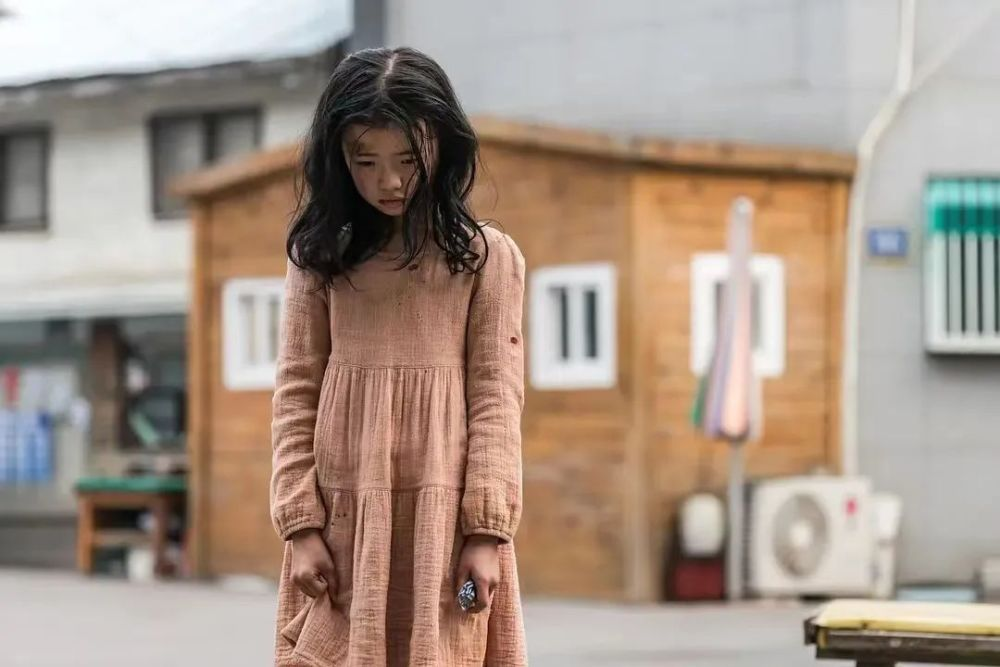
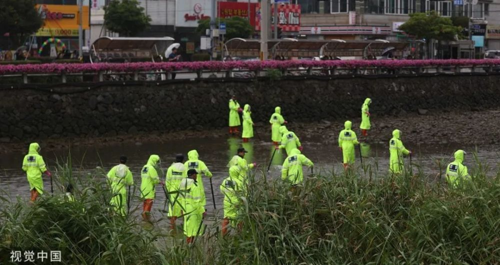
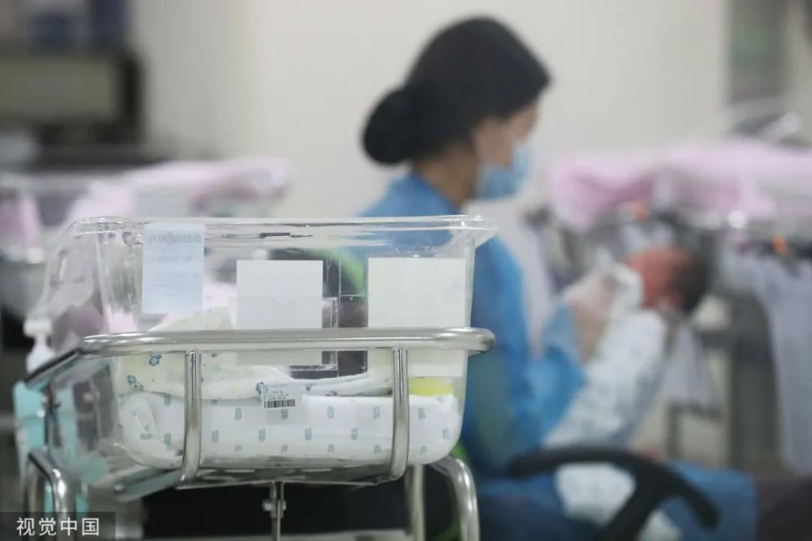

# 韩国频发“冰箱死婴”，妈妈为何丧失人性

**作者 | 吴大宇**

7月2日，一起杀婴案在韩国引发了全国震动。

一对夫妻涉嫌将自己刚出生5天的儿子勒死，并弃置于河水中。

据事发地庆尚南道警方称，这名婴儿于2022年9月出生。这对夫妇最初狡辩称，孩子在出院的第二天，就已经死亡。但因为两人经济拮据，无力承担火葬费用，便自行埋葬了他。

引发韩国朝野震动的不止是残忍的人心。重要的是，类似“杀婴案”，已经是韩国近两周发现的第3起。

最残忍的一起发生在6月21日。一名女子，也是5位孩子的母亲，被发现家里冰箱藏有两具婴儿尸体。经警方调查，这两个婴儿，分别是她2018年和2019年刚产下的女孩和男孩。

她在孩子刚出生一天后，便亲手杀害了他们。据韩国警方披露，这位母亲在去年12月搬家时，还会带上藏尸的冰箱迁居。

_《请寻找我》剧照_

“冰箱死婴”案发生后，一个在韩国长期存在、但是被避而不谈的问题引发舆论风波——韩国人惊讶地发现，“幽灵婴儿”在自己的国度并不罕见。许多孩子出生了但并未被记录在册，政府根本不清楚他（她）们的生死下落。

6月22日，韩国审计监察院首次公布，从2015年到2022年的8年间，查出了全国有2236名未进行出生登记的婴幼儿。

韩国政府对其中23名（即1%）进行了抽样调查，结果显示：至少3人已死亡。

极高的死亡率揭示了韩国政府人口管理的漏洞。

“这是一件令人悲伤和震惊的事情，也是大韩民国的耻辱。”
韩国国会主席尹在玉在6月23日说。“我感到非常羞愧和抱歉。”他允诺，将改革现今具有漏洞的出生登记制度。

改变出生登记制度也许是最简单的一步。频发的杀婴、弃婴案背后，还有关于贫困、阶级固化、高生育成本等一系列国情，等待韩国社会共同直面、忍耐、解决。

01

一石激起千层浪

韩国的“冰箱死婴”案，在今年6月引起轩然大波。以至于，接下来两周，韩国发现的多个死去的“幽灵婴儿”，都与此有关。

杀婴的母亲住在韩国首尔市南边不远的水原市，一间单身公寓内。6月21日被发现藏尸儿女之前，她是邻居眼里三位孩子的母亲，有法律上的丈夫，经济困难。

更多的案件细节随着警方的深入调查曝光。2018年11月3日，这名女子在韩国军浦市产下自己的第四个孩子。第二天她便出院，将女婴带回到水原市的家中，疑似在当晚将女儿勒死。

_6月30日上午，因涉嫌杀人及隐匿尸体而被拘留的“水原冰箱婴儿尸体事件”嫌疑人30多岁的女性A某被移送检察机关/《朝鲜日报》报道_

2019年11月19日，这名经济困难的女子再次怀孕，在水原市某医院产子。在第二天出院回家的路上，她又勒死了小儿子。

经调查，她将一女一儿的尸体装进黑色塑料袋里，放入家中的冰箱。

至于杀婴女子的丈夫，据韩媒报道，他在证词中表示，自己并不知道妻子怀了第四个孩子，也就是女儿的存在。再到2019年出生的第五个孩子，他说，自己知情妻子怀孕，当时让她堕胎。

但考虑到“数百万韩元的堕胎费用”，该女子在供词中承认，她自作主张地放弃堕胎，选择生下小孩后再杀他。

杀婴藏尸的母亲引发韩国朝野震动。不止是心狠的当事人备受关注，大量愤怒与不满的舆论铺天盖地，指向的是韩国的出生管理制度和人权制度。

这些焦点指向同一个核心：一个婴儿凭空消失了三四年，为什么从未有人或者任何机构能发现？

_《小委托人》剧照_

为回应舆论，6月22日，韩国监察院公布了审计结果：2015年至2022年，有2236名在韩出生的儿童没有进行出生登记，只有医疗机构签发的临时出生号码。

这些人又被叫作 “幽灵儿童”——没有户籍，不是韩国公民，无政府管理，一直处于灰色地带。

也就是说，他（她）们生死未卜，长期无人关注。

这也是韩国官方机构第一次公布“幽灵儿童”的具体数值。舆论压力下，韩国卫生福利部也在6月24日宣布，全国各地要在7月7日前，完成对2000多名儿童的摸底调查。在调查阶段，负责社会福利和居民登记的公职人员将登门拜访有关家庭，检查
“幽灵儿童”的行踪和安全。

在官方的“全面清查”下，两周内，越来越多未透光的暗处被曝光。

“警方正在京畿道南部水原市、华城市和安城市……调查幽灵儿童案。”新闻画外音在韩国四处响起。“其中4起，连婴儿是生是死都不知道，母亲涉嫌国籍不明或是非法居留。案件侦办起来困难重重。”

_当地时间2023年7月4日，韩国庆尚南道巨济市，警方在高岘洞新县第一桥周围就“幽灵婴儿”案件正在搜查婴儿尸体_

去向不明的儿童拷问着韩国社会支持系统。

比如，京畿南道厅正调查一名在华城市的20多岁的女性。2022年，她将孩子交给网络认识的买家，涉嫌遗弃儿童罪。

据披露，2022年1月，在产子一个多月后，她将孩子交给了在咖啡馆会面的两男一女。如今，她向警方表示，“我不清楚带走孩子的（人的）身份和联系方式。”

死去的婴儿也在多地被发现。

7月2日，水原地区法院批准了一个对一名20多岁女性的逮捕令。她被指控于2019年4月埋葬了自己小孩。据报道，这是由于家长疏忽管理，刚出生的男婴被单独留在家中，三天后死亡。

同一天，一名在京畿道的50多岁女人，因涉嫌埋葬她在2015年9月生下的男婴而被拘留。据称，该男婴患有唐氏综合症。

02

2236名幽灵儿童

2200多名“幽灵儿童”大白于天下的2023年，韩国政府的变革无可逃避。

6月30日，“冰箱死婴”案发生一周后，韩国国会难得地出现两党意见一致，几乎全票通过出生人口登记修订法案。

修订后的法案要求，医疗机构要在14天内，向地方政府报告新生儿的出生情况。如果自出生日起一个月内没有申报新生儿情况，地方政府负责人将“接手”，提醒监护人。

不过，这项仓促推出的法案并未明确表明，没尽到职责的医疗机构和个体，将受到什么惩罚。

_未尽职责的医疗机构和个人的惩罚机制并不明确，图为当地时间2019年2月27日，韩国首尔，一家医院的新生婴儿室_

事实上，“幽灵儿童”在韩国社会已经存在多年。一个最有名的“幽灵儿童”事件，是2015年在光州的12口之家。

这个家庭有10个小孩，但只有5个是韩国公民，剩余5名是“幽灵儿童”。

2015年，当地政府发现这个特殊的家庭时，最大的三个孩子已经成年，在外工作，供养家庭。剩余的孩子与父母一起，9个人挤在一套只有1个单间及客厅和厨房、总面积5坪（相当于16.5平方米）的房子里。

5名无证儿童，当年最大的已经19岁，最小的11岁。他们没上过一天的学。

其父母供述称，两人在1998年因为开餐馆破产，欠下外债。多年来，两人在逃债的路上颠沛流离，居无定所，因此不希望在政府处登记孩子的出生，也没太多条件供养孩子读书。

“我们没有选择杀掉孩子，只是因为经济困难，无法照料。这与虐待小孩无关。”他们辩称。

最终，这对涉嫌疏忽照料孩子的父母，因为迟迟未登记小孩的出生，被罚款20万韩元（约合1100元人民币）。

_疏于照料孩子的父母将会被罚款/《小委托人》剧照_

多起大龄“幽灵儿童”，在接下来的年月相继被媒体曝光。

这些不为子女办出生登记的家庭，有大致相似的背景：虽然为人父母，他们过的并不如意。

贫穷、文化程度较低、社会地位不高，他们无暇顾及小孩的教育和心理。

2020年，一家韩国媒体还对“幽灵婴儿”现象做过独家调查。结果显示，2019年至2020年3月，这期间在韩国出生的“幽灵婴儿”达353人。其中，73.9%的无证婴儿是在婴儿收容箱发现的，即韩国教会组织在公共场合设置的、给被遗弃的小孩准备的保温箱。

另有11.4%的“幽灵婴儿”，属于非婚生子女。

这些案例同时揭示了人口管理的巨大漏洞。在韩国，孩子出生后，监护人不需要立刻在医院进行出生登记，只需在出生1个月内进行登记。

没及时为孩子登记的父母，只面临5万韩元/小孩（约合277元人民币）的罚款。

_出生后未被登记的婴儿，很容易陷入“三不管”的境地/《未成年》剧照_

但是，这些没被医院及时进行出生登记的婴孩，已经陷入“三不管”境地。地方政府、社保机构，均不清楚新生儿的具体情况。姓名年龄，父母是谁，生死如何，官方文件里，查无此人。

韩国首尔国立大学教授李凤柱（音译）曾对此呼吁：“我们亟需一个系统，无论父母在孩子出生时处在什么状况，国家都要有能力知晓。我们的政府每年花费超40万亿韩元（2218亿人民币）鼓励人们生育孩子，却在他（她）们出生后，置其于风险之中。”

03

破除阻碍

韩国人并非不清楚，国家出生登记制度一直存在漏洞。但长期以来，相关改革面临阻碍，没能有足够推力进行。

这背后，据韩国媒体解释，一是过去受医疗届人士的阻力较大，因为这意味着医院管理成本加大和责任的增强。

另一个争议围绕着，韩国传统观念和社会现实的影响，部分单身怀孕、生下孩子的女性，羞于承认自己有过孩子。生育孩子的记录连同档案登记在册，将影响这部分女性未来的家庭关系、婚恋和就业。

于是，如果出生登记制度进一步落实，将可能加剧这部分女性处境的艰难。

_在传统观念的影响下，出生登记制度落实也将会使部分女性处于艰难的处境/《白小姐》剧照_

2022年戛纳电影节获奖影片《掮客》，曾描述过深陷伦理困境的韩国年轻母亲。女孩名叫文素英，是杀人犯。她生下自己痛恨的男人的小孩后，将孩子放在了婴儿收容箱底下，想置其不顾。

但命运在文素英遇到想偷小孩贩卖的掮客后改变。她走上了与掮客们一起帮孩子找买家的路。这个过程中，她开始反思自己的遗弃行为，以及身为人母的意义。

许多矛盾在影片中展现。比如，是否选择生下孩子，在韩国同时是一个宗教信仰问题。

“比起生完孩子再抛弃，生孩子之前抛弃孩子（即堕胎），难道罪就更轻吗？”有台词如此诘问。

年纪轻轻就由女孩变成母亲的文素英，在影片最后平静又绝望地透露了心路：“我偶尔会做梦，雨水能把过去的自己清洗干净。但是一睁眼，雨还是倾盆大雨，我也没有任何改变。”

_《掮客》里的年轻母亲文素英/《掮客》剧照_

表面极端的案件，背后是复杂的韧性和真实的人生处境，一种与贫困、无人支援、没有希望等相交的人生。

美国俄亥俄州莱特州立大学的心理学者奥伯森、谢丽尔‧迈耶等曾就杀害子女的父母做过研究。她们发现，选择杀婴的女性，大多在婴儿诞生几天内就会将孩子杀害。

“这些年轻女性通常会非常被动，情感孤立，不信任任何人，”学者奥伯森解释。“她们认为这会过去的，可能我不是怀孕，可能只是我的想象。”她们对自己生下孩子感到震惊，只想把婴儿遗弃，“装作什么事也没发生”。

至于为什么选择生下孩子，受访者都回应称，因为她们不相信堕胎。

复杂的人性和现实，给管理机构提出了更高的难题。

韩国国会主席尹在玉在6月23日表示，“冰箱死婴”案后，国会不仅会推动与出生登记有关的修订法案，还将推出“在医疗机构披露出生信息允许匿名法案”。

“这可能是不受欢迎的，” 尹在玉说，但是“我们将推广它”。

_《生日》剧照_

匿名政策的推出，意味着一些女性对可能因自己档案被登记有小孩而影响人生的这一顾虑，将有所消解。

尽管，另一派反对声音同样对匿名政策反应强烈，称这一政策鼓励女性不承担抚养孩子的责任。

对此，韩国政策委员会强调，与上述改革配套的，是国家抚养儿童保护制度的完善。

“有必要对现行的以私立寄养机构为中心的保护体系进行检查，对婴儿箱里的弃婴进行系统化管理。（我们）必须加大力度，摆脱韩国是输出孤儿国的污名。”

争议与碰撞仍在韩国社会争锋。

唯一可以肯定的是，6月末的“冰箱死婴”，带给韩国社会的绝不止极端事件自身的惊悚与骇人。它给韩国政府留下了无数叩问与回响：在生育率已经低至0.75的韩国社会，究竟如何能让每一个新生儿人人生而平等？

文中配图部分来源于视觉中国，部分来源于网络

编辑 | 向由

排版 | 菲菲

关注南风窗，查看更多精彩内容

