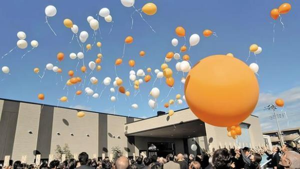

# 韩媒：“无人祭奠，无地可葬”，日本惊现气球葬礼

【环球时报综合报道】近日，日本“气球葬礼”受到外媒关注。韩国《朝鲜日报》4日发表题为《“无人祭奠，无地可葬”，日本惊现气球葬礼》的文章，介绍日本步入超老龄化社会后这一社会现象。

_日本的一场葬礼上，向天空放飞气球的场面。右下角最大的气球里装有死者火化后的骨灰。（图源：《朝鲜日报》报道配图）_

日本“Balloon
Kobo”是一家提供“气球葬礼”服务的公司，他们将遗体火化后的骨灰装进气球送上高空，然后让气球自然爆炸，死者的骨灰最后在空中散落。最近，举行“气球葬礼”的日本人持续增加，仅预约人数就超过百人。“气球葬礼”费用一般为24万日元（约合1.2万元人民币）。英国《经济学人》杂志刊文介绍日本“气球葬礼”称，“近来，早早进入超老龄化社会的日本死亡人数激增，因而对更具创意的葬礼需求不断增加。这是无人祭奠，无地可葬导致的现象。”

《朝鲜日报》称，平均寿命长、生育率低的日本早在2006年就进入超老龄化社会。去年，日本死亡人数超过150万人，创二战以来最高值。日本厚生劳动省推测，日本2040年死亡人数将达到168万人。（林泽宇）

