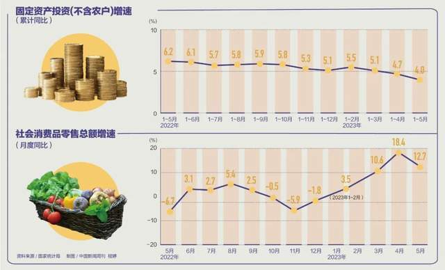
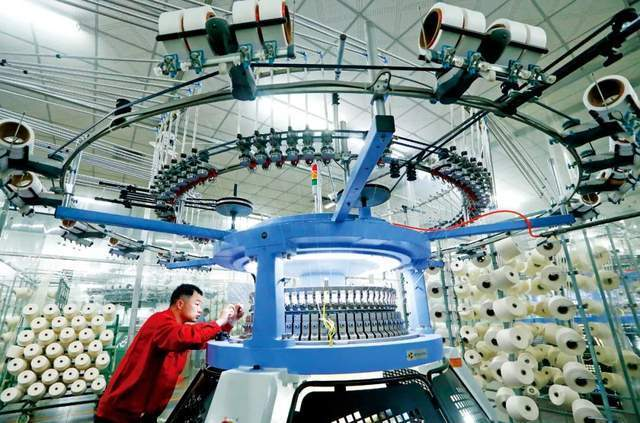
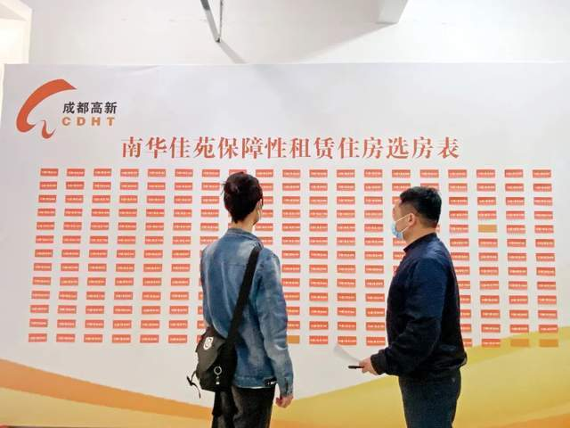

# 专访刘尚希：要给民营企业吃长效“定心丸”，恢复信心

据央视新闻报道，中共中央政治局常委、国务院总理李强7月6日下午主持召开经济形势专家座谈会，听取专家学者对当前经济形势和做好经济工作的意见建议。

座谈会上，刘尚希、罗志恒、田轩、黄先海、袁海霞、秦海林、陆铭、赵伟等专家学者先后发言。大家就解决好经济运行中的问题提出了意见建议。

2023年二季度以来，经济复苏态势不及预期。在中国财政科学研究院院长刘尚希看来，从近期看，居民与企业信心有所上升，但不稳固，“捂住钱袋子的倾向仍很明显。”

他认为，“当前财政货币政策的信号是清晰的。但财政货币政策传导受阻，亟待体制政策创新。”其中的关键是要创新宏观调控模式，刘尚希在接受《中国新闻周刊》专访时指出，目前面临经济下行的风险较大，迫切需要政府在宏观政策、改革举措等方面出新招。

_刘尚希_

**“多重因素相互叠加，**

**导致经济复苏会非常艰难”**

**中国新闻周刊：对于上半年经济情况，目前普遍认为复苏进程不及预期的。你如何看待上半年经济形势？**

**刘尚希：**
复苏低于预期，这是目前大家的一个共识。原来以为疫情防控形势转变之后，经济会迅速反弹，但现在看没有迅速反弹，因为从一些经济指标看，今年二季度也就是从4月开始，出现了经济下行的迹象，这意味着风险可能在扩散、扩大，这个判断没有太多分歧。

经济出现下行的原因，背后有多重因素在叠加。首先，是疫情的“疤痕效应”，疫情持续时间比较长，对企业资产负债表的损伤比较大，连带影响个体工商户、小微企业的经营，实质上最终造成了居民、企业资产负债表的损伤。这是疫情在经济方面的“后遗症”，是不可忽略的因素。

其次，是房地产市场下滑带来的影响。房地产业的关联效应比较大，“房住不炒”是对的，但房地产业怎么转型还在探索中，转型过程没有完成，房地产进入了深度调整状态。产生的关联性影响就不仅仅体现在房地产业本身，对上下游都产生了连带影响，还对金融部门和居民部门等都产生了连锁反应。例如，居民出现提前还贷，感觉到房价在下降，房屋资产可能在贬值，个别区域出现“资不抵债”后一些人选择“断供”，这导致居民的资产负债表也在收缩。另外，在“三道红线”政策后，针对房地产业的金融政策也做了调整，支持“保交楼”，但不少房地产开发企业自身状况还是每况愈下，它们的资产负债表是深度受损的。

第三个是外部环境，全球的需求也不足，因为全球经济都在衰退，都处于下行的态势。毫无疑问这对中国经济也是一个下拉的因素，例如对出口的影响，订单在减少。这些外部因素叠加国内经济复苏压力，进一步导致经济下行。

第四，是如何正确处理政府与市场的关系，涉及到监管不确定性问题。这不仅关系到一些大的数字平台企业，还涉及到各个方面。前几年在监管方面的一些做法，是在出其不意的情况下出台的，和市场的有效沟通是不足的。突然出台，都造成了一定的波澜，其影响现在依然存在。加强监管是必要的，但如何在法治的轨道上提升监管政策的确定性程度，也是当前面临的重大课题。这是改善预期、稳定预期很重要的方面。

还有一个因素是国企与民企的关系。例如，从房地产业来看，尽管都受到影响，但民营房地产企业受到影响是非常大的，国企受到的影响相对要小。为什么出现这种分化？说明民企的信心更加不足。在数字经济领域，民营企业实际上是处于领跑位置，现在出现了后劲不足的问题。中央反复强调“两个不动摇”，支持民营经济发展壮大，但是在现实中，公平竞争原则在国企和民企中还没有真正落实。因为民企盘子很大，民间投资出现负增长，主要靠政府或国企投资，肯定是顶不上来的。从趋势上看，如果民营经济进一步收缩，国民经济可能会加快下行。

以上这些因素，如果单个出现影响不会太大，但这些因素同时出现且互相叠加，会相互作用、相互强化，导致预期难以改善，信心不足。尽管两年前中央经济工作会议提出经济面临“三重压力”，到现在看还没有真正缓解。因此，经济复苏非常艰难，就像车轮陷在泥地里，走出来会非常吃力。

**中国新闻周刊：你此前提到，目前捂住钱袋子的倾向仍很明显，存在经济再次收缩的风险。这种风险的程度怎么判断？**

**刘尚希：**
目前的情况，我觉得是处于一个十字路口。为什么说是十字路口？因为上面提到的那些因素不是周期性的，如果是周期性因素，我们挺一挺，经济自身就会好转。面对这种情况就需要强化风险意识，迫切需要政府在宏观政策、改革举措等方面出新招。

目前的情况并不是复苏滞后问题，而是存在一些深层次矛盾。另外，一些体制机制、结构性的问题原来就存在，疫情三年也没有时间去管，问题还在不断积累，其内在的影响就反映到经济走势上来了。现在很有必要对一些结构性问题、体制机制问题加快改革，这样才有可能从泥潭里拔出来。

_面对当前的经济运行状况，需要政府在宏观政策、改革举措等方面出新招，以推动经济持续回升向好。图/视觉中国_

**“地方财政紧运行可能**

**与积极财政政策加力提效的要求相悖”**

**中国新闻周刊：你最近提到，“当前财政货币政策的信号是清晰的。但财政货币政策传导受阻，亟待体制政策创新。”如何理解？**

**刘尚希：** 信号是清晰的，主要是指政策方向上，例如要实施积极的财政政策和稳健的货币政策，这是清晰的。至于力度和效果，是另一个问题。

力度是否足够，首先要看效果。如果不看效果只看力度，可能适得其反。首先要评估财政货币政策效果怎么样。从这些年来看，财政货币政策效果在边际递减，已经越来越弱了。根本的原因在于，财政货币政策的传导要依赖一个良好的体制基础，如果这个体制基础有缺陷就传导不下去，或者说，体制不健全，传导效果会大打折扣。

目前的体制基础不够健全。例如金融领域，货币政策的体制基础取决于金融体制，需要建立起现代银行制度。这个体制没有完全建立起来，以市场化为导向的金融结构性改革有成效，但成效不明显。财政体制的改革也有进展，但中央与地方财政关系的改革不及预期。因此目前地方财政困难的局面，与经济变化、央地财政关系的调整是联系在一起的。

在现行体制下，地方财政紧运行可能与积极财政政策加力提效的要求相悖，即使扩大全国财政赤字，扩大地方债券规模，政策信号传导也会受到梗阻。此外，货币传导也遇到了同样问题。一边大量增加货币供应，货币存量增长达到两位数，远远快于经济增长速度，另一边，存款比贷款增长更快，在宏观上贷款似乎出现了“空转”现象。

**中国新闻周刊：为解决货币传导不足，央行创设了另一通道：资金直达机制，即结构性货币政策。目前结构性货币政策效果如何？**

**刘尚希：**
结构性货币政策，是依靠定向释放流动性，本质上应该是财政干的事，需要财政政策来支持才能发挥作用。目前货币总量政策，效果已经越来越弱，对企业和居民“放水都很难放出去”。企业亏损在增加，不少企业不愿意贷款，居民也是如此。降息起到了一定作用，但对民营企业来说，资金成本仍然是偏高的。

仅仅靠降息解决不了根本问题，关键是如何增强对未来情景的信心，调动和激发企业的贷款意愿。如果信心不足企业不想贷款，利率降到零，他们也不会选择贷款，这就是常说的“流动性陷阱”。降息是一个刺激需求的措施，但事实上现在已经有点晚了，应该早降息。“在想吃饭的时候加强营养，作用才会比较明显。”

在多种因素叠加导致经济下行的情况下，货币政策的传导作用毫无疑问会越来越弱，甚至会落入“流动性陷阱”。在经济下行的时期，货币政策的作用是有限的，要作为财政政策实施的配套条件来定位，而非并行。比如中央政府发行国债，货币政策应该大力配合，在二级市场甚至一级市场购买国债。公开市场操作可以更多运用国债这个手段，提高央行资产负债表中国债的比重，不能像过去一样，教条式地强调所谓“央行独立性”。应当建立一体化的财政货币政策协同新框架，从国家治理的高度发挥好两大政策的合力。

**“让宏观调控的决策、执行完全回归中央”**

**中国新闻周刊：当前的宏观调控模式，存在哪些深层次问题？应该如何创新？**

**刘尚希：**
中央与地方的关系，属于国家治理问题，直接反映在宏观调控上。2008年之前，宏观调控主要是依靠中央，而现在主要依靠地方，出现了“中央调控地方化”现象。

1998年出现了亚洲金融危机，当时也采取了一系列宏观调控措施，采取了中央发行长期建设国债，然后资金转贷给地方的方式，限制地方通过各种投融资平台借债和扩张，不允许地方发债和搞财政赤字。而2008年之后，在“四万亿”的方案中，除了中央筹集1.18万亿之外，其他都交给地方。地方主要依靠投融资平台进行融资，地方财政从而积极扩张，形成了大量债务，一直延续至今。加上房地产市场不景气，地方土地出让收入大幅减少。

这是在2008年之后出现的一个转折性变化，这种调控模式，其效果已经越来越差了，难以持续。地方上的投资目前主要依靠中央给的专项债指标，没有其他渠道。且在地方财政比较困难的情况下，没能力再去扩张。一些地方不但不扩张，反而还在收缩。因此，经济复苏要实施积极的财政政策，但如果还依赖地方财政来扩张，地方事实上已经没这个能力了。在“中央调控地方化”的机制下，积极财政政策要再加力，也很难有实际效果。

另外，当前中央对地方债务扩张实行严格控制，不可能加杠杆。在这种局面下，一方面，基于地方债务风险的考虑，要求地方降杠杆，另一方面，积极财政政策希望地方加杠杆，这就左右为难了。因此，实施积极财政政策，应该根据形势变化，调整央地政府的杠杆结构，这样宏观调控中左右为难的问题就会迎刃而解。

当前其实有办法，调整央地政府杠杆结构是有空间的，因为目前国债在GDP中的占比并不高。现在我国地方债规模超出了中央债规模，这种靠地方宏观调控的模式效果在下降，而风险在上升，应当归位，让宏观调控的决策、执行完全回归中央。

**中国新闻周刊：当前地方财政的问题，除了地方债规模太大，利息负担越来越重，还有哪些突出问题会影响经济复苏效果？**

**刘尚希：**
首先就是不要再扩大地方债，再增发作用也不大了。而且地方也找不到那么多符合条件的项目，目前项目投资在地方上也是层层下移，省里发债筹措资金，再拨付给市、县，让他们去寻找匹配的项目。市、县这个空间单元较小，已经很难找出这么多投资项目来。因为目前区域经济的分化很明显，在县一级层面，很多地方人口已经是净流出而减少，能找出多少合意的项目呢？

此外，从大的趋势来看，需要进一步提高人口城镇化水平，要防止“逆城市化”，从空间上要围绕城市群、都市群，围绕中心城市来布局投资项目，不能简单地把资金层层分配下去，让市、县甚至乡镇来报项目。现在把专项债资金落实到项目上，主要机制就是让地方层层上报。这是有问题的，不应该简单地让市县报项目，他们上报只能是作为参考，应该由省级统筹安排，根据经济区域一体化的要求、根据当前人口流动趋势和产业要素集聚的态势，去布局投资项目，才可能产生真正的效益。这样即使没有短期经济效益，也能有社会效益。而现在不少投资项目，连社会效益都看不到，因为人口已经从当地流出了。项目投资出现了与人口流动和分布趋势相悖的问题，导致投资效果越来越差。

另外，原来的专项债设计思路需要进行调整优化。从宏观上，地方专项债不应该再加码，剩下的指标转化为国债，优化央地杠杆结构，由中央来统一实施。社会基础设施建设项目应瞄准经济社会的主体空间形态，布局的空间单元应从县乡上移到市域以上，人口净流出、且发展潜力小的地方，应当减少项目布局。

_5月4日，山东青岛市一家民营外贸企业的生产车间。图/IC_

**要给民营企业吃长效“定心丸”，**

**恢复信心**

**中国新闻周刊：目前很多建议开出的药方，是要从房地产着手。认为应该尽快调整房地产政策进行救市。你怎么看？**

**刘尚希：**
目前房地产市场需要多管齐下。房地产行业需要转型，而不是简单回到过去的老路，那样会出更加严重的问题。目前一二线城市的低收入人群买不起房，但如何保障他们的居住权？需要大力发展公租房、长租房等租赁市场。

发展房地产不应都去卖房，应该鼓励房地产企业建设租赁住房，享受政府补贴或者由政府来购买。针对低收入人群不同的收入水平，设计合理的租金体系和退出机制，在商业模式上实现可持续运转。我们去一些地方考察，有些租金收得太低，公租房成了福利房，需要财政大量补贴，供给就会越来越收缩。

一方面要大力发展公租房、长租房等租赁市场，保障低收入群体的居住需求。另一方面取消限制性措施，高端的商品房完全交给市场去调节，对刚需买房群体进行分类分层考虑，从地价、土地供应等方面统筹安排，不能简单一刀切。既发挥政府的作用，也发挥市场的作用，两者作用结合起来，“房住不炒”才能实现。通过简单地放开、刺激大家去买房，又走回了老路，这条路显然行不通。

**中国新闻周刊：市场普遍期待能出台一揽子政策拉动投资、刺激需求，你认为当前政策发力提效的重点是什么？**

**刘尚希：**
从当前来看，不确定性的监管政策首先需要调整，要释放出明确的负面清单信号，要给民营企业吃长效的“定心丸”，老的“定心丸”可能不够了。在产权保护、公平竞争审查等方面，要有一些真招，不能泛泛而谈，这对稳定预期、增强信心是非常重要的。

其次，公共政策重点应围绕农民工市民化来做文章，围绕城市群、都市圈来布局投资项目。市场能干的交给市场去干，政府不要挤出市场投资，要带动社会投资，要去干市场不愿意干和干不了的项目。与农业转移人口市民化相关的投资空间相当大，既能扩大当前投资、扩大内需，也能促进市民化进程，带动乡村振兴。

第三，要发挥大的龙头企业比如数字平台企业在解决就业、带动中小企业发展的积极作用。中小企业发展是不能脱离这些大的龙头企业的，在制造业中很多中小企业是为大企业进行配套。龙头首先要活起来，龙身和龙尾才能摆动。这些大企业有信心了、开始扩张了，自然就会带动很多中小微企业的扩张。要把大中小企业当成一个有机整体来看，不能单纯为了稳就业而去扶持中小企业。产业链安全，也需要依靠这些龙头企业来当“链主”，缺乏这些链主，产业链安全也得不到保障。

_2022年4月17日，2022年四川成都市首个保障性租赁住房项目开始选房。图/视觉中国_

除了救急政策，还应该有一些治本的政策。治本政策，就是要进行结构性改革，突破城乡二元结构，推进以人为核心的城镇化。现在有研究表明，城市人口增长和消费需求扩大呈正向关系。城市人口规模不断扩大，内需才能不断成长。有相关研究表明，农民成为农民工，消费可以扩大30％，农民工成为市民，消费又可以在此基础上再次扩大30％。城市人口的增速和消费需求的扩大、升级呈正相关关系。

城乡二元结构带来的不仅仅是经济的二元，更是社会的二元结构。应该想办法加快农民市民化的进程，需要提供相应的公共服务。比如，在农民进城的住房保障上下功夫，这样也能带动房地产业的转型。所以应该大量扩大基于人口流动的公共服务投资和公共服务基础设施建设，从这些方面发力。这就需要从空间形态上去考虑问题，从都市圈、城市群等方面做文章。基本公共服务均等化，应打破静态的地域基准“跟人走”，尤其是大城市要带头，对农民工的住房、医疗、子女教育等方面进行改革，让他们享受同城同待遇。城市既需要低碳绿化，更需要包容性，这非常有利于增强社会活力和经济动能。

发于2023.7.10总第1099期《中国新闻周刊》杂志

杂志标题：刘尚希：复苏的关键是要创新宏观调控模式

作者：闵杰

