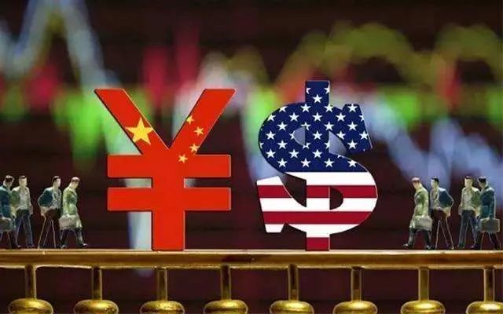
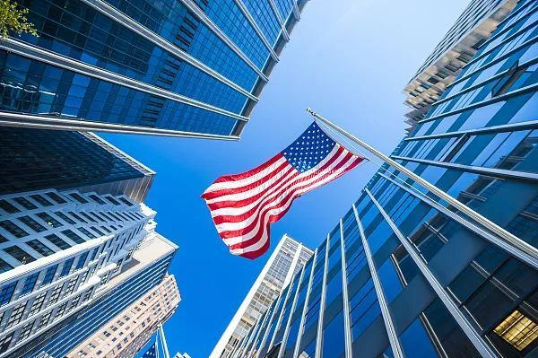
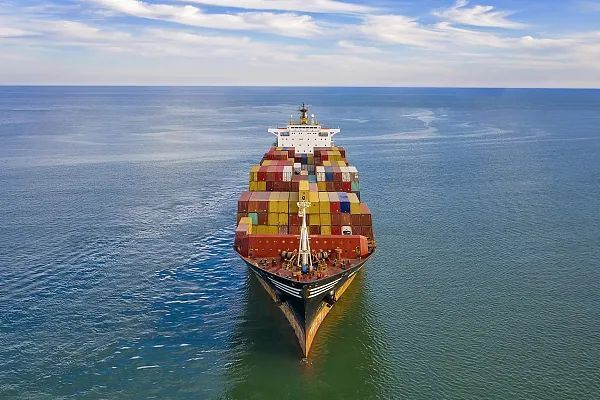

# 中美关系：回不到也无需回到过去

“对我们来说，试图与中国脱钩将是灾难性的。”

美国财政部部长耶伦，是本届美国政府中，少有的几位明确表达过“反对脱钩”的政治人物。

6日，她开启了为期四天的访华之行。

而就在上个月，美国国务卿布林肯完成了其任内首次访华。可刚离开中国，他就把自己的承诺置诸脑后，高喊要“继续做中方不喜欢的事，说中方不喜欢的话”。

不得不与华交流，又放不下打压执念，美国对华心态为何如此“拧巴”？

**（一）**

毋庸讳言，当前，中美关系处于建交以来最低谷，但责任显然不在中方。

苏联解体后，美国认为世界上所有国家的发展都要走西方市场经济和选举民主的道路，历史已经“走向终结”。在这种傲慢情绪指引下，美国减缓对制度漏洞的修补，放松对资本力量的约束，使原本因外部约束而被压制的经济不平衡、社会不稳定、政治不团结等问题愈演愈烈。

近年来，美国经济增长缓慢、社会动荡不断、政治极化严重，“帝国黄昏”颓势显现。这些本是美国自身制度缺陷所致，本应由美国通过制度改革解决，但孤傲的山姆大叔，是断然不会说自己半个“不”字的。

事实上，自从这只“白头鹰”坐上了“山巅之城”的铁王座，就再也不肯挪窝，时刻眯着眼要与山下的老二保持安全距离。历史上，不论亲疏，但凡有国家的GDP接近或超过美国的70%，就会被其坚决打压。

英国、德国、苏联、日本、欧盟已先后趴下，作为“六号选手”的中国，被迫进入了这场据说叫修昔底德的危险游戏。再加上中国在美国人眼里，向来属于“非我族类，其心必异”，打压阻滞中国，便更带有了某种政治正确性。

**（二）**

美国正紧紧抓住“正在褪去的世界唯一超级大国的荣耀”，试图通过散布对中国的负面信息来破坏中国的发展和其国际地位的提高。

具体来看，持续炒作中国威胁，鼓吹对华“脱钩”，今年年初借“流浪气球”事件大做文章，最近又开始鼓噪对华“去风险”，多次派军机、军舰在中国周边海域搞“擦边”“碰瓷”，其政治人物频频在各种场合散布不利于中国的不实言论。

**美国单方面的对华新冷战开始了，但中美新冷战没有开始。**

**因为中国始终保持理性与克制，不仅从不主动挑事，而且有礼有节地回应美方种种错误举动。**

别的不说，在当前形势下仍然接受布林肯、耶伦等美国政客的访华请求，并给予其相应规格接待，就可见中国之诚恳。

**（三）**

中方的善意有目共睹，但显然并不足以融化坚冰。

从“底层逻辑”看，美国对华打压根源于内部政治、经济、社会矛盾的不断恶化。随着美国政治极化愈演愈烈，政治手段和政治目的倒置现象愈发严重。

选举取代治理成为美国政治的核心内容，几乎从选举结果公布的那一刻起，输赢双方就都开始为下一轮选举做准备，胜者借手中公权力对败者“围追堵截”，力求斩草除根。败者则竭尽全力对胜者使绊子、设圈套，力求在下一次选举中反败为胜。

美国政治成为逐利“真人秀”，政客们则成了狂热“嘴炮党”，理性、秩序、逻辑愈加匮乏，反智、肤浅、短视成为其最显著特点。为了迎合金主和选民，什么话都敢说，什么谎都敢扯，什么锅都敢甩。

有声音称，中国通过对美贸易巨额顺差赚取美国大量财富，顺差原因是中国关税高于美国，中国市场不够开放。但事实上，美国从中美贸易中得到了大部分好处，美国公司拿到了贸易差额中绝大部分利润。

诸如此类的反智言论还有很多，本质上都指向了一个现实：各方势力将对华强硬当做谋求政治利益工具。随着美国大选临近，美国国内必然掀起一波新的反华浪潮。

**（四）**

美国，在骨子里是个信奉实用主义的国家。

对中国的结构性依赖，使美国人很难鼓起勇气彻底对华“撕破脸”。

就现实来看，美国强行对华“脱钩”，已对美经济产生严重反噬，90%以上对从中国进口商品征收的额外关税最终都落到了美国消费者头上，导致美国通胀率居高不下，严重影响了民众对政府的信心和满意度。据国际货币基金组织（IMF）测算，中美若分裂为对立阵营，世界经济将萎缩1.5%，损失将超过1.4万亿美元，届时谁都无法独善其身。

这几年的苦头，让美国国内的知识分子和商界精英打破了过去数年的沉默，开始越来越多地发声和反思。特别是后者，已经到了忍无可忍地步。

近段时间，库克、马斯克、比尔·盖茨等美国大企业高管不顾国内反华大氛围，纷纷访问中国。被称为“华尔街意见领袖”的摩根大通CEO杰米·戴蒙在今年5月访问上海时更是直截了当地表示，“摩根大通无论是顺境还是逆境，都会留在中国”。

**在金钱至上、金主至上的美国政治中，这些两党主要捐款者的对华态度决定了美国对华打压的底线。也正是基于上述定调，美国政客在疯狂表演中也不得不避免翻车。**

总的来说，中美之间依然存在“巨大而危险的鸿沟”，未来很长一段时期内处于博弈状态。与此同时，中美关系“你中有我，我中有你”的状态也将长期持续下去，斗而不破会是新常态。

**（五）**

中美两个有世界影响力的大国，谁也不可能改变谁，谁也不可能取代谁。

而摆在美国人眼前的是，对华“极限施压”在事实上已经搞不下去了，国际社会也不希望僵局继续。

但连续搞垮五个“世界第二”的美国，显然需要一个过程去适应坚强的“六号选手”。

于是我们看到，每次双方重启对话传出一些积极的迹象和苗头，一转眼就被华盛顿的打压、遏制中国举动给浇灭了。美国对华政策反复无常，经常言行不一，这既是美国处理对华关系时“既要又要还要”的心态决定的，也深受美国国内政治极化背景下两党政治算计的影响。

面对美国大棒，我们一味地顺从、退让显然不行，斗一斗，反倒更容易将规矩给立起来。

**过去几年在美国竭力打压下，中国综合国力进一步壮大，中美实力差距进一步缩小。这是拜登政府不得不放弃其上任之初“从实力地位出发”对中国打压的最根本原因。**

**事实证明，做好自己的事是中国最大的本事，也是中国在处理中美关系时最大的优势。**

**（六）**

在国际体系正在从单极走向多极化的历史进程中，中国的成长肯定会引来“羡慕嫉妒恨”。及时、科学和理性地面对美国的战略打压，在斗争中因势利导、既斗争又合作，战略性地延续中华民族历史性发展进程，避免这一进程因为美国的打压和折腾而遭遇重大挫折，是我们必须保持的战略清醒。

中美关系再也回不到过去，也无需回到过去。

我们必须要面对现实，面向未来，打破思维定势，创新中美互动的新机制、新方法、新领域。这也许并非易事，却是中美两国各自发展趋势所决定的必然之路。

