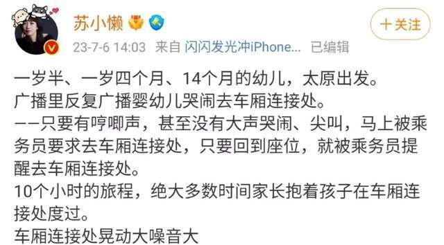
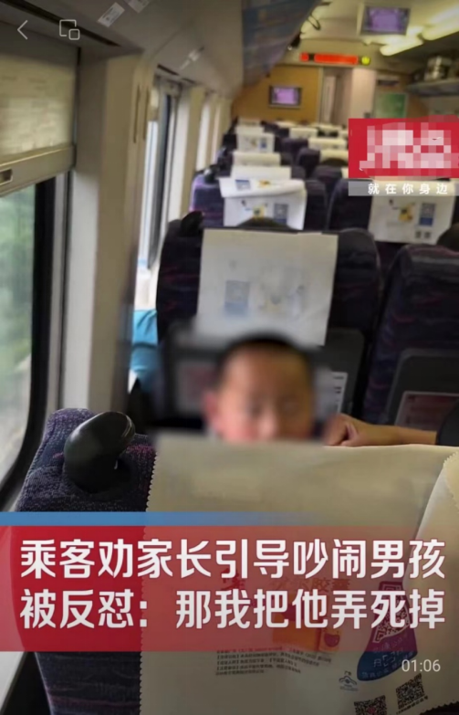
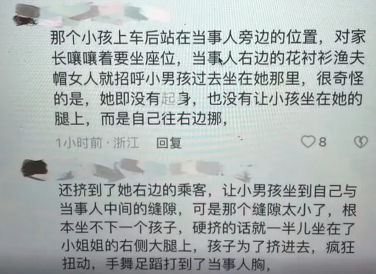
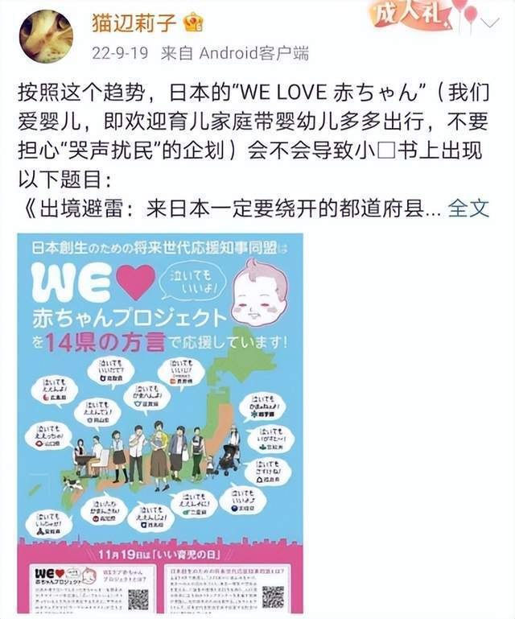

# 仇视孩子，正在占领中国舆论场

**不婚是自由，不育是自由，仇童不是自由，是偏执；宽容孩子，是法律义务。**

**冰川思想库特约撰稿丨沈彬**

总算有人明白过味来了，已然成为新闻产品细分类目的“熊孩子”新闻，在“秩序”“公德”的外衣之下，包裹着对儿童的戾气、对生育的厌恶，却被当成了爽文来吸引流量。

更可怕的是，标榜不育的所谓“最后一代人”正展现对婴幼儿的漠视乃至仇视。

01

**“仇童”华丽丽地登场了**

作家苏小懒，是勇敢的人。

她在微博记录了若干起带孩子乘火车，遭遇苛刻对待的事：

——四川一列火车车厢里一名只有八个月大的小宝宝，因为发出了咿咿呀呀的声音，就被乘客质疑“太吵”，在被投诉之后，被乘务员“邀请”到餐车车厢。

——“一岁半、一岁四个月、14个月的幼儿，太原出发。广播里反复广播婴幼儿哭闹去车厢连接处。只要有哼唧声，甚至没有大声哭闹、尖叫，马上被乘务员要求去车厢连接处，只要回到座位，就被乘务员提醒去车厢连接处。”

_图/网络_

**很快她的微博变成了“诉苦大会”。**

有的家长说：“五月份带孩子去北京，一岁半，途中孩子哼唧有点哭闹，乘务员也一直来提醒我安抚好孩子，不让孩子大声。”

有的说：“两周前带我孩子坐高铁。孩子刚刚哭了两声就被乘务员过来提醒带到车厢连接处了。”

还有的说：“我遇到过两次了，可能太热了，小孩子1岁多，哭了。正在哄，乘务员就让去连接处了。”

爸爸，或者是妈妈，带着吃喝拉撒都不能控制的孩子，还背着尿布、奶瓶、热水壶、口水巾、替换衣服……大包小包，孩子因为环境陌生，或者感觉害怕，或者感觉兴奋，突然哭闹起来，哄过没用，凶过没用，周围已经投来嫌弃的目光，你正试着给小孩子讲个故事，播一段小猪佩奇，手足无措中。

此时，已经有正义的乘客站起来，拿着手机边拍边质问：你能不能管管你的孩子！

你焦头烂额中，没有好气地回了一句：“我管了，孩子不听！”

“你管不好，说明你的教育没有到位！”

“要不你来管！你把他弄死好了！”

**嗯！就是等着你这句话呢。**

对面斯文的小哥哥或者小姐姐，把刚才录的视频往网上一放，然后就是一片嘲讽“熊家长”的评论。然后，媒体以“乘客劝家长引导吵闹孩子，被反怼：那把他弄死掉！”为标题，再吃一波流量。

_图/网络_

这就是“新黄色新闻”里的流量担当——“熊孩子新闻”，要的就是撕裂、冲突，要的就是凸显熊家长蛮不讲理，很多时间故意不写或者不核实孩子的实际情况，比如，３岁，比如，８个月。

我有一次被这种明显断章取义的新闻整怒了，家长在讲出上了标题的那句——“那我把他弄死”之前，还讲了一堆“你们又不是没有看到，我们之前一直在哄”的话。不客气地说，自媒体、机构媒体屈从于流量KPI，精心投喂出了一个“熊孩子新闻”的消费群体。

在厌女、憎男、仇老之后，“仇童”华丽丽地登上了舆论场。

02

**被咪蒙“解放”了下限**

什么时候我们开始对孩子这么不宽容？什么时候带孩子出门比不牵绳带狗出门更有负罪感，一不小心就被钉上了道德的十字架呢？

**小孩子在东西文化当中，都是纯洁、善良的化身。** 耶稣说：“你们若不回转，变成小孩子的样式，断不得进天国。”中国儒家也说君子不失赤子之心。

但是，养过小孩子的都知道，他们很多时候也是“小恶魔”——不肯吃，不肯睡，大哭大闹，不愿意停，多少妈妈从婴儿永远炯炯的不肯睡觉的眼神里被“折磨”得疲惫不堪。

这种失控是作为哺乳动物幼崽必须经历的阶段，不是父母故意放纵的结果，也是整个人类社会必须共同承担的共同成本。

宽容小孩子本是人类不言自明的道理，那么，什么时候网络空间失守了底线呢？

_图/网络_

**还记得多年前的咪蒙系的“故事会”吗？**
火车上带孩子的家长要求换下铺，行文时一定要突出家长站在道德高坡做俯卧撑的样子，被自己严词怼回去，然后“上价值”：你有孩子了不起啊！一时间煽动出了突破文明阈值的情绪，之后变成仇童的狂欢。

被咪蒙“解放”了下限的网民，突然觉得天地都宽阔起来，再也不耻于硬刚3岁小孩子，再提宽容孩子，那就是“道德绑架”。

03

**不婚不育转向“仇童”**

自媒体的兴起大幅降低了人们的“文明阈值”，禁忌和底线变得越来越低，是一个方面。

另一个方面，则是标榜不婚不育的年轻人，潜移默化中形成了“仇童”的集体意识。

7月4日
，科普作家河森堡给出了一段“暴论”说：如今公共场合下对幼儿的责难和苛求，其实也是社会上“有今没明”气氛的体现，毕竟生养孩子是一个超长线的投资……一个只在乎当下的人，自己不会做生养孩子的选择，也一样难以容忍别人的孩子给自己带来的麻烦，这在生育率普遍暴跌的中国和韩国，逻辑是一样的。

“有今没明”是从生育的经济成本角度的分析， **“仇童”是不愿意婚育的价值观在情感层面上的转写。**

我看到一个孕妇的跟评：“随着低生育率的发展，未来人们对幼童闹腾的容忍度也会越来越降低，因为缺乏了同理心。以前家家户户都会有孩子或曾经养育过孩子，很容易理解别的家庭。我怀孕至今8个月了，都没被让过座，为啥，因为大家都觉得自己不会有后代了，自然没必要牺牲自己现在的利益完成这个社会道德传递。”

_图/图虫创意_

我不能确定，不给孕妇让座是不是成为“风潮”，至少一个标榜“不婚不育”的社会，很难形成对于孕妇、婴幼儿的关爱，这在逻辑上是成立的。

随着少子化愈演愈烈， **一些年轻人敌视孩子成为大概率事件，这是一个客观和悲观的现实。**

你有没有发现，几乎所有有关“熊孩子”直接冲突的新闻里，和孩子冲突起来的都是年轻的小姐姐和小哥哥，有没有！

04

**儿童车厢：韩国人的牙慧**

一者，很多小仙女、小少爷其实在和孩子争夺生态位，他们觉得自己才是需要社会照顾的群体。

社交的网络舒适区、圈地自萌的商品化，让很多年轻人拥有了“漫长的童年”，“小公举”自带减龄人设，哪怕到了更年期，都需要得到别人的照顾，而不是容忍人类幼崽。很多个案中，都是小仙女利用女性的“弱者身份”和小孩争夺“受宠溺权”。

上回杭州一个女网红，在地铁上说三岁的小男孩摸她的胸，带孩子的又是老奶奶，说了一句掉在小网红舒适区里的话“他还小，不懂事儿”，顿时发作起来，也的确赢得了一众媒体的支持。在被目击者揭穿之后，她又发视频承认“夸大求原谅”。

_▲地铁事件目击者留言（图/网络）_

**我不相信，一个和小孩子斤斤计较的人，会奉献社会，**
这些人无非打着“公德”“规范”的借口，实施着最赤裸裸的自私自利，本质上这些人觉得自己才是需要得到社会照顾的“婴儿”，而真正需要得到社会帮助照顾的婴幼儿抢占了他们的生态位。

二者，当“厌婚”成了流量密码，那么必然“厌育”，必然“厌童”。

就像前述的那名孕妇的留言，因为不生也不想生，所以对孩子会缺乏同理心，更不觉得需要容忍孩子。这个问题也不是中国的，生育率低下的韩国更明显，“儿童禁入区”已经在韩国很流行了。

据统计韩国有数百个禁止儿童进入的公共场所，主要目的是确保成年人有个不受干扰的环境。餐厅、咖啡馆等公共场所的所有者是主要拥护者，光济州岛就有80多个此类区域。所以，那些在新闻后面鼓噪“儿童车厢”的无非是拾韩国人的牙慧。

你大概看过这样的文章，新手父母带着孩子坐飞机，还特意给周遭位子上的乘客准备好了道歉卡、小礼物，怕因为孩子吵闹给其他人造成困扰。这则故事非常的“日系”，但给我的感觉是，出门带一个孩子就是“有原罪”的。

_图/网络_

不过，据@猫辺莉子的介绍，真实日本并不是这样的——日本并没有常设的“儿童车厢”，电车上贴着“我们爱婴儿”“哭出来没关系”的贴纸。日本一向强调社会性育儿，“自己生、自己养”这种看法本身就是反社会，且是迫害弱势群体的仇恨言论。

05

**结语**

把18周岁以下的未成年人和呀呀学语、嗷嗷待哺的婴幼儿放在一个“篮子里”讨论，本身就是有问题的，甚至有人故意为之，这样才能祭出“你养孩子，关我什么事”“你小你有理”的叙事。

下回再有人说：“你孩子关我屁事”，直接拿《未成年人保护法》怼回去——“全社会应该树立爱护、关心未成年人的良好风尚”，再奉送一句“你以后的养老金全靠ta了”。

不婚是自由，不育是自由，仇童不是自由，是偏执；宽容孩子，是法律义务。

