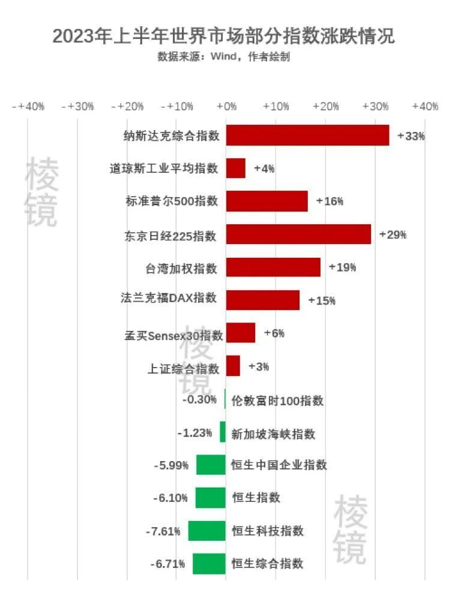
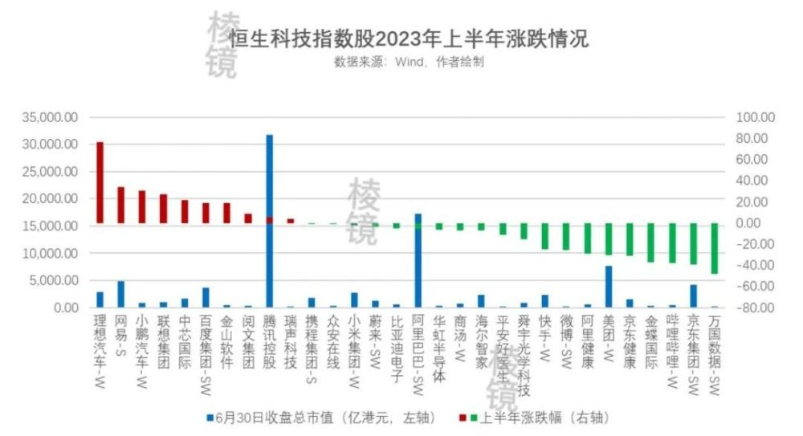
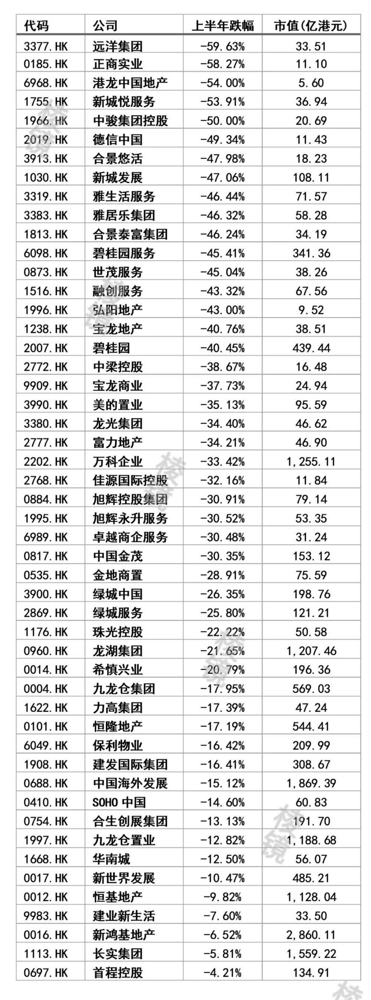

# 半年退市21家，科技股指数下跌7成多，港股沦为全球最差股市

_​来源：视觉中国_

特约作者 | 温世君

编辑 | 郭一非

出品 | 棱镜·腾讯小满工作室

7月至今，港股四个交易日先涨后跌。6日，恒生指数单日跌幅高达 3.02%，迅速下探至19000点关口之下。

虽然有机构喊出港股2023年下半年“不会再跑输”，明年上半年“目标23000点”，但当下这个起跑略显踉跄。

现在的股市不好吗？大多数市场其实还不错。

纵观全球，美股尤其是纳斯达克、日股，甚至中国台湾、欧洲的市场都在2023年上半年迎来了一波上涨行情。同期来看，中国内地市场的上证综指也积累了3%的涨幅，虽表现平淡，但聊以慰藉。

_图：2023年上半年世界市场部分指数涨跌情况（以2023年第一个交易日收盘指数为基准）。数据来源：Wind，作者绘制。_

但港股这边的风景却略显冷清。

6月30日，虽然小鹏汽车、蔚来等多个新能源标杆股票贡献了一定的涨幅“正能量”，但恒生指数收盘依然下跌0.09%，报收18916.43点，正式为2023年上半年的港股市场画上句号。

从2023年1月3日也即新年第一个交易日收盘指数为基准，截止6月30日，恒生指数上半年下跌6.1%，恒生综合指数下跌6.71%，恒生科技指数下跌7.61%，恒生中国企业指数下跌5.99%。

是谁拖累了港股？

**科技股引擎熄火**

港股的世纪牛市距离今天并不遥远。

2018年，港交所新版《主板上市规则》生效，允许中国内地新经济公司在港二次上市，保留VIE构架（简言之就是境外上市实体通过协议控制境内运营实体）和“同股不同权”。

2019年，阿里巴巴回归港交所，创当年全球最大规模IPO。2020年之后，网易、京东、新东方（今年已更名为“东方甄选”）、百度、携程、微博、蔚来……在美上市的一众中概股，也纷纷回归港交所。

此时，即便在疫情之下，港股“流金”涌动，依然如潮水。

_图：以2019年7月1日指数为0点，至2023年6月30日恒生指数、恒生科技指数、恒生中国企业指数、恒生综合指数走势情况。来源：Wind_

2020年底，港交所任期最长，多达11年的行政总裁，也是一手推动新版《主板上市规则》落地的李小加正式卸任。他在接受媒体采访时，轻描淡写地说：“这么大年纪了，接下来想自己干点事，看看能否尝试不打工了。”

时也命也。站在今天看，他的急流勇退几乎“卡点”。在他卸任后不久，次年2月16日，恒生科技指数上探到10694.68点的峰值。

随后，监管、市场、信心等多重因素下，这个指数开始一路起伏下滑。2022年10月24日，恒生科技指数下探至2801.99点，较一年多之前的峰值，下跌73.8%。港股过山车，名不虚传。

2023年，监管方面开始不断释放利好消息。1月初，央行金融市场司负责人马贱阳公开表示，2020年11月以来，蚂蚁集团等14家平台企业金融业务的“大多数问题已基本完成整改”。

市场已经砸出这样的“深坑”，但科技公司业绩、技术、概念方面乏善可陈，并没有历史性的突破，叠加中美博弈等宏观背景，当下港股科技股的信心、行情的修复，仍缺乏有效的驱动力。

_图：恒生科技指数股2023年上半年涨跌情况，市值为2023年收盘市值。数据来源：Wind，作者绘制。_

2023年上半年，恒生科技指数30家成份股，收涨的只有10家。30家成份股中市值前五名的，只有腾讯控股一家上半年收涨5.27%。

新能源车在上半年有一波行情。恒生科技指数成份股中，涨幅最大的是理想汽车，上半年收涨76.43%，但其2800多亿港元的总市值，相对于30家恒生科技指数成分股合并9.36万亿港元的总市值（6月30日收盘），带动能量依然有限。

**地产股的挣扎**

当然，弱市也不乏强手。

在地缘政治、能源供应、汇率等多重因素下，能源类股票涨幅明显。中国石油上半年涨幅58.54%，领涨81家恒生指数成份股。此外，中国石化、中海油、中国神华三家央企的涨幅，分别为27.08%、19.58%以及19.42%。

这些能源类公司总市值不小，如果没有它们在上半年较为有力提振了恒生指数的“水位”，或许指数会更加难看。81家恒生指数成份股中，上半年下跌个股多达55家。其中，碧桂园服务（物业板块）下跌45.41%领跌，其背靠的母公司碧桂园，则下跌40.5%倒数第二。

2023年3月1日，41岁的杨惠妍接替父亲杨国强，出任碧桂园主席，酝酿多年的接班计划正式落地。但迎接这位新掌门的，却是公司上市16年以来的首次亏损。

2023年4月，碧桂园发布的2022年财报显示：全年净利润亏损29.62亿元， 2021年则盈利267.97亿元。

虽然在2022年碧桂园在全市场发行了“近人民币百亿元直接融资”，获得了“超十家银行逾人民币3000亿元意向性综合授信支持”，属于为数不多的没有债务违约的民营房企。但截止年末，碧桂园已预售面积依然高达8380万平米，但已竣工未交付面积只有400万平方米。

现在，碧桂园对外喊出的“保交付、保资产、保安全、保信用”，绝不是口号，而是切切实实的压力。

但碧桂园的境遇，其实是当下中国房地产公司的普遍现象。

如果把观察范围扩大到包含528家港股上市公司的恒生综合指数，地产股的艰难挣扎更为明显。恒生综合指数中包含的65家地产公司，多达55家上半年处于跌势。

其中，不乏“浓眉大眼”千亿港元市值的地产巨头：万科下跌33.42%，龙湖下跌21.65%，中海下跌15.12%，九龙仓下跌12.82%……

甚至分红的策略也不再奏效：即便2022年万科给出了7.87%、龙湖给出了6.5%的高股息率，依然难以扭转股价的疲软走势。

_图：2023年上半年股价下跌的55家恒生综合指数成分股地产公司（跌幅序）。数据来源：Wind，作者绘制。_

作为国民经济的支柱产业，房地产行业与金融行业的稳定唇亡齿寒，我们不希望再走日本泡沫破裂、资产价格崩塌，用数十年时间修复资产负债表的险路。

政策调控、经济周期、人口走势，房地产行业眼下仍旧压力重重，未见回暖。但问题的关键是整个市场信心的修复——居民对于预期收入的信心，企业经营者对市场的信心，投资者对股价的信心。

**借机私有化、退市常态化**

市场低迷，对于希望私有化的企业来说是个机会，这意味着可以用更低的价格，把上市公司买回来。

2022年全年，港股共有15家公司实现私有化退市。但2023年仅上半年，就有12家港股上市公司发布了私有化退市公告。截止6月30日，已有三家公司完成私有化，包括江南集团、寰亚传媒、金利丰金融。

以江南集团为例，这家位于无锡的电缆制造企业2012年于港股上市，2016年股价峰值时，市值曾经一度高达59.14亿港元。但2023年第一个交易日，其股价只有0.2港元，总市值不过12.3亿港元。

正如江南集团在公告中称，退市的原因是“流通量较低”，股价“变现欠佳”，但维持上市公司地位“需要高额的合规成本”，而且
“目前的上市平台不再足以作为其长远发展的资金来源”。公司甚至直言，“股份表现欠佳影响客户和投资者口碑、对其业务以及员工士气造成不利影响”。

上市时爱之深，退市时恨之切。毕竟港股市场马太效应明显，资金聚集在头部上市公司，一些中尾部的企业与其沦为“仙股”，还要承担持续上市费用成本，不如及早退场。更重要的是，A股注册制的大门已经打开，且两地市场依然存在估值溢价，港股私有化之后，再择机A股上市，也是私有化的一个重要动机。

6月27日，达利食品发布溢价37.87
%的拟私有化公告，其理由同样是“股价低迷，募资有限”。相较于1月3日487.5亿元的总市值，达利食品在公告私有化前一天，市值已跌至372.48亿元。

虽然达利食品在回答媒体采访时称“公司目前没有 A
股上市计划”。但其业绩较为稳定，选择在股价相对低迷时私有化，实控人和管理层必有更系统性和长远的考量。可以判断，这家一度错过A股消费股行情的食品企业，未来回A的可能性非常之高。

_图：2023年上半年港股退市、私有化公司一览。数据来源：Wind，作者绘制。_

私有化之外，更多的退市也在2023年上半年出现。从数据上看，港股退市公司从2018年的4家，迅速增加到2022年47家。2023年上半年，港股被动退市公司也已达到21家。

退市名单中，既有中国忠旺这样折戟的大鳄，新力控股集团这样回天乏力的地产企业，也不乏南岸集团、环球智能控股这样的老牌壳股。

这背后的重要原因，源自港股“炒壳”、“借壳”的价值空间变得有限。2018年8月，港交所新修订的《上市规则》“除牌”条文生效。2019年7月，港交所发布《有关借壳上市及其他壳股活动等咨询总结》，直指“借壳”上市盛行，港股“壳价”大跌。

有人说股市，特别是对港股而言，水至清则无鱼，但这无疑是短视看法。

不可否认的是，港股已经成为世界头部的交易市场，短期的市场震荡放在时代的长河中微不足道。市场本是无形的，一笔一笔的交易才构成了市场。无论多空，所有市场的交易者都愿意张开双臂，欢迎一个更加健康、规范的市场。

（以上分析仅供参考，不构成任何投资建议）

