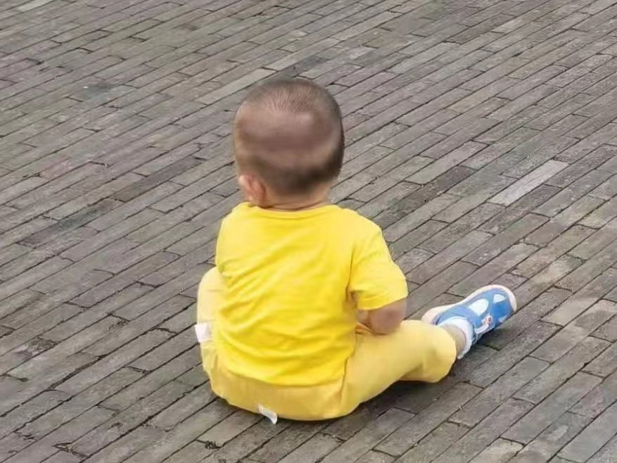
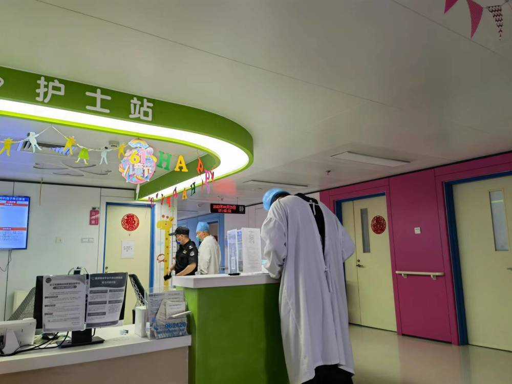
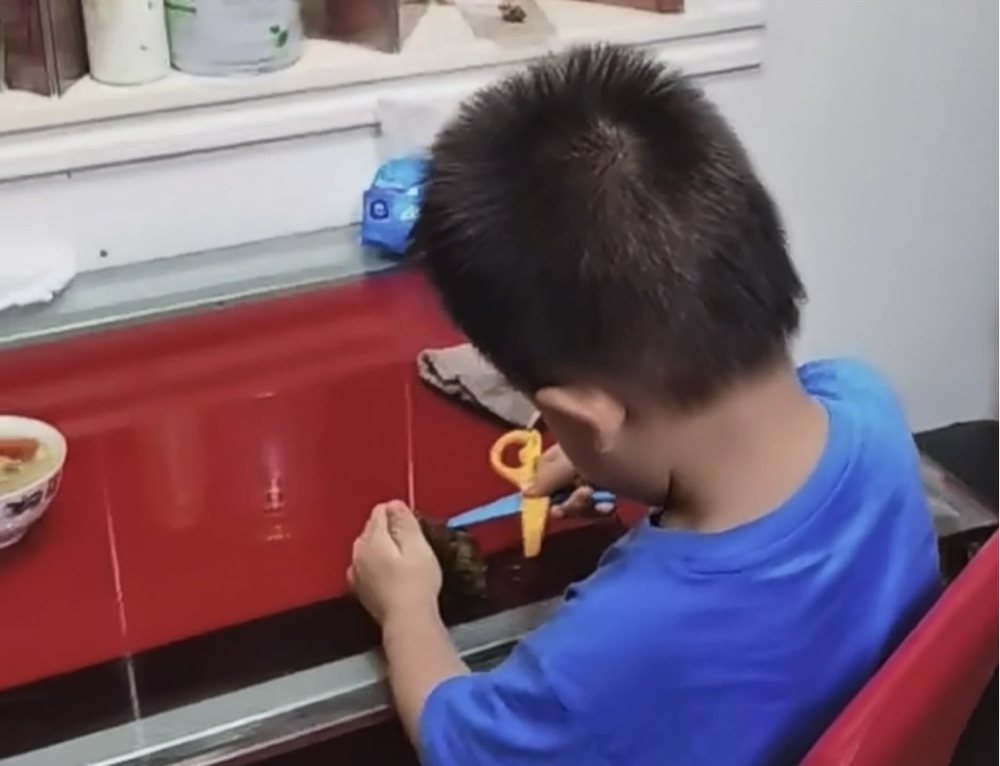

# 奶液泵入静脉之后：医院瞒家长补病历，患儿“全面发育落后”反被起诉

_“赵洁之子”生活照。
（受访者供图/图）_

那天是2020年6月1日儿童节，40岁的赵洁成为母亲的第23天。

7:45，天亮不久。后来才知道，此时在南京市儿童医院304病区，一位刚上完夜班的护士混淆了两根输液管，将其中一根灌满乳白色牛奶的硅胶管，接入至6号床婴儿的头皮静脉留置针，持续向婴儿静脉注射牛奶约半个小时。

5天后，赵洁才得知儿子在医院蹚了一回鬼门关。医院之所以不在事发当天告知家长，理由是：未调查清楚。

一晃三年，赵洁至今还在等一个调查结论。儿子已经3岁，发育低于常人，连最基础的“爸”“妈”都不会叫。作为父亲的薛林告诉南方周末记者，他有时会盯着像哑巴一样的儿子，不自觉地哭。

赵洁是一名外科医生，她与丈夫薛林四处奔波维权。而这名婴儿，以“赵洁之子”为名，频繁出现在上百页病历和几十份问询笔录、检举信、起诉书、判决书等材料中。

这是国内罕见的一例将深度水解配方奶注入婴儿静脉的医疗事故。当初的泵奶事件与如今患儿的发育落后，是否系因果关系？一系列模糊的病历和矛盾的证词，让这起医疗纠纷，成为一道难以解开的谜题。

“以肺炎的名义转科”

第一个发现情况异常的，是304病区的值班护士沈某文。

2020年6月1日早晨8:14，沈某文在巡房时，按惯例打开暖箱检查，发现6号床婴儿的被褥上有一摊水渍，旁边是一端连接着营养液挂瓶的针头，持续滴出营养液。

“然后我就去查看患儿的情况，发现静脉留置针上面有另一路液体在输注，我就顺着延长管向下看到了泵奶的注射器。”在南京市卫健委的询问笔录中，沈某文如此陈述。这意味着，本应该输注进婴儿静脉的营养液空悬在一旁，而用于注入婴儿鼻饲管的奶粉液，正被输注进婴儿头皮下的静脉。

沈某文立即断开泵奶的针，并叫早晨进行该项操作的护士颜某一起处理。此时，已经有约10ml的深度水解配方奶进入静脉通道，混合血液在婴儿体内遍布、循环了半个小时。

事情发生在早晨7：42，根据医嘱“小儿深度水解配方奶30ml，鼻饲（先经口喂养，剩余奶量鼻饲喂养维持1小时）Q3h”，患儿吸吮13ml配方奶后，颜某误将剩余17ml应鼻饲奶液的连接延长管接入至患儿头皮静脉留置针中。

事发使用的深度水解奶粉罐上明确表明“本品禁止用于肠外营养支持和静脉注射”。业内专家表示，深度水解配方奶与静脉营养液中的成分大致相似（均为氨基酸），但深度水解配方奶泵入静脉，可能导致过敏反应、中毒反应、肺栓塞、感染等风险。

眼看事情处理不了，沈某文提醒颜某跟领导汇报。“颜某说她要先观察一下，后来交接完班，大概九点以后，她和领导汇报的。”

后被南京市卫健委问及为什么没有立即报告时，颜某说：“我当时自己也很害怕，然后一直忙着处理这个事儿，给他上心电监护，所以没有立即报告。”

兼管304病区的护士长徐某娟回忆，“大约9点左右医生开始查房，颜某就把我拉过去，和我说她把奶粉输到静脉里了，然后我就赶紧去看了患儿。”

当奶粉在婴儿体内循环近一个半小时后，304病区护士长仇某还不知情，“我看到徐护士长神色紧张地进来，就问她什么事，知道了颜某把奶泵到静脉里了。”仇某立刻协助徐某娟对婴儿进行抽血、腰椎穿刺操作。“患儿当时没有特殊反应，生命体征心率逐步增快，呼吸相对快些，其他正常。”

9:24左右，徐某娟电话通知新生儿外科主任唐某兵。随后，南京市儿童医院急诊科副主任医师、新生儿内科主任、护理部副主任等人陆续赶到病房，组织抢救。

后续南京地区医疗责任保险赔偿处理中心对此出具的《医疗安全风险管理建议》显示：根据“赵洁之子”的病历推断，当时给予患儿吸氧，并安排血常规、生化、凝血常规、血培养、血气等检查，血液检查提示凝血功能较差，血中性粒细胞较低。婴儿出现一定程度的中毒反应和感染性疾病。

“唐某兵说他兜不住，你们赶快和院长汇报。”医务处干事张某回忆，情况紧急，患儿需马上转移到NICU（新生儿重症监护室）进行抢救。

救治过程中，儿童医院新生儿内科主任跟唐某兵明确表态，“患儿可以去306病区进一步治疗，但一定要统一口径，跟家长交代病情，事情太大，等外科请示领导后，告知其结果。”

但在同年11月的两份笔录中，唐某兵称，事发后“患儿情况比较稳定，心率稍快，面色红，还够不上抢救的标准”。12月21日，当被南京市卫健委问及“赵洁之子”的病情时，唐某兵又回答：“发生泵奶事件后属于病情较重的病人。”

张某记得，现场一位医生临时提了一嘴，患儿原本就有肺炎。此前，“赵洁之子”因“出生后反应欠佳2小时”，于2020年5月10日出生当天，入住南京儿童医院，被诊断为：“早产儿，低出生体重儿，疑似新生儿败血症，新生儿肺炎，以及先天性扭转不良伴胃扭转”。

南京市卫健委调查笔录显示，多名一线医生表示，相关领导在第一时间指示医生“以肺炎的名义转科，暂不说真实原因”。

事发当天中午11:20，对泵奶事件一无所知的薛林接到医生电话，被告知孩子要转入 306 病区进一步治疗。“让我们去医院，但未说孩子的基本情况。”

当天下午，薛林在不知情的情况下，签署了7份文件，包括2份医患沟通记录、2份特殊治疗及检查知情同意书，还有新生儿机械通气知情同意书、新生儿空氧混合CPAP治疗知情同意书，以及1份病危（重）通知单。

南方周末记者看到，当天院方提出的特殊治疗包括：对患儿进行气管插管、呼吸机辅助通气抢救治疗、静脉营养及血管活性药物治疗、腰椎穿刺检查、空氧混合CPAP治疗。在上述文件中，院方均说明特殊治疗操作风险高，难度大，可能会造成生命危险。

病危（重）通知单写道：“目前患者病情危重，虽然积极救治但病情趋于恶化，随时可能危及生命，特此下达通知。”

看到这份病危通知书，赵洁“眼泪唰唰就下来了”。直至四天后，6月5日，新生儿内科主任将薛林带到行政楼的会议室，告诉了这位父亲泵奶事件。薛林听完，“懵住了”。

_南京市儿童医院。 （受访者供图/图）_

“先不对外说”，后补记病历

“在这件事情上，我们一线医生是煎熬的，从星期一到星期五都煎熬的。”

泵奶事件发生在星期一。南京市儿童医院新生儿外科主任在一份交给南京市卫生监督所的补充材料中写道，事发当天，直至下班时间，一线医生都没有收到告知家长的通知，故无法记录病历。

多名一线医生在笔录中称，“不告知（病情），不记录（病历）”是领导的指令。

而领导层对此说法不一。南京市儿童医院院长陈宇宁称，自己在当日上午10:20左右得知消息，领导层集体做出决策。“这件事情发生后我和黄书记（南京市儿童医院党委书记黄松明）都是在一起的，王副院长当时汇报了情况，鉴于患儿母亲情绪的问题，建议患儿先以新生儿肺炎的名义转科，我同意了。”

副院长王某向南京市卫健委否认这一说法，“我没有和任何人讨论和汇报过患儿转科的事情，也没有任何人和我请示过关于告知（家长）的事。”

《病历书写基本规范》第三条规定，病历书写应当客观、真实、准确、及时、完整、规范。《医疗事故处理条例》第八条规定，特殊情况下病历可于6小时内补记，并加以注明。

在南京市卫健委对此案的调查过程中，一线医生对不记录病历的解释是：多个病区及辅助科室所有医务人员均可查阅院内医疗病历系统，而且患者家长赵洁在医院熟人众多，也均有机会查看病程并告知家长，所以在听从医院管理部门不告知的指令下，他们无法当天在病程中记录。

次日，星期二，婴儿病历仍为空白。副院长王某在笔录中表示自己对此不知情：“当天晚上我看了病历，当时发现与泵奶有关的病程并没有记录。”

“下指令的人推脱得一干二净，责任就变成一线医生不记录了。”一线医生在一份集体汇报中写道：星期二中午，他们曾催问过医院管理部门调查结果。“但遗憾的是，没有得到回复。”

星期三17:10，南京市儿童医院召开视频会议，南京市儿童医院医务处主任田某在会上指示：“先保密，我已经和各位主任也打过招呼，先不对外说。”副院长王某也表示，病程记录已经超过6小时，后续怎么补记，要请示两位一把手（医院党委书记和院长）再做决定。

星期四中午，王某找医院党委书记和院长讨论病历记录情况时问：“其他科医生都已经知道了，你们看怎么办？”当天下午，医生蒋某某接到了田某的电话：“田某让我补一个抢救记录，我就和李某星一起把抢救记录补上了。”

星期五，医院领导告知家长泵奶事件，此时一线医生已经将四天内的病历补齐。其中，6月1日的6份病历表明，除呼吸心跳加快之外，婴儿当天生命体征较稳定。

对于这些后期补记的病历，赵洁夫妇并不认可，称其“漏洞百出”。

病历显示，2020年6月1日早晨8:45，患儿神志清、精神反应可，面色黄柔；9:30，面色红润，精神反应好转，有哭闹，生命体征稳定；11:44，神志清，精神反应尚可，面色红，稍黄柔。

这与询问笔录中，两位新生儿内科医务人员对当时婴儿体征的描述大相径庭。2020年11月23日，儿童医院新生儿内科主任在接受南京市卫健委询问时回忆，自己在事发当天早晨9:34接到通知赶往现场，看到孩子正在进行氧帐吸氧，“神志不清，全身苍灰，刺激无反应，肌张力低”。儿童医院新生儿内科副主任也称，“患儿当时精神不好，感染重、面色苍黄、白细胞下降、凝血功能严重异常，所以考虑给婴儿下了病危通知书。”

6月1日上午10:24的新生儿监护检验报告单中显示，“赵洁之子”血氧饱和度73.21%，后附参考值为95%-99%（注：动脉血氧饱和度参考范围95%-99%，静脉氧饱和度参考范围65%-75%）。如果73.21%是动脉氧饱和度，代表患儿已处于严重缺氧状态，濒临死亡。

这份抽血化验单的采血人、化验人是谁，报告单均无记录。所有被南京市卫健委询问的医护人员及院方领导在笔录中称，不知道是哪位医生下的医嘱，也不知道是谁抽的血。

针对赵洁提出的质疑，南京市儿童医院称，经院内组织专家讨论，根据该化验的各项结果得出结论：实际采的是静脉血血气，氧饱和度符合65%-75%的正常范围。“假设此血气为动脉血，氧分压42mmHg是必须气管插管机械通气治疗了，否则一定会出现呼吸衰竭，严重缺氧，危及生命。这与本患儿整个临床表现及救治过程不符。”

实际上，抽取的血液是动脉血还是静脉血，主要依据患儿临床表现判断。赵洁认定的临床表现是患儿事发后严重缺氧，濒临死亡；而医院认定的临床表现是患儿生命体征稳定。但关于“整个临床表现及救治过程”详情，院方未在病历中记录。

“在9:30到11:44这个抢救的时间段内，病历没有任何关于小孩体征的描述，抢救的过程完全没有记载。”赵洁进而向儿童医院提出，查看孩子病房6月1日的监控录像，院方回应“监控未启动”。

2020年10月19日，儿童医院出具的《关于赵洁之子事件经过的报告》提出：“我院多次与家长进行沟通、解释，但家长一直不相信医院的调查结果，希望家长可以通过第三方或司法途径进行调查。

赵洁坚持医院的调查结果不实，她认为病历抹除了婴儿因泵奶事件后生命危急的真相，导致无法证明婴儿后期身体状况不佳与泵奶事件有因果关系。为了明确2020年6月1日当日具体发生了什么，赵洁决定跟儿童医院对簿公堂。

同年6月和10月，南京市卫健委两次介入案件，进行调查。

家长告政府，医院告患儿

赵洁怎么也想不通，颜某作为已经从业11年的医护人员，为什么能犯违背常识的错误。

在护理的核心制度中，有一项查对制度，其中规定服药、注射、输液严格执行“三查七对”。三查即操作前查、操作中查、操作后查。七对指核对床号、姓名、药名、剂量、浓度、时间和用法。

在2020年12月18日的一份询问笔录中，南京市卫健委卫生监督员问颜某：“你在给赵洁之子接鼻饲奶的时候具体三查和七对是怎么执行的?”

“操作前查对床号、姓名、什么奶、剂量、给奶途径，并且我用空针接到鼻饲管末端，抽取了部分胃内容物，确保了鼻饲管在胃里。操作中检查整个管路，最后贴上标签;操作后再次确认是否通畅，连接完整，输奶泵已开启。”颜某回答，自己进行了三查七对操作，但没有严格执行。

“我觉得我是正常操作的。那段时间我们科正在整改，原来的鼻饲用的营养泵贴的桔红色标签全部撤下来了，两种泵如果不贴标签，实际上是一样的。”2020年6月，颜某在医院内部的“不良事件讨论会”上也做过解释。

有医生表示质疑：输液是竖泵，泵奶的是横泵，完全不同。还有横泵放在暖箱下面，区域也不同，管子也不一样，为什么会接到静脉上面？

颜某补充道，自己前一天上夜班太累，睡得迟，夜里3-4点收了两个病人，早晨起来很累。“当然这个不是我发生事情的借口，我也不知道当时怎么鬼使神差地干了这个。”

事发当天，颜某担任夜班组长，具体工作是辅助管床护士，负责检查和质控，并不负责给婴儿喂奶，后出于帮忙，才给“赵洁之子”喂奶。护士长提出，颜某应优先完成自己的工作职责再帮忙。

泵奶事件后，南京市儿童医院针对“无泵奶专用延长管”和“未进行双人核对”两方面提出整改措施：病区全面使用肠内营养泵，科内进行全员培训并考核，护士长日常监督实施“双人核对”工作情况。

2020年10月，南京市儿童医院承诺，患儿此次住院救治费用均由医院承担，愿意提供患方一定的精神赔偿，一岁后患儿身体状况有任何问题发生，经鉴定如系此次事件导致，医院承担相应责任。

同一时间，南京市卫健委以颜某为案发人进行案件受理，报案人薛林。经初步审查认定，颜某的行为违反了《医疗纠纷预防和处理条例》，涉嫌未遵守诊疗护理规范开展诊疗活动。

在“赵洁之子”事件中，参与抢救的一线医生均未按规定及时告知病患家属患者病情，违反相关规定；也未及时填写病历资料，所有病程均为事发后几天后补记，构成违法行为。

次年1月，南京市卫健委对颜某予以警告，并罚款人民币五万元。一同被开具行政处罚通知书的还有田某、唐某兵、蒋某某等六人，各自罚款一至三万元不等。南京市儿童医院由于未严格执行护理制度的行为，构成未遵守诊疗护理规范开展诊疗活动、未按规定告知患者病情、未按规定填写病历资料，以及未按规定封存现场实物；予以警告，并罚款人民币五万元。

医院整改了，卫健委对医院也处罚了，但事情还没有结束。

“我小孩已经3岁了，一个字儿都不会讲。”赵洁认为南京市儿童医院受到的处罚太轻。此外，医院是否涉嫌伪造、篡改病例，颜某是否涉及刑事犯罪，南京市卫健委的调查报告都没有给出结论，赵洁认为未能满足诉求。

2022年2月24日，赵洁夫妇将南京市卫健委告上了法庭。然而11天后，他们不到2岁的儿子也成了被告。

_“赵洁之子”生活照。
（受访者供图/图）_

“全面发育落后”，原因难以查明

赵洁夫妇认为，真相调查清楚之前，医院都应该让儿子继续住院，接受治疗。两人的父母特意从老家赶来，守在病房里看着孙子康复。

医院则多次称“患儿已完全康复”，要求其出院，双方因此纠纷不断，甚至衍生了长达半年的“报警送餐”闹剧。赵洁说，“医院不让我们上楼，我们一天三顿饭都报警，让警察送上楼。”

2022年3月7日，南京市儿童医院起诉“赵洁之子”，要求其出院，后又撤诉。在民事起诉状中，院方陈述：在泵奶事件2周后，“赵洁之子”因误输入牛奶出现的感染及凝血功能就已经恢复正常，2021年4月1日予以出院，“但是，被告代理人拒不听从医嘱，并强行安排被告祖父母在308病区与被告居住至今”，并称，目前患儿生长发育良好，生命体征平稳，处于中等发育水平。

赵洁并不认同“生长发育良好”，2022年10月24日，南京儿童医院对“赵洁之子”的发育进程测量显示，已经29.5个月的孩子，发育相当于12-13个月。

同月，另一家医院对“赵洁之子”出具的GESELL智能测试报告单也显示，“赵洁之子”在适应性、大运动、精细动作、语言以及个人社交等五大方面的发育商（DQ）分别为67、80、56、16、50。

一般而言，0-3岁阶段的孩子发育商正常值是90-115分。该测试报告单的结论是：“赵洁之子”全面发育落后，仅相当于11月龄的孩子。

奶粉输入婴儿静脉与婴儿发育全面落后是否具有因果关系，这个问题至今难以查明。

“我就是想知道，那天到底发生了什么？是不是因为缺氧，导致我儿子大脑不可逆的损伤。”赵洁一遍遍要求南京市卫健委还原事发当日经过，给泵奶事件一个定性。

一审法庭上，南京市卫健委陈述，因薛林、赵洁不同意进行医疗事故鉴定，故调查人员不能单方作出鉴定化验，从而对整个医疗纠纷事件无法进行还原。

“我们巴不得做医疗事故鉴定，但南京市卫健委要根据儿童医院的虚假病历做鉴定。”赵洁不认可泵奶事件相关病历的真实性，称在此基础上做鉴定“没有任何意义”。

赵洁认为，在医疗事故鉴定之前，应该先对病历做鉴定。“病历不真实，泵奶事件就不可能有合理的定性，整个事件会一直陷在死胡同里。”

在起诉南京市卫健委的官司中，赵洁取得了胜利。南京江北新区人民法院认为，南京市卫健委作出的涉案处罚决定书对事件起因、责任人员的范围、责任的划分等情况明显表述不明，现有的证据不足以支持处罚决定，违法事实认定不清，予以撤销。

南京市卫健委提出上诉，称其已穷尽调查手段，并就发现的违法行为予以处理；对于赵洁夫妇提出的其他诉求，卫健委没有证据予以支撑，对于无法查实的事项，卫健委无权作出相应处理。

2023年3月29日，二审法院驳回上诉，维持原判。赵洁夫妇说，“历经两年多，行政诉讼案获胜了，但泵奶事件又回到调查的起点。”

大半个月后，被推翻的调查从头再来。南京市卫健委对泵奶事件启动联合调查行动，联合单位包括南京市公安局、纪委、司法局、信访局等。

2023年6月，南方周末记者多次致电南京市卫健委，对方称事件还在调查中，不便接受采访。南京市儿童医院也以“事件还在调查中”为由拒绝受访。

6月27日晚，在与南方周末记者的视频通话过程中，赵洁几次教儿子叫“妈妈”，她慢慢发音做示范，孩子无动于衷。那双乌黑的眼睛，呆呆地盯着陌生人。

这个3岁的小男孩，会在房间里上蹿下跳，爬到桌面上挥舞长剑，又跑到门前迎刚回家的父亲，但不会说话。

“我希望他成为一个健全的人，但从目前来看，可能性不大。”赵洁说。

（应受访者要求，赵洁、薛林为化名）

南方周末记者 郑丹

