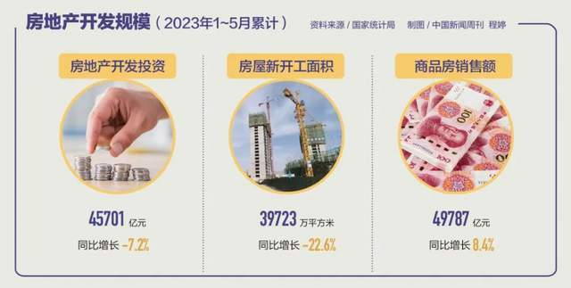
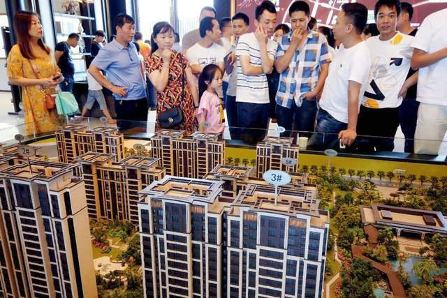
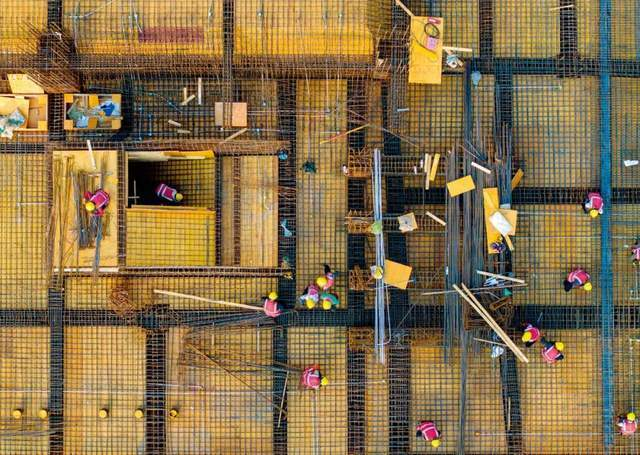

# 房地产还有大招吗？

2023年7月3日，中国房改启动25周年之际，中国的房地产业正处于深度调整之中。

去年四季度，伴随“金融十六条”“三支箭”等支持房企融资政策的出台，市场普遍判断，房地产业的政策拐点已经出现。但是半年多时间过去，房地产市场的拐点尚未到来，在经历今年一季度的“小阳春”之后，市场在4月迅速转冷。与此同时，房企资金状况没有明显改善。

正是在这样的背景下，6月以来，各种有关房地产救市的“小作文”不断在网上出现，却又一次次落空，目前市场的变化似乎系于更大力度救市政策的出现。

而在救与不救的踌躇之间，人们更关心的问题似乎是如何“救市”才是有效的。房地产行业，还能像过去十余年一样，成为经济复苏大盘中的关键一步棋吗？

_图/视觉中国_

**救，还是不救？**

“我们已经听到北京楼市政策风声，或是取消北京城六区以外区域限购，或是将‘认房又认贷’改为‘只认房不认贷’，或是降低首付比例，特别是目前二套六成的首付比例。”类似的“政策风声”已经在市场中流传多时，只不过期待中政策落地的时间点从5月推至7月。

更大力度的“救市政策”会否出台？这已经成为当今中国房地产市场的最大悬念。

“作为从业人员，当然非常期望政策支持，比如一线城市二套房首付、利息降低，部分区域适当放开限购等。但从理性角度看，上一次LPR仅下调10个基点，如此克制的货币政策，可能预示未来刺激房地产的政策会比较克制。”全国房地产经理人联盟理事邓浩志向《中国新闻周刊》表示，如果有更大力度的房地产刺激政策，应该会在近期推出，否则后续推出的可能性不大。“可能经过综合衡量，决策层认为‘挺过去’或许更有利。”

关于“救，还是不救”的讨论已经在舆论场进行多时，主张“救”的人士往往会强调房地产业于中国经济的重要意义。

6月底，中房集团原董事长孟晓苏在题为“中国房地产业2023年能否重启”的演讲中提及一组数据，2021年，中国房地产业销售额达到历史峰值18.2万亿元，但是却在去年下跌近5万亿元至13.3万亿元，房地产市场去年下降的销售额比汽车市场一年的销售额还大。

房地产业被视为启动内需的关键，甚至有“救楼市才能救内需”的观点，不仅因其销售额较高，也因其对周边产业的带动能力。“房地产业萎缩，空调可能也卖不出去。”孟晓苏曾引用截至去年11月居民新增储蓄15万亿元的数据表示，拿出其中的三分之一购房、装修，能够顺利启动楼市。此言一出，舆论哗然。但是他随后澄清说，只是鼓励银行里有大量存款的人购房。

但是亦有观点认为，中国的房地产市场已经达到“天花板”。

“房地产已经进入正常的行业调整时期，减价、减量、减速，如果非要将它拉到医院抢救，反而会让市场扭曲。”万通集团创始人冯仑担心，如果“救市”让房地产市场更加扭曲，还不如不救。

与冯仑一样，王石也在比照中国与其他国家房地产市场的发展阶段，“30年前，大和房屋曾经是日本三大住宅开发公司之一，75％的收入源自买地、建房、卖房，如今其服务收入已经占比76％，万科便在参考日本经济发展来到平稳时期后房地产市场的变化。”

但是依然有观点认为房地产业短期内仍有不小的发展空间。野村证券中国区首席经济学家陆挺便认为，去年中国城镇化率为65.2％，但城市户籍人口只占全国人口的47％左右，外出农民工人数约1.7亿。“我们保守估计有城镇住宅需求的农民工及其家属人口为2.2亿，扣除在工作居住地已经拥有城镇住房的4％的农民工人口，实际住房需求约为1亿套。”

“美国房地产业已经有246年历史，最近十多年强势复苏，拉动美国经济持续增长。”显然，孟晓苏认为只有25年历史的中国房地产业尚未触及“天花板”。

他认为，一些评论在使用虚假数据证明中国房地产业已经触及“天花板”，比如称中国人均住房面积已经达到50平方米，但是统计局数据显示，中国城镇人均住房建筑面积36.52平方米，北上广深则更低。

有经济学者向《中国新闻周刊》表示，从中长期来看，需要引导房企从增量开发向存量服务转型，也就是从开发商转变为运营商，但是这种转变不可能在一夜之间完成，短期内仍需要解决当下面临的问题。

关于房地产业对于中国经济的意义，时任国务院副总理刘鹤曾在今年年初表示，从未来看，中国仍处于城市化较快发展阶段，巨大的需求潜力将为房地产业发展提供有力支撑。他表示，房地产业是中国国民经济的支柱产业。与房地产相关的贷款占银行信贷的比重接近40％，房地产业相关收入占地方综合财力的50％，房地产占城镇居民资产的60％。

_四川成都锦江区的房产交易中心。图/视觉中国_

房地产业需要一场软着陆。相比于“救，还是不救”，更为现实的问题可能是“怎么救”。

去年四季度，伴随着“金融十六条”“三支箭”等金融支持政策的出台，外界曾评价房地产业政策拐点已经到来，但是相关政策出台已逾半年，房企流动性仍难言改善。

**政策频出，房企融资为何仍艰难？**

国家统计局每月发布的房地产开发投资增速通常被视为房地产市场冷热的标志。最新公布的数据显示，1~5月，全国房地产开发投资45701亿元，同比下降7.2％，同期房屋新开工面积39723万平方米，同比下降22.6％。可见房地产开发投资的下滑依然没有见底。

房地产开发投资意愿较弱的背后，是房企资金状况并未得到明显改善，特别是融资修复依然艰难。1~5月，房企到位资金55958亿元，同比下降6.6％。其中，国内贷款7175亿元，下降10.5％；利用外资13亿元，下降73.5％；自筹资金16267亿元，下降21.6％。

房企依然融不到资，但去年四季度出台的“金融十六条”与“三支箭”都旨在恢复受到“三道红线”和“贷款集中度”影响的房企资金需求。

而去年年底推出的金融支持政策之所以效果有限，部分原因在于一些政策落地的时间确实较长。

以“三支箭”中的“第三支箭”为例，2022年11月28日，证监会发布调整优化房企股权融资方面的五条措施，这是国内时隔12年后重启地产股权融资，与“第一支箭”新增授信、“第二支箭”增信债权工具并列，又被称为支持地产行业的“第三支箭”。

_福建福州市一处房产项目的售楼处。图/视觉中国_

“第三支箭”发布后，先后有多家上市房企或涉房企业公告增发事宜，如今年3月，新城控股公告称，拟定增不超过80亿元，其中24亿元用于补充流动资金，另56亿元拟投入其位于浙江温州、山东东营、重庆大足、山东泰安、江苏宿迁、山西大同的6个项目，这些项目均为已取得预售许可证、计划于2023年年内交付的项目，计划交付时间分布在6月至12月之间，是公司“保交楼、保民生”的重要工程。

但是直到今年5月29日招商蛇口定增通过审核，“第三支箭”在推出半年后，才迎来首单落地。5月底至6月初，招商蛇口、中交地产、福星股份、大名城、陆家嘴、保利发展等6家房企公告其定增获批，定增募资总额预计超400亿元，款项多用于“保交楼”“保民生”项目，或者是为了补充流动资金。中指研究院企业研究总监刘水认为，获批企业涵盖了央企、地方国企，以及福星股份和大名城两家民企，政策支持覆盖面较宽。

此外，尽管落地政策支持力度较大，但是否有投资者愿意参与定增仍然存疑。刘水向《中国新闻周刊》解释说，当前房地产市场仍处在弱复苏进程中，从中长期来看，新房增量市场空间有限，房企需向新发展模式转型，行业处在新旧发展模式的转换期，因此投资人对房地产行业存在较多顾虑，定增计划能否实际募资成功仍是未知数。此外，当前上市房企估值普遍走低，也削弱了定增计划对原股东的吸引力。

目前，一些上市房企已经处于退市边缘，遑论再进行股权融资。据中指研究院数据，目前，A股和H股中有35家房企徘徊在退市边缘，其中7家房企基本锁定退市。而A股戴帽房企共有11家，其中*ST蓝光已于6月6日退市，*ST海投也于6月19日接到终止上市交易告知书。

也就是说，即使有政策加持，但是在“市场化”的导向下，能否有金融机构愿意向房企，特别是出险房企“输血”依然存疑，银行在向房企贷款时便存有这样的疑虑。

去年11月发布的“金融十六条”中，为打消商业银行为“保交楼”提供配套融资时的风险顾虑，提出按照“后进先出”原则，问题项目剩余货值的销售回款要优先偿还新增配套融资和专项借款。同时明确规定，后期若这类新发放配套融资形成不良，相关机构和人员只要已尽职者，可予免责。

这项规定的有效期是自2022年11月11日起半年内，但是据《中国新闻周刊》了解，在此期间，商业银行对于已经出险房企的项目，特别是其中剩余货值较小、资不抵债的项目依然难以提供资金支持。“一些前期已售房源占比较高的项目往往难以获得新增贷款，因为后续可处置的资产较少。”

今年6月26日下午，住房和城乡建设部部长倪虹在会见中国银行董事长葛海蛟时，表示希望中国银行能在“保交楼”配套融资层面进一步加大工作力度，为促进房地产市场平稳健康发展、维护社会大局稳定作出更多贡献。

尽管有“金融十六条”鼓励，银行仍然担心坏账。金融机构正面临两难：一方面在房地产市场下行阶段需要规避风险，另一方面又要履行“保交楼”社会责任。

同样，在去年四季度出台的一些金融支持政策已经到期的情况下，后续政策迟迟难产，决策层也陷入两难，正如刘鹤在年初所言，需要处理好房地产业系统性风险和道德风险的关系。如果下一步救助需要政府投入更多“真金白银”，该投给哪些房企？又是否能够达到目的？

在目前的市场环境下，即使已经获得国资注资的房企，也难保现金流无虞。

作为河南本土龙头房企，建业地产近日公告，未能在宽限期结束之前支付2024年到期之7.75％优先票据利息，将暂停向所有境外债权人进行支付。

_6月13日，江苏淮安市，工人在一建筑工地上施工。图/视觉中国_

此前，河南省政府曾出面协调相关国资对其进行纾困。2022年6月1日，建业地产发布公告称，董事长胡葆森单独拥有的恩辉投资公司将建业地产29.01％的股份转让给河南同晟置业有限公司，后者也成为建业地产的第二大股东。同晟置业是河南省铁路建设投资集团有限公司全资子公司，河南铁建则由河南省人民政府100％控股。同晟置业入股帮助建业按期偿付了2022年8月8日到期的5亿美元债。加之建业自身于前年偿付的4亿美元债，在一年半的时间内，建业地产共偿付了9亿美元的外债。

今年压倒河南建业的最后一根稻草是不及预期的销售额。根据建业地产最新公告，今年1~5月，建业地产取得物业合同销售总额87.64亿元，同比减少20.8％；总合同销售建筑面积1259579平方米，同比减少14.6％；每平方米平均销售价格为6958元，同比减少7.3％。

建业集团公告称：“2023年二季度以来，中国房地产市场销售持续疲弱，每月销售逐渐恶化。销售不及预期，本集团流动资金紧张状况正在加剧，境外兑付压力持续增加。”

**一线城市松绑，能起多大作用？**

金融机构对房企的信心需要房地产市场支撑，销售回款显然对于当下的房企至关重要。“只有促进房地产销售好转，才能推动市场信心恢复，进而带动房地产投资改善。”中指院的研报称。

但是当前房地产市场依然萎靡不振。楼市在2023年第一季度短暂回暖之后，于第二季度再度转弱。中指研究院数据显示，在第一季度，全国重点100城新建住宅销售面积同比增长18.6％。2月和3月环比持续上行，但4月和5月环比分别下降26％和8％。

连万科这样的头部房企也销售不及预期。万科董事会主席郁亮提到，今年4月，一二线城市新房成交环比下降26％，5月又环比下降了2％，6月的先行指标显示，一手房来访量环比下降7％左右，二手房带看量也下降10％左右，这意味着市场销售不容乐观。

“短期内，市场确实还承受较大压力，合理需求没有得到释放，成交亦未达到合理水平。”郁亮称，影响当前市场表现的是短期预期，购房者对未来预期不确定或不明朗，修复信心和市场氛围需要时间。“但长期需求基础和购买力依然存在，市场不会饱和。”

问题的核心是，当下信心和市场氛围如何修复？在种种“救市”政策中，取消限制性措施成为市场更多的呼声。

中指院研报称，从稳定市场角度看，核心城市仍然存在着政策优化的空间。比如一二线城市认房又认贷政策还可以优化，首付比例可以降低；一二线城市可以采用一区一策的方式促进郊区去库存；限价政策调整上限，让价格回归市场；二套房贷利率、交易税费进一步降低等。

“核心政策是要取消限购，取消消费领域的限制性措施，直接激活楼市。”孟晓苏认为，取消限制性措施，特别是一线城市限制性措施，是激活楼市的关键。现在的救市政策，是滑稽救市，一手做人工呼吸、输氧，一只手还掐着病人的脖子。“我从来没有说过救楼市，我只是希望把掐脖子的这只手挪开，不再掐脖子了，病人慢慢就能缓过来。”

房地产一方面极度宽松，但另一方面还在持续限购限贷跟限价，为什么要卡着脖子输氧气？上海财经大学校长刘元春此前撰文解释：这种现象出现反映了我们目前陷入了涨价与降价同样的困局，陷入了短期和中长期的矛盾，也陷入了长效机制和新开发模式如何破题的一些难题。“因此新一轮房地产的调整路径会很复杂……单纯的市场刺激，很难复苏，还可能产生严重的后遗症。”

孟晓苏则建言松绑一线城市房地产限购政策。“2016年楼市去库存是从北上深率先起步，带动了强二线，带动了二线，带动了三线城市，带活了全国，这是我们中国的经验。一线楼市的启动才能辐射、带动到全国各地。”

年初开始，孟晓苏便提议北上广深带头取消限购，并从“商改住”起步。半年时间过去，谈及北京如何平稳的取消限购，他仍然建议从郊区、“商改住”做起。

此外，政策空间还来自改善型需求。乐居最新调研显示，有购房需求人群中换房改善占比达3/4。首套房贷利率的加点下限有过多次优化，而二套房贷尚未调整。邓志浩也提醒记者，一线城市一些改善型需求目前受到限购政策的制约，比如购买三套房依然有诸多限制。

在市场呼吁放开限购的情况下，据长江证券首席经济学家伍戈的统计，因城施策虽继续，但力度弱于过往。本轮房价同比下跌城市占比处于历史高位、销售下行的最大跌幅和负增时长均创历史之最（2023年为两年复合增速），但限购城市占比却仍保持在历史均值左右。

特别是今年以来，一线城市松绑楼市的步伐仍然谨慎。

上海、广州、深圳等一线城市的楼市调整政策更多限于公积金政策适度松绑，均提出针对多子女家庭提高公积金贷款额度。如广州住房公积金管理中心6月28日发布通知，为贯彻落实积极生育支持措施，生育二孩及以上的家庭（至少一个子女未成年）使用住房公积金贷款购买首套自住住房的，住房公积金贷款最高额度上浮30％。

至于为何一线城市松绑限购始终谨慎，广东省城规院住房政策研究中心首席研究员李宇嘉认为，结合近期商品房市场的走势，社会消费品零售总额低迷的现状，意味着必须要修复底层预期、就业和收入，而出台松绑一线城市限购、限贷等政策，可能带来的政策效果并不大，反而触碰到了“房住不炒”“不以房地产作为短期刺激经济的手段”等顶层要求，得不偿失。

显然，楼市政策之外的更多因素正在决定居民对于房地产市场的预期。

孟晓苏说，从境外的经验来看，在楼市下跌预期中，有钱、有需求的人也不愿意回到楼市。

如何让他们回到楼市？孟晓苏说，“我们看到每次楼市低迷的时候都会采取一些措施，一些市场现在又到了这个时候，会不会出台一定的措施？”

这个问题暂时没有答案。

发于2023.7.10总第1099期《中国新闻周刊》杂志

杂志标题：房地产的十字路口

记者:陈惟杉

