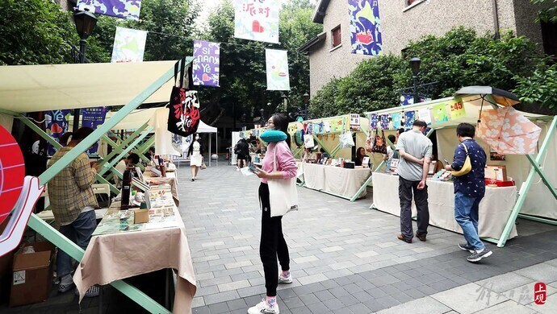
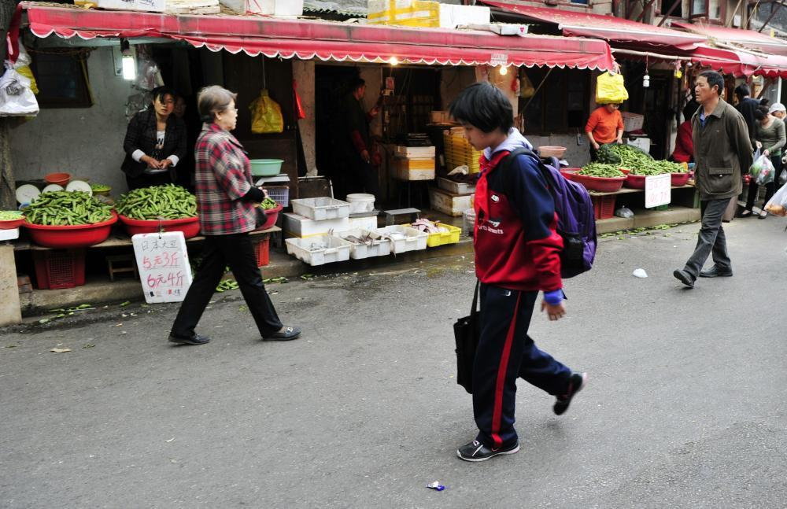
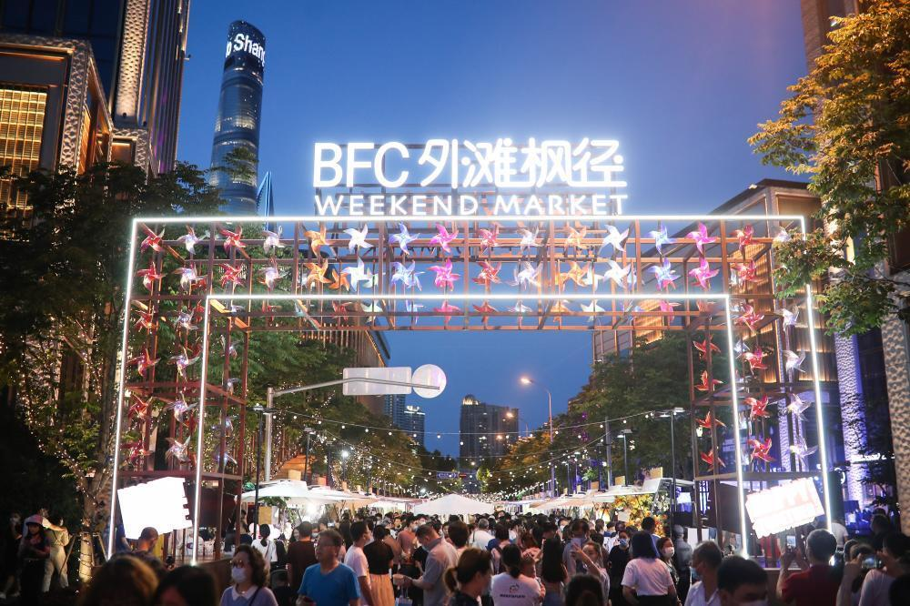
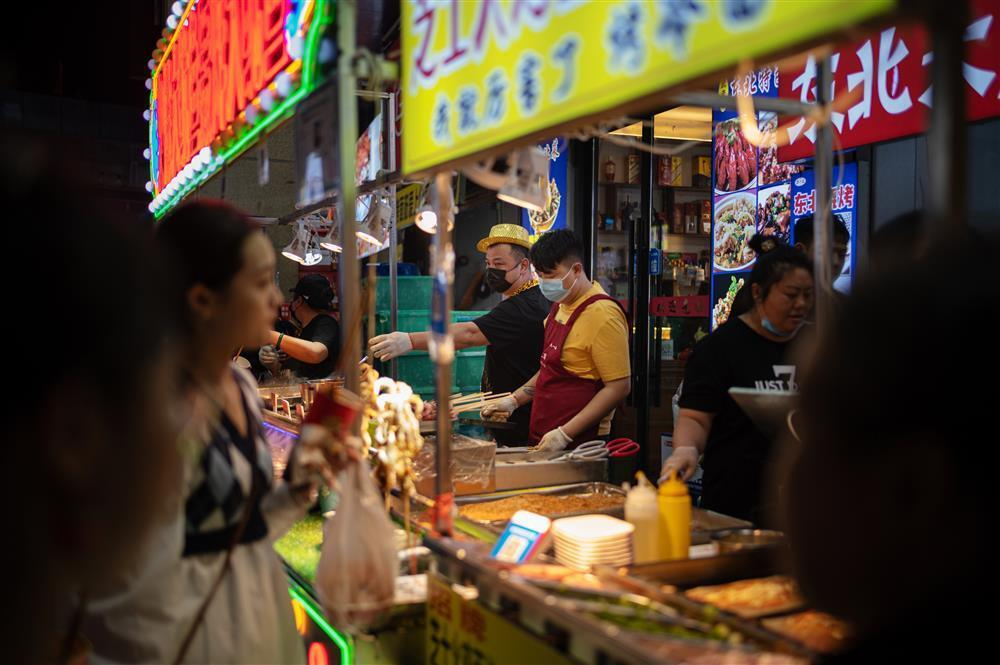
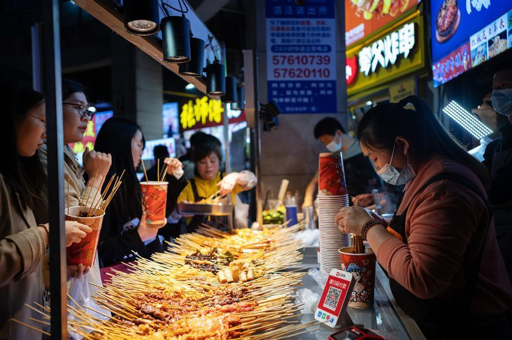

# 高品质“烟火气”！上海设摊经营活动新规下个月实施，多部门回应

南庄路北侧的奉贤区南桥镇沈陆中心路自产自销管控点内，数十个摊位上摆满了附近田头大棚产出的蔬果，不同于上世纪常见的“马路菜场”，这里井然有序、干净整洁，将占道设摊对交通、市容环境的影响降到尽可能低的同时，还解决了农户自产蔬果销售难、市民就近买菜难的民生问题。

对这样的设摊方式，上海持开放包容的态度。将于今年8月5日实施的《关于进一步规范设摊经营活动的指导意见（试行）》（以下简称《指导意见》）明确，上海各区会同有关部门综合考虑市容环境卫生、交通安全、公共安全、消费需求、食品安全、“菜篮子”供应保障、市场公平等因素，可以划定一定的公共区域用于设摊等经营活动。

新规实施后，设摊经营活动会发生什么变化？能否兼顾市容环境与民生保障之间的平衡？上海多部门今天（7月7日）作出回应。

_南桥镇沈陆中心路自产自销管控点 李茂君 摄_

放：鼓励“特色点”

过去，设摊经营这种业态很大程度上是城市生活配套不够健全的产物。居住区周边数公里没有菜市场、商超，老百姓衣食住行有需求，流动摊贩顺应需求出现，但由于门槛很低，交易双方又缺乏监督约束，“马路菜场”“马路集市”逐渐成了“脏乱差”的代表，严重影响城市形象，也让设摊区域周边的民众不堪其扰。

于是，治理成为过去很长一段时期内上海对待无序设摊的主要态度。上世纪70年代至今，上海设摊管理经历了“还路于民”“分类管理”“源头治理”“精准治理”四个阶段，无序设摊数量从有记录的2007年4.7万个减少到了2022年的5759个。这些年，外宾游客、市民群众充分肯定上海的市容环境，无序设摊的有效治理功不可没。

_十几年前的上海马路菜场龚星
摄_

然而，随着城市配套的不断完善，在上海日渐式微的设摊经营却被寄予了新的期待：能否承载高品质的“烟火气”，进一步丰富人们的物质和精神生活。

在制定《指导意见》的过程中，相关部门多次深入相关区域开展调研，累计收到修改意见54条，采纳46条。同时，通过各渠道广泛征集人民意见建议，共汇总165条建议，有效采纳142条。其中不少建议就对摊贩的“转型升级”寄予厚望。

“顺应民生所需，即将实施的《指导意见》创设了‘特色点’，我们希望将来的设摊区域内多一些符合城市高品质要求的摊位。”上海市绿化市容局副局长朱心军介绍，上海划定的设摊区域内可设置3种类型的摊位：疏导点、管控点、特色点。

前两种摊位是推行了多年的做法，主要功能是“保基本”。疏导点是入场入室经营点位，在标准化菜市场、早餐网点等民生服务供应不足的区域设置。管控点是利用闲置空间经营的点位，主要销售自产农副产品，畅通本地农产品销售渠道。

来自上海市绿化市容局的数据显示，上海近年来的疏导点和管控点呈逐步缩减趋势，目前纳入绿化市容部门统计口径的数量仅70多个。

而特色点与它们不同，它是品牌化、主题化、特色化的集市、夜市、限时步行街、外摆位等点位，优先在地标性夜生活集聚区、水岸夜生活体验区和园区、商圈、景区等区域内选点。特色点鼓励创新创业、支持原创品牌、传播公益慈善、展现工匠精神、传递海派风情、展示本地特色、营造生活氛围，既要满足人民需求，又能体现“上海味”“时尚潮”“国际范”。

特色点的气质与去年发布的《上海市夜间经济空间布局和发展行动指引（2022—2025）》十分契合，需要相关规划和功能空间的支持来进一步发力。

上海市商务委商贸行业管理处副处长邓金兵介绍，上海市夜间经济下一步将从“做足水文章”和“做优慢生活”两方面下功夫，聚焦“一江一河”，打造浦东富都滨江地区、黄浦滨江外滩地区、北外滩地区、苏河湾地区等10个水岸夜生活体验区，以及吴江路—张园—丰盛里地区、五角场—大学路地区、豫园地区、静安寺地区等15个地标性夜生活集聚区。

_枫泾路限时步行街
海沙尔 摄_

管：不能长“尾巴”

鼓励高品质摊位不等于全面无条件放开设摊经营活动，多个部门均表示，将继续坚持包容审慎、疏堵结合的原则。

《指导意见》仍严禁无序设摊和跨门经营，单位和个人不得擅自占用道路、桥梁、人行天桥、地下通道及其他公共场所设摊经营、兜售物品以及堆放物品，上海道路两侧和广场周围建（构）筑物内的经营者不得擅自超出门窗和外墙经营。

针对风险较高的食品摊贩，上海市市场监管局网监处副处长谢雷表示，无论是门店经营还是设摊经营，对食品安全的要求都是一样的，均将按照“四个最严”标准落实属地责任和经营主体责任。

2020年12月1日起施行的《上海市食品摊贩经营管理办法》明确，食品摊贩在从事食品经营活动前，应当通过现场办理或网上办理的方式，向经营所在地的乡、镇政府或者街道办事处提供相关信息和材料，作出食品安全责任承诺，并取得《上海市食品摊贩临时经营公示卡》。

同时，食品摊贩应当在区政府划定的临时区域（点）和固定时段，按照登记的食品经营范围，从事食品经营活动。2018年12月13日起施行的《上海市人民政府关于本市禁止生产经营食品品种的通告》就明确禁止食品摊贩经营生食水产品、生鱼片、凉拌菜、色拉等生食类食品和不经加热处理的改刀熟食，以及现榨饮料、现制乳制品和裱花蛋糕。

食品摊贩从事食品经营还要受到《上海市食品安全条例》等法律法规的约束，必须悬挂食品摊贩临时经营公示卡和食品从业人员健康证明，提供符合食品安全标准和要求的餐具、饮具，将餐厨垃圾和餐厨废弃油脂存放在专用加盖或者密闭容器中。

_泗泾夜市董天晔 摄_

针对设摊经营场所的秩序管理，上海公安部门表示将按照“一点一方案”的要求制定安保预案，加强隐患排查整治，特别强化对规模性设摊经营活动相关区域的巡逻防控和驻点守护，配足警力做好秩序维护和客流疏导管控。

针对设摊经营场所可能延伸出无序设摊“尾巴”的问题，上海市城管执法局副局长严永康表示，如果不是在划定区域范围内沿街兜售、设摊的，将加大执法力度，确保疏导点位的正常运行。同时，将鼓励引导有条件的“轻餐饮”门店按要求试点外摆位。

在管理上，《指导意见》要求各区、街道（镇、乡）将设摊管理纳入城市运行“一网统管”平台，并构建各级政府、社会各方参与的社会治理共同体，形成市民群众、经营主体、管理部门等多方协商沟通机制。

据介绍，《指导意见》正式实施后，上海各区要制定区域内规范设摊经营活动的具体方案，明确允许设摊经营、超出门窗和外墙经营等经营活动的区域范围、时段、业态以及管理要求等，征求周边市民意见，并向社会公布。

