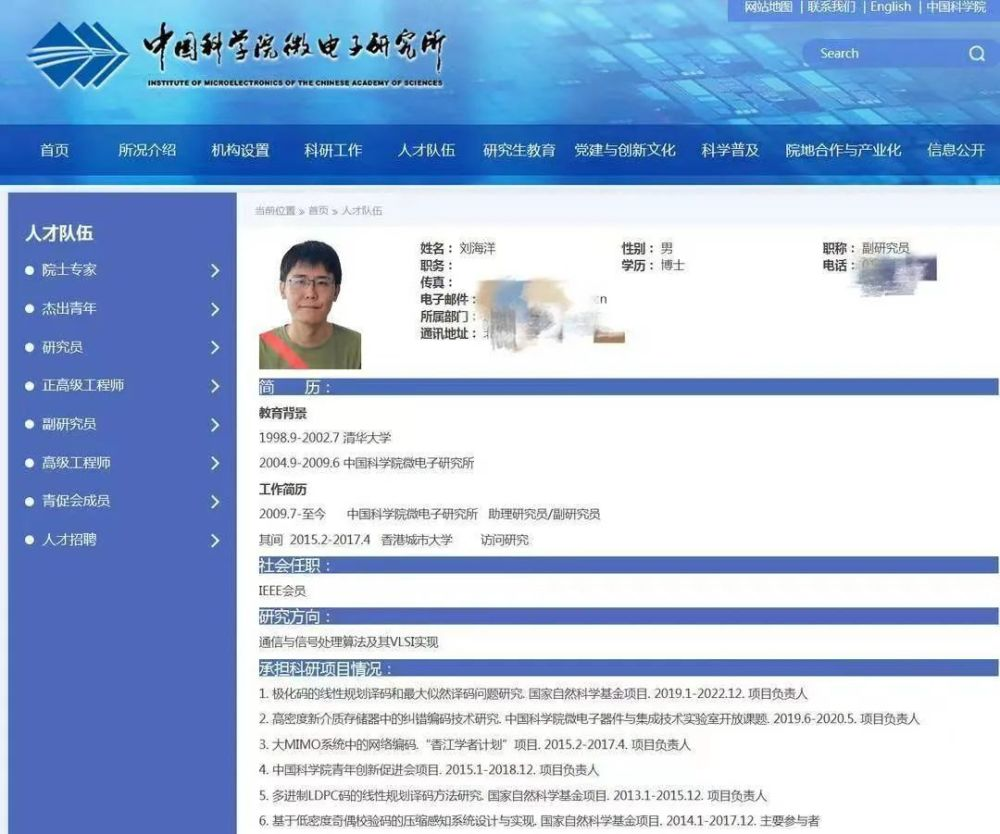

# “硫酸泼熊”的大学生任职中科院引争议，媒体：“翻旧账”是本末倒置

继续拿刘海洋过去所犯下的错误，以及其名校毕业生身份来说事，未尝不是一种苛责和狭隘。

**全文1430字，阅读约需3分钟**

**撰稿/星宇（媒体人） 编辑/何睿 校对/吴兴发**

_▲简历显示刘海洋已任中科院副研究员。图/中国科学院微电子研究所官网截图_

针对网友发帖称当年清华大学“硫酸泼熊”的学生刘海洋，时隔多年之后，成为了中国科学院专家一事，7月6日，中科院微电子研究所回应封面新闻称，刘海洋确实在该院工作，其相关工作人员表示，“刘海洋的所有录用程序都是合规的，他之前也受到了清华大学的处罚”。

发生于2022年的清华大学在校生刘海洋用硫酸伤熊事件，当时在社会上引起了广泛关注。关于如何处罚，教育、法学及动物学等方面的专家，当时也都发表了看法。最终，刘海洋被清华大学给予留校察看处分。同时，“在经历了长期的讨论与争议之后，北京市西城区法院判决刘海洋犯故意毁坏财物罪，但鉴于其一贯品学兼优，案发后有悔罪表现，决定免予刑事处罚”。

应该说，这一处理结果，是综合考量了彼时社会动物保护观念和立法状况，以及当事人的个人情况所作出的，在当时是经得起各个维度的审视的。

二十来年后，旧事重提，人们发现刘海洋的身份已是中科院副研究员，成为一名在相关研究领域能独当一面的专家，按理说这是
一件让人欣慰的事。因为，这意味着即便当年犯了错，受了处分，刘海洋依然“知耻而奋进”，成功走上人生大道，实现了个人价值和社会价值。在很大程度上，这也彰显了当年清华大学对其处分所秉持的“教育帮助、给予出路”原则的现实价值。

但从舆论场的反馈来看，有一种声音似乎是试图“翻旧账”，拿刘海洋目前所取得的成就来推论当时处分的不合理，这显然是一种本末倒置。应该看到，刘海洋在当时所受到的处分，以及被刑事拘留一个月，虽然最终被免予刑事处罚，说明在当时已经为自己的行为付出了代价。

在此基础上，刘海洋个人能够成长成才，包括后续的升学、深造，完全是个人努力的结果，而不能作为当时处分不合理的依据。事实上，现代法治精神的一个重要内涵就是——惩戒只是手段而非目的，以一个人是否有前途来衡量处罚的正当性，实属大谬。

从升学到被中科院录用的过程来看，刘海洋由于当时并未留下刑事案底，只要其成绩和表现合乎学校和单位的要求，这也完全是符合程序规范的。毕竟，没有任何法律法规明确要对刘海洋这样过去犯过错误的人彻底堵死个人成长和就业的通道。

因此，在这件事情上，一切都宜回归到法律和权利的角度来审视，继续拿刘海洋过去所犯下的错误，以及其名校毕业生身份来说事，未尝不是一种苛责和狭隘，对当事人和相关单位都容易带来“误伤”。

其实，此事被重新置于舆论放大镜下的时机，及其衍生的一些似是而非的言论，对比刘海洋当年所遭遇的舆论，以及他最终所受到的处罚，是非常耐人寻味的。

比如，这不由得让人思考，我们的舆论世界到底是更包容了，还是更狭隘了？是更理性了，还是更情绪化了？我们对个人权利的尊重意识，是更强了，还是更淡了？其实，这些问题关乎我们社会的公共生活质量，也关乎每个人的权益，值得深思和细品。

现代社会，没有人必须一辈子背负着自己的一时过错。“硫酸泼熊”一事的再度讨论不是不可以，但该导向的是理性的探讨，而非某种可疑的情绪宣泄。

**值班编辑 李加减 康嘻嘻**

**本文部分内容首发自新京报公号“新京报评论”**

**未经新京报书面授权不得转载使用**

