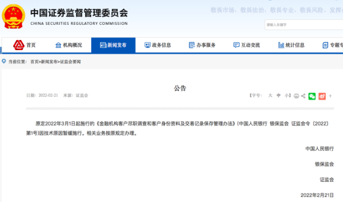

# 取2.5万元现金用不用告知用途？记者实探，多家银行回应“不用”

近日，浙江某男子到银行取2.5万元现金，因不满柜员追问取款用途，“故意”每次只取1元。这一幕被拍摄并发布到社交媒体平台后，冲上了热搜。

此事也引来网友热议，有人认为男子行为解气，也有人认为柜员的询问是为了合规。

金融系统业内人士武忠言对《华夏时报》记者表示，银行此举主要是防止储户被骗钱。

他同时援引此前监管部门发布的规范表示，此次事件中储户取款金额未达到文件中规定的五万元人民币以上的取款数额，因此银行工作人员了解其资金用途，明显不符合规定要求。

虽然武忠言援引的相关规范目前仍被暂缓施行，但北京若轩律师事务所负责人黄涛也对《华夏时报》记者表示，目前有效的相关规范性文件并不要求银行登记所有客户资金的来源或者用途，而是“仅对于高风险客户”。

7月6日，记者也就此咨询了北京多家银行网点。面对记者“取现金2.5万元需不需要告知取款用途”的提问，除一家城商行工作人员明确表示“需要”外，多家国有大行、股份制银行和城商行均对记者表示“不用”。

**取现金多少要告知用途？各家银行要求不一**

根据现场目击者的表述，询问取款用途是银行规定职责范围内的事情，主要是防止受到诈骗。男子认为钱是自己的，取钱时还问这么多，有点不耐烦。最后男子看到工作人员委屈哭了，才把2.5万元取出来。

此外，也有媒体报道，此事发生在浙江宁波某银行，该行热线电话客服人员对媒体表示，取5万元及以上金额需要向网点提前预约，网点也会根据反洗钱的相关要求，询问一些问题。

对于此事后续处理情况，该客服人员对媒体表示此事目前领导在处理，暂不清楚是否对那名受了委屈的员工进行了安抚。

在网上相关讨论中，很多网友表示，对于2.5万元这样“小”数额的现金而言，银行工作人员询问用途实属“多此一举”，但也有人认为，银行也是为了合规，防止诈骗等事件的发生。

从网友的讨论来看，更多网友认为取现金不需要告知用途。那么，在现实生活中真是如此吗？

带着这个疑问，记者于7月6日走访了北京一些银行网点。通过咨询发现，除一家城商行外，其他银行网点均表示，对于2.5万元的现金取款，不会要求客户在取款时告知资金用途。

那么多少额度以上就需要了呢？

对此，有的银行表示，20万元以上的现金取款需要告知用途，有的则表示取多少人民币都不需要，但是20万元以上的现金取款需要提前预约。

此外，也有一家城商行北京某支行工作人员对记者表示，不管多少额度的现金取款，行里都要求必须询问，客户只需要正常说一下就行了，比如“家里需要用钱、买东西等等”。

他坦言，“我们不会要求很严格，但必须问。不问的话，如果以后出了问题还要负责任。”

值得注意的是，对于同一家银行，其不同地区的营业网点也有不同的要求。例如，某国有大行某北京营业网点明确表示取现金不需要告知用途，而其在山东聊城的一家营业网点则要求五万元以上的现金取款需要告知用途。

**“告知用途”是否有法律依据？**

对于银行工作人员询问现金取款用途一事，武忠言表示理解。

“银行工作人员询问客户取款用途主要是防止储户被骗钱。”武忠言解释道，“近年来，数字化浪潮席卷了社会的方方面面，诈骗分子的手段不断翻新，让人防不胜防。”

采访中，某国有大行工作人员也对记者表示，“我们这里是只要年纪大的客户，不管存取现金或转账多少都要问收款人是否认识，因为电信诈骗太多了。”

武忠言同时指出，询问取款用途一事也有据可循。“2022年中国人民银行等三部门印发的《金融机构客户尽职调查和客户身份资料及交易记录保存管理办法》（下称《办法》）规定，为自然人客户办理人民币单笔5万元以上或者外币等值1万美元以上现金存取业务的，应当识别并核实客户身份，了解并登记资金的来源或用途。”

武忠言指出，此次热搜事件中储户取款金额未达到文件规定的取款数额，银行工作人员了解其资金用途，明显不符合规定要求。

不过，值得一提的是，原定于去年3月1日起施行的《办法》目前尚未有效实施。

黄涛表示，中国人民银行、中国银行保险监督管理委员会、中国证券监督管理委员会三部门于2022年2月21日发布公告表示“因技术原因暂缓施行，相关业务按原规定办理”，这也意味着“上述管理办法仍未有效实施”。

不过，从目前有效的规范文件来看，登记资金用途一事仅限于高风险客户。

黄涛补充分析称，中国人民银行、原中国银行业监督管理委员会、中国证券监督管理委员会、原中国保险监督管理委员会于2007年8月1日颁行的《金融机构客户身份识别和客户身份资料及交易记录保存管理办法》中，在自然人客户办理人民币单笔5万元以上或者外币等值1万美元以上现金存取业务的，银行应当核对客户的有效身份证件或者其他身份证明文件，仅对于高风险客户了解其资金来源、资金用途。“可见，目前有效的相关规范性文件并不要求银行登记所有客户资金的来源或者用途。”

此外，他表示，我国《反洗钱法》为了预防洗钱活动，维护金融秩序，遏制洗钱犯罪及相关犯罪，要求银行等金融机构办理的单笔交易或者在规定期限内的累计交易超过规定金额或者发现可疑交易的，应当及时向反洗钱信息中心报告。

黄涛认为，为了便于银行履行其报告职责，同时打消客户被干涉自由使用资金的顾虑或抵触情绪，一方面监管部门应当根据经济发展现状规定被核查取款用途的合理起步金额，另一方面可要求银行在询问客户大额取款的资金用途前应充分释明相关规范的条文，避免客户和银行工作人员互相不理解、甚至发生冲突的情况。

责任编辑：孟俊莲 主编：张志伟

