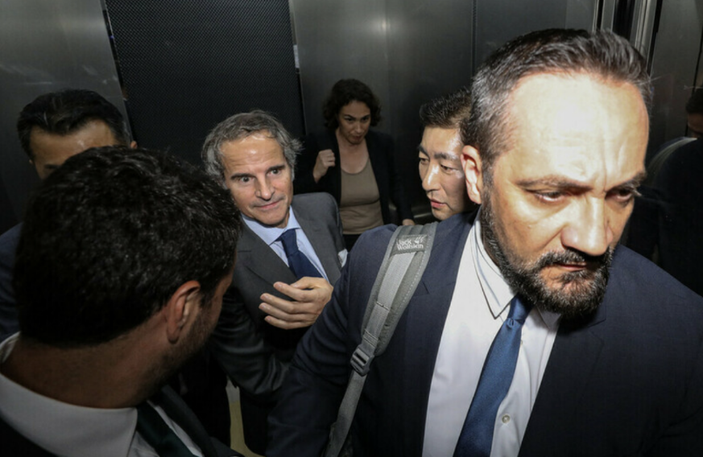

# 国际原子能机构总干事刚到韩国机场就被强烈抗议，被迫改变路线离开

【环球网报道】据韩国《朝鲜日报》7月8日报道，结束对日本访问的国际原子能机构（IAEA）总干事格罗西当地时间7日夜间抵达韩国金浦国际机场，与此同时，反对日本核污染水排海计划的韩国政界人士及市民团体在机场举行强烈的抗议示威活动，导致格罗西不得不改变离开机场的路线。

_当地时间7日夜间抵达金浦国际机场的格罗西，图自外媒。_

报道称，抗议活动从7日晚上就开始进行，抗议者们手持写有“反对国际原子能机构总干事入境”“不承认国际原子能机构报告书”等字样的标语牌，高喊“格罗西回去（go
home）”的口号。格罗西当地时间晚10时40分左右抵达机场，一个小时后来到入境大厅，但由于强烈的抗议活动，他无法穿过抗议人群离开，便原路折返。控制局势的警员人数也从早些时候的20人增加至80人左右。为了避开抗议人群，格罗西8日凌晨采用另外一条路线离开机场。

_当地时间7日，在金浦国际机场示威的抗议者，图自外媒。_

据媒体此前报道，7月4日，韩国国务调整室第一次长朴购然在记者会上通报，国际原子能机构总干事拉斐尔·格罗西将于本月7日至9日对韩国进行为期3天的访问。朴购然说，访韩期间，格罗西将与韩国原子能安全委员会委员长刘国熙举行会谈，向韩方说明国际原子能机构有关日本福岛核电站核污染水排放入海综合报告书的内容。此外，格罗西还将与韩国外长朴振举行会谈。

国际原子能机构于4日发表有关日本福岛核电站核污染水排放的报告书，格罗西于4日至7日访问日本，之后访问韩国。在国际原子能机构发表报告后，当地时间7日，韩国政府发布了有关日本福岛“核处理水”排海安全性的研究报告，称如果日本东京电力公司遵守处置规定排放“核处理水”，放射性物质浓度将符合排放标准和目标值，也符合国际标准。

针对韩国政府的报告，据《韩国日报》报道，韩国最大在野党共同民主党党首李在明7日在国会召开最高委员会议，称韩国政府对福岛核污染水排海的态度是“不负责任”的，“难道仅因为国际原子能机构不负责任的报告就同意日本福岛核污染水排海吗？”李在明还说，“尹锡悦政府要尊重的不是国际原子能机构的报告或日本国民意见，而是韩国国民的想法。”共同民主党表示，韩国政府7日发布的福岛核污染水排海安全性研究报告有关科学、技术、研究等内容“令人羞愧”，“代表了日本政府和东京电力公司的立场”。

