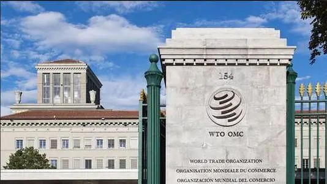

# 国际通行做法！中国在WTO解释对镓、锗实施出口管制

据第一财经记者从核心信源获悉，在7月6~7日举行的世贸组织（WTO）货物贸易理事会会议上，

针对中方从8月1日起对含有镓和锗的产品（用于计算机芯片和其他产品的金属）适用的新出口限制，欧盟、日本、加拿大、韩国、澳大利亚、英国和瑞士等7个成员方提出关切。

中方代表在会议上表示，出口管制不是禁令，中方致力于保持供应链的安全和稳定。中方还解释道，出口管制是国际上对两用（民用和军用）商品的普遍做法，其他WTO成员也实行了出口管制。

6日，商务部发言人束珏婷在例行记者发布会上亦表示，镓、锗相关物项具有明显的军民两用属性，对镓、锗相关物项实施出口管制是国际通行做法，世界上主要国家普遍对其实施管制。中国政府依法对镓、锗相关物项实施出口管制，确保其用于合法用途，目的是为了维护国家安全，更好履行国际义务。需要指出的是，出口管制不是禁止出口，出口符合相关规定的，将予以许可。

**中国依法实施出口管制**

商务部、海关总署7月3日在官网发布公告称，决定对镓、锗相关物项实施出口管制。

欧盟委员会执行副主席蒂默曼斯在本周访华期间回答第一财经记者提问时表示，中国把镓、锗相关关键材料列入清单这些事情说明，双方并不总是在所有事情上都达成共识，不过由于气候危机和绿色转型，他仍然认为双方关系将会得到加强。

据外媒报道，有知情人士透露，欧盟官员正在努力，希望能缩小前述两种关键金属的出口管制范围，希望确保对这两种金属的出口限制基于明确的安全影响，并遵守WTO规则。

束珏婷在6日记者会上表示，中国政府依法实施出口管制，不针对任何特定国家。在发布公告前，中方已通过中美、中欧出口管制对话渠道进行了预先通报。

她表示，对镓、锗相关物项实施出口管制的措施将于8月1日起正式实施。目前，商务部尚未收到企业的出口申请文件。中方将依照相关法律法规规定，对镓、锗相关物项出口申请进行审查，出口符合相关规定的，将予以许可。

**为何短时间内美日荷同步修订法规**

在WTO此次会议上，对于美国、日本和荷兰关于芯片出口限制的协议，中方问，为什么在这么短的时间内，三个成员都同步修订了相关法律法规，对同一领域出台新的出口管制措施。

中方表示，这些措施明显偏离了国际社会广泛认同的和平利用科学技术的做法，该协议破坏了WTO规则的权威和有效性。

美方表示，WTO货物理事会不是讨论有关国家安全问题的适当场合，欧盟和日本则表示，这些措施符合WTO规则。

此前在6月30日，荷兰宣布将部分光刻机等半导体相关产品纳入出口管制。

商务部新闻发言人对此表示，近几个月以来，中荷双方就半导体出口管制问题开展了多层级、多频次的沟通磋商。但荷方最终仍将相关半导体设备列管，中方对此表示不满。近年来，美国为维护自身全球霸权，不断泛化国家安全概念，滥用出口管制措施，甚至不惜牺牲盟友利益，胁迫拉拢其他国家对中国实施半导体打压围堵，人为推动产业脱钩断链，严重损害全球半导体产业发展，中方对此坚决反对。

商务部发言人还表示，荷方应从维护国际经贸规则及中荷经贸合作大局出发，尊重市场原则和契约精神，避免有关措施阻碍两国半导体行业正常合作和发展，不滥用出口管制措施，切实维护中荷企业和双方共同利益，维护全球半导体产业链供应链稳定。

据悉，此次中方还在WTO的会议上表示，美国以国家安全为名采取的大量且越来越多的措施反映了美国是如何滥用国家安全条款的。

此外，据报道，美方正考虑针对面向中国的人工智能（AI）芯片出口实施新的限制。

束珏婷对此表示，一段时间以来，美方不断滥用出口管制措施，持续加强对华半导体打压遏制，人为割裂全球半导体市场，这是对全球自由贸易的破坏，是对国际经贸规则的无视，是对公平竞争原则的践踏。半导体是全球产业分工合作的典型代表。中国是世界最大的半导体市场，芯片销售规模约占全球的1/3，这是中国企业与各国企业互利共赢合作的结果。美方的做法，不仅损害中国企业正当权益，也将严重影响众多国家和地区的利益，阻碍全球科技交流和经贸合作，终将反噬自身。

**欧盟CBAM实施引广泛关切**

在此次会议上，欧盟与环境有关的两项贸易措施也为WTO成员广泛关切。其中一条即为欧盟的-碳边境调整机制（CBAM）。

中国、俄罗斯、巴西、印度尼西亚、巴拉圭、印度、土耳其、泰国、沙特阿拉伯、哈萨克斯坦共和国、日本和韩国等12个WTO成员-
都在发言中重申了他们对欧盟新CBAM措施的关注。

中国表示，CBAM是一个单边措施，偏离了共同但有区别的责任、各自能力的基本原则以及《联合国气候变化框架公约》的国家决定性贡献安排，不符合WTO的非歧视性基本原则。

据第一财经记者了解，许多成员方抱怨欧盟没有提供足够的时间让WTO成员在10月CBAM生效前对该措施进行评论。

欧盟则表示，CBAM的整个设计阶段都是透明的，并将在过渡期内继续与成员接触，将在2025年底前逐步引入CBAM。

针对欧盟准备开征“碳关税”，中国商务部新闻发言人束珏婷曾在2022年3月30日的例行记者发布会上对第一财经记者表示，希望欧方避免形成新的贸易壁垒。

蒂默曼斯在接受第一财经记者采访时表示：“我认为我们所做的事情是符合WTO规则的。”

然而，针对CBAM的实施，欧盟之外有不少不同看法。非洲气候基金会最新研究报告称，CBAM每年将给非洲国家造成250亿美元的损失。在WTO对欧盟举行的第15次贸易政策审议会议上，中方表示，CBAM等措施将歧视进口产品并限制市场准入，尤其是来自发展中成员方的产品。

