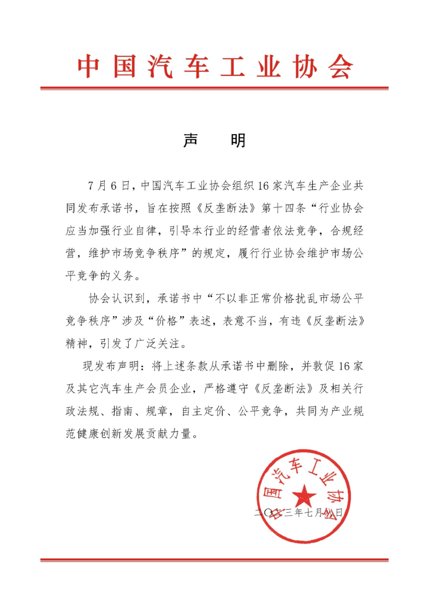
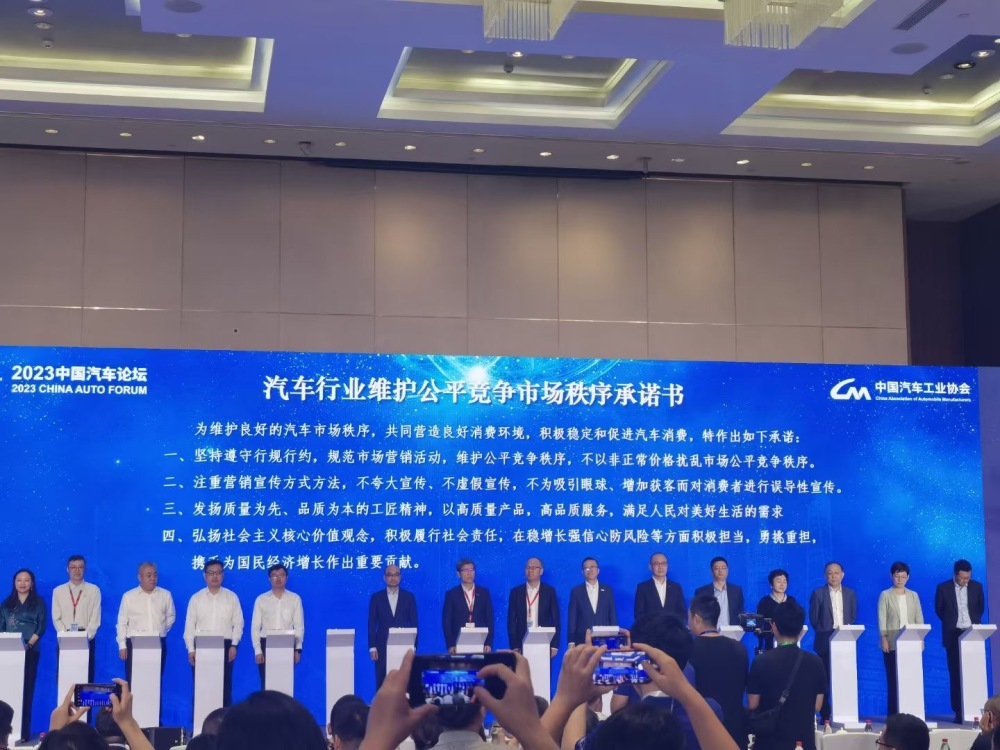

# 特斯拉与国内15家车企承诺不打价格战，中汽协：删除涉及“价格”条款

腾讯汽车讯 7月8日消息，日前，中国汽车工业协会组织蔚来、理想等16
家汽车生产企业签署了《汽车行业维护公平市场秩序承诺书》。今日协会发布声明：协会认识到承诺书中“不以非正常价格扰乱市场公平竞争秩序”涉及“价格”表述，表意不当。将上述条款从承诺书中删除，并敦促
16 家及其它汽车生产会员企业，严格遵守《反垄断法》及相关行政法规、指南、规章，自主定价、公平竞争，共同为产业规范健康创新发展贡献力量。

_来源：中国汽车工业协会网站_

7月6日，16家车企在2023中国汽车论坛上联合签署了《汽车行业维护公平竞争市场秩序承诺书》(下称《承诺书》)，做出了包括“不以非正常价格扰乱市场”在内的多项承诺。

据悉，签署承诺书的16家车企既包含自主品牌，也包括外资车企，全员名单为中国一汽、北汽集团、江汽集团、东风汽车、广汽集团、吉利汽车、上汽集团、中国重汽、长城汽车、长安汽车、奇瑞汽车、比亚迪、蔚来汽车、小鹏汽车、理想汽车以及特斯拉。

**相关阅读**

不再打价格战了？16家车企签署承诺书，特斯拉也加入

