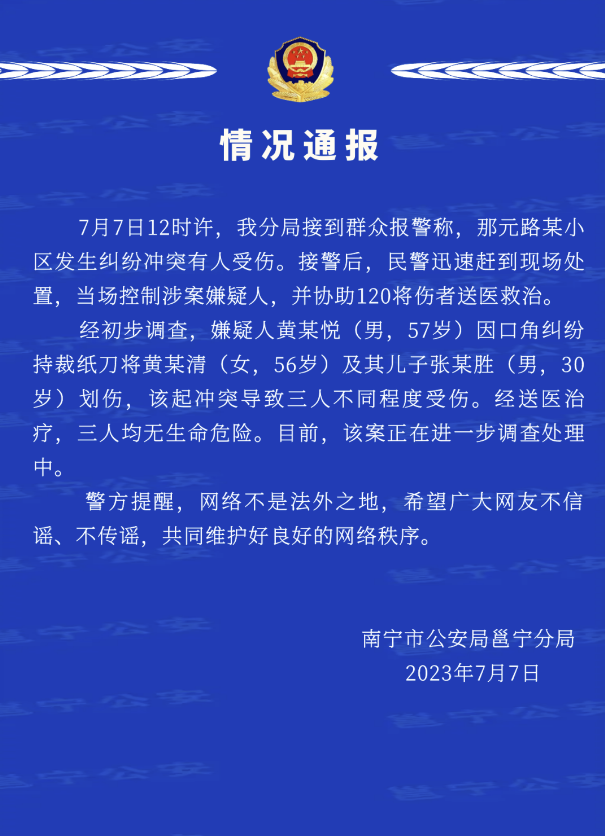

# 男子因口角纠纷持裁纸刀将一对母子划伤，南宁警方通报

7月7日晚间，南宁市公安局邕宁分局发布情况通报：7月7日12时许，我分局接到群众报警称，那元路某小区发生纠纷冲突有人受伤。接警后，民警迅速赶到现场处置，当场控制涉案嫌疑人，并协助120将伤者送医救治。经初步调查，嫌疑人黄某悦（男，57岁）因口角纠纷持裁纸刀将黄某清（女，56岁）及其儿子张某胜（男，30岁）划伤，该起冲突导致三人不同程度受伤。经送医治疗，三人均无生命危险。目前，该案正在进一步调查处理中。

