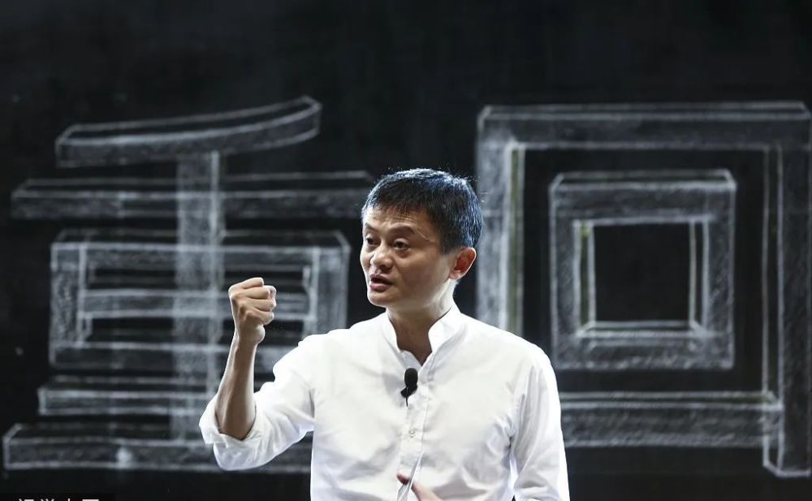

# 蚂蚁估值跌七成，员工人均激励从280平豪宅缩水到68平

_来源：视觉中国_

作者 | 肖望

出品 | 棱镜·腾讯小满工作室

IPO折戟977天后，蚂蚁集团整改靴子终于落地。

7月7日晚，中国人民银行、国家金融监督管理总局、中国证监会联合宣布，平台企业金融业务存在的大部分突出问题已完成整改，并公布了对部分平台企业的行政处罚。其中，蚂蚁集团及旗下机构处以罚款（含没收违法所得）71.23亿元。

7月8日，蚂蚁集团公告，将回购现有股东不超过7.6%的股份，回购价格对应公司估值约为5671亿元。这一估值相较上市定价估值缩水七成，蚂蚁回购需要动用约431亿元自有资金。

金融监管部门联合公告指出，金融管理部门工作重点从推动平台企业金融业务的集中整改转入常态化监管。

通过对业务和架构采用外科手术式的切割，萦绕在蚂蚁集团上方的不确定性因素一一消除，市场上关于蚂蚁重启上市的猜想又多了起来。

蚂蚁是否有针对员工的回购计划尚未披露，不过员工期权价值已大幅缩水。

据蚂蚁此前的招股书信息，授予给蚂蚁员工的激励计划规模已达1377亿元。按照6月末16660名员工数计算，蚂蚁员工人均激励达到827万元。以当时杭州2.9万/平的房价，可以买280平的大房子。

那些曾距离财富自由一步之遥的蚂蚁员工们，如今离实现财富自由还有多远？

**蚂蚁估值较上市定价缩水七成**

作者了解到，蚂蚁上市按下暂停键后，股东的不满情绪也在日益滋生，有股东私下表达过想要退出的意愿。但该如何为当下的蚂蚁合理估值成为难点。

蚂蚁集团第一轮境内融资于2015年6月至8月开展，当时，全国社保基金、新华人寿、中国太平洋人寿、春华资本等12家投资者参与，投后估值约为2600亿元。

此后，蚂蚁又经过数轮融资，估值一路飙升。到2018年7月C轮融资时，估值已提升至9600亿元。除原有股东继续跟投，还有新加坡政府投资公司、马来西亚国库控股、华平投资、加拿大养老基金投资公司、淡马锡等国际知名资本参与。

等到2020年10月蚂蚁确定上市发行价时，其总市值已达到2.1万亿元，5年间估值飙升7倍。此外，二级市场上投资者打新热情高涨，预期蚂蚁上市后会有数个涨停板不在话下。

最早参与融资的股东投入已过8年，而最近一批外部股东投入也已走过5年。股东们的资金成本、时间成本巨大，但上市退出的时间表仍不明朗。

这一定程度上也影响了后续新晋股东的态度。例如，2021年12月24日，中国信达资产披露拟参与蚂蚁消费金融的增资计划，但半个月后就放了鸽子。一年后蚂蚁消金完成增资计划，但105亿元新增注册资本金较此前计划缩水过半，股东规格也有所下降，从金融央企降为地方国资。

蚂蚁此次回购5671亿元的估值，较C轮融资估值下降约40%，相较上市定价估值则缩水约73%。

据《晚点财经》，贝莱德集团在去年9月底将蚂蚁估值下调至1106亿美元。普信集团( T.RowePrice )在去年11月底将其估值下调至568亿美元。

贝莱德给出的估值较上市定价估值缩水约62%，而普信集团给出的估值较上市定价缩水超80%。蚂蚁本轮回购价格低于贝莱德预期，但好于普信集团的预期。

对于回购价格的确定，蚂蚁集团表示，本次回购遵循市场化原则操作。按照市场惯例聘请了国内外知名投行作为财务顾问，并根据其出具的估值报告进行了定价。

据《中国证券报》，贝莱德、富达、普信集团等国际投资机构对蚂蚁集团的最新估值在4000亿元—7000亿元人民币之间，5671亿元的估值处于中值水平，与市场预期相符。一方面，近几年阿里、腾讯等同类可比上市公司的股价降幅较大，可参考标的的估值水平下降。另一方面，蚂蚁集团经过两年多的整改，其金融属性逐步增强，宜更大程度按照金融机构定位进行估值。

**人均激励缩水，从280平豪宅到68平蜗居**

蚂蚁指出，本轮回购“为补充员工激励池以持续吸引人才，同时为进一步满足股东对流动性的需求”。这意味着，个别股东可以通过回购退出。

蚂蚁今年1月的公告显示，目前其由杭州君瀚持股31.04%，由杭州君澳持股22.42%，其他股东持股46.54%。杭州君瀚是蚂蚁的员工激励计划平台，杭州君澳则主要是阿里合伙人的持股平台，考虑到阿里巴巴持有蚂蚁33%的权益，则外部股东持股比例约为13.54%。

或为了安抚股东，蚂蚁此前还进行了大手笔分红。阿里巴巴财报显示，蚂蚁集团于2022年3月及12月宣布向股东分派股息，阿里巴巴分别收到39.45亿元和105.19亿元的蚂蚁集团股息。按照阿里巴巴持股33%计算，蚂蚁两次派息合计超过438亿元。以C轮估值9600亿元计算，2022年度派息率达到4.56%，收益率略超过一般的银行理财产品。

蚂蚁方面指出，本次发起回购，所有股东均可在回购比例内自愿选择是否参与。基于对公司长期发展的承诺和信心，杭州君瀚和杭州君澳的自然人股东已自愿放弃参与回购。

这意味着，本次7.6%的回购比例，可以满足过半外部股东的退出需求。

蚂蚁是否有针对员工的回购计划尚未披露，不过员工期权价值已大幅缩水。

据蚂蚁此前的招股书信息，授予给蚂蚁员工的激励计划规模已达1377亿元。按照6月末16660名员工数计算，蚂蚁员工人均激励达到827万元。以当时杭州2.9万/平的房价，可以买280平的大房子。

当时网络消息称，蚂蚁暂缓上市后，不少员工推迟了购买豪宅、豪车的计划。

如今，蚂蚁估值缩水超七成，假设员工数不变，则人均激励为223万元，当前杭州平均房价为3.3万/平，换算下来只能买68平左右的蜗居。

不过，不同员工根据职级和工作年限授予的期权差异较大，人均激励作为公开渠道能得到的数据仅供参考。但这表明，不少蚂蚁员工离财富自由更远了。

**金控集团浮现，重启上市悬疑**

7月7日晚间，蚂蚁集团回应监管处罚：自2020年以来，蚂蚁集团在金融管理部门指导下积极推进各项整改，目前已完成相关整改事项。

阿里巴巴公告曾披露，蚂蚁集团的具体整改方向包括：

1、蚂蚁集团将整体申设金融控股公司，实现金融业务全部纳入监管；

2、支付业务回归支付本源，坚持小额便民、服务小微定位；

3、申设个人征信公司，依法持牌、合法合规经营个人征信业务，加强个人资讯保护，有效防范数据滥用；

4、将“借呗”、“花呗”全部纳入消费金融公司，依法合规开展消费金融业务；

5、强化消费者权益保护，加强金融消费者适当性管理；

6、完善公司治理，遵守公平竞争的法律规则，规范关联交易，加强风险防控，营造公平竞争的市场环境，进一步增强社会责任体系建设等。

今年1月7日，蚂蚁集团公告，阿里巴巴集团创始人马云及其一致行动人签署《一致行动协议终止协议》等，不再存在任何直接或间接股东单一或共同控制蚂蚁集团的情形。

这意味着，马云放弃了对估值曾达2.1万亿元的巨无霸——蚂蚁集团的实际控制权。这是蚂蚁完善公司治理的重要一步，也是蚂蚁集团整改的重点之一。此前，马云及其关联方在蚂蚁集团拥有权益的普通股占比为8.8%，但对于蚂蚁的任何决策具有一票否决权。

当时蚂蚁集团人士回应北京商报称：目前蚂蚁仍专注于整改和业务升级，没有启动上市的计划。

新华社7月7日报道指出，蚂蚁集团已实质性具备金融控股公司的设立情形。随着蚂蚁集团完成相关整改事项，进一步夯实合规治理水平、加强风险管理能力，有市场人士预计，后续蚂蚁集团申设金控公司、申请征信等业务牌照的进度或将加快。

不过，成立金控公司，意味着蚂蚁还需要补充巨额资本金。

蚂蚁集团重启上市猜想再起，但市场也有了新变化。蚂蚁集团原计划在科创板和香港联交所主板同步发行上市。

不过，上交所在2021年4月发布的《上海证券交易所科创板企业发行上市申报及推荐暂行规定（2021年4月修订）》明确提出，限制金融科技、模式创新企业在科创板发行上市。禁止房地产和主要从事金

