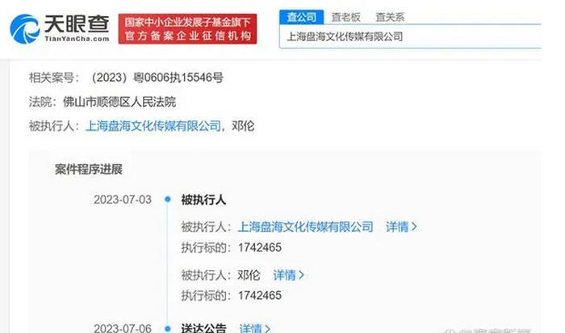

# 邓伦被商家申请强制执行174万，去年因偷逃税被追缴税并罚款1.06亿

天眼查App显示，近日，邓伦、上海盘海文化传媒有限公司新增一则被执行人信息，执行标的174万余元，执行法院为佛山市顺德区人民法院，申请执行人为佛山市云米电器科技有限公司，涉及服务合同纠纷案件。

据悉，2021年云米宣布邓伦成为其全球品牌代言人。2022年3月，邓伦因偷逃税被税务部门追缴税款并罚款共计1.06亿元。随后，云米品牌发文表示终止与邓伦的合作关系。

来源：高度新闻

编辑：刘玉红

