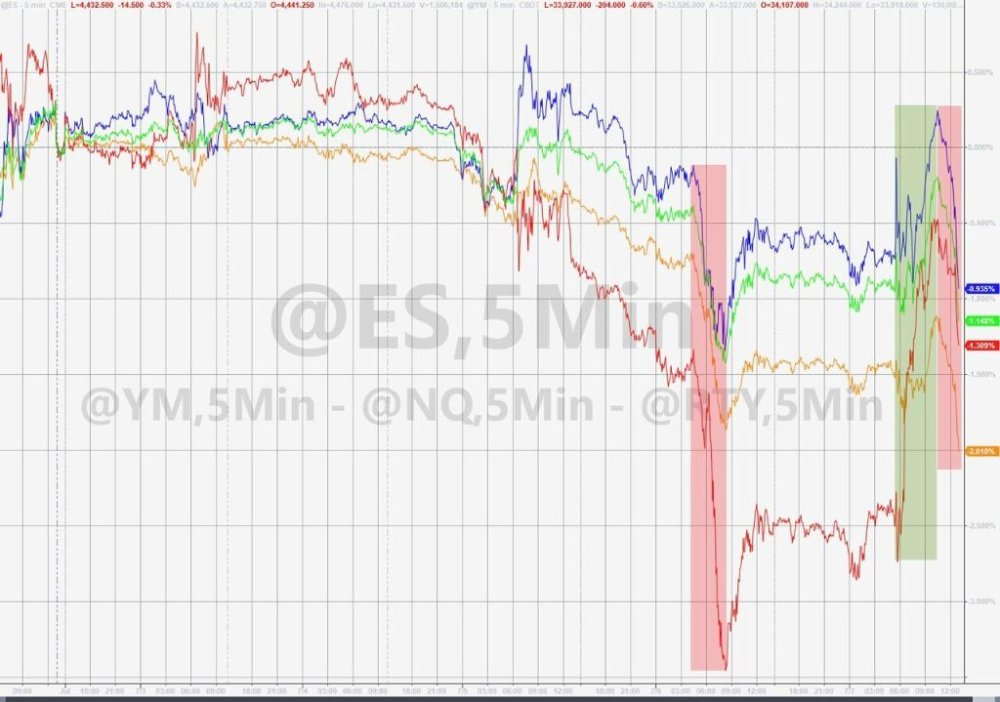
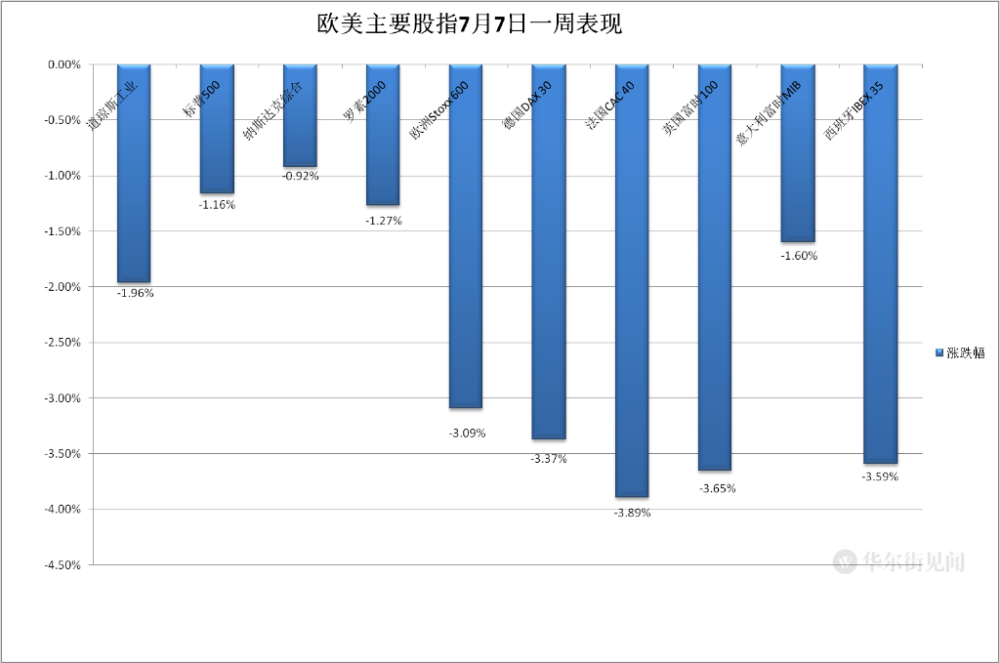
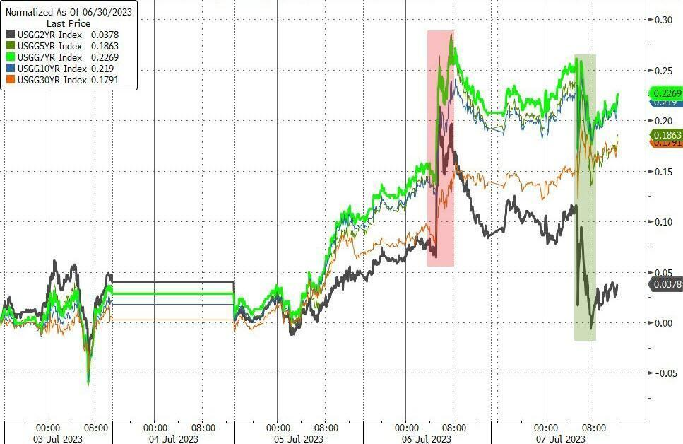
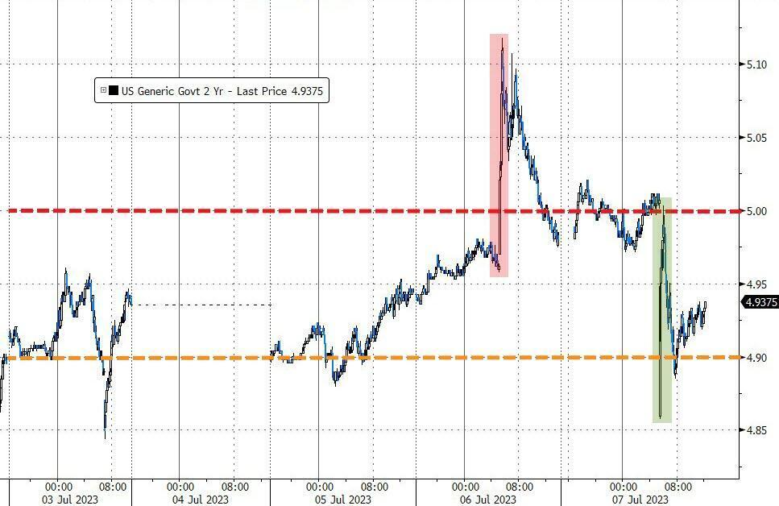
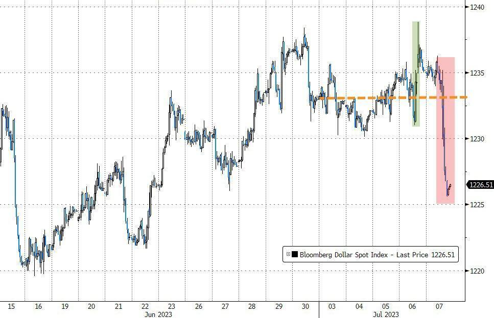
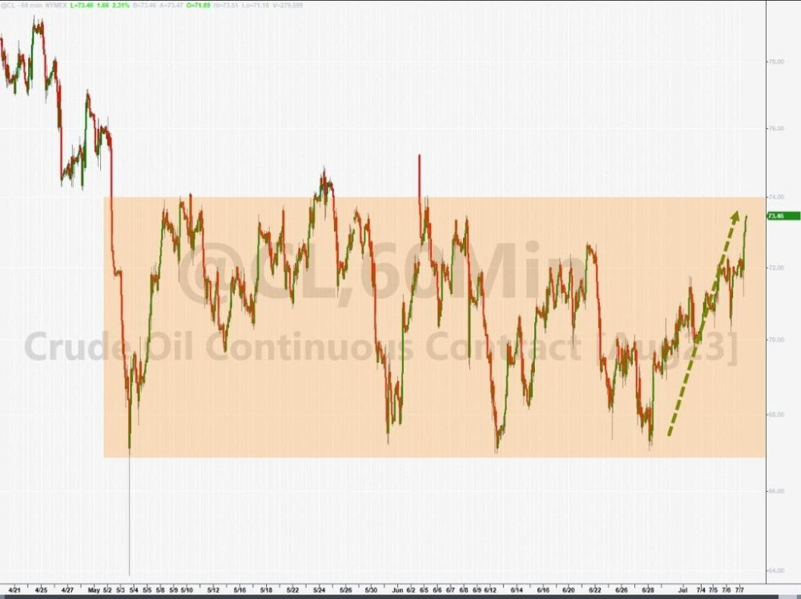
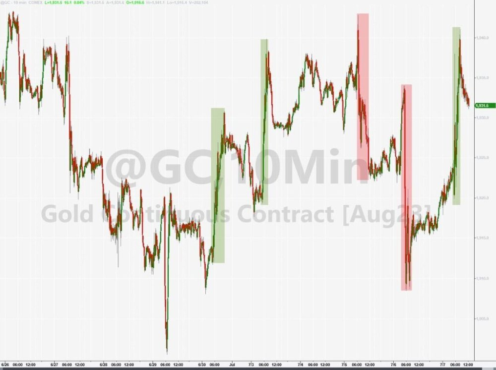

# 非农就业意外放缓未能拯救美股，7月首周“开门黑”，阿里大涨8％

周五公布的6月非农就业报告显示，6月新增非农就业人数超预期下滑至20.9万，创两年内来新低，人数还高于20万，6月失业率如期小幅下降至3.4%，平均时薪的同比和环比增速都高于预期。

评论称，新增非农就业并未像周四公布的“小非农”私人部门就业那样增长爆表，非农就业增长放慢但仍强劲，且薪资上涨压力太大，几乎完全没有给美联储带来7月继续暂停加息的理由，联储7月会重启加息。不过，交易者对7月过后联储是否还加息表示怀疑。

就业数据公布后，美债收益率先降后升、短线V形反弹，美股开盘后表现不一。周四“小非农”激化的美联储加快紧缩预期“退烧”，对利率前景敏感的两年期美债收益率远离周四刷新的2007年来高位，美股盘中基本保持降势，而盘前刷新四个月高位的基准十年期美债收益率美股早盘回落，午盘转升。美元指数加速下跌，数据公布后迅速跌破103.00，一度跌至一周多来低位。

周五主要美股指盘中走势分化，标普纳指一度转涨，但尾盘均转跌。因美联储纪要释放鹰派信号和就业数据强化加息预期，美股在7月、二季度和下半年首周“开门黑”。而中概股一扫周四的颓势，总体强劲反弹。中国证监会公布，金融管理部门对蚂蚁集团处以罚款71.23亿元，工作重点从推动平台企业金融业务的集中整改转入常态化监管。阿里巴巴美股大涨。

美元继续下挫之际，非美货币普涨。离岸人民币一度较日内低位回涨约400点，本周第四日上涨。日元兑美元创两周来新高，较去年日本政府出手提振日元时的门槛145回升逾2%。分析师认为，避险情绪成为本周主题，但基准十年期美债收益率还处于4%上方，日元的任何上涨可能都是有限的，市场担心日本政府可能更接近干预汇市。

美元走软的助推下，多种大宗商品上扬。市场对美联储紧缩的预期较周四有所缓和，黄金强劲反弹，盘中曾涨超1%，创约一个月最佳单日表现，并凭借周五反弹，一个月来首次单周累涨；周四V形震荡的国际原油加速上行，布油冲上两个月来高位，三周来首次收涨超2%。在沙特和俄罗斯均宣布减少供应新举措、沙特能源大臣表示OPEC+将采取一切必要措施支持油市的本周，原油至少涨超4%，创三个月最大周涨幅。

评论称，周五，油市供应的担忧及技术面的买盘压倒了对央行继续加息打击需求的忧虑。布油自4月中以来首次步入技术性超买区域。周五，墨西哥国有企业Pemex在墨西哥湾的离岸平台着火，六人受伤；周五油服巨头贝克休斯公布，本周美国能源企业的开工油气钻井平台十周来首次增加；因人手短缺，挪威Equinor
ASA宣布在北海油田Oseberg East暂时停产。

三大美股指三连跌 微软为首蓝筹科技股盘中转跌 能源板块逆市领涨 中概跑赢大盘

三大美国股指集体低开。早盘道琼斯工业平均指数保持跌势，盘初曾跌超150点、跌超0.4%，午盘转涨。标普500指数开盘不到半小时后转涨，后很快转跌，刷新日低时跌0.3%，早盘尾声时彻底摆脱跌势。纳斯达克综合指数盘初转涨，开盘约一小时后转跌，刷新日低时跌近0.2%，后很快转涨并保持涨势。午盘刷新日高时，纳指涨逾0.9%，标普涨近0.7%，道指涨约114点、涨超0.3%，此后持续回落，道指未到尾盘即转跌，尾盘标普和纳指也转跌。

最终，三大股指集体连跌三日。道指收跌187.38点，跌幅0.55%，报33734.88点，在周四自6月28日以来首次收盘跌破34000点后，又创6月28日以来新低。标普收跌0.29%，报4398.95点，纳指收跌0.13%，报13660.72点，均连续两日刷新6月29日上周四以来低位。

价值股为主的小盘股指罗素2000收涨1.22%，在连跌两日至6月26日以来低位后反弹，跑赢大盘。科技股为重的纳斯达克100指数收跌0.35%，连跌两日，继续刷新6月29日以来低位。

在只有四个交易日的本周，三大指数均累计下跌，在上周反弹后回落。纳指累跌0.92%，标普累跌1.16%，分别迎来最近11周和八周内第二周累跌。道指累跌1.96%，罗素2000累跌1.27%，均录得最近六周内第二周累跌。纳斯达克100累跌0.94%，最近三周内第二周累跌。

_主要美股指本周走势_

标普500各大板块中，周五有六个收跌，跌超1.3%的必需消费品和跌近1.2%的医疗领跌，苹果所在的IT板块跌超0.4%，跌幅最小；五个收涨的板块中，周四跌超2%领跌的能源涨近2.1%领涨，材料涨近0.9%，工业、金融和亚马逊所在的非必需消费品都涨不到0.3%。

本周只有涨0.2%的房地产一个板块累涨，医疗跌近2.9%领跌，材料跌2%，防御性的公用事业跌0.2%，跌幅垫底。

总体连跌两日的热门中概股反弹，跑赢大盘。纳斯达克金龙中国指数（HXC）收涨约3.2%，本周累涨约1.6%。中概ETF
KWEB和CQQQ分别收涨约3.7%和1.9%。个股中，到收盘时，盘中曾涨超9%的阿里巴巴涨幅略超过8%，京东收涨近5%，腾讯粉单、蔚来汽车涨超4%，百度、拼多多、微博涨超3%，爱奇艺、B站、携程、金山云涨超2%，理想汽车涨超1%，小鹏汽车涨超0.1%。

龙头科技股午盘多数转跌。特斯拉盘初曾涨1.5%，午盘转跌，收跌近0.8%，在连涨六日后连跌两日，继续跌离去年9月以来高位。FAANMG六大科技股中，周四逆市收涨至6月16日以来高位的微软收跌约1.2%；周四小幅收涨的苹果收跌约0.6%，和微软均跌至上周四以来低位，连续五个交易日市值守住3万亿美元关口；谷歌母公司Alphabet收跌0.5%，奈飞收跌近0.2%，均连跌两日至上周四以来低位；
周三反弹至去年1月以来高位的Facebook母公司Meta继续下跌，收跌0.5%；而周四回落的亚马逊全天保持涨势，收涨1.1%，靠近周三刷新的去年9月以来收盘高位。

总体连续两日跑输大盘的芯片股盘中反弹，但尾盘回吐多数涨幅。费城半导体指数和半导体行业ETF
SOXX微幅收涨、几乎收平，本周分别累跌2.6%和2.5%。截至收盘，英伟达涨近1%，高通涨0.6%，而美光科技跌近0.8%，英特尔跌近0.4%，AMD跌近0.3%。周四跑输大盘的AI概念股也盘中回吐多数涨幅。C3.ai（AI）早盘涨超5%，收涨逾0.4%，SoundHound.ai（SOUN）盘初曾涨超9%，收涨逾3%，BigBear.ai（BBAI）早盘曾涨近5%，收涨1.4%。

连跌两日的银行股指数保住盘中反弹成果，跑赢大盘，地区银行表现更好。周四跌至6月28日以来低位的银行业指标KBW银行指数（BKX）收涨近1.4%；周四跌至6月21日以来低位的地区银行指数KBW
Nasdaq Regional Banking Index（KRX）收涨约2%，周四刷新6月26日以来低位的地区银行股ETF
SPDR标普地区银行ETF（KRE）收涨近2.2%。

大银行多数上涨但涨幅不大，美国银行收涨近0.9%领跑，而富国银行收跌近0.3%。重点地区银行中，Zions
Bancorporation（ZION）收涨逾4.3%，阿莱恩斯西部银行（WAL）收涨超3.4%，Keycorp（KEY）涨1.7%，西太平洋合众银行（PACW）涨近0.9%。

波动较大的个股中，被Wedbush银行认为前景改善而将目标价上调20%至30美元、意味着预计股价将较周四收盘涨近39%后，特斯拉对手Rivian（RIVN）收涨近14.3%；被Cantor
Fitzgerald重申超配评级、预计其治疗复发型多发性硬化症的药物Briumvi二季度销售将高于预期后，TG
Therapeutics（TGTX）收涨8.3%；在
Jefferies预计股价将因公司扭亏为盈而走高后，体育博彩公司DraftKings（DKNG）收涨5.6%；而下调全年利润指引的牛仔服品牌李维斯（LEVI）收跌7.7%。

美国非农就业缓和激进加息的担忧，连跌两日的泛欧股指小幅反弹。欧洲斯托克600指数暂别周四所创的3月28日以来收盘新低。主要欧洲国家股指周五多数上涨，连跌四日的德股和法股以及连跌三日的意股均反弹，而英国和西班牙股指分别连跌五日和四日。

斯托克600各板块中，医疗跌超1%，而周四领跌的房产小幅反弹，涨近0.5%，周四跌超3%的矿业股所在基础资源涨超1%，和化工都涨超1%领涨。个股中，在估算客户提前为抵押贷款再融资导致公司损失高达1.8亿英镑后，英国贷款机构OSB
Group暴跌28.8%，股价创2020年11月以来新低，领跌斯托克600成份股。

因周四一日跌超2%，上周反弹的本周斯托克600指数自3月17日以来首次单周跌超3%，刷新上上周所创的3月17日以来最大周跌幅。因周四至少跌超2%，本周各国股指集体累跌，在上周反弹后回落，上周累涨逾3%的德法西股都跌超3%，英股也跌超3%，抹平上周涨幅。

各板块中，本周只有防御性的房产一个累涨，涨0.4%，旅游周五涨逾1%，全周仍和医疗、工程板块都跌超4%。

两年期美债收益率远离2007年来高位 十年期美债收益率刷新四个月高位

欧洲国债价格涨跌不一，盘中追随美国国债收益率回落，英债和短期德债的收益率均盘中转降，中长期德债的收益率保住升势。

英国10年期基准国债收益率收报4.64%，日内降1个基点，美股盘前曾升破4.71%，刷新周四所创的2008年10月以来高位，后持续回落；2年期英债收益率收报5.36%，日内降11个基点，远离周四盘中升破5.50%刷新的2008年来高位；基准10年期德国国债收益率收报2.63%，日内升1个基点，在美股盘前曾接近2.68%，继续刷新3月9日以来盘中高位，美股开盘后回吐多数升幅；2年期德债收益率收报3.24%，日内降3个基点，远离周四盘中逼近3.35%刷新的3月9日以来高位。

在央行加息预期高涨的本周，欧债收益率均连升两周，最近五周内第四周攀升。10年期英债收益率累计升约26个基点，10年期德债收益率升约24个基点，升幅远超上周。2年期短债的收益率普遍升幅不及长债。

美国10年期基准国债收益率在非农就业数据公布前处于4.07%上方，日内升约个基点，数据公布后迅速回吐升幅转降，一度下破4.00%刷新日低，日内降近3个基点，后很快反弹抹平降幅，美股盘前曾逼近4.09%，日内升逾6个基点，连续三日刷新约四个月来高位，美股开盘后回落，早盘一度下破4.03%回吐所有升幅，后又持续回升，到债市尾盘时约为4.06%，日内升约3个基点，在上周微升后本周累计升约22个基点。

_各期限美债收益率本周走势_

对利率前景更敏感的2年期美债收益率在非农数据公布前处于5.01%上方，数据公布后也迅速回吐升幅转降，并一度下破4.86%，较周四接近5.12%所创的2007年6月以来高位回落超过20个基点，后几乎抹平降幅，美股盘前曾上测5.0%，美股早盘降幅扩大，午盘降幅有所收窄，到债市尾盘时约为4.95%，日内降约3个基点，本周累计升约5个基点，收益率升幅远不及十年期美债。

_两年期美债收益率本周四创2007年来盘中新高后持续回落_

非农数据后美元指数加速下跌 创两周新低 日元两周新高 离岸人民币一度回涨400点

追踪美元兑欧元等六种主要货币一篮子汇价的ICE美元指数（DXY）周五基本处于跌势，亚市早盘短线转涨时接近103.20刷新日高，非农就业公布后很快跌破103.00、跌幅迅速扩大，美股早盘跌破102.30后，刷新6月22日上上周二以来盘中低位，日内跌逾0.9%
，较周四接近103.60刷新的6月13日以来高位回落约1.3%。

到周五美股收盘时，美元指数处于102.30下方，日内跌近0.9%，在连涨三日后连跌两日，本周跌超0.6%；追踪美元兑其他十种货币汇率的彭博美元现货指数跌近0.7%，在连涨两日后回落到6月22日以来低位，本周累跌0.5%，和美元指数均抹平上周的涨幅。

_彭博美元现货指数在周五非农报告公布后加速回落 跌至两周来低位_

非美货币中，日元连涨两日，在周四创逾一周新高后又创两周新高。美元兑日元在美国非农就业报告公布后迅速跌破143.00，美股盘中曾跌破142.10，刷新6月22日以来低位，日内跌近1.4%，较上周五盘中涨破145.00而连续刷新的去年11月以来高位回落逾2%。

离岸人民币（CNH）兑美元在亚市早盘刷新日低至7.2647，亚市盘中转涨，欧美交易时段保持涨势，美国就业报告发布后加速上行，美股早盘刷新日高至7.2248，日内涨308点、较日低回涨399点。北京时间7月8日4点59分，离岸人民币兑美元报7.2324元，较周四纽约尾盘涨232点，在周三止住三连阳后连涨两日，在只有一日下跌的本周累涨353点，扭转两周连跌势头。

比特币（BTC）在亚市早盘曾跌破2.98万美元，刷新6月30日上周五以来低位，此后震荡回升，美股盘中曾涨破3.04万美元，较日低涨超700美元、涨超2%，美股收盘时处于3.02万美元上方，最近24小时微幅累跌，最近七日跌0.2%左右。

布油创两月新高 原油创三个月最大周涨幅

国际原油期货在美股盘前短线下跌，美股盘初转涨后持续上行。午盘刷新日高时，美国WTI原油涨至73.92美元，日内涨近3%，布伦特原油涨至78.54美元，日内张超2.6%。

最终，WTI
8月原油期货收涨2.87%，报73.86美元/桶，创5月24日以来收盘新高。布伦特9月原油期货收涨2.55%，创6月15日以来最大涨幅，报78.47美元/桶，创5月1日以来收盘新高。

本周美油累涨约4.6%，布油累涨约4.1%，均自4月6日以来首次单周涨超4%，创4月6日一周以来最大周涨幅，连涨两周。

_美国WTI原油回升到4月下旬以来最近交易区间的顶部_

美国汽油和天然气期货继续涨跌互见。NYMEX
8月汽油期货收涨1.8%，报2.5893美元/加仑，刷新6月21日以来高位，连涨三日，本周累涨1.7%，连涨两周；NYMEX
8月天然气期货收跌1.03%，报2.5820美元/百万英热单位，连续两日刷新6月20日以来低位，连跌四日，本周累跌7.7%，创5月26日以来最大周跌幅，连跌两周。

伦铜扭转三连阴 伦锡回落但一周涨近6% 黄金创一个月最大日涨幅 结束三周连跌

伦敦基本金属期货周五涨跌互见。领涨的伦铜涨超1%，在连跌三日、一周来首次收盘跌破8300美元后重上这一关口。连跌两日的伦铝和伦铅反弹，伦铝走出连日刷新的去年9月末以来低位，伦铅暂别一个月低位。

而伦镍和伦锡止步两连涨，伦镍跌近2%，跌落将近两周来高位，伦锡跌近0.7%，虽然告别五个月来高位，但收盘守住周四涨超3%站上的2.8万美元关口。周四反弹的伦锌小幅回落，未能靠近周二所创的一周多来高位。

本周基本金属涨跌各异。上周独涨的伦锡涨约5.8%，连涨两周且连续两周表现最佳；此前连续两周领跌的伦镍涨超1%，伦铜涨近0.7%，均止住两周连跌。而伦铅跌超2%，伦锌跌超1%，伦铝跌近0.3%，均连跌三周。

纽约黄金期货周五反弹，美国非农就业报告后加速上涨，美股早盘涨至1941.1美元刷新日高，日内涨超1.3%。

最终，COMEX
8月黄金期货收涨0.89%，创6月8日以来最大收盘涨幅，报1932.50美元/盎司，脱离周四刷新的3月14日以来收盘低位。本周期金累计上涨0.16%，结束了三周连跌的势头。

_纽约黄金期货两周来走势_

