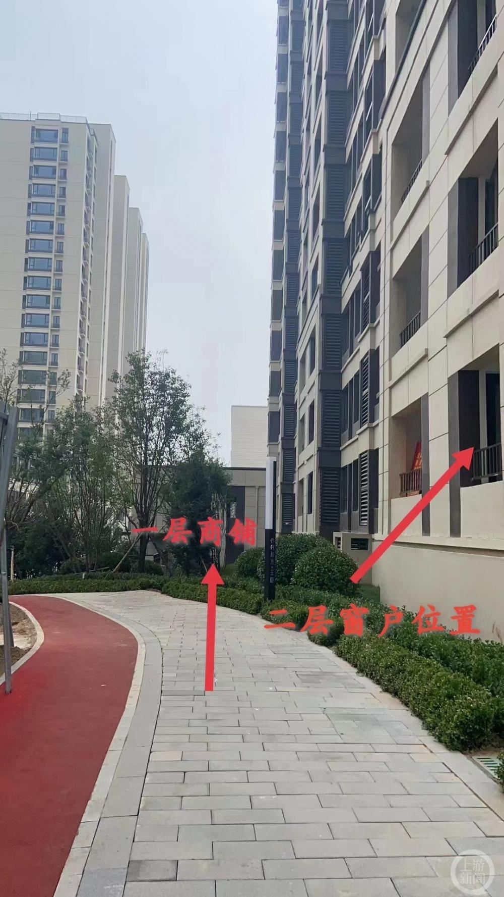
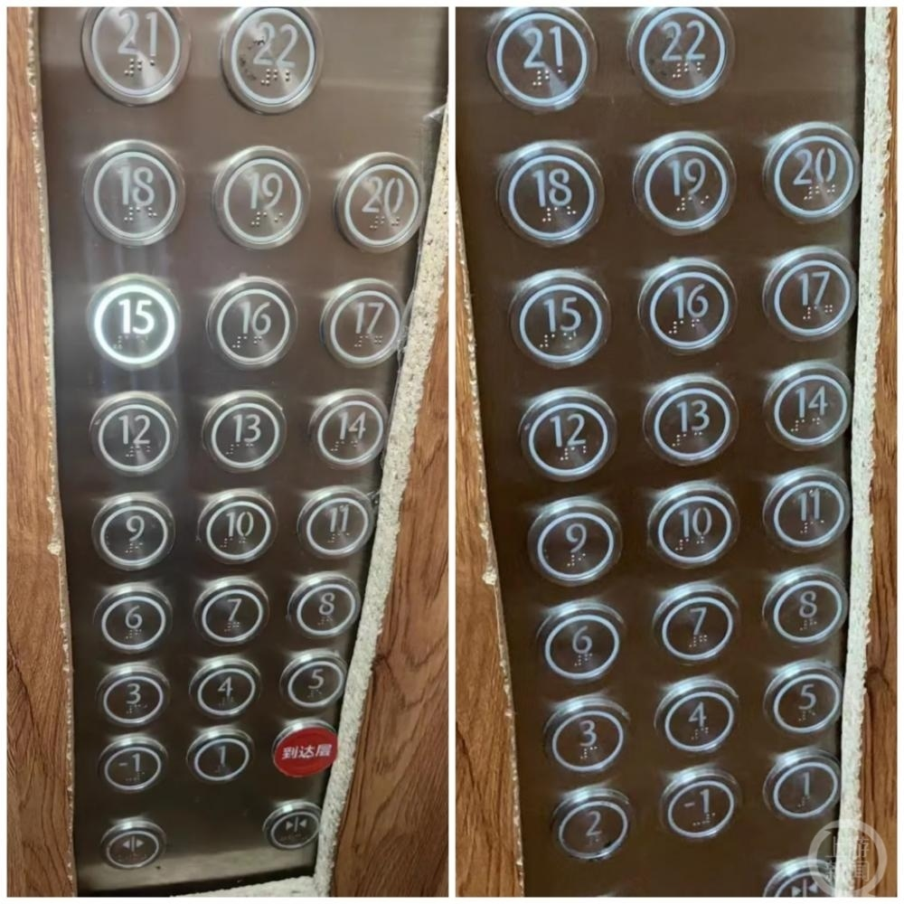
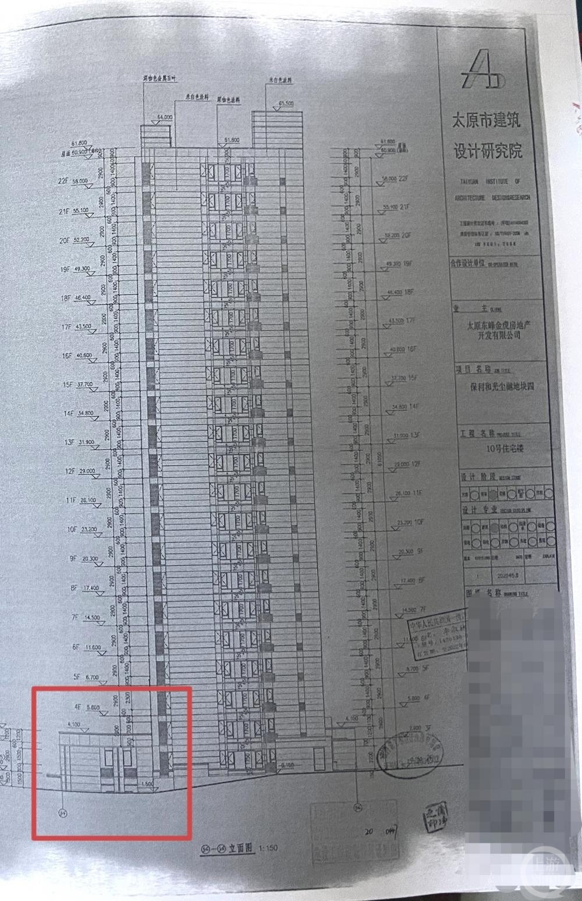

# 一住宅楼建缓坡上引发楼层计数争议，开发商称合规，部分业主拒绝收房

近日，上游新闻记者接到反映称，太原一小区的一栋业主认为，他们所购住房与合同中的层数出现了差异。因担忧采光和潜在的下水反水问题，部分低层住户拒绝收房。该住宅属于保利历时5年打造的高端IP“和光系”。

业主李响告诉记者，2021年初，他在太原保利和光尘樾10号楼购入一套3楼预售商品房。《商品房屋买卖合同》显示，该商品房建筑层数地上22层，地下2层。一张落款为2020年10月23日的《房屋分户平面图》显示，他所购入的住宅位于第3层，10号楼共有24层。

据了解，这起楼层之争缘起于该栋住宅所处地势的特殊性，建在一个西低东高的缓坡上。目前，整栋楼西南角有一商铺被认定为一层，单元入户门设在二层，然而整体来看，“二层”才是目测的地上一层，地上目测共有21层。

7月4日，和光尘樾售楼部一位白姓经理告诉记者，10号楼不存在违建情况，“我们的报批、报规、报建都是合规合法的。”

记者了解到，约十户业主维权近三个月，有人坚持退房，有人想换取金钱或物质补偿，诉求不一。

_▲商铺和二楼位置图。_

**业主：怎么数3层房子都在地上2层，1-3层电梯按键也在来回变**

李响第一次去验房是4月13日，当天是太原和光尘樾楼盘的开放日，当时虽然还没交房，也可以提前参观一下自己的房子，并未察觉到楼层有什么异样，他只是发现小卧室的窗户没有多少光亮，“一开始我也没注意，毕竟我们坐电梯上去，按键是3层”。

第二天，他看到业主群里有人讨论“10号楼没一层”，还以为是假消息，直到几天后他再次前往小区，这才意识到自己的房子真的从3层变成了2层，由于被入户大厅的墙壁遮挡，房间采光受到影响。

10号楼业主王珊记得，4月19日，她第一次到现场确认了自家房子的楼层有问题，她介绍，“虽然门口写的是30X，但是我们从北面数、从南面数，怎么数它都是二层。”

记者多方了解到，太原保利和光尘樾一期10号楼所处地势比较特殊，西南低东北高，西南角有一商铺，也是整栋楼唯一的底商，这就是1层。此外，10号楼为一梯两户住宅，每层共有6户，这栋楼的3个入户门都设在北侧，从入户门进入，这一层的房间被标为201-206。

李响告诉记者，从10号楼电梯的楼层标号也能看出这栋楼的“不正常”。7月2日，他发来一张电梯按键图解释说，标号“-1”实则为地下2层，标号“1”实则为地下1层，而按顺序标号“2”的圆形按键被一张红色贴纸覆盖，上面写着“到达层”。据多位业主反映，标号“3”-“22”的楼层，实际的地上楼层都比数字要高一层。

7月3日，李响再次前往10号楼，他发现，电梯楼层标号发生了改变，从地面进入电梯的层数标号为“1”，然后直上标号“3”的楼层（实际为地上2层），标号“2”的楼层实则为地下2层。

电梯标号的混乱让业主们很困惑，王珊向记者抱怨道，“它上面的楼层一直不变，但是1、2、3层来回在变。”

记者了解到，目前参与维权的业主约有10户，特别是像李响和王珊这样的3层住户，有强烈的意愿想要退房，他们担心换到2层会有下水道堵塞问题，因此不想住2层。“2层是整栋楼下水道管最低一层，1层是独立排水”。

“我能接受低层，但是我接受不了低层带下水，所以当初避开了二层买的三层，况且这中间差了将近13万元的差价呢。”王珊说。

_▲6月与7月的10号楼电梯按键对比图。
图片来源/受访者供图_

**业主4月中旬的投诉记录仍显示“正在跟进中”**

太原保利和光尘樾由太原东峰金虎房地产开发有限公司开发，该公司成立于2019年，系中国保利集团成员，保利发展（山西）有限公司持股70%，后者为保利发展控股集团股份有限公司的全资子公司。

李响和王珊都对记者表示，当初选择购买这一楼盘，正是看中了保利这一品牌的品质保证，“大公司几乎不会烂尾，品控一般都不会太差”。2021年，二人分别花了近一万元一平米的价格买下这间保利的精装修住宅，据他们说，当时附近其他家的楼盘只需每平米六千多元。

4月19日，王珊发现不对后，第一次拨打了保利发展控股集团股份有限公司的客服热线，至今未获有效回应。“我从4月19号开始投诉，一直到7月4号，中间没有一个负责人出来联系我们。”她告诉记者，两个多月来，她打了将近20个保利投诉电话，客服都回复说已经登记过了，尽快会有负责人联系。

7月5日，记者致电上述客服热线，证实了王珊的说法。客服称，王珊4月19日的首次登记记录虽然后续多次催单，但目前仍显示“正在跟进中”。

**房产销售称近期才得知10号楼的特殊性，各部门反馈称设计、审批、验收环节没问题**

记者注意到，10号楼业主所签署的《商品房屋买卖合同》第十条规定，经规划部门批准的规划变更、设计单位同意的设计变更导致下列影响到买受人所购商品房质量或使用功能的，出卖人应当在有关部门批准同意之日起10日内，书面通知买受人。

李响提供给记者的一张10号楼建筑图纸显示，太原设计研究院为设计单位，图中可以看到，位于整栋楼西侧的一个建筑（即商铺）明显处于低洼处，虽然只占据了一个小角落，但被标为1F-3F之间。

7月6日，记者以10号楼业主身份，致电太原设计研究院保利和光尘樾项目负责人，该负责人对记者表示，自己负责的项目非常多，记忆中该楼盘没有发生调整层数这么大的变更。“和光尘樾的这个方案当时做得很成熟，从报规到方案报审都是很严格的。”

该负责人还称，以最低的地面为基准来认定建筑层数的做法“没有问题”。当被问及业主质疑的只有商铺算作一层，其余楼层都比自己购买时“降低了一层”时，该负责人表示，销售与业主之间可能存在沟通问题，“跟设计环节没有关系”。

前述购房合同显示，10号楼业主购买的预（销）售商品房批准机关为太原市行政审批服务管理局。多位业主告诉记者，他们曾拿着图纸前往审批局了解情况，对方称该住宅验收没有问题。近日，记者多次致电审批局，截至发稿，未获有效回复。

李响告诉记者，售楼大厅沙盘上显示的住宅情况和当初购房时销售口述的不一致，销售没有告知他10号楼的地势，也没有告知一层有一商铺。“我不可能一层层数沙盘上的楼有几层，最近才知道沙盘显示是21层，从侧面能看到地势不平，正面看不明显。”他说。

“销售当时就说这个楼有22层，你看要买哪层？”李响称，“确定了三层之后，他就指了一下沙盘上楼的三层，按我们固有思维卖的”。

受访者提供给记者的一段录音显示，6月26日，售楼部白经理对维权业主解释称，“我们是在未知情的情况下卖给你们的。”

7月4日，记者致电白经理了解情况，当被问及他是在何时得知“10号楼有点问题”时，他表示在6月交房前，大概四五月份，当时已经是竣工尾期。

“在备案中10号楼一层的04-06户是商铺，从二层以上是住宅。”白经理告诉记者，10号住宅楼正好处于小区地势差衔接的一个区域，有一个缓坡，10号楼西侧规划的是一层商铺，因此一层一直没有对外销售。白经理还称，该项目的沙盘是按照实际的地势高差来做的，地势在销售时一般都会告知客户。

“有问题的房间我们是不卖的，涉及到商铺的我们是不卖的，最后成了现房之后我们再开始销售，因为它有好多不利因素，但是正常楼层二层往上它是没有不利因素的。”白经理说。

6月28日，李响收到太原市小店区政府的一条投诉反馈意见：“区市场监管局工作人员反馈，现场检查10号楼修建过程中因地势坡度原因导致出现这一问题，建筑手续已经相关部门审批，未发现构成虚假宣传情况。经核查协调，保利和光尘樾将为您登记诉求，向总部反馈后统一处理。给您带来的不便敬请谅解。”

_▲10号楼设计图纸，红框为商铺位置。
图片来源/受访者供图_

**维权诉求无法统一**

白经理告诉记者，目前前来维权的业主诉求无法统一，“有人想退房，有人想退钱，有人想要储藏间或车位（作为赔偿），有人想（减免）十年的物业费，还有人想要换楼层。”

“想要退房只能起诉，就这一条路径。”白经理曾这样告诉业主。据业主们反映，他们多次求见开放商，但长久以来只有白经理一人对接。

7月5日，维权业主们终于见到了一位保利公司公关，现场录音显示，一位业主质问这位公关，“销售当初在沙盘上明确指的目前30X的那户，说你家就是那一家，后来实际收房我收的是下面这个房子，销售告诉我开发商没有明确告诉他们这栋楼的特殊性。”公关回应称，“那你直接把他（销售）起诉就行。”

近日，记者多次拨打该楼盘开发商——太原东峰金虎房地产开发有限公司的公开电话，截至发稿未接通。

记者查阅公开报道发现，2017年南阳市宛城区法院曾处理过一起类似案例，合同约定楼盘地上总层数为26层，当事人购买的第25层在交房时变成顶层，经法院多次调解，开发商赔偿业主楼层差价以及楼层差价额30%的违约金。

王珊感到不解，针对10号楼的特殊性，售楼部至今没有张贴明确的公示告知业主。对此，白经理向记者表示，正在和公司沟通。

一位从业多年的山西房产销售告诉记者，在销售期房时，他们会根据沙盘仔细介绍住宅的情况，包括户型、地理环境、小区整体规划等，也会向业主指出所处楼层的具体位置，如果住宅涉及底商，一定会交代底商在哪里。该房产销售还称，一整层作为一楼底商很常见，目前还未遇到过一间独立的商铺算做一层的情况。

北京金诉律师事务所主任王玉臣律师告诉记者，业主可以起诉，
“通过民事诉讼起诉开发商只是一种备选方案。”王玉臣介绍，以往承办类似案例时，他更多是通过政府信息公开申请、违法查处申请、行政诉讼、谈判等多种法律手段来推动问题的解决。

（李响、王珊为化名）

上游新闻记者 张锦

编辑：邹渝

责编：范永松

审核：冯飞

