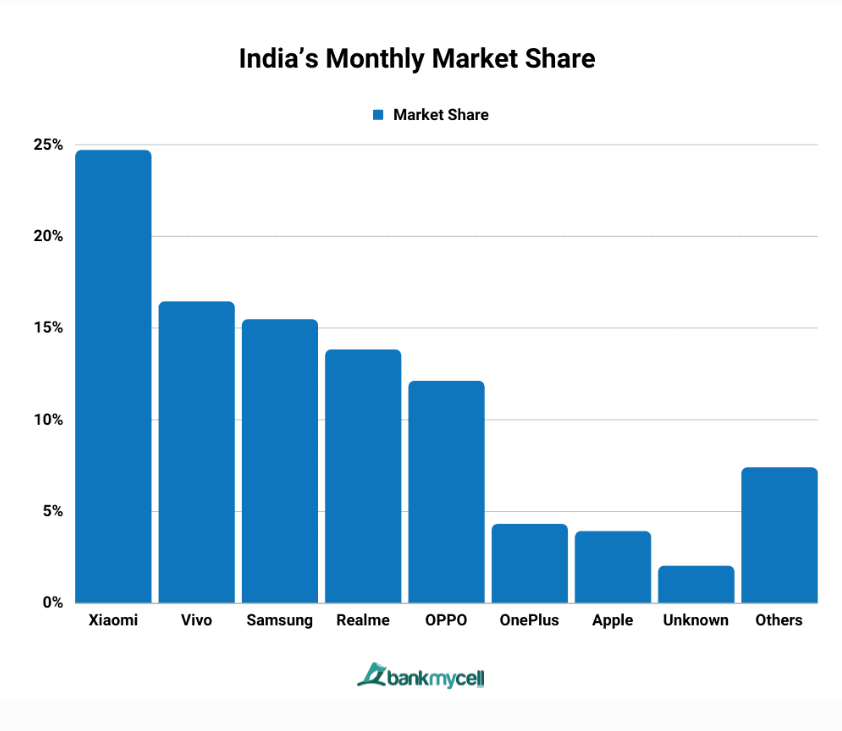
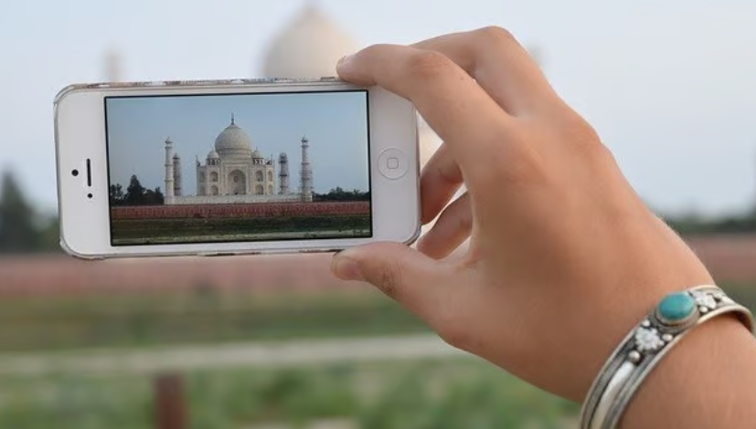
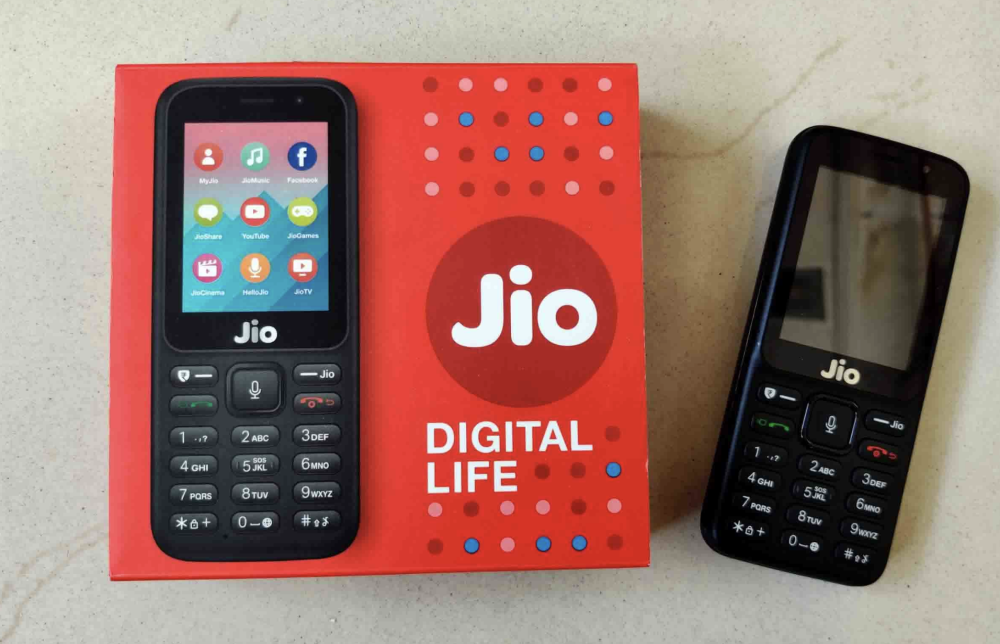
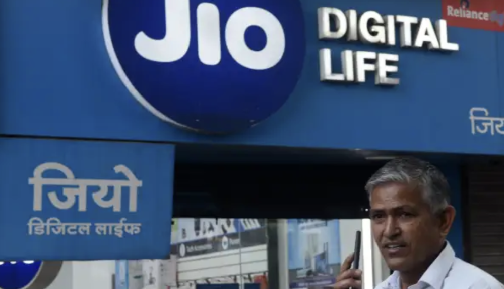

# 亚洲富豪“盯上”2.5亿印度人：没用过智能手机，百元机能否抢占市场

本文来源：时代周报 作者：刘沐轩

在全球手机品牌竞争最激烈的印度，小米、vivo、OPPO、三星、苹果等品牌依旧打得火热。

截至2023年一季度，小米在印度智能手机厂商市场中占有最高的市场份额，为24.87%。其次是vivo（16.54%），三星（15.41%），Realme（13.96%）和OPPO（12.14%）。

_印度的手机市场，中韩手机品牌占据上风。（图源：bankmycell）_

但他们的战场还不够大。

亚洲首富、印度信实集团董事长安巴尼表示，世界正处于5G革命的风口上，但印度仍有2.5亿手机用户受困于2G时代。

这些用户大多数是生活在印度贫困农村中的中老年人和家庭主妇，他们仅仅将手机当作通话和短信的工具，几乎不碰互联网和移动支付，也没有动力去购买上万卢比的5G智能机。

为了让更多印度用户接入现有的移动通讯市场，信实集团的电信运营商子公司Jio近期推出了一款售价仅为999卢比（约合人民币87.3元）的廉价4G手机。

此举有望进一步推动印度的电信业向5G时代迈进。如果成功，不仅仅是印度的电信运营商，全球的手机厂商也将迎来更大的市场。

廉价“百元机”能打开市场吗？

印度的手机市场还有不少增长空间。

市场分析机构IDC的数据显示，截至2022年9月，印度拥有全球第二大电信业，用户基数为11.7亿人，而且还在迅速增长。

IDC研究总监巴特拉表示，“过去几年，该行业的增长主要是由较低关税、价格合理的智能手机普及，印度电信运营商的服务价格下降，4G覆盖范围的扩大，以及用户数据消耗的增加推动的。”

与此同时，印度也在加速迈进5G时代。

巴特拉预测，到2026年，印度将成为全球5G的主要市场，并将主导5G网络的增长。

另一家市场分析机构Counterpoint
Research估计，印度目前有近8500万支持5G的智能手机用户，5G手机在2022年占据了32%的市场份额。到了2023年4月，印度大约有超过50%的智能手机具备5G功能。

然而巴特拉指出，迄今为止，印度的5G市场在很大程度上是供应驱动的，印度消费者并没有将5G设备视作刚需。“印度市场上主要是中国和韩国的手机品牌，几乎所有的智能手机型号价格都在300美元（约合人民币2166.3元）左右，并且支持5G。”

_不是每个印度人都买得起智能手机。（图源：社交媒体）_

这也意味着，有近2.5亿不愿或难以支付300美元买一台智能机的印度人被落下了。数据显示，印度成年人口的人均国民年收入为20.42万卢比，但是底层50%的人均年收入为53610卢比。折合下来，他们每天仅有146.9卢比，也就是12.8元人民币。

对于他们的生活现状，技术政策分析网站MediaNama的创始人、数字权利活动家帕瓦解释道，在印度的低收入家庭中，手机仍然是一个共享设备。“因为设备价格昂贵，网费价格也在上涨。这些家庭中一般只有一个人的手机可以上网，通常是家里的男性。”

只有降低购机成本，才能将这些人接入印度的4G移动互联网。但Jio的野心不止于打开更大的智能手机市场，“抢人头”或许才是他们真正的目的。

据财联社报道，IDC印度的副总裁Navkendar
Singh表示，Jio的主要目标是在Jio平台和Jio网络上吸引更多客户，然后他们可以开始交叉销售服务。现在用户只需要每月向Jio支付约1.5至2美元，当客户在三四年内升级手机时，他们会在某个时间点选择更先进的功能手机或低成本智能手机。

改变市场格局

2G业务已成为印度电信运营商的烦恼，许多运营商抱怨，提供该业务几乎是亏本。

除了仅提供4G网络的Jio之外，印度的其他三大运营商都有着数百万2G网络用户。但为了防止用户流失，谁也不敢率先关闭2G业务。

因此，Jio计划通过推出一款廉价手机来改变市场格局。这款仅有2英寸显示屏、支持4G的手机，除了基本的短信和通话外，仅能够进行移动支付，访问Jio自己的流媒体点播平台，甚至不能安装应用程序。功能堪称简陋，外形也像十五年前的款式。

_这款12美元的廉价手机，看起来像个“古董”。（图源：社交媒体）_

但Jio声称，这款手机的月租费用比其他电信公司便宜30%，并会为客户提供相当于其他公司7倍的4G流量。首月仅需支付1.50美元（约合人民币10.8元），用户将获得无限制的语音通话和14G的数据流量。而其他运营商的语音通话月租近3美元（约合人民币21.6元），且只有2G的数据流量。

这套营销策略对不少国家或地区的人而言并不陌生，印度的电信运营商也不是第一次采取这类型的“低价”营销策略。

_凭借着大胆的营销策略，Jio得以迅速占领印度市场。（图源：社交媒体）_

2016年，当Jio首次推出每月部分流量免费且语音通话价格超低的套餐时，曾改变了印度的移动电信业，其他三大运营商的用户被转化为Jio的用户。最终使Jio迅速成为与印度电信巨头Bharti
Airtel体量并列的电信运营商，几乎以两强垄断方式控制了这个世界增长速度最快的移动通信市场。

