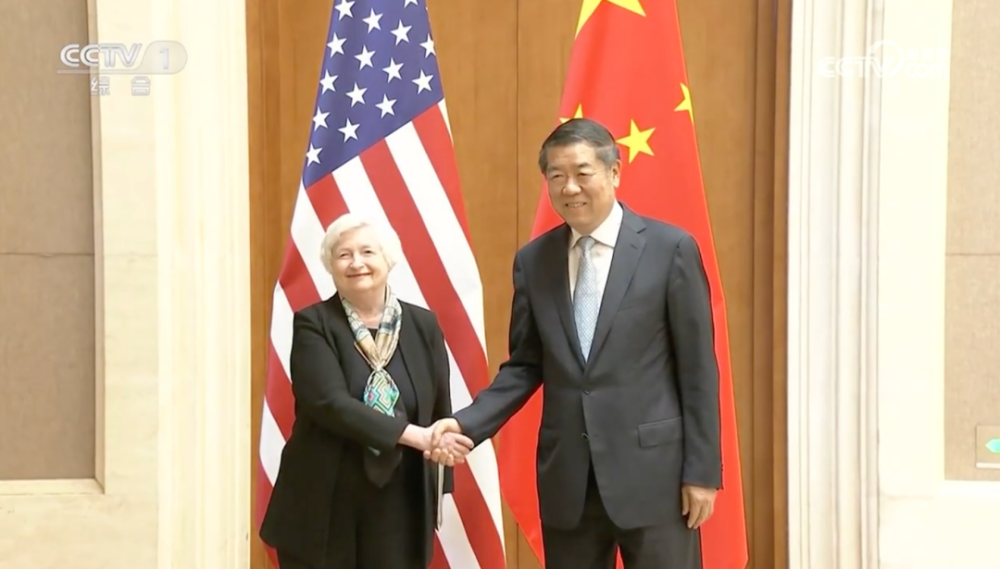
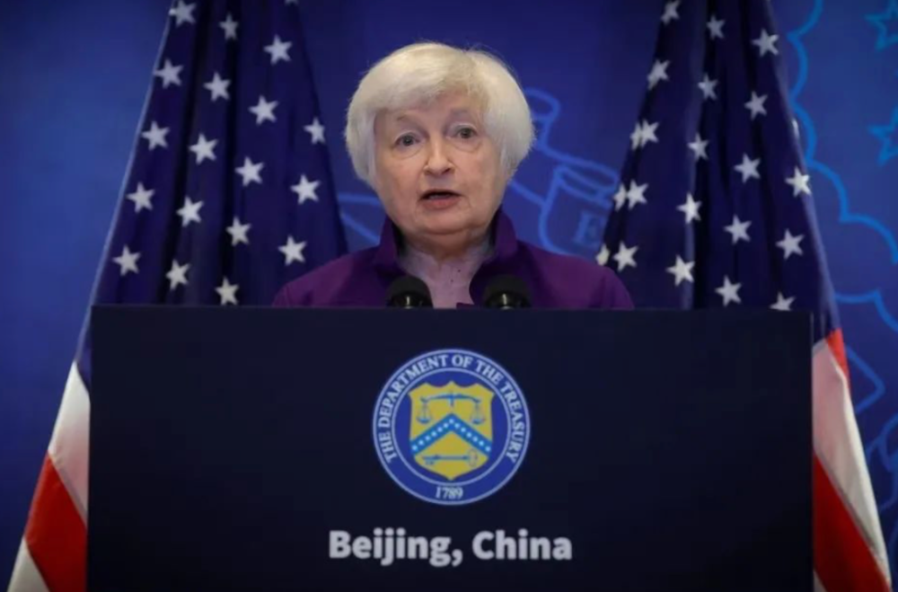

# 国务院副总理何立峰以这一新身份与她会见

**撰文 | 董鑫**

据新华社报道，7月8日，国务院副总理、中美经贸中方牵头人何立峰在京会见美国财政部长耶伦。

**政知见（微信ID：bqzhengzhiju）注意到，在公开报道中，这是何立峰就任国务院副总理之后，首次以“中美经贸中方牵头人”的身份亮相。**

央视新闻报道显示，中方参加此次会见的还有：

财政部部长刘昆

中央财经委员会办公室分管日常工作的副主任韩文秀

中国人民银行党委书记、国家外汇局局长潘功胜

中央财经委员会办公室副主任，财政部副部长、党组成员廖岷

商务部党组成员、副部长兼国际贸易谈判副代表凌激

国务院副秘书长郭玮

外交部北美大洋洲司司长杨涛

经中美双方商定，耶伦于7月6日至9日访华。

这是她担任美财长后首次访华，她也是继美国国务卿布林肯之后，在不到三周的时间内第二位访华的美国内阁高官。

**“加强沟通”是耶伦此次访华的重要关键词。**

落实两国元首共识

从耶伦此访的目的来看。

对于这次访问，中国财政部和耶伦均表示，这是落实中美元首巴厘岛会晤重要共识，加强和深化双边沟通的重要举措。

政知君注意到，2022年11月，中美元首在巴厘岛会晤时同意，两国财经团队就宏观经济政策、经贸等问题开展对话协调。

就在今年1月，时任国务院副总理刘鹤以“中美全面经济对话中方牵头人”的身份，在瑞士苏黎世，与耶伦举行了会谈。

双方在当时的会谈中同意，经贸团队在各个层级继续保持沟通交流，中方还欢迎耶伦在今年适当时候访问中国。

7月9日，也就是耶伦此次访华行程的最后一日，她在美国驻华大使馆召开了记者会。

会上，耶伦进一步介绍，自己此行的目的，是同中方新的经济团队建立并深化联系，以期稳定两国关系、减少误解风险、探讨合作领域。

耶伦表示，美国和中国存在重大分歧，这些分歧需要明确和直接的沟通。双方就两国关系中的机遇和挑战进行坦诚深入的讨论，能更好地了解彼此的行动和做法。

她还强调，拜登总统和她本人都没有从大国冲突的角度来看待两国关系。

“我们相信，世界足够大，足以让中美都能繁荣发展。两国都有义务负责任地管控关系，找到共同相处和共享全球繁荣之道。”耶伦说。

“会谈具有建设性”

耶伦在华期间的行程密集。

7月7日下午，国务院总理李强在人民大会堂会见耶伦。

7月7日，中国人民银行党委书记、国家外汇局局长潘功胜会见耶伦。

7月8日，国务院副总理、中美经贸中方牵头人何立峰在京会见耶伦。

7月8日晚，财政部部长刘昆与耶伦在钓鱼台国宾馆举行会谈。

此外，据《环球时报》报道，耶伦还与国务院前副总理刘鹤以及人民银行行长易纲会面，与在华的美国商界代表和多位女性经济学家见面，与中国气候变化问题专家会晤。

在与中方高级别官员的会晤中，双方就两国和世界经济金融形势、两国财政政策、应对全球性挑战等议题进行了交流。

政知见（微信ID：bqzhengzhiju）注意到，对于相关会晤的总结评价，中方和耶伦的用词颇为一致。

新华社在何立峰与耶伦会见的新闻稿中写道， **双方进行了深入、坦诚、务实的交流，会谈具有建设性。**

廖岷就答媒体记者询问时表示，此次耶伦访华期间，中美经贸团队举行了长时间坦诚会谈。‍‍‍‍

耶伦则在9日的记者会上总结说，她与中方高级官员进行了共计约10个小时的双边会谈，这些会谈是 **“直接、实质性和富有成效的”**
，为稳定两国关系向前迈进了一步。

值得一提的是，会见中，中方还就诸多关切的问题，面对面向美方提出了要求和建议，美方也给出了表态。

李强在会见耶伦时指出，中国的发展对美国是机遇而不是挑战，是增益而不是风险。把经济合作泛政治化、泛安全化，不利于两国乃至全球经济发展。希望美方秉持理性务实态度，同中方相向而行，推动中美关系早日重回正轨。

何立峰与耶伦会见时表达了对美方对华制裁限制措施的关切，并表示，中方认为，泛化国家安全不利于正常经贸往来。

耶伦则明确表示，美方不寻求“脱钩断链”，无意阻碍中国现代化进程。

在9日的记者会上，耶伦又再次向媒体重申，美国无意与中国经济“脱钩”，世界上最大的两个经济体“脱钩”对两国来说都是灾难性的，也会让世界不稳定。

她还强调，美国追求的是一种“健康的竞争关系”，这种关系可以让中美两国都长期从中获益。

“继续保持交流互动”

在这位美财长访华之前，有美国媒体评论说，此访在一定程度上表明了中美两国的沟通渠道在逐渐恢复，且外界十分关注美方能否通过此访与中国建立更长期沟通渠道。

中方已经表态：

**李强会见耶伦时表示，双方应通过坦诚、深入、务实交流，就双边经济领域的重要问题加强沟通、寻求共识，为中美经济关系注入稳定性和正能量。**

**何立峰会见耶伦时表示，双方同意继续保持交流互动。**

**廖岷就耶伦访华答媒体记者询问时表示，后续双方将保持沟通。**

在9日的记者会上，耶伦也被媒体记者问及未来两国在财政金融领域沟通机制的安排。

她表示，此次访华为美方官员与中方新的经济团队提供了见面的机会，可以讨论彼此有分歧的议题、探索如何深化合作交流。

耶伦坦言，一次访问并不能在一夕间就解决美中之间遇到的挑战，期待并相信双方官员会就此访期间讨论过的问题进行更为全面和定期的交流，也希望此访可以有助于建立一个有韧性且富有成效的沟通渠道。

但也如财政部在答记者问中所说， **希望美方以实际行动为两国经贸关系健康发展、实现互利共赢创造良好环境。**

**资料｜新华社、中新社等**

**【版权声明】本文著作权归政知新媒体独家所有，未经授权，不得转载。**

