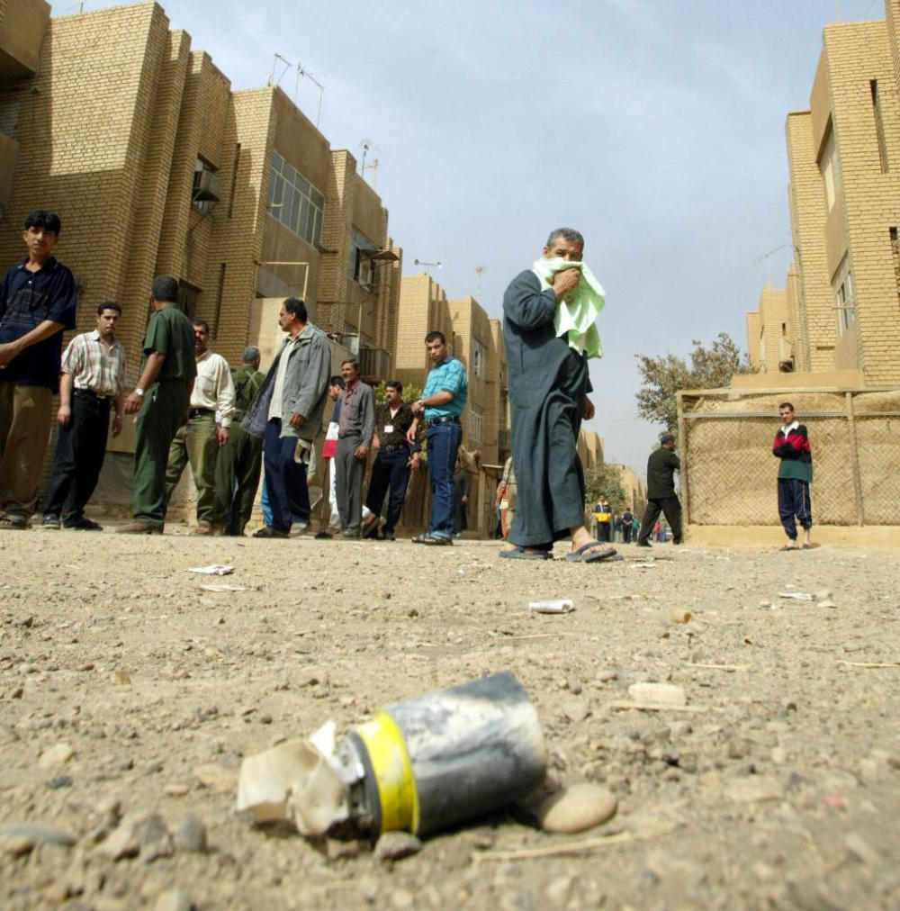
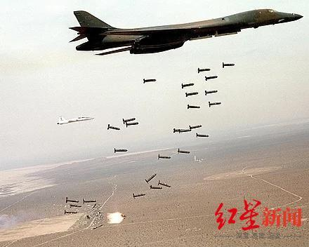
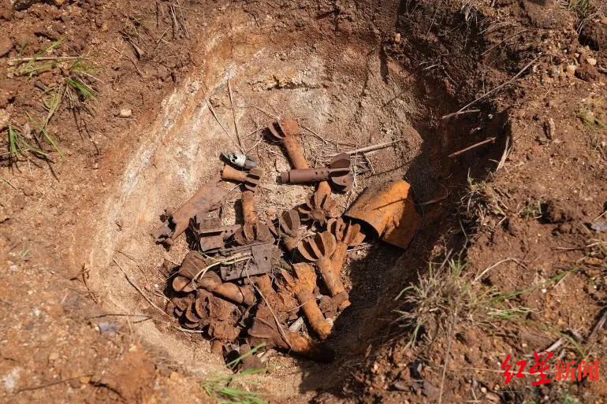

# 美国提供“集束弹药”背后：20年未用，库存充足，弥补援乌弹药不足

美国政府7日宣布向乌克兰提供集束弹药，目前全球有123个国家签署了禁止使用集束弹药的国际条约，包括美国的大部分盟友英国、法国、加拿大等，原因是其极易对平民造成严重伤害。乌克兰防长列兹尼科夫当地时间7日发文，对美国决定向乌克兰提供集束弹药表示欢迎，并称乌军不会将集束弹药用在俄罗斯境内。

美国部分盟友8日公开表态反对这项决定，包括英国、加拿大、西班牙、意大利等。英国首相苏纳克指出，作为《集束弹药公约》签署国，“英国政府禁止生产或使用集束弹药，也劝阻他国使用集束弹药。”加拿大政府提到，加拿大反对使用集束弹药，特别担忧集束弹药对孩童潜在影响。西班牙防长罗伯斯表示：“对于乌克兰的合法防卫我们说‘Yes
’，而对提供集束弹药，我们说‘No’。”

**美国送集束炸弹的背后：**

**还有300万枚库存**

美国国防部7日发表声明说，向乌克兰提供集束弹药是拜登政府同国会、美国盟友及伙伴“广泛协商”后作出的决定。声明中列出的武器装备清单显示，此次援乌的集束弹药由155毫米口径榴弹炮发射，具体数量没有公布。

一年多以来，美国已经动用了155毫米榴弹炮弹药库存，向乌克兰运送了超过200万发弹药。然而乌克兰军队每天消耗数千发子弹，给美国及其盟国的武器库存带来了巨大的压力。乌克兰议会议员叶霍尔·切尔尼耶夫今年早些时候表示，基辅可能需要每天发射7000至9000发子弹，以加强其反攻战斗。

美国自2003年伊拉克战争之初以来，都没有在战场上使用集束弹。因此，美国储存了大量的集束弹药，可能有多达300万枚。

_↑2003年4月5日在伊拉克巴格达南部一个居民区拍摄的照片，人们纷纷绕开一枚集束炸弹的“子炸弹”
新华社发_

早在3月，当西方忧虑弹药生产赶不上乌军用量之时，美国国会两院共和党人就曾联署去信拜登，要求拜登向乌克兰输送集束弹，以弥补美国及其盟友的弹药不足，并帮助乌军应付俄军的弹药数量优势。

据报道，白宫当时不愿向乌克兰提供集束弹药，部分担忧是，使用一种受到许多国家谴责的武器，美国似乎会失去道德制高点。但目前的战场形势让拜登政府改变了立场。

目前，乌克兰反攻的最大阻碍是俄军在整道前线上以地雷、反坦克障碍物、各种战壕等所构成的防御工事。若用火箭炮、榴弹炮等单一弹头攻击，所需数量非常大，对于火药本来就不太足够的乌军来说，集束弹便成为了打破这一僵局的武器。

一方面，集束弹的小型炸弹数量多、打击范围广大，弥补了单一弹头的不足；另一方面，集束弹打击范围广，子炸弹体积小，不必精准定位目标，且更容易进入战壕内。

据报道，拜登7日接受采访时介绍说，此决定是为了解决乌克兰即将面临的弹尽窘境。美国官员表示，“乌克兰人决定无论付出什么代价也要使用集束弹药，这成为影响拜登想法的一个关键因素。”

**集束弹药**

**俗称“子母弹”**

集束弹药是一种由多个较小的炸弹、炮弹或导弹弹头集合成的一种炸弹，俗称“子母弹”。安装于“母弹”内的每个小型炸弹又称为“子炸弹”。

当集束弹药投射到目标区域时，弹体内的“子炸弹”会散开，在数座足球场的范围内造成无差别攻击。因此与传统炸弹相较，集束弹能够大幅增加弹药的涵盖面及杀伤范围，使用较少的投射次数，便能摧毁更多目标。

_↑一架美国轰炸机在投掷集束炸弹_

单个子炸弹可装入的炸药分量较小，所以每个子炸弹的爆炸威力不及单一的大型炸弹，通常以人员、没有装甲的车辆或器材等软性目标为攻击对象，但因为子炸弹的散布面积大，故此杀伤面积大，可以打击子炸弹分布范围内的多个目标。从军事角度来看，若要对付躲在战壕或坚固阵地里的敌军地面部队，集束弹惊人地有效。

集束弹药后来经过改进，开发出不同类型的“子炸弹”，如可击穿125毫米或更厚装甲的“子炸弹”。美国预计将会供应乌克兰的集束弹药是“双效改良型常规弹药”（DPICM），包含攻击装甲车的用途。

**集束弹药被禁：**

**伤害平民**

集束弹药存在的问题是：极易对平民造成巨大伤亡。

虽然所有武器对非交战平民都会构成威胁，但集束弹药对平民的威胁特别显著，原因有二。

第一是集束弹药设计是对大面积战区进行杀伤，弹药如误击或掷偏很容易波及对非交战者，造成死伤。

第二是由于一系列原因，它们往往无法正常发挥功能，例如作战前的搬运、储藏和投放时的操作不当，以及由于投放到较松软的地面，集束弹药就无法正常引爆，许多子炸弹可能不会爆炸。战术上看，集束弹药的未爆弹（哑弹）杀伤力与一颗反步兵地雷相似，可以让敌军造成非预期的死伤，但是战后哑弹的清理便相当困难。

_↑集束弹药残留物_

根据人权观察和国际红十字会的数字，在实际战争中，集束弹小型炸弹的“不爆炸率”可高达20%至40%不等。由于其战时误伤和战后后遗问题严重，有多达123个国家签署了2008年达成的《集束弹药公约》，承诺禁止集束弹的使用、转移、生产和储存，当中也包括25个北约成员国。

**对乌克兰遗害无穷**

此前多起冲突中，许多哑弹存留下来。美军曾在越南战争、海湾战争、科索沃战争、阿富汗战争、伊拉克战争中使用集束弹药，仅海湾战争中就有数万个子炸弹没有爆炸，战后造成大量民用设施损毁、众多平民死伤。北约轰炸南斯拉夫时，投放了上千枚集束弹药，释放出近35万颗子炸弹。北约认为，有8%-12%是哑弹。

有报道称，美国将集束弹药转让给乌克兰是可怕的，它们将在几十年内杀死和残害当地居民。“乌克兰有重复越南、老挝和柬埔寨悲剧的风险。”

相关数据显示，越战结束后40多年间，遗留未爆炸弹在越南造成4万多人死亡、6万多人受伤；在老挝，战后每年都发生百余起误触事件，已造成2万多人死亡；柬埔寨政府数据显示，自1979年至2021年，地雷等未爆炸物造成近2万柬埔寨人丧生，4.5万余人伤残。美国虽表示要清除这些未爆炸弹，但行动缓慢。

美国法律禁止生产、使用或向他国转移哑弹率高于1%的集束弹药。然而，据美国国防部发言人帕特里克·赖德说，美国此次援乌的集束弹药哑弹率降至不高于2.35%，这是“仔细挑选”的结果。另据报道，美国此次援乌的集束弹药每枚内包含72枚子炸弹，哑弹率约为6%。这意味着，每发射一枚此种集束弹药，平均有至少4枚子炸弹为哑弹。

红星新闻记者 邓纾怡

编辑 郭宇 责编 邓旆光

