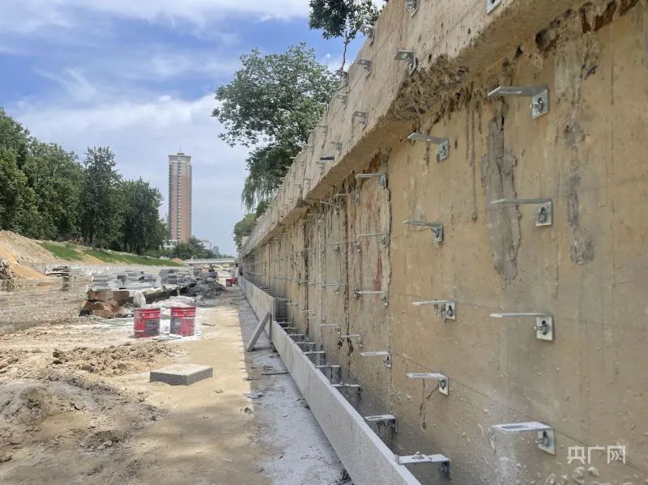
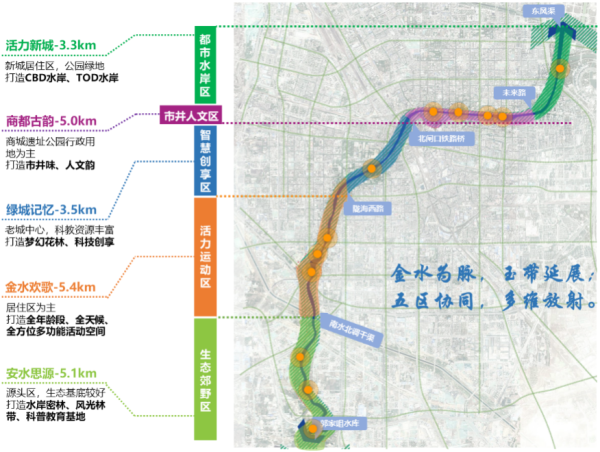
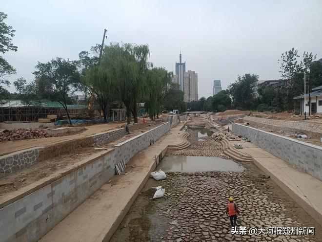
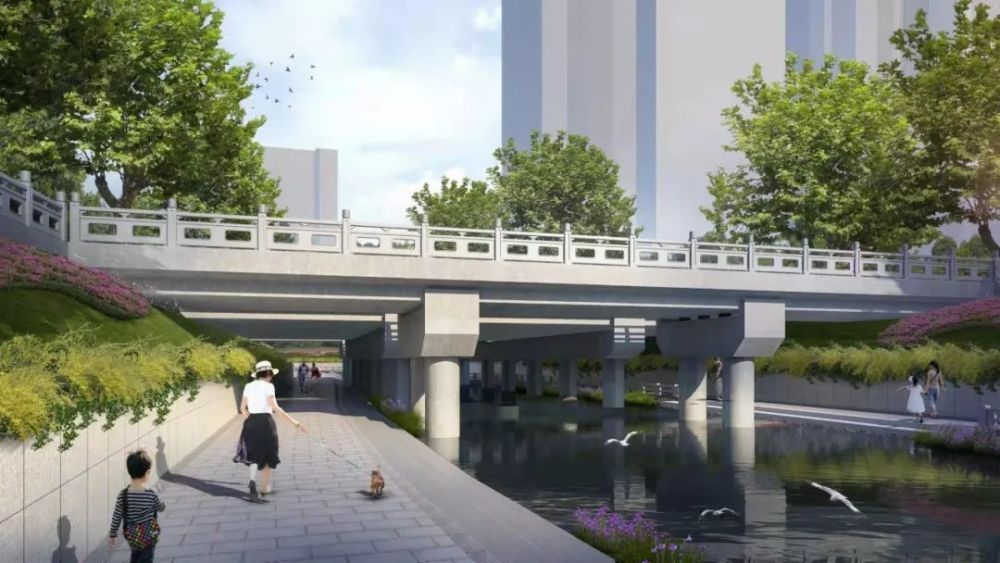

# 郑州沿河道贴瓷砖引争议 现场工人：一下大雨河道都满了，纯粹浪费

最近，河南郑州金水河“河道干挂大理石”一事受到舆论聚焦。

央广网等媒体发自当地的报道显示，相关施工实际是在沿河人行步道旁边的立面进行的。另据金水河综合整治工程环境影响报告书等官方资料，金水河城区段如铭功路-
水上餐厅（长度0.9km）、二七路-人民路（长度1.1km）采用的是垂直挡墙+河床步道的驳岸形式，通过拉近步道和水面距离来提升亲水性。

金水河是郑州市主城区主要行洪排涝通道之一，全长约28km，从西南向东北横穿郑州市区。

7日，央广网记者从金水河起点郭家咀水库开始，沿着金水河岸向东北方向沿途走去，依次来到了嵩山南路与陇海西路交叉口西北侧、郑州市人民公园北侧等金水河沿岸地点，发现有部分河道人行步道两旁的墙面上已干挂大理石。每处所干挂的大理石长度约为100米，所挂大理石自身高度在1.6-2米之间。

_郑州市人民公园北侧金水河河道周边正在干挂大理石。央广网
图_

报道称，经实地查看，金水河河道周围确实有铺设大理石的情况，只是并非在河道内，而是在河道上方人行步道的墙上干挂有大理石。

《新京报》记者7日来到金水河东明路至中州大道段，发现在高于河床约80厘米的路面的一侧，瓷砖贴着1.6米高的墙铺设。施工人员告诉记者，每块瓷砖高20厘米，从底部一直砌到墙顶，需要8块，“这里不是网上说的河道，而是人行步道。”而在已铺设瓷砖的墙壁外立面上，离地约50厘米处，还安装有内嵌式景观灯，接有电线，部分步道外侧已安装护栏。

在两家媒体的报道中，有现场施工工人质疑，“河道也不深，不到1米，前几天郑州下雨，水都跟人行步道齐平了。一下大雨河道都满了，铺这个纯粹浪费。”另有长期在金水河附近工作的市民介绍，金水河旁原本就有人行步道，但现在步道的高度被挖低了。一位施工人员拍摄的视频显示，7月3日18时许，由于降雨，河水漫上人行步道，水位接近内嵌式景观灯的位置。

另有网友提出，沿河道贴砖有无安全上的考量？沿河人行步道与水面高度差是否过小？

澎湃新闻注意到，上述施工是金水河综合整治提升工程中的一部分，
**该工程自郭家咀水库起，至东风渠，治理河道总长22.3公里，包括水安全保障工程、沿河路综合整治提升工程、水质保障与生态复修工程、桥梁恢复提升工程、绿化完善工程、智慧管理工程等。**

郑州市城乡建设局曾在2020年答复市政协委员提案时指出，金水河现状以“三面光”河道为主，存在行洪卡口、水质水量波动大、生态性不足、公共空间碎片化、配套设施缺乏等问题，总体亲水性差、形象品质不佳。

当时完成的金水河综合整治提升工程方案宣称充分借鉴了韩国首尔清溪川“分段整治、岸线梳理”设计理念，从上游到下游分为五个片区：生态郊野区（郭家咀水库-
南水北调干渠）、活力运动区（南水北调干渠-嵩山南路）、智慧创享区（嵩山南路-北闸口铁路桥）、市井人文区（北闸口铁路桥-未来路）、都市水岸区（未来路-
东风渠）。

按照该方案，央广网报道中的郑州市人民公园北侧金水河河段，就属于5个片区中的市井人文区。

郑州市城乡建设局当时介绍，为解决河道亲水性不足的问题，方案结合场地条件降低绿道与河道常水位之间的高差，在改造后的驳岸中增设亲水阶梯、亲水平台，慢行系统中设置过水汀步、悬挑绿道，堰坝采用龙鳞堰等表现形式，景观小品中设置互动喷泉、水幕等，从点、线、面多层次提升亲水效果，实现水城相依、人水相亲。

具体包括：通过拆墙透绿、新建节点公园、对现状公园改造提升，串联滨水绿地空间，融合河道蓝绿空间；采用“岸线梳理，元素活用”的手法进行驳岸改造，活用文化、科创元素，利用堤顶路和下方河床的巨大高差，营造丰富多样的亲水体验空间，因地制宜充分融入跌水、喷泉、涌泉、瀑布等多种水体表现形式；
**选用草坡入水+直立挡墙、两级生态砌块挡墙、直立式高挡墙、两级矮挡墙+缓坡等驳岸形式，增加亲水性**
；拆除原有橡胶坝，结合景观节点新建跌水堰坝，提升景观效果等。

部分 **游步道降低后高程与常水位高差较小，存在一定的防汛风险**
，郑州市城乡建设局相应解释为，本次提升改造考虑在亲水游步道出入口设置警示牌、提醒广播等，同时在下沉游步道进入口设置人流控制设施，洪水期间禁止行人进入，并参考韩国清溪川等城区河道成熟管理经验，在桥下及邻近绿道段设置应急逃生通道、无障碍设施通道等，以确保行人安全。

_金水河方案总体功能分区。微信公众号“郑州发布”
图_

据微信公众号“郑州发布”，2021年11月25日，郑州正式启动以保障防洪安全为核心的金水河综合整治。

澎湃新闻注意到，此次公布的方案继续按场地特征从上游到下游分为五个分区，计划基于“河-路-园”一体的设计原则，实现纵向步道贯通、横向两岸融合，构建完善的滨水慢行体系。如：运用多种型式确保河道两岸慢行系统上下游全线贯通；新建人行桥、过河汀步等，促进公园、道路（金水路、沿河路等）与河道有机融合等。

在防洪排涝方面的整治上，郑州市城乡建设局有关负责人称，将通过通卡口、顺河床、理岸坡提升行洪能力。比如
**通过河道下挖、拓宽、重建等措施，提升卡口段河道行洪能力；梳理河道全线坡降，优化纵断面设计，确保行洪通畅；通过全线河道断面型式优化设计，结合岸坡“微改造”完善堤防系统、提升过流能力。**
结合上游郭家咀水库重建及南截流沟建设，提升金水河防洪标准至100年一遇，总体保障金水河流域防洪安全。

_金水河滨河公园改造现场。大河报 图_

之后的2022年8月，郑州市城乡建设局在答复相关提案时透露，2021年“7·20”特大暴雨灾后，金水河综合整治工程加速推进
**，整治方案从景观提升、业态丰富，逐渐向重视防洪达标、水质提升、慢行贯通等基本功能提升转变**
，规划设计“上蓄、中截、下排”三位一体防洪体系，达到百年一遇防洪标准，总体实现“河安、水清、路通、岸美”的整治目标。具体措施有，一“蓄”。对南四环上游的郭家咀水库进行疏挖、清淤、扩容，对坝体进行加固，对水库溢洪道进行重建。二“清”。已完成金水河西三环上游5公里河段3500余棵阻水杂树清理；南四环至湖滨南路10处严重淤积河段清淤任务；确保汛期河道排水通道顺畅。三“疏”。对金水河中游的帝湖、大学北路桥、北闸口沿河路、水上餐厅4处卡口河段实施工程治理，打通行洪瓶颈，疏挖排水通道，提升洪水下泄能力。

_金水河综合整治工程大学北路桥项目效果图。中建七局交通公司
图_

**此前报道：**

郑州花34亿给河道贴瓷砖？记者实探：为人行步道，曾因降雨被淹

