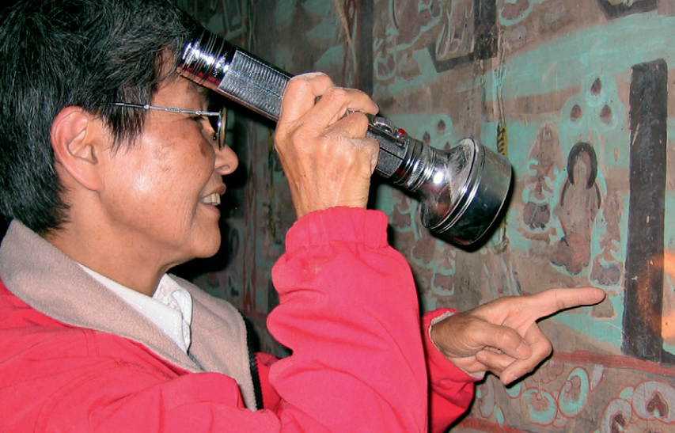
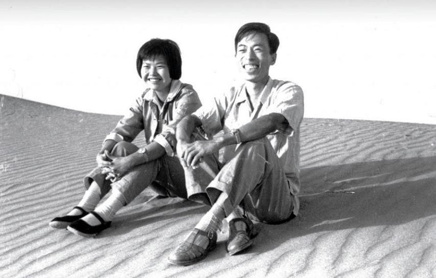
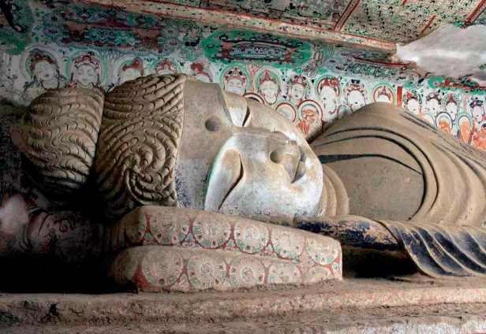

# 85岁的“敦煌女儿”，又捐1000万

作者：陈娟 许晔

编辑：许晔

两个月前，樊锦诗向北京大学捐款1000万元，设立樊锦诗教育基金，用以支持北大的敦煌学研究。

今天，她又将自己所获奖金及个人积蓄拿出来，向中国敦煌石窟保护研究基金会捐资1000万元！

樊锦诗是敦煌研究院名誉院长、全国优秀共产党员，曾获得“文物保护杰出贡献者”“改革先锋”等荣誉称号。人们提起她时，总是亲切地称她为“敦煌女儿”。

2020年，《环球人物》记者见到樊锦诗，问她当初为何选择来偏远而荒凉的敦煌。

她答：“那还有啥可说的呢？一个有事业心和责任感的女大学生，碰上一个思想纯粹的年代，最终的结果就是扛起铺盖卷儿，义无反顾地上路。”

**半夜房顶掉老鼠**

今年，是樊锦诗从事敦煌文物工作的第60年。

1963年，她从北大历史系考古专业毕业那年，时任敦煌艺术研究所所长的常书鸿向北大考古系申请推荐毕业生到敦煌工作，点名就要樊锦诗。毕业分配结果宣布时，樊锦诗犹豫不决——前一年她去敦煌实习，留下了“心理阴影”。那次实习是她第一次去敦煌，一路上都在畅想，想象风度翩翩的常书鸿先生，想象如世外桃源般的敦煌。

可一下车她就傻了眼，眼前的常先生穿一身洗旧了的“干部服”，一双布鞋，戴一副眼镜，“一个鼎鼎大名的艺术家怎会这么土！”

那里的生活更是想象不到的艰苦，住破庙泥屋，没电没水，上个厕所都要跑很远。而且敦煌昼夜温差大，气候干燥，樊锦诗从小在上海长大，根本无法适应。“严重的水土不服，加上营养跟不上，我几乎每天晚上都失眠，经常到三四点钟就醒了。”

还有一次半夜房顶掉老鼠，把她吓个半死，暗暗发誓：“这地方我再也不来了……”

_·1964年，樊锦诗（左）在敦煌文物研究所工作。_

但真正面临抉择时，樊锦诗又和许多年轻的大学生一样，天真而坚定——只要是国家需要，就愿意无条件地服从。

“我转念一想，说不定这就是天意。作为一个考古学生，其实在潜意识里，我还是非常喜欢敦煌的。”

樊锦诗念念不忘的是敦煌那些美丽的壁画和造像。“这些洞窟最初是谁建的？壁画是什么人画的？她又是怎样湮没在了历史的记忆中……都在向我传递着一种强烈的信息，这里充满着奥秘，我想要去探究它的谜底。”支撑樊锦诗去敦煌的，还有一个美好的希望——学校承诺，三四年后会分配新的考古专业毕业生来敦煌，她就可以离开，去武汉和爱人彭金章团聚。

彭金章是他们班的生活委员，在学校时对樊锦诗格外照顾，给她占座，送她手绢、家乡土特产，一来二去两人确定恋爱关系。毕业分配，彭金章的去向是武汉大学。分别时，樊锦诗对他说：“很快，也就三四年。”

她背起大包，戴着草帽，坐火车、转汽车，历经三天三夜，到了敦煌。谁也没想到，她这一去就再也没有离开。

**“我不能退缩”**

到敦煌艺术研究所后，樊锦诗的第一项工作就是和其他几位同事一起撰写敦煌第一部考古调查报告。她加入到
“面壁者”的队伍中去，每天睁开眼就往洞窟里钻，跟着先生们爬“蜈蚣梯”——一根绳子直上直下吊着，沿绳一左一右插着脚蹬子。每次爬她都心惊胆战，在梯子上左摇右晃。

“我把所有时间和精力全部倾注在洞窟里。”樊锦诗说。刚到敦煌，一不工作她就胡思乱想，想上海、想北京、想爱人，有一种巨大的孤独感和失落感，“这种失落一直会把我拽向忧郁的深渊，有好几次都想离开”。

为了抗拒这个深渊，她学着遗忘，将姐姐送的小镜子藏起来，不再每天照镜子。

她渐渐习惯了宿舍没有地板的泥地，习惯用报纸糊起来的天花板，习惯了半夜里老鼠掉在枕头上，然后爬起来掸掸土，若无其事继续睡。

她只要一走进石窟，所有的孤独和不快全都忘了。“慢慢地离不开敦煌，安下心来，心无旁骛地守护它。”

_·2004年8月，樊锦诗在莫高窟第272窟考察现场。_

735座洞窟，樊锦诗能说出每一尊佛像的来历、每一幅壁画的年代、每一个石窟需要修复的问题。“每一个洞窟都有病。”她说，保护是一个永恒的主题。

“那些怀抱琵琶的飞天和斑斓的佛国世界，迟早会消失。人类所能做的，只不过是让消失的过程慢一点。”

有一阵子，樊锦诗总在做梦，梦到墙体上的壁画一块块地剥落，“难道我们就眼睁睁地看着世界上独一无二的敦煌石窟艺术逐渐消亡吗？”问题一直萦绕着她，走路吃饭睡觉都在琢磨，但总也无解。

到了上世纪80年代末，樊锦诗到北京出差，一个偶然的机会，有人在电脑上给她展示图片。

她忍不住问：“那你关机后，刚才显示的图片不就没了吗？”对方回答：“不会！因为转化成数字图像后，它就可以永远保存下去。”她茅塞顿开：壁画也可以数字化保存。

后来，这一构想得到甘肃省科委的支持，敦煌研究院在文物界首先开始了壁画数字化的试验。“尽管我们在山沟里，但我们从来都是开拓进取，不墨守成规的。”

此后，敦煌便行走在数字化的道路上。1993年，敦煌研究院开始尝试用计算机技术重组壁画信息；2006年，敦煌研究院数字中心成立，专门从事研发石窟文物数字化；2014年，莫高窟数字展示中心建成，游客可以在这里观看球幕电影，了解莫高窟的前世今生。越来越多的游客被莫高窟的神秘和美丽吸引。随之而来的是，它也被裹挟到旅游开发的大潮中，遇到了市场开发和保护的矛盾。

1998年，樊锦诗成为敦煌研究院第三任院长。不久，她就遇到一件棘手的事：当时，全国掀起“打造跨地区旅游上市公司”热潮，有关部门要将莫高窟捆绑上市。“敦煌是国家的遗产、人类的遗产，决不能拿去做买卖。”

为此，她四处奔走，甚至对当时的相关主管部门领导说：如果敦煌也捆绑上市，文物局就关门吧，我这个院长的帽子也不要了。就这样，她硬是把压力顶了回去。

“担子交到我身上是很重的，我知道自己的能力和分量，但是我不能退缩。”

多年后再谈起当年，樊锦诗仍很坚决，“敦煌研究要做什么？就是完整、真实地保护她的信息，把她的价值传给子孙后代。如果没好好挖掘文物的价值就让企业来开发，那我就是罪人。”

樊锦诗为中国石窟考古与保护做出了重大贡献。今天，国际编号为381323号的小行星被正式命名为“樊锦诗星”。

_·编号381323小行星被命名为“樊锦诗星”。_

**“那不是我的荣誉，那是敦煌的荣誉”**

在敦煌坚守60年，樊锦诗觉得自己最对不住的就是丈夫和孩子。1968年，她生下大儿子，产假一休完就上班。孩子没人看，只好把他捆在襁褓里，临走之前喂饱，中途再回来喂一次奶。有一次，她下班回宿舍，发现孩子从床上滚了下来，脸上沾满了地上的煤渣，心疼得直哭。

最终，她和彭金章一商量，把孩子送到丈夫河北老家的姐姐那里。后来，老二也由这个姑姑带大。一家四口真正团聚，是在彭金章调到敦煌后。樊锦诗忙于工作，照顾孩子的重担就落在了丈夫身上。“我能守在敦煌，离不开老彭的理解和支持。”樊锦诗说。

当年，她一头扑在敦煌考古时，彭金章也肩负重任，在武汉大学创立了考古系。两人面临的现实问题是：谁去谁那里？

一场旷日持久的“拉锯战”开始了——武汉大学到敦煌要人3次，敦煌“以礼相待”，也到武汉大学要人3次。结果双方“不欢而散”。后来，还是彭金章妥协，做起了“敦煌女婿”。1986年，彭金章调到敦煌研究院，夫妇二人都在敦煌扎下了根。此时，距离两人毕业分别已经过去23年。

彭金章来到敦煌后，研究所就交给他两块“硬骨头”，其中之一是研究被当时学术界称为“敦煌荒漠”的北区洞窟。

“洞窟积尘都是成百上千年形成的，发掘完一个洞窟后，他就成了泥人，眉毛和眼睛都是灰土，口罩一天换几个，都是黑的。”樊锦诗回忆。

8年里，彭金章用筛子几乎筛遍了北区的每一寸沙土，挖掘出大量珍贵文物，证实完整的莫高窟石窟寺院由南北石窟共同构成，从而使有编号记录的洞窟由492个增至735个。

_·1965年，樊锦诗与彭金章在莫高窟合影。_

《环球人物》记者见到樊锦诗那年，她已经82岁了，仍住在莫高窟，做研究、撰写考古报告，只是身边没有了爱人彭金章——2017年他因病去世。

她一生不喜名誉，谈及个人成就，她说“要不是敦煌，人家知道我是谁？那不是我的荣誉，那是敦煌的荣誉。”

她也不追逐物质和金钱，生活简朴，可以称得上是“抠门”。任院长时，她每次出差尽可能独自一人，为的是省差旅费。而且只要去北京出差，就住在景山公园后的一个地下室招待所，连那里的服务员都认识她，称她是“住在地下室里级别最高的名人”。

在敦煌，每当苦闷和烦恼时，樊锦诗都喜欢去第158窟看一看。第158窟内的佛床上，卧着莫高窟最大的释迦牟尼佛涅槃像。卧佛像头向南，足向北，右胁而卧，面向东。1200多年来，始终从容不迫、宁静坦然地面对着朝圣者

_·莫高窟第158窟。_

一走进这里，她的心就格外宁静，有一种回家的感觉。“如果此生找不到自己心灵安顿的地方，如果心灵一直在流放的路上，就犹如生活在漫漫长夜中。敦煌就是我心之归处。”

总监制： 吕 鸿

监 制： 张建魁

主 编： 许陈静

编 审： 苏 睿

