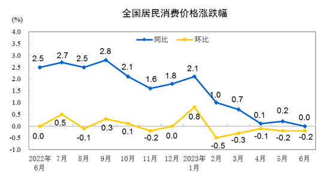
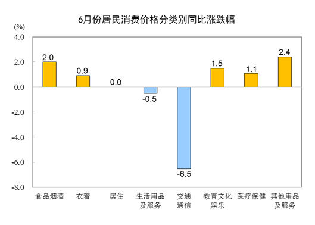
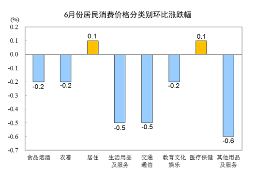

# 中国6月CPI由上月上涨0.2%转为持平，猪肉价格下降7.2%

2023年6月份，全国居民消费价格同比持平。其中，城市持平，农村下降0.1%；食品价格上涨2.3%，非食品价格下降0.6%；消费品价格下降0.5%，服务价格上涨0.7%。

1­­—6月平均，全国居民消费价格比上年同期上涨0.7%。

6月份，全国居民消费价格环比下降0.2%。其中，城市下降0.2%，农村下降0.2%；食品价格下降0.5%，非食品价格下降0.1%；消费品价格下降0.3%，服务价格上涨0.1%。

**一、各类商品及服务价格同比变动情况**

6月份，食品烟酒类价格同比上涨2.0%，影响CPI（居民消费价格指数）上涨约0.55个百分点。

食品中，鲜菜价格上涨10.8%，影响CPI上涨约0.20个百分点；鲜果价格上涨6.4%，影响CPI上涨约0.13个百分点；粮食价格上涨0.5%，影响CPI上涨约0.01个百分点；水产品价格上涨0.5%，影响CPI上涨约0.01个百分点；畜肉类价格下降3.3%，影响CPI下降约0.10个百分点，其中猪肉价格下降7.2%，影响CPI下降约0.09个百分点。

其他七大类价格同比四涨一平两降。其中，其他用品及服务、教育文化娱乐价格分别上涨2.4%和1.5%，医疗保健、衣着价格分别上涨1.1%和0.9%；居住价格持平；交通通信、生活用品及服务价格分别下降6.5%和0.5%。

**二、各类商品及服务价格环比变动情况**

6月份，食品烟酒类价格环比下降0.2%，影响CPI下降约0.07个百分点。

食品中，蛋类价格下降2.2%，影响CPI下降约0.02个百分点；鲜果价格下降1.7%，影响CPI下降约0.04个百分点；畜肉类价格下降1.2%，影响CPI下降约0.04个百分点，其中猪肉价格下降1.3%，影响CPI下降约0.02个百分点；水产品价格下降1.2%，影响CPI下降约0.02个百分点；鲜菜价格上涨2.3%，影响CPI上涨约0.05个百分点。

其他七大类价格环比两涨五降。其中，居住、医疗保健价格均上涨0.1%；其他用品及服务、生活用品及服务、交通通信价格分别下降0.6%、0.5%和0.5%；衣着、教育文化娱乐价格均下降0.2%。

**2023年6月份CPI同比持平PPI同比下降**

**——国家统计局城市司首席统计师董莉娟解读2023年6月份CPI和PPI数据**

国家统计局今天发布了2023年6月份全国CPI（居民消费价格指数）和PPI（工业生产者出厂价格指数）数据。对此，国家统计局城市司首席统计师董莉娟进行了解读。

**一、CPI保持基本平稳**

6月份，消费市场运行基本平稳，CPI环比略有下降，同比持平。

从环比看，CPI下降0.2%，降幅与上月相同。其中，食品价格下降0.5%，降幅比上月收窄0.2个百分点。食品中，受高温、降雨天气影响，鲜菜价格由上月下降3.4%转为上涨2.3%；其他食品供应总体充足，价格大部分下降，其中鸡蛋、鲜果、猪肉和水产品价格降幅在1.2%—2.6%之间。非食品价格下降0.1%，降幅与上月相同。

非食品中，受国际油价下行影响，国内能源价格下降0.7%，降幅比上月扩大0.5个百分点；受“618”商家促销活动等因素影响，扣除能源的工业消费品价格由上月持平转为下降0.3%；服务需求持续恢复，服务价格由上月下降0.1%转为上涨0.1%；市场供应偏紧，中药材价格上涨1.7%。

从同比看，CPI由上月上涨0.2%转为持平。其中，食品价格上涨2.3%，涨幅比上月扩大1.3个百分点。食品中，鲜菜、薯类、鲜果和禽肉类价格上涨较多，涨幅在4.3%—10.8%之间；猪肉价格下降7.2%，降幅比上月扩大4.0个百分点。

非食品价格由上月持平转为下降0.6%。非食品中，服务价格上涨0.7%，涨幅回落0.2个百分点；工业消费品价格下降2.7%，降幅扩大1.0个百分点，其中能源价格下降9.3%，扣除能源的工业消费品价格下降0.5%，降幅均有扩大。

据测算，在6月份的CPI同比变动中，上年价格变动的翘尾影响约为0.5个百分点，与上月相同；今年价格变动的新影响约为-0.5个百分点，上月为-0.3个百分点。

**二、PPI下降**

6月份，受石油、煤炭等大宗商品价格继续回落及上年同期对比基数较高等因素影响，PPI环比、同比均下降。

从环比看，PPI下降0.8%，降幅比上月收窄0.1个百分点。其中，生产资料价格下降1.1%，降幅收窄0.1个百分点；生活资料价格下降0.2%，降幅与上月相同。受国际市场原油价格继续回落及有色金属价格波动影响，石油煤炭及其他燃料加工业、石油和天然气开采业、有色金属冶炼和压延加工业价格分别下降2.6%、1.6%、0.8%。煤炭、钢铁供给量大，煤炭开采和洗选业、黑色金属冶炼和压延加工业价格分别下降6.4%、2.2%。一些技术密集型行业价格上涨，其中飞机制造价格上涨1.0%，智能消费设备制造价格上涨0.4%，医疗仪器设备及器械制造价格上涨0.2%。另外，电力生产中的风力发电和太阳能发电价格分别上涨2.6%、1.4%。

从同比看，PPI下降5.4%，降幅比上月扩大0.8个百分点。同比降幅扩大主要是受石油、煤炭等行业价格继续回落影响。其中，生产资料价格下降6.8%，降幅扩大0.9个百分点；生活资料价格下降0.5%，降幅扩大0.4个百分点。调查的40个工业行业大类中，价格下降的有25个，比上月减少1个。

主要行业中，石油和天然气开采业、石油煤炭及其他燃料加工业、化学原料和化学制品制造业、煤炭开采和洗选业价格降幅在14.9%—25.6%之间，且降幅均扩大。上述4个石油、煤炭相关行业合计影响PPI同比下降约2.81个百分点，比上月的影响扩大0.71个百分点。黑色金属冶炼和压延加工业、有色金属冶炼和压延加工业价格分别下降16.0%、7.2%，降幅分别收窄0.8、1.2个百分点。另外，文教工美体育和娱乐用品制造业价格上涨4.9%，飞机制造价格上涨4.1%，医疗仪器设备及器械制造价格上涨1.8%，电力热力生产和供应业价格上涨1.3%，纺织服装服饰业价格上涨0.6%。

据测算，在6月份5.4%的PPI同比降幅中，上年价格变动的翘尾影响约为-2.8个百分点，与上月相同；今年价格变动的新影响约为-2.6个百分点，上月为-1.8个百分点。

**延伸阅读：**

国家统计局：6月PPI同比下降5.4%，环比下降0.8%

**附注**

1.指标解释

居民消费价格指数（Consumer Price
Index，简称CPI）是度量居民生活消费品和服务价格水平随着时间变动的相对数，综合反映居民购买的生活消费品和服务价格水平的变动情况。

2.统计范围

居民消费价格统计调查涵盖全国城乡居民生活消费的食品烟酒、衣着、居住、生活用品及服务、交通通信、教育文化娱乐、医疗保健、其他用品及服务等8大类、268个基本分类的商品与服务价格。

3.调查方法

采用抽样调查方法抽选确定调查网点，按照“定人、定点、定时”的原则，直接派人到调查网点或从互联网采集原始价格。数据来源于全国31个省（区、市）约500个市县、近10万家价格调查点，包括商场（店）、超市、农贸市场、服务网点和互联网电商等。

4.数据说明

由于“四舍五入”原因，有时会出现合计数据与分类数据高值或低值相同的情况。

