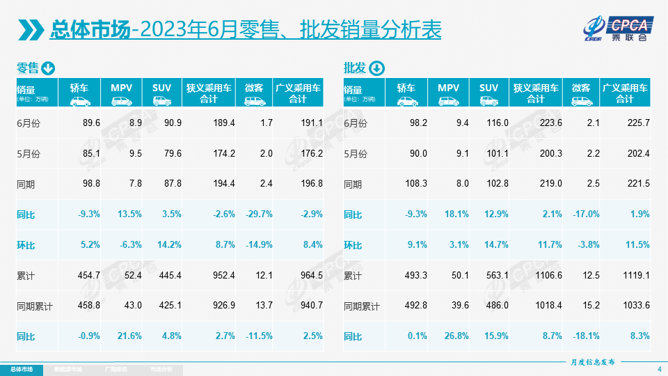

# 乘联会：6月乘用车市场零售189.4万辆 同比下降2.6％

**6月乘用车市场零售189.4万辆 同比下降2.6%**

乘联会数据显示，2023年6月乘用车市场零售达到189.4万辆，同比下降2.6%，环比增长8.7%。今年1-6月零售持续环比增长，这是本世纪以来从未出现过的逐月环比增长的走势，今年1-6月累计零售952.4万辆，同比增长2.7%。

**6月新能源车市场零售66.5万辆 同比增长25.2%**

数据显示，6月新能源乘用车批发销量达到76.1万辆，同比增长33.4%，环比增长12.1%。今年1-6月累计批发354.4万辆，同比增长43.7%。6月新能源车市场零售66.5万辆，同比增长25.2%，环比增长14.7%。今年以来累计零售308.6万辆，同比增长37.3%。

**6月新能源车国内零售渗透率35.1% 较去年同期提升7.8个百分点**

乘联会数据显示，6月新能源车国内零售渗透率35.1%，较去年同期27.3%的渗透率提升7.8个百分点。6月，自主品牌中的新能源车渗透率58.8%；豪华车中的新能源车渗透率30.9%；而主流合资品牌中的新能源车渗透率仅有3.7%。

**6月乘用车出口29万辆 同比增长56%**

乘联会统计口径下的6月乘用车出口（含整车与CKD）29万辆，同比增长56%，环比下降4%。1-6月乘用车出口168万辆，同比增长92%。6月新能源乘用车出口7.0万辆，同比增长185.3%，环比下降27.8%，占乘用车出口24%；其中纯电动占比新能源出口的89%，A0+A00级纯电动出口占新能源出口的56%。6月厂商出口方面，上汽乘用车20,645辆、特斯拉中国19,468辆、比亚迪汽车10,536辆。

**中国乘用车的7月出口仍会保持强势增长**

近期人民币汇率变化有利于出口，由此判断中国乘用车的7月出口仍会保持强势增长，推动7月总体乘用车的国内外总量继续保持较好增长。

**今年7月车市如出现负增长应该是正常现象**

乘联会分析指出，去年6月1日开始实施车购税减半政策，因此政策启动期叠加去年3-6月的购买延迟因素共振，导致去年7月的超高基数，不利于今年7月车市同比增速的表现，今年7月如出现负增长应该是正常现象。随着7月车市进入国六B的延展实施期，上月老库存零售的虹吸效应或将引导本月车市产销相对稳定阶段，上半年促销价格的快速拉升已经结束，7月开始进入平缓促销增长期，这与2019年的价格走势相似，促销对车市的拉动减弱。

