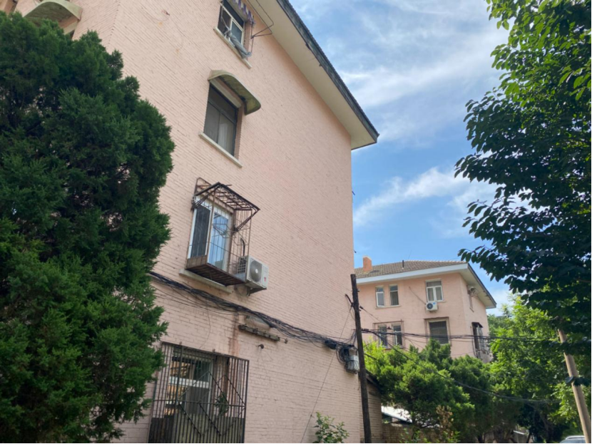
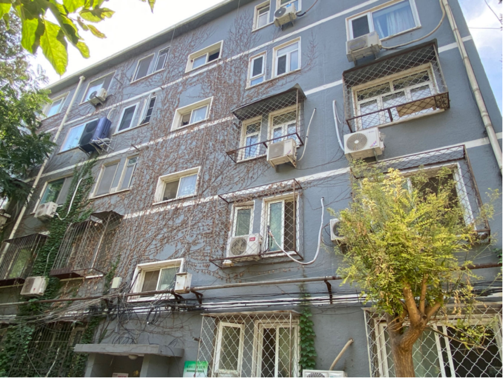
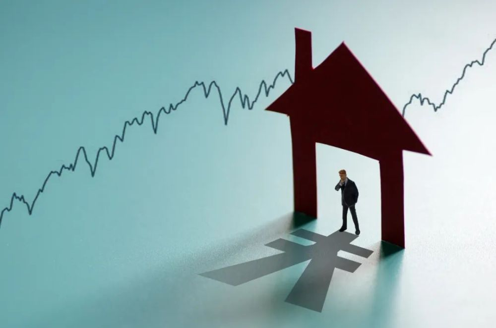

# 北京二手房调查：中介“逼我”降价200万卖房

全文共3584字，阅读大约需要8分钟

_“200万的降价幅度是否合理，降了就真能卖出去吗？”当徐雯把自己的疑问抛给中介的时候，得到的回答竟然是“我也没有信心”。_

记者丨王寅浩

北京二手房市场的降温，正在引发连锁反应。

根据北京市住建委官网数据统计，自今年4月起，北京二手房市场成交量已连续三个月下跌，另据机构数据，截至6月底，北京二手房挂牌量已高达近19万套。三个月以来市场的“活跃度不高”，让买卖双方之间的“堰塞湖”逐步形成：一方面，部分千万级别的房源开始被中介通知“降价200才有信心卖掉”；另一方面，卖房的不顺畅，直接影响到置换的第二步，部分刚改新房项目已经开始收到“因卖不掉二手房”为理由退掉的预定。

尽管目前仍是个例，但二手房交易不畅带来的“堰塞湖”仍然成为各大操盘手不得不关注的重点，甚至有项目给出了明确要求，“要了解清楚购房者卖房的品质，提前做出判断”。

**“中介让降200万接受不了”**

在被要求从1250万元降到1050万元未果后，徐雯感觉自己已经被房子挂牌的中介放弃了。

徐雯的房子位于北京市东城区鼓楼外大街，属于回迁房小区里面积比较大、户型比较好的两居室，近90平方米的面积，别说是一家三口，带个老人住也绰绰有余。

由于紧邻西城的德胜片区，过去徐雯家的户型一直是那些在德胜买个小房子占坑、出区买个大点的自住家庭的首选。“我在这住了5、6年了，之前这个小区跟我们家同户型的基本靠抢，现在有三套挂着，装修标准虽各有不同，但带看都没有。”

徐雯挂牌赶上了本轮北京二手房“小阳春”的尾巴。“2月挂牌的时候，小区内三套一起挂的，户型一样，但我们家楼层最好、装修最好，还不临街，当时中介给的正常评估价是1150万元。”由于徐雯是两年前刚刚花了50多万元装修的，考虑到她的接受程度，和当时的市场状况，中介也同意1250万元的报价。其余两套同户型的，一套因着急出售，直接报价1099万元，另外一套则报价1170万元。

“据我所知，那两套也都没成交，直接下架了。”徐雯上一次接到中介的电话，同样被要求挂牌价直接降到1050万元，否则没办法安排带看。

“我换房是因为通勤有点远，就想平行置换，我知道现在市场不好，但200万的降价幅度是否合理，降了就真能卖出去吗？毕竟我想换的小区也没这么大幅度降价。”当徐雯把自己的疑问抛给中介的时候，得到的回答竟然是“我也没有信心”。为此，徐雯与挂牌的中介沟通，把房子下架。

**“买卖双方内心的‘堰塞湖’已经形成”**

对于徐雯提到的“无厘头降价”，房源所在的中介门店却并不认可。

“她的房子2月挂牌的时候，就比我们测算的均价高出100万元，当时其实我们提示过比较高，但因为她确实刚装修了两年，考虑到使劲说可能产生逆反，加之当时的市场确实看上去高歌猛进，我们就同意高挂。”在门店店长看来，3月后的市场急转直下，三套稀缺房源均未能卖出，除了1099万元有自己特殊情况外，1150万元的带看也并不多，加之装修成本并不是购房者最看中的，1050万元的最新报价是门店根据市场、小区成交均价给出的建议，如果接受不了，门店也觉得暂时下架是个比较好的选择。

“北京二手房网签量这两个月回到1.2万套左右水平，这基本是符合预期的，属于常态化水平。”在诸葛数据研究中心高级分析师陈霄看来，成交数据上其实并不支撑“堰塞湖”结论，但挂牌量确实一路猛增，目前不算上法拍等特殊房源，北京二手房的挂牌量在19万左右。

但北京链家研究院院长高原分析，挂牌量与市场形势关联较为复杂，并非简单的“房子多了不好卖”或“房子少了不够卖”的直观感受。这一指标为机构或企业的单一过程性经营指标，具有较大的供需弹性。从历史数据回顾来看，挂牌量涨落和当时市场形势并无显著关系。例如2020年2月疫情伊始，市场销售情况较差的同时，挂牌量水平同样不高。而2021年上半年市场销售相对较好时期，挂牌量也处于相对较高水平。

另有业内资深分析师告诉北京商报记者，要定义当前北京二手房市场是否形成“堰塞湖”，最简单的就是看政策力度，如果真的坏到一定程度，那么相应的帮扶政策早就出来了，当前市场更多是受到情绪、预期等因素的影响。

一如徐雯房源挂牌门店店长说的那样：“现在的‘堰塞湖’，更多的是买卖双方内心里的‘堰塞湖’”，“卖的不甘心降价，买的觉得市场还会降”，叠加支持政策的不充分，对峙就此形成。

**“两个退订都是因为卖不掉二手房”**

内心里的“堰塞湖”是否会引发持续性新房与二手房之间的“恶性”链条传导？

陈霄指出，目前尚需进一步观察，但影响肯定是有的。

“6月底，我们退了两套预定的房源，理由都是手里的二手房卖不出去。”董佳是某头部央企石景山刚改项目的操盘手，正常情况下一个项目有几套房子退订是正常的，但因为目前北京二手房市场的状况，和自己操盘项目的准业主八成来自置换，他和团队对这轮退订是一个开始，还是偶发，心中没底。

董佳的担忧主要来自这波二手房的成交波浪。“今年高峰期在2月，3月开始断崖式下降，虽然现在的数据还不错，但二手房不好卖是大家都知道的，二手房如果跌到荣枯线三个月，新房势必受到影响。”作为一个总价在800万-1200万元区间的改善型项目，董佳的项目客户适配集中，置换需求占了绝大部分，拿地又不早不晚，没有早价格优势，也没有晚政策优势，董佳深知自己不是那“能挑客户”的。

即便如此，“置换房源的品质”成了董佳给一线销售设定的“必须要了解”的KPI，用他的话说要“及时了解二手房这个‘堰塞湖’的动态”。“再难的市场也可以卖房子，但我们是央企，我们等不了，退订非常麻烦，如果客户需要置换的房子我们评估置换周期在半年以上，那么就建议他再考虑一下。”

董佳的担忧不无道理，新房市场和二手房市场本就一体两面，具备相互传导的关系。连续几个月的低位运行，巨大的二手房挂牌量如同一个持续膨胀的“堰塞湖”，对尚处于恢复期的新房市场也带来冲击。虽然当前还是部分个案，但市场最怕的就是持续性。

**谁来疏导“堰塞湖”**

当前北京二手房“堰塞湖”淤积的症结，有销售不畅因素，也有供需之间的不平衡因素。

据麦田统计，在目前北京挂牌房源中，每两套在售房源，就有一套是房龄超过20年的老房子，且从去年底开始，房龄10年以内的次新房源占比减少明显。

陈涛就是那个卖了“70年代老破小后”，买不到合适的房子的人。

在三次降价92万元后，陈涛终于卖掉了自己位于北京市东城区地坛北里的两居室，819万元的成交价，比同小区上一套成交的同户型、同面积、同楼层房源，低了31万元，当时还是2021年的6月。

陈涛是典型的老北京，房子是母亲单位分的，作为婚房精装修后送给了陈涛。“我妈也在这个小区，周边也有丰富的教育资源，但我们不准备要孩子，守着个老破小太难受了。”
由于父母同一单位，在那个年代，每个人都可以分一套同户型房子，陈涛选择卖掉自己这套一层的两居室，母亲继续留在这个小区。

二环边上、公园对面，守着医院、地铁、菜市场，又花了40多万元精装修，更和亲人保持了一碗汤的距离，陈涛卖房的事被老邻居们各种不理解。

面积小、功能不合理、停车不方便、没有物业……作为典型的“90后”，陈涛和媳妇起初也想“关起门来忽略老破小”，但住了几年后发现忽略不了。“我们是一楼，70年代老破小的一楼就不用多说了，这个小区还有个特殊情况，全单元的水闸就在我们家小院，谁家跑水、装修都得敲门进来关水，什么倒灌、蟑螂就更别提了。”加上三年疫情，封闭那段时间居委会虽尽职尽责，但也没法跟住在新小区的同学相比，于是卖掉老破小，换个好物业的现代化小区，成了陈涛夫妻的执念。

“但我们没想到市场‘掉下来’会这么快。”原本打算有了目标房源后，再卖掉手里这套。“好学区、好配套，怎么都好卖”的预期与5月挂牌以来被市场的“毒打”，让陈涛慌了。“我就想赶紧卖了，都没心思看新房子了，我怕越往后越起不来。”

尽管最终在一次次价格的让步后，陈涛成功完成置换第一步，819万元的价格却让他有点尴尬：原本的计划新房1000万元预算，卖掉这个两边老人再支援一下，自己的积蓄装修，现在卖房款与心理价位差的有点多，是进一步“啃老”，还是把置换需求缩水，陈涛还没想好。“现在这个市场看不太明白，就怕卖在低点，买在高点。”

对于陈涛的这种担心，地产分析师严跃进认为符合绝大部分置换需求消费者的心态。“当前影响房地产市场的核心是大环境出现波动，所以仅仅依靠市场调节，短期内无法取得预期效果。”
严跃进建议，应该在“房住不炒”的基础上，尽快建立起符合地方市场健康运行的长效机制，量大则疏、量小则稳。后续既要在行政、金融和财政等方面落实见效快的政策，也要积极关注一二手房联动的问题。眼前要朝着“盘活二手房、鼓励置换新房”的角度进行。只有这样，才能防范市场进一步降温，并促进房地产交易市场的通畅和健康发展。

编辑丨汪乃馨

图片丨北京商报、视觉中国、壹图网

