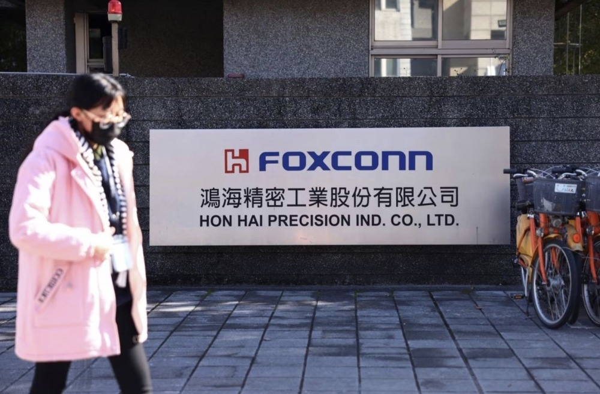

# 富士康宣布退出印度半导体合资公司，莫迪的百亿芯片梦遭遇重大打击

腾讯科技讯
7月10日，据外媒报道，富士康周一宣布，退出与印度金属石油集团韦丹塔（Vedanta）的195亿美元半导体合资计划，这对印度总理莫迪的印度芯片制造计划无疑是一个挫折。

去年，全球最大的代工电子制造商富士康和韦丹塔签署了一项协议，计划在莫迪的家乡古吉拉特邦建立半导体和显示器生产工厂。

“富士康已决定不与韦丹塔合作进行合资企业，”富士康在一份声明中表示，没有详细说明原因。

富士康表示，它已经与韦丹塔合作超过一年，将“伟大的半导体想法变为现实”，但他们已经共同决定结束此次合作，并将其名称从现在完全由韦丹塔拥有的实体中删除。

莫迪将芯片制造作为印度经济战略的重中之重，以追求电子制造业的“新时代”，而富士康的这一举动对他吸引外国投资者首次在印度本地制造芯片的雄心壮志构成了打击。

韦丹塔没有立即回复置评请求。

富士康最著名的业务是组装iPhone和其他苹果产品，但近年来，它一直在扩大芯片业务以实现业务多元化。

此前有报道称，莫迪的计划陷入了困境，韦丹塔-富士康项目进展缓慢，因为他们与欧洲芯片制造商意法半导体的合作谈判陷入僵局。

韦丹塔-富士康已经让意法半导体加入了技术许可，但印度政府明确表示希望欧洲公司在合作伙伴关系中拥有更多“利益”，例如持有合资公司的股份。

意法半导体对此不太感兴趣，谈判仍然处于僵局状态，一位消息人士此前曾表示。

印度预计其半导体市场到2026年将达到630亿美元。莫迪的100亿美元激励计划，去年吸引了三份建厂申请。除了富士康，还包括全球联合体ISMC（拥有Tower半导体作为技术合作伙伴），以及总部位于新加坡的IGSS
Ventures。其中，30亿美元的ISMC项目也因Tower被英特尔收购而遇阻。IGSS的30亿美元计划也被暂停，因为该公司想要重新提交申请。

审校：小北

