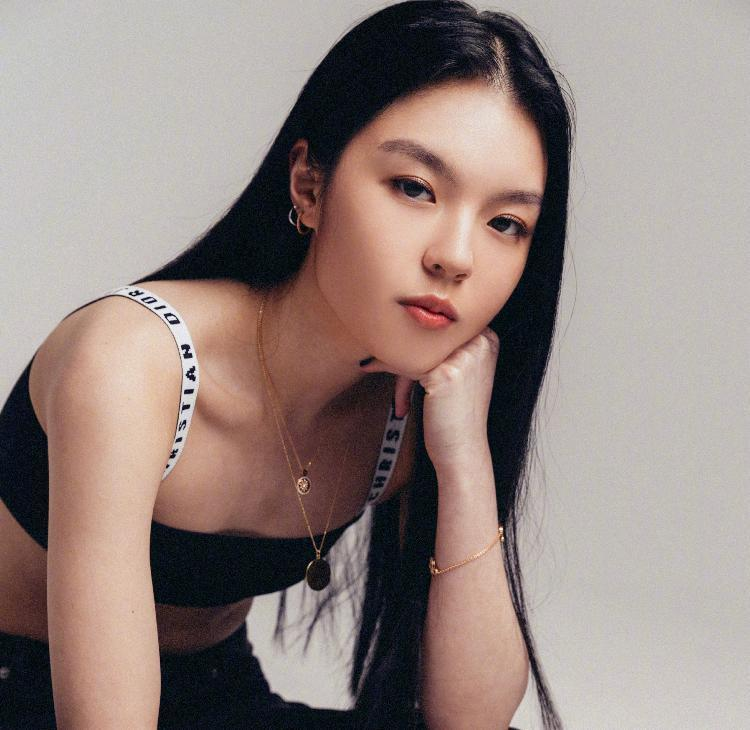
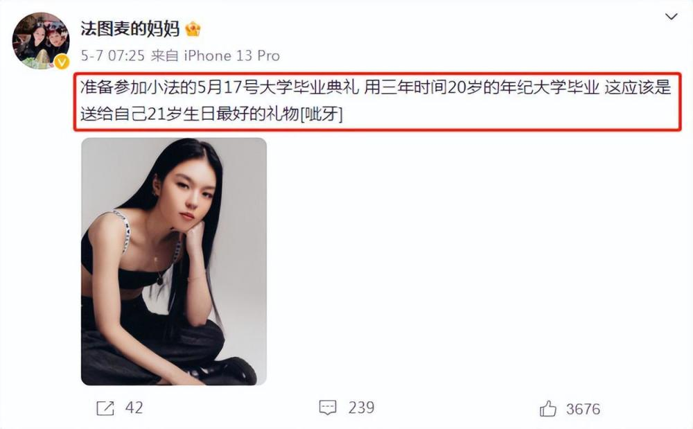
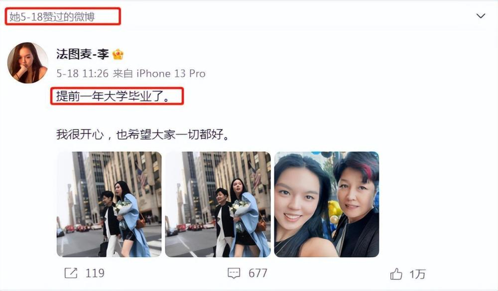
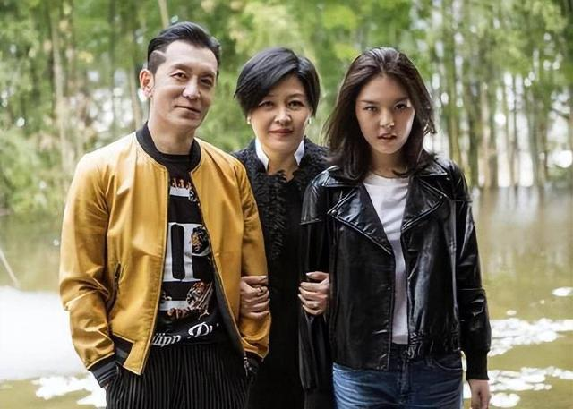

# 已故主持人李咏女儿签约经纪公司，精通五国语言以演员身份出道

7月10日，有业内人士晒出已故主持人李咏女儿法图麦·李的写真照片，并配文“欢迎我司新人演员——法图麦·李”，宣布其将作为演员出道的消息。

据公开信息显示，法图麦·李出生于2002年5月20日，身高170cm，体重48kg，毕业于美国哥伦比亚大学，在资料的语言一栏，除了普通话外，还写着英语、法语、日语、韩语等外语语种，此外她还擅长钢琴、芭蕾、写作。让网友叹服：“真不愧是哥伦比亚大学的高材生。”

随后，有网友发现，法图麦·李的百度百科也已经将其简介改为“中国内地女演员”。据悉，其实早在2016年的时候，法图麦·李就曾担任过编剧的工作，此番进军演艺圈，也并不是陌生的环境。

今年5月7日，法图麦·李的母亲哈文也微博发文透露女儿大学毕业的好消息，并表示这是“女儿送给自己21岁生日最好的礼物。”同月的18日，法图麦·李自己也发文称，自己是提前一年大学毕业，并直言自己很开心。

看到法图麦·李以演员身份出道的消息后，网友们也纷纷表示期待：“是很优秀的孩子，希望有美好的演艺事业！”“五官很立体，已经有明星范儿了！”

法图麦·李的父亲李咏，是中国内地知名主持人，在央视主持过《幸运52》《非常6+1》《咏乐汇》等热门节目，2018年10月，李咏因癌症在美国去世。

法图麦·李的母亲哈文，是中国内地知名女导演、编剧、制片人，2013年和2015年，都曾担任中央电视台春节联欢晚会的总导演。

潇湘晨报记者周诗浩

