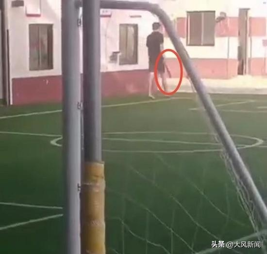
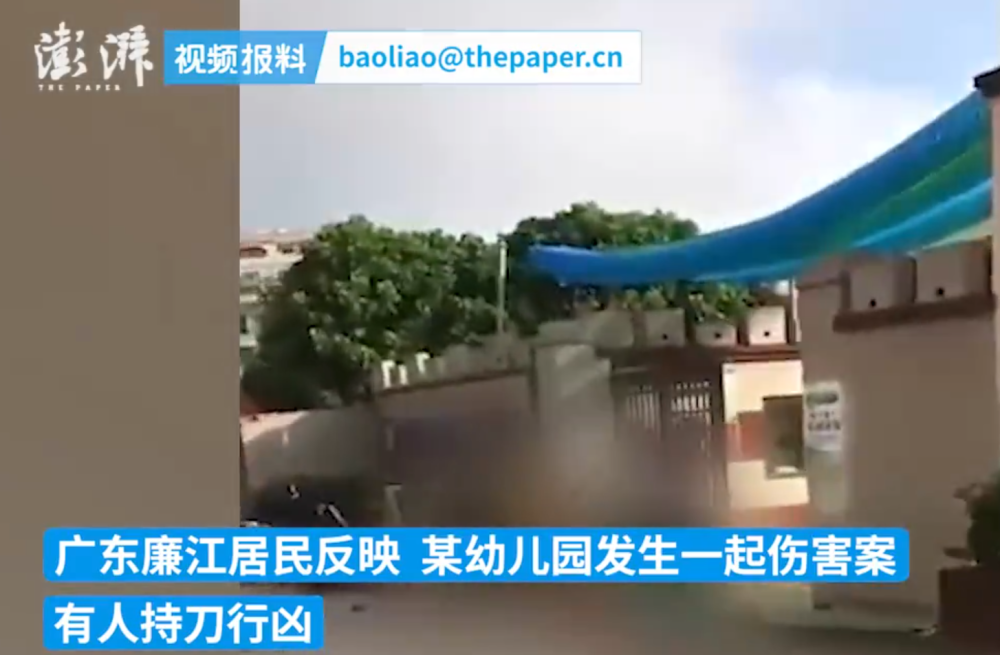
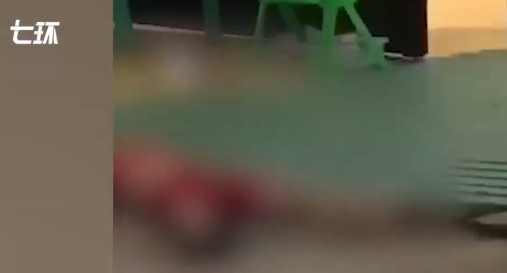

# 广东廉江男子幼儿园行凶致6死1伤 知情人：疑因车祸赔偿纠纷报复行凶

据华商报大风新闻报道，7月10日，广东廉一25岁男子持刀在某幼儿园行凶，致6死1伤，引起广泛关注。

网传视频显示，涉事幼儿园门外，至少有4人倒在血泊中，其中有孩子和大人，有电瓶车被推倒，有人目击者称，“太惨了，赶紧报警！”

7月10日上午，一名爆料人告诉记者，事发10日早晨，“现在是说死伤者中，其中一名死者开车撞了他家的小孩，然后一直没有赔偿，由此产生了纠纷，所以才发生这个事（砍人）。”

该爆料人表示，凶手疑似报复行凶。“可能赔偿一直没下来，或者是双方没协商妥。”

10日上午，记者联系了廉江市教育局，工作人员答复称：“现在是多个部门在联合调查。”

记者询问死者中有一名幼儿园老师，是否幼儿园尚未放暑假，工作人员表示：“具体情况还在调查当中，还没有收到反馈的消息。”

10日上午，记者联系廉江市公安局横山派出所，民警回应称不便透露案情。

对于，前述爆料人所说车祸赔偿纠纷起因，暂未得到廉江当地权威部门证实。

另据东方网·纵相视频报道，网传遇害者包括1名老师、2名家长以及3名学生。

对此，广东廉江市宣传部工作人员回应称，事发今日上午，案发后公安机关已介入调查，案件起因及6名遇害者的身份还在调查核实中。

**此前报道：**

据澎湃新闻报道，7月10日，广东廉江居民反映，有人持刀在某幼儿园行凶，引起广泛关注。

_视频显示，幼儿园门口有多人受伤倒地。_

横山镇相关部门人员回应，事发于今日上午，已抓获嫌疑人。廉江市教育局人员表示，已介入处理。7月10日，廉江市公安局发布通报称，致6人死亡、1人受伤，犯罪嫌疑人已被抓获。

通报全文：

7月10日7时40分许，廉江市横山镇发生一起故意伤害案，致6人死亡、1人受伤。当日8时许，警方将犯罪嫌疑人吴某杰（男，25岁，廉江市人）抓获归案。目前，案件正在加紧侦办中。

**【来源：九派新闻综合华商网大风新闻、东方网·纵相视频、平安廉江、澎湃新闻】**

