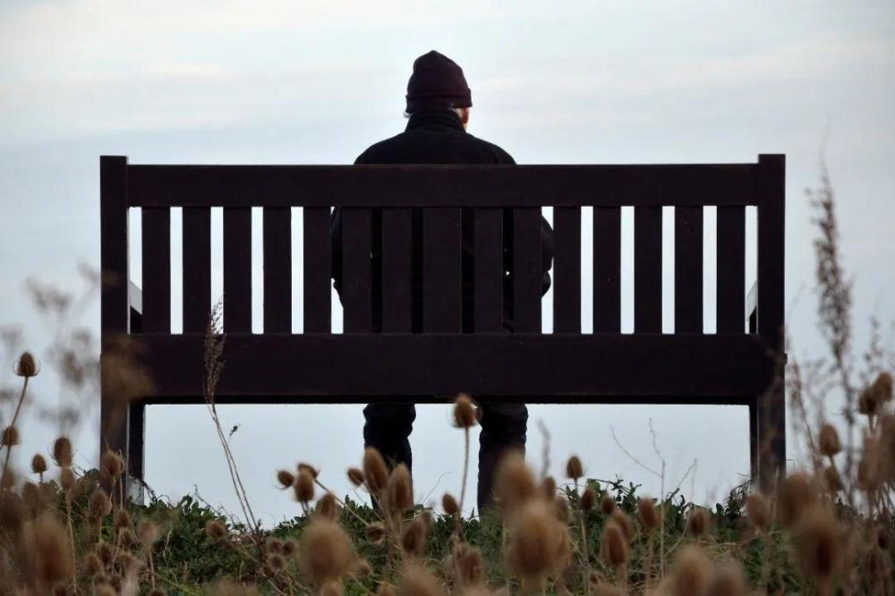

# 我的父母，没有退休金

**钱的问题始终是核心。退休金也是家庭收入的一部分，多一份来源，家庭大小事，便有更多的讨论空间，反之，少了这份托底，如随水浮萍，只能跟着子女的轨迹漂浮。**

**文 |** 李清扬 石震方

**编辑 |** 金匝

**运营 |** 栗子

**一个求助**

给母亲徐丽发出那条“求助”短信前，王昭雨已经犹豫了两个月。

她36岁，生活在北京，有一个年幼的女儿。和许多典型的中年夫妻一样，她和丈夫是双职工，更依赖于两边的父母帮忙看孩子。婆婆已经来了北京近两年，看得出人越来越疲累，而王昭雨也需要喘息的机会，她迫切地渴望母亲徐丽的到来。

徐丽今年55岁了，在小城一个企业的食堂工作，负责员工们的一日三餐。每一天的节奏都是紧张的，从早晨五点多开始忙碌，到晚上六七点才能落灯收工。十几个人的饭菜，分量大，锅碗瓢盆都是特大号，有时候“连拿起大锅铲在锅里炒菜的力气都没有”。

但徐丽对此依然感到满意。她做的食物常被员工称赞，这让她觉得自己被需要、有价值。但更重要的是，这是份“正规工作”，虽然是企业编外人员，但签了合同，会严格缴纳医疗、养老保险，持续工作到60岁后，还能领到一份不错的退休金。

王昭雨明白，对母亲来说，退休后有一笔养老的钱，是不依赖子女的一种方式，晚年生活的一重保障；可一旦母亲来北京，就意味着她得辞掉手里的这份工作，没了收入，也断了养老保险的缴纳。

最终，在一个和婆婆闹过矛盾的夜里，王昭雨还是狠下心，向徐丽发出了那条微信：“你能来帮帮我吗？养老保险我来给你交。”

徐丽生活的小城，正常缴纳养老保险，按时退休的话，她的退休金是每个月1000元左右，后边可能会有增长，但对许多生活在农村的老人来说，每个月只有两三百元的新农保（新型农村社会养老保险），没有退休金，因此，拥有一份工作，一份可以给予收入、提供更多未来养老保障的工作，是很重要的。

如歌第一次发现母亲背着他们兄妹三人偷偷出去工作，是在视频聊天的时候——她看到母亲穿了一件橙色的反光马甲。

面对如歌带着恼怒的质问，母亲用故意轻松的口吻答道：“我来当清洁工，很轻松的，散个步就把钱赚了。”

这份母亲口中很轻松的工作，是在村口通往城镇的高速路上扫地，每天花费几个小时，拿着扫帚和垃圾篓，沿着道路清理一遍，一个月的收入是1000元。

如歌特别生气，“高速路上车来车往的，多危险？”她故意把话说得难听，跟母亲算了一笔账：“你要是出了什么状况，现在挣 1000 块，可能我给你治病要 2000
块，倒贴1000 块，哪个划算？”那头的母亲沉默了。

小时候，如歌的父亲做煤炭生意失败，一家人从河南来到广东谋生。为了抚养三个孩子，母亲白天在工厂打工，加班到晚上十点，凌晨三四点又爬起来张罗早餐摊，一天只睡三个小时。早餐收了摊，母亲还会推着三轮车，捡路边废弃的瓶子。

在如歌的记忆里，母亲“像铁人一样”，什么苦都吃了，最苦的时候，家里连买袋盐的钱都凑不出来。工作之后，如歌和哥哥每年都会各自给父母一两万，这笔钱覆盖农村的生活成本并不成问题。她反对母亲出去工作，希望她安度晚年，但母亲对于日后的养老生活，始终有自己的考虑。

_▲ 图 / 视觉中国_

**没了底气**

最终，徐丽没有犹疑，从老家赶来了北京。但在她来之后的这两个月里，女儿王昭雨发现了一个奇怪的现象：徐丽几乎从来不和同小区的老太太们一起结伴出去玩。

这对母女住在北五环外的一个次新小区，周围的老太太们，基本都是从老家来帮子女带孙辈的，孩子们早晨7点多去上社区幼儿园，直到下午5点放学前，时间都是属于自己的。有些老太太们会相约着集体出行，换上统一的衣服，披着颜色相同的纱巾，每周去不同的景点游玩、拍照和聚餐，发在朋友圈里或抖音上。

那些照片里从来没有徐丽。

王昭雨有次问她，为什么不一起去？母亲的答案让她有些出乎意料：费钱。买衣服、吃饭、门票，这一天的行程下来，可能就得花出去几百块，母亲有些舍不得。王昭雨有点心酸，她确实没考虑过这一点。她安慰母亲，“钱我来出，你放心去玩”，但母亲紧接着摇了摇头：“那些出去玩的老太太们，都是有足够的退休金的。”

徐丽所说的老太太们，大多来自东北的城市，比如哈尔滨、沈阳，那里工业化进程开始得早，程度也更高，她们年轻时多在一些厂矿、企业工作，养老保险缴纳充足，现在退休了，每个月能够拿到四五千元的退休金。

就在那一刻，王昭雨突然发现了一个让她难过的事实：有没有退休金，正在成为划分老人群体的一项“标准”。

在小区里，没有退休金的老人们，一般在公共活动空间消磨时间，斗地主、打麻将，“一分钱不花，就是自娱自乐”，也有在小区当保安、捡废品、磨剪刀，来赚钱补贴家用的；而有退休金的老人，活动要丰富得多，旅行、上老年大学，“花起钱来是很有底气的”——母亲没有这份底气。

在王昭雨的记忆中，母亲徐丽这一生称得上坎坷，开过卖窗帘的小店，打过各种各样的零工，一直没有一份正式的工作，直到进入这家企业，生活才算有了着落。到了晚年，还要因为女儿的需要再放弃自己的退休金，想到这一点，王昭雨心里就非常愧疚：“是我让她的生活没了底气。”

这种现象并不少见。同样是在深圳，30岁的娅慧，也是需要老人帮忙带孩子的双职工家庭。娅慧总听没有退休金的婆婆说，同样是帮孩子带孙辈，小区里有养老金的父母，如果感觉自身身体不行，可以用退休金雇保姆，帮衬孩子的小家。“他们不需要向孩子伸手，不需要看孩子脸色，摩擦也会少很多。”

某种程度上，有没有退休金，甚至会改变一个家庭的权力结构。

娅慧的朋友彭广，给她讲过自己的故事：彭广是家里的老幺，他的父亲年近70岁，已经没有了赚钱的能力，母亲之前在广州当月嫂，年龄上去之后，也被家政公司清退，丢了工作。彭广父亲年轻时是一个脾气暴躁、刚烈、不顾家的人，现在指望着儿子养老，“像变了一个性格”，顺从、讨好，每天变着花样给儿子做饭、煲汤。彭广从来没想到，“爸爸有一天会是这个样子”。

钱的问题始终是核心。退休金也是家庭收入的一部分，多一份来源，家庭大小事，便有更多的讨论空间，反之，少了这份托底，如随水浮萍，跟着子女的轨迹漂浮。

_▲
图 / 视觉中国_

**没有停歇**

北京大学国家发展研究院的教授赵耀辉，从2007年开始主持“中国健康与养老追踪调查”，他的研究指出，2009年新农保实施后，绝大多数农村户口的人进入了社保体系，到了60岁之后开始领取养老金，但这笔钱数量太少，依据前期缴纳的钱而定，每月最低拿到100元左右，最高的话能拿到800到1300元，难以真的用来生存。

项目的调查数据也显示，为了弥补养老金的不足，即使是70岁以上的农村户籍老年人，就业率仍然超过了50%。为了生活，他们对于打工非常积极，“只要干得动都会干”，像无脚鸟，没有停歇的一天。

如歌的母亲就是如此。在女儿的劝说下，她辞掉了高速路上扫地的活儿，但没过多久，又在一家玩具厂找了工作。

她所在的村子里，散布着各种各样的制造业工厂，从玩具到服装再到泡菜，以当地廉价的农村劳动力为依托，制成产品输往海外。如歌过年回家时，母亲骑电动车带她上街溜达，几十家工厂像棋盒一样伏在马路两边，让她想起小时候在广东看过的产业集聚区，那些看起来像两层楼高的建筑，其实是架空了的几米高的厂房，母亲在那些工厂里度过了很多年。

2008年，受全球金融危机波及，广东的许多工厂倒闭，父母从广东来到了北京谋生。那时候，如歌在老家上学，母亲在北京做过育儿嫂、保姆、超市的拣货员。到了2018年，父亲被查出患上尿毒症，要靠一周三次的透析为生，父母才不得不迁回老家。

母亲一边照顾父亲，一边带着小孙子。孙子上了幼儿园，母亲就开始找活儿干。玩具厂按时薪计，站着工作，每天8小时，时刻有人督工，做得慢了会被批评，是体力和精神的双重消耗。如歌再次向母亲发了火，“我知道是要站着工作时惊呆了，坚决地要她辞职”。

对于出门工作，母亲总有各种理由——一会儿是“我在家里快憋死了”，一会是“工长给我打电话说赶货，我帮帮忙”，一会是“跟小姐妹在那坐着聊聊天挺好的，干多干少无所谓，不求挣钱，求个乐呵”。出去的次数多了，小侄子甚至会向如歌“告状”：“姑姑，奶奶又出去工作了。”

最近半年，母亲又去了一家工作时间相对自由的服装厂，按件计薪，负责衣服的点位和上扣。母亲告诉如歌，周围的工友都是年龄相近的姐妹，空闲时，她们会一起拍个小视频放松。但实际上，厂里的工作结束，母亲回家还要洗衣做饭。长久劳作让她患上了腱鞘炎，手腕上鼓出一个大包，“她总时不时地用另一只手揉，把包揉下去才能好受点”。

_▲
如歌母亲工作的服装厂。图 / 受访者提供_

林琳父亲面临的状况也极为相似。他今年62岁，对找工作来说，这是一个尴尬的年纪。

过去两年，父亲在内蒙的一家矿场负责看守机器，包吃包住，后来上头频繁检查，矿上开始裁人，过了60岁的父亲第一批被裁掉了。回到河北农村生活后，对父亲来说，找到工作，成为他心头最记挂的事。

为了有份工作，父亲百般托人打听，好不容易听说北京西三旗附近有份垃圾分类的活儿，立刻收拾了三个包裹的行李，兴冲冲地赶来。工作的环境完全不能算好，住在地下室，食堂建在垃圾站附近，夏日灼热，每天得忍耐高温进行垃圾分类，还要拍照上传，过程繁琐。上岗的第二天，一场突发的肠梗阻，让父亲进了医院。

父亲在急诊病房住了三天。他嘴角起了溃疡，躺在病床上，时常对着墙壁，不发一言。母亲打来电话，父亲头一句就是：“我又让你失望了。”疾病突发时，父亲不敢直接告诉林琳，就连来北京这件事，也是等工作确定了之后才告诉女儿。他小心翼翼，不想添麻烦，但疾病轻易地打碎了他努力维持的局面。“他觉得耽误我上班，又花了我的钱，很没面子，也很内疚。”林琳理解父亲的心情。

过去，父亲是家里的经济支柱，在矿场工作了十几年，养活了一家人。从林琳记事起，父亲每个月都有收入，被裁掉之后，回家给人打零工，种花生、捡垃圾、摘樱桃，一刻闲不下来——直到60岁。

工作越来越难找，年初，父亲甚至特意去染了头发，为了显得人精神、年轻，但年龄就像一把标尺一样卡住了他，打零工被拒的他灰心地回来，嘟囔道：“我62岁也不算大，为什么不要我？”

王昭雨知道，母亲面对的也是相同的事实，一旦徐丽离开了之前的岗位，就很难再回去了。年龄像一把筛子，随着数字往上，可从事的岗位就越来越少。徐丽之前做过超市的理货员，比食堂的工作累得多，但她现在也会担心，再往后，“可能连这种工作都找不到了”。

在许多故事里，父母年轻时从农村奋斗进入城市，子女在城市扎根，父母一代的养老，由退休金和子女共同托底。若把目光移回农村，在许多地方，父母没有退休金，可能连这份托底也没有。

王忠兴今年53岁，成长在湖南农村，20岁便离开家乡，四处打工。早些年，他在江苏学习了污水处理的技术，凭着这身本领，他追着更好的薪酬，去过山东，跑过河南，最后落脚河北，一驻就是十七年。工作的地点在远离市区的农村，每天去市区的车只有几班，每天工作八小时，一个月只休4天。他几乎从不娱乐消费，一个月9000元的薪酬，一年下来近十万元，一边要赡养农村的父母，一边要供三个子女读书。

9000元里，是不包括养老保险的，“哪有这些东西，你愿意干就干，不干有人干。”

养老金这个概念对他来说，没有多少意义。他知道交了养老保险，老了能有保障，但他心有余力不足，“现在三个孩子，顾生活都顾不上来，哪有这个闲钱？”

赵耀辉的研究里，这是一群特殊的人。社保体制因地区分割，导致流动性强的人缴纳社保的动力不足。而工资的28%上交，其中20%进入统筹系统，8%进入个人账户，当农民工选择更换地方，意味着曾经上交的大部分社保留给了当地。与其缴纳社保，他们宁肯把钱全部归为自己。这进一步导致，当这部分人年老，仍然无法拥有可以托底的养老保险体系。

_▲
日本人口老龄化严重，东京街头随处可见老年工作者。图 / 视觉中国_

**帮扶**

养老金微薄，得为老年生活攒钱，是许多年迈的父母坚持打一份工的原因。但还有一个更隐形的原因，是帮扶孩子的小家庭。

如歌和两个哥哥都背着沉重的房贷，母亲总希望自己能为孩子做点什么。

很多时候，如歌觉得父母找的工作，性价比并不高，但为了孩子，他们总能忍受。母亲在服装厂时，如歌一边给她买止疼药，一边忍不住数落：“身体受罪了，止疼药随便买几盒也是五六百块钱，累死累活的，何必呢？”但母亲的回答一下让她红了眼眶：“我就想减轻一下你们的压力，你看你马上结婚了，我也想攒点钱给你买点家具，给你买几床被子。”

王昭雨并不反对父母出去工作，在她看来，父母是需要“感受到自己是有价值的”。比起不工作，她更希望父母可以做一些“不太累的工作”，然而多数时候，这更像是一个奢侈的愿望。

王昭雨的父亲58岁，去年在老家的一个制药厂谋得了一份司机的工作，负责接送员工。这份工作全年无休，早出晚归，三餐不定。而父亲患有高血脂，最需要注意饮食，生活规律。这次母亲来北京，王昭雨想父亲能一道来，但父亲觉得，趁着还能工作，多攒一点钱。

父亲的户口在农村，也有缴纳新农保，到了60岁，每个月能领到几百元的养老金。而王昭雨还有个小她七岁的弟弟，已婚未育。她明白，父亲现在不愿放下工作，有一部分是在为弟弟在打算。“等弟弟生了小孩，是不是要补贴一些？小家庭能力不够的话，未来生活是不是也要帮助？”孩子成家立业并不是终点，他们总想得更远。

给自己养老，替儿女抚育，是双重枷锁，背在他们身上。

王昭雨每每想到，母亲徐丽现在辞掉工作，来北京帮她带孩子，等弟弟有了孩子，她会像候鸟一样，再去弟弟所在的城市帮他带孩子，就格外难受。“母亲在这个事情里头是没有多少自主权的，只能够跟随子女的状况迁徙，各种变动。”

林琳也有个弟弟，买了房子，还有五六十万的贷款。弟弟的工作是开出租，收入并不高，父母总挂念着帮弟弟填补一些贷款。在林琳的父母看来，让孩子给自己花钱是丢脸的，而给孩子花钱天经地义。

大到看病，小到一顿菜，林琳的父母都不愿让她和弟弟出钱。林琳带父亲看急诊那天，医生跟另外一位病人说“押金先交3万元”，父亲以为是说给他听的，“给他吓坏了，当场就说咱不看了”。而每逢生病，父亲常挂在嘴边的一句话就是，“太花钱了，别给我治了。”

和其他只能从事基础体力劳动的父母不同，娅慧的父亲今年55岁，在深圳经营着一家规模10人左右的制造业小公司，母亲在公司帮忙，两人每月的个人所得在两万上下。自己创业做小老板，时间相对自由，也没有“年龄到了会被裁员”的风险，但娅慧父母的压力仍旧不小——他们想给娅慧的弟弟在深圳买一套房。

娅慧的弟弟小她五岁，刚毕业参加工作，与已经成家立业的姐姐比起来，父母的注意力更多倾斜在弟弟身上。然而，两万的月工资想够一够深圳的首付，着实有些困难，可如果把所有的积蓄都砸在房子里，加上没有充裕的退休金托底，到时候“舍不得吃，舍不得穿”，生活的质量将大打折扣。

父亲有时候开玩笑，要是一家人不在深圳，他们也可以早点退休回农村过田园生活。父亲计划，至少干到60岁，再考虑退休的事情。

_▲ 图 / 视觉中国_

**真的老了**

父亲的工作无法继续，林琳反倒有些庆幸。离开医院之后，她陪父亲回去宿舍收拾行李。在老小区的地下室，很多个小房间挤在一块，像个弯弯曲曲的迷宫，每一个小房间背后，都住着一起打工的夫妻，或是像父亲一样独居的老人。房内潮湿，没有窗户，空气沉闷，林琳觉得压抑，收拾完行李，她赶紧跑出来，呼吸了一口新鲜空气。

林琳知道，要是没有生病，父亲八成会住在这里，继续打工。这次生病，父亲受了很大的打击，他一直不承认自己老了，但这次他说：“不服老不行，不能再逞强了。”

没察觉到父亲正在老去的还有林琳。在她的印象中，从没见过父亲唉声叹气的样子。“他以前状态特别好的时候，没什么事情在他眼里是事儿。”26岁，林琳和当时的男友分手了，这个年龄，在父母所在的农村，是一种压力，母亲愁得不行，父亲却告诉她：“车到山前必有路，别忧虑太远的事，关注当下就行。”

父亲生病后，女儿和父亲的身份掉了个儿，这次送医，父亲需要灌肠，林琳被护士叫进去的时候，“脑子里来不及想什么”，机械性帮父亲脱掉裤子，清洗身体。事后想起来，她自己也觉得惊讶：“以前从没想过，我还可以做到这些事。”

父亲生病，让衰老这件事真真切切地摆在两代人面前，而老去的失意与养老的压力，逼近的不止是父母，还有孩子。

今年过年，娅慧和丈夫回天津老家，她和丈夫的表妹聊天，表妹的父母都是体制内的老师，谈到养老，表妹显得松了一口气：“幸好爸妈有工作，养老不太需要花钱，而且肯定会贴补我们小家。”

对比起来，娅慧和丈夫要难得多。他们都在企业打拼，家里的四个老人，都没有退休金。她形容自己，是“一个没有任何退路的人”，害怕被裁的达摩克里斯之剑时刻悬在头顶，“如果老人们有足够的退休金的话，我的抗风险能力可能会更强一些”。

她打了个比喻，现在的家庭结构是一叶小舟，无风无浪，就能平稳行驶，可一旦风浪出现，没有退休金这样的风帆来抵御，就有倾覆的可能。

而她自己，也在担心未来的养老金问题。与体制内相比，娅慧所在的企业，缴纳的五险一金相对较少，朋友为此拉她一块去买商业保险，为自己的老年生活多上一重保障，但娅慧觉得迷茫，没有行动。“现在很多年轻人都不愿意交五险一金了，我也不知道自己再交几十年之后，通货通胀的情况下，最后到底能拿到多少钱？”

王昭雨不一样，她还是给自己买了份商业养老保险，等她55岁时，每个月能领取2000元左右的养老金。这笔钱，她决定留给母亲徐丽，每个月直接打到她的账户——当作一种“剥夺”她养老金的补偿。

_▲
2023年6月，北京，坐在公园里的老人。图 / 视觉中国_

（应受访者要求，除赵耀辉外，文中人物均为化名）

**文章为每日人物原创，侵权必究。**

