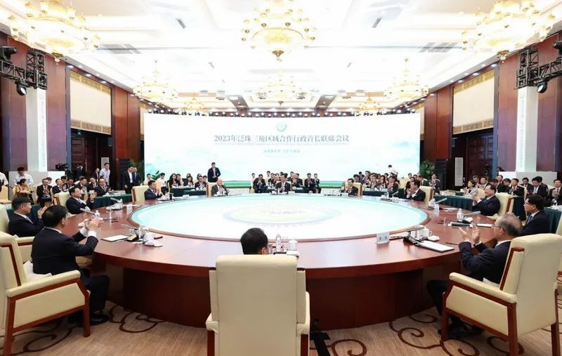
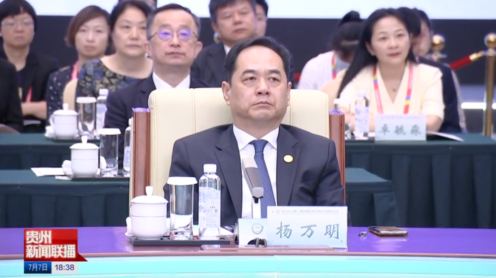

# 新组建的“中字头”机构，首次公开亮相

**撰文 | 董鑫**

据国务院港澳事务办公室官网消息，日前，以“奋进新征程，合作开新局”为主题的2023年泛珠三角区域合作行政首长联席会议在贵州省贵阳市召开，中央港澳办、国务院港澳办副主任杨万明出席会议，中央港澳办等有关负责人等参加会议。

最新一轮党和国家机构改革方案明确，在国务院港澳事务办公室基础上组建中央港澳工作办公室。

3月16日，新华社发布《党和国家机构改革方案》。

在中央机构改革方面，在国务院港澳事务办公室基础上组建中央港澳工作办公室。

根据方案，中央港澳工作办公室承担在贯彻“一国两制”方针、落实中央全面管治权、依法治港治澳、维护国家安全、保障民生福祉、支持港澳融入国家发展大局等方面的调查研究、统筹协调、督促落实职责。

值得注意的是，中央港澳工作办公室是党中央办事机构。

2017年4月，中共中央印发《中国共产党工作机关条例（试行）》，党的工作机关主要包括办公厅（室）、职能部门、办事机构和派出机关。

根据《中国共产党中央委员会工作条例》，按照党中央决策部署和中央委员会总书记指示要求，党中央决策议事协调机构召开会议，研究决定、部署协调相关领域重大工作。

公开报道显示，在中央层面有过多个涉及港澳事务的“中”字头小组。

**中央港澳小组**

据人民网报道，1978年8月12日，中央决定成立港澳小组，以协助中央掌管港澳工作。

**中央港澳工作协调小组**

该小组的历史可以追溯至2003年7月，中央因应当时香港的形势成立，由18个部门组成。

**中央港澳工作领导小组**

2020年首次出现在公开报道中。

中央党校（国家行政学院）副教授张克在接受政知君采访时表示，国务院港澳办自设立以来就是一个机构双重身份，既作为国务院办事机构代表中央政府处理涉及港澳事务，同时也是党中央港澳工作领导机构的办事机构。

组建中央港澳办是港澳工作领导体制的重大变革，有利于加强党中央对港澳工作的集中统一领导，完善中央层面港澳工作的领导体制机制。

此外，机构改革方案还提到，保留国务院港澳事务办公室牌子，不再保留单设的国务院港澳事务办公室。

国务院港澳办官网显示，目前办领导共有5位，分别是：

主任（兼）、党组书记夏宝龙

中央纪委国家监委驻国务院港澳办纪检监察组组长、党组成员施克辉

副主任、党组成员杨万明

副主任、党组成员王灵桂

党组成员向斌

根据今年3月发布的最新一轮党和国家机构改革方案，党中央共新组建了五个机构。

除中央港澳工作办公室之外，其他4个分别是中央金融委员会、中央金融工作委员会、中央科技委员会、中央社会工作部。

目前，中央金融委员会、中央社会工作部、中央港澳工作办公室均已有相关负责人出现在公开报道中，

5月18日，中央金融委员会办公室分管日常工作的副主任王江出席国家金融监督管理总局揭牌仪式。王江此前担任中国光大集团股份公司党委书记。

7月6日，第一批全国性行业协会商会主题教育调研座谈会在中国质量协会召开，中央社会工作部副部长柳拯主持会议并讲话。柳拯此前担任民政部副部长。

7月7日，省部级干部信访工作专题研讨班结业式举行，中央社会工作部部长吴汉圣主持结业式。吴汉圣此前担任中央和国家机关工委分管日常工作的副书记。

**党和国家机构改革方案明确，中央层面的改革任务力争在2023年年底前完成。**

**资料 | 新华社等**

**【版权声明】本文著作权归政知新媒体独家所有，未经授权，不得转载。**

