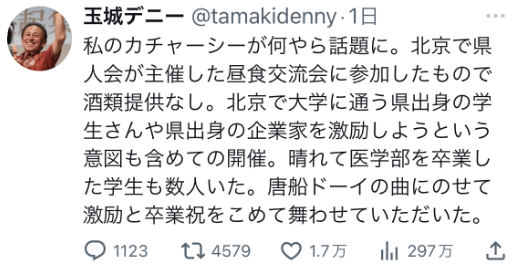
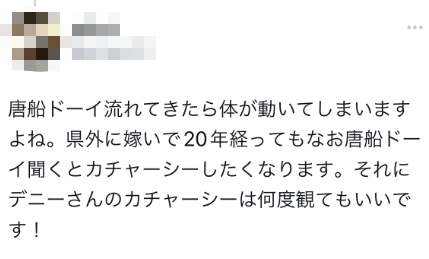
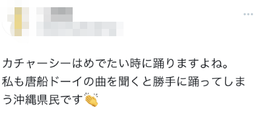
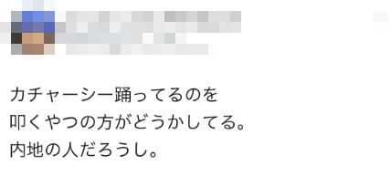

# 日本冲绳县知事在北京宴会上跳民族舞蹈引议论，本人发文澄清

【环球网报道】近日，一段“冲绳县知事玉城丹尼在北京宴会上跳舞”的视频在日本网络上流传，一些网络上的批评者猜测“玉城丹尼喝多了”，并借此对其加以指责。针对此事，玉城丹尼7月8日晚上发推澄清，该宴会并未提供酒精饮料，自己在宴会上跳民族舞蹈是为了鼓励在北京学习或工作的冲绳县学生及企业家。

_一段据称“玉城丹尼在北京宴会上跳舞”的视频近日在日本网络上传播_

针对日本网络上近期的讨论，玉城丹尼称，“看起来我的‘カチャーシー’（编者注：音为kachaashii，一种冲绳当地民族舞蹈，意为手舞）成为议论话题。（涉事视频画面）是我在北京参加由冲绳侨胞团体举办的午餐交流会，当时没有提供酒类”。他补充称，该宴会“旨在激励在北京上大学的冲绳县学生和冲绳县出身的企业家，其中有几名刚毕业的医学部学生，为了鼓励并向他们表达毕业祝贺，我随着唐船ドーイ（编者注：琉球地区民谣，曲名意为看呀，从中国来的船）跳了一段”。

在日本网络上，一些人将玉城丹尼访华以及其在北京跳舞视为“向中国示好”，对此感到不满，不过，也有一些人支持玉城丹尼的交流活动。有网友说，“与眼前的邻国保持良好关系非常重要，我对丹尼先生访华感到高兴。跳得真棒”。

有网友写道，“一听到唐船ドーイ我身体就自然地开始摆动。虽然嫁到县外有20年了，但一听唐船ドーイ还不禁想跳カチャーシー。而且，不管看多少遍，都觉得丹尼先生跳得很好。”

有网友写道，“カチャーシー是有值得庆祝的事情时跳的舞，我也是一听唐船ドーイ就不禁跳起来的冲绳县人”。

有人说道，“指责跳カチャーシー的不知道是怎么想的，估计是‘内地人’”。

