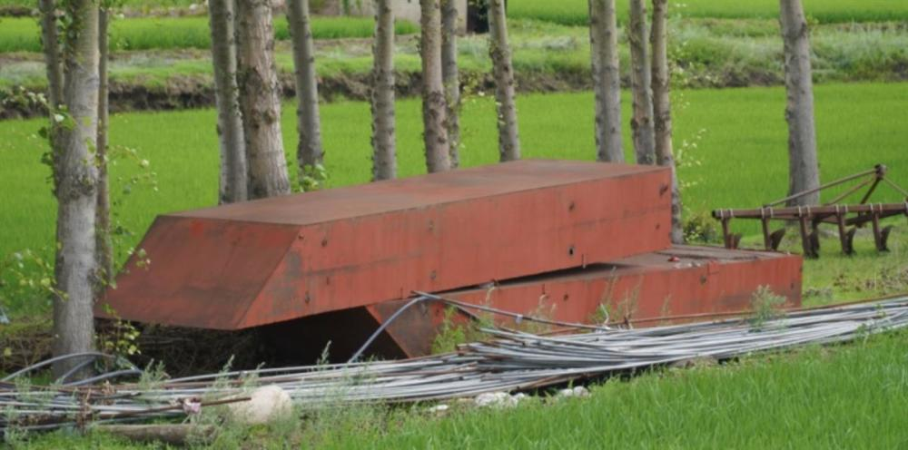
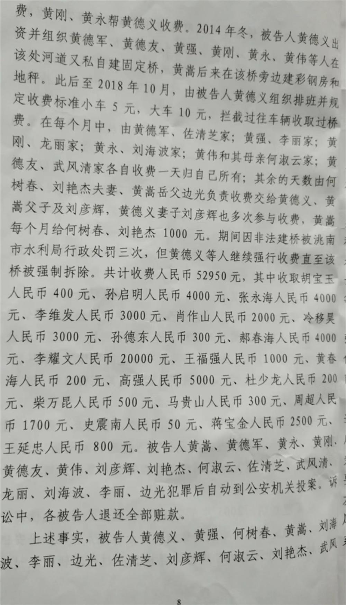

# 村民私搭浮桥被判刑，当地村民：未强制收费，偶有外地人过桥发生争执

极目新闻记者 李贤诚

近日，吉林省白城市村民黄德义私搭浮桥被判寻衅滋事罪一案，引发轩然大波。公众热议的焦点，便是此案寻衅滋事罪判定是否恰当？

7月9日，当地多位村民向极目新闻记者表示，黄德义曾是一名村小老师，因“浮桥事件”已丢了工作。当初，村民们过浮桥都是自愿交费。如果没有这座浮桥，村民需要绕行数十公里才能到达对岸。

据悉，6月底，黄德义已向白城市中级人民法院再次提起申诉，6月29日，白城市中级人民法院依照法定程序对该案登记立案，案件正在审查中。

**村民私自建桥收费，18人被以寻衅滋事罪判刑**

洮儿河，是黑龙江水系松花江西源嫩江右岸最大支流，位于内蒙古兴安盟境内与吉林省西北部。村民黄德义的家，地处洮儿河沿岸的吉林省白城市洮南市瓦房镇振林村，而河的对岸，便是白城市洮北区平安镇安全村。

_搭建浮桥的铁船（图源：央广网）_

据媒体此前报道，黄德义兄弟五人，祖上都以摆渡为业。20世纪90年代末，黄德义和他的三哥造了三条铁皮船，连接在一起，用于摆渡，但收费并无标准。2014年，他和亲友又焊了十三条铁皮船搭建浮桥，投入了近13万元。2016年4月、2016年9月和2017年11月，洮南市水利局三次给黄德义下达《行政处罚通知书》和《责令限期整改通知书》，每次罚款1万元，并让他拆除浮桥。可拆桥以后，2019年2月，黄德义被洮南市公安局以涉嫌寻衅滋事罪刑事拘留。此后，黄德义的多位家人、亲戚也被采取刑事强制措施。

2019年12月31日，洮南市人民法院作出一审判决。法院判决认定，黄德义及其他人员于2005年至2014年搭建船体浮桥收取过桥费；2014年至2018年搭建固定浮桥。黄德义组织排班并制定收费标准，小车5元大车10元，拦截过往车辆收取过桥费，总计为52950元，其行为构成寻衅滋事罪，判处黄德义有期徒刑两年，缓刑两年，其他17人分别被判处不等有期徒刑及缓刑。

_一审判决书（图源：网络）_

被判刑后，黄德义曾向洮南市人民法院提出申诉。2023年3月31日，黄德义的申诉被洮南市人民法院驳回。2023年6月26日，黄德义继续向吉林省白城市中级人民法院申诉。2023年6月29日，白城市中级人民法院依照法定程序对该案立案，目前正在审查中。

7月7日，当地官方人士在接受央广网采访时表示，针对“黄德义私搭浮桥事件”反映出来的问题，洮南市进行了专题调查研究决定，近期将在振林村附近建设一座便民桥，力争在秋收前建设完成，同时，洮南市将进一步完善交通路网，对振林村附近公路桥架设进行论证。

**当地村民及政府：建桥者并未强制收费，偶有外地人过桥时发生争执**

极目新闻记者获取的一份黄德义提交的刑事再审申请书显示，黄德义和振林村部分村民在河对岸有耕地，春耕时，因无法直接过河到对岸耕种，需要绕行几十公里去种地。因此，黄德义就自己花钱购买造桥的材料，搭建了通往河对岸的浮桥。这样既方便了自己家，也解决了两岸村民耕种和秋收的问题。

7月9日，与黄德义同村及河对岸安全村的多位村民向极目新闻记者表示，黄德义曾是村小的一名老师，如今已年过五旬，因为建浮桥收费被判刑，老师的工作也丢了，现在靠种地和打工为生。而当初，村民们过浮桥去对岸，都是自愿交费，并未强制收费，所交的费用在3元到10元不等。

“黄德义家在河对岸也承包了一部分地，建这座桥，既方便了他们家，也方便了大家。”振林村一名村民认为，建桥本就需要投入一大笔钱，通过收取一定的通行费，回收一点资金，能够理解，“如果没有这座浮桥，我们要绕几十公里才能到对岸，花费的时间和金钱要多得多。”

振林村另一村民告诉极目新闻记者，看在乡里乡亲面子上，有些村民过桥没给钱，黄德义家也就算了，她自始至终都没给过钱。

安全村的一名村民则表示，这座浮桥基本上都是由黄德义及其家人负责维护。此前，偶有外地人过桥时，对于收费不能理解，曾有过争执。有的路人明白其中缘由后会交钱，有的人不给钱也就算了。

洮南市瓦房镇政府工作人员在接受媒体采访时回应称，据其了解，黄德义搭建的浮桥确实存在收费情况，“但不是强制的”。此外，针对黄德义在搭建浮桥的过程中把道路挖烂的传闻，该工作人员也进行了否认。其表示，浮桥连接着洮南市瓦房镇振林村至白城市洮北区平安镇安全村，极大缩短了两岸村民往来的距离，村民对在此处建桥的需求也较为强烈。

**法律人士：当事人行为不具有寻衅滋事的主观故意**

7月8日，中国政法大学教授罗翔发布《私造浮桥，有罪吗？》一文称，寻衅滋事罪有四种行为方式：有随意殴打他人，有追逐、拦截、辱骂、恐吓他人、有强拿硬要或者任意损毁、占用公私财物，还有在公共场所起哄闹事，造成公共场所秩序严重混乱的。在本案中，法院认为黄某收过桥费的行为属于强拿硬要。黄某则称，自己在焊船体、搭建上投入超13万元，收费是想收回成本，同时，他从未强制收钱，都凭村民自愿，对一般的过路人，也不存在“不给钱不让过”的情况。振林村某村干部和多位洮儿河沿岸村民也证实该说法。如果上述证言属实，过桥缴费纯属自愿，也就不可能属于强拿硬要。

罗翔表示，即便认定私自建桥属于违法行为，最严重的法律后果也只有行政处罚，而无刑事责任。另外，对于民众私自建桥，也可事后补办手续，而非一律拆除，尤其是在修建桥梁能够便利民众出行的情况下更不宜动辄拆除。

_法院回应（图源：网络）_

云南刘文华律师事务所律师刘文华向极目新闻记者分析认为，虽然寻衅滋事罪被戏称为“口袋罪”，但立法层面对寻衅滋事罪规定的边界还是比较清晰的，入罪标准也比较细，针对的是“无事生非，严重破坏社会秩序”的行为。寻衅滋事罪的法律依据是《刑法》第二百九十三条以及《最高人民法院最高人民检察院关于办理寻衅滋事刑事案件适用法律若干问题的解释》。从目前披露的案件信息来看，本案当事人架设浮桥解决出行难题并适当收费以回收成本的行为，并未落入前述法律和司法解释所规定的“寻衅滋事罪”的范畴。罪刑法定，只要架设浮桥的行为没有落入法律规定的“寻衅滋事罪”范围，就不应当定罪处罚。

刘文华还提到，目前来看，本案当事人的行为，本质上是一种民间自力解决交通难题的行为，行为可能具有行政违法性，但不具有寻衅滋事的主观故意，不宜定罪入刑。建议当地司法机关复查本案，如果发现案件确有错误，应早日启动再审，依法纠错。

（来源：极目新闻）

**此前报道**

吉林白城村民私搭浮桥被判刑引争议，修桥人与官方说法出入较大

镇政府人员回应吉林私搭浮桥案：村民需求强烈，未见强制收费

吉林村民私搭浮桥收费被判刑 罗翔：司法不能背离人之常情、世之常理

