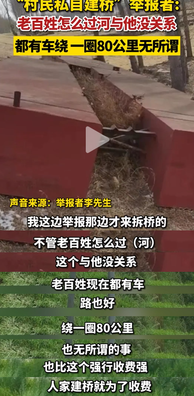

# 村民私搭浮桥被判寻衅滋事，举报者：出行难不难跟他有什么关系

​又是金腰带，又是无尸骸的，最近哥刷到频率最高的评论就是这个。

还不是“村民私造浮桥被判寻衅滋事”闹的。

本以为是单幕戏，没想到硬生生演成了造桥的、检查的、支持的、反对的、受益的、举报的、挖沙的七军乱战，

讲真，直到今天（7月10日），哥才吃全了事情的来龙去脉。

啧啧啧，这人性呐。

【一】事情太离奇

吉林白城市振林村附近有一条洮儿河，村民黄德义的祖辈在这里干过多年摆渡的营生。2014年，黄德义和亲戚们合资13万建了一座浮桥，外地车辆往来收费高点，小车5块大车10块，附近村民愿意给过桥费就给，不愿意就算了。

2015年，黄家被罚款。

2016年，黄家被罚款。

2017年，黄家被罚款。

官方说法是，浮桥没有经过审批认证，违法建筑不能确保安全，需要拆除。

2018年，浮桥被黄家人自行拆除，以为没事了。

2019年，黄德义因寻衅滋事罪被判有期徒刑2年，缓刑2年。

除了他之外，出资建桥包括后续参与收费的17名亲属，包括黄德义的2个兄弟、3个侄子、3个嫂子等等分别被判3个月拘役到1年有期徒刑不等的缓刑，年龄最小的95后，最大的70多岁。

整个家族被一锅端，得造多大的孽啊？

【二】本来是双赢

同村受益的村民直挠头，人家建桥也没大喊一声此路是我开，留下买路财。

大家过桥愿意给的就随意给点，不想给也没人拦着，就是外人过桥，要给几块钱的过桥费。

来回次数多了，有的村民觉着，不给钱自己都觉着不好意思，毕竟人家也是有投入的，而且至今没回本。

现在桥没了，回趟娘家都要绕一大圈。

省不少事呢。

如果没有浮桥，村里小卖部一周去城里进货来回多走140公里，多花五六百块。

打车从市区到振林村附近，经过浮桥，只需要60块左右打车费，不经浮桥，要花180块。

在各家媒体的采访中，到底能省多少路说法不一，看图对比，差距就很明显了。

没有浮桥，振林村到白城市的地图距离是83公里，绕了一个大圈。

安全村是与振林村隔河相望的村子，从这里去白城市，只有47公里。

隔了一条河，路程少一半。

这里需要一座桥，但这里没有桥。

洮儿河上有三座桥，其中两座距离振林村比较近，但一点的距离也有将近20公里。

典型的有市场就有供给，有人提供服务，本来是双赢的局面。

【三】寻衅滋事了

之所以罪名是寻衅滋事，当地的回应是，浮桥没有经过审批认证，无法提供安全保障。

从2015年后的三年里，每年都处罚，每次都要求拆除违法建筑，恢复河道原貌。可每次检查完，黄家人又重新搭桥。

2018年，这座浮桥又遭到举报才被强制要求拆除。

从判决文件中能发现这次举报很特别，因为是扫黑办转交的线索。

说明最初的举报是以“家族团伙”的理由举报的，不仅信访举报，还捅到了扫黑办。

结果又没被认定为“黑恶势力”，说明不是家族团伙。

可让你拆你不拆，寻衅滋事的罪名又好用，就有了今天这个结果。

【四】善人还是村霸

黄德义全家族，除了孩子，被定性为“全员恶人”。

网友说，这不就是车匪路霸吗？

讲真，浮桥没有经过审批，该拆就拆。

至于寻衅滋事，很多人有不同的看法。

要说黄家人建了浮桥，为了赚钱把能走人的河道挖了，把其他更便捷的道路堵了，或者本来有更方便的道路，他们强行霸占下来收费，那是妥妥的寻衅滋事。

可他们自己出钱，村民的现身说法，也没人诉苦遭受欺凌，被强买强卖被逼交钱。

村民说，我们明明从中受益良多。

路在这里摆着，司机自己算账，更何况村民不是次次交钱。

判决书中写明了，黄家人收过桥费赚了52950块，连本都没赚回来，更何况还被罚了几万块。

亏大了的买卖。

至于这52950块是怎么算出来的，黄家人不知道。当地有关部门给出的回应是：案件在审理中，不便过多解释。

这笔费用中，村民李某被收费最多，共2万元。这笔钱经法院退返给了李某，又被他还给了黄某。李某说：“这座桥确实给咱带来了方便。”

当然，李某也不知道这2万是怎么算出来的。

前几天，罗翔老师也下场解析“寻衅滋事罪”，认为如果村民所说属实，“过桥缴费纯属自愿，也就不可能属于强拿硬要。无强无硬，自愿缴费何罪之有？根据法律条款，即便认定私自建桥属于违法行为，最严重的法律后果也只有行政处罚，而无刑事责任。”

话说回来，既然被骂出微博的罗翔老师都下场发表了看法，那些不知什么原因对他科普法律知识心生厌恶的网友，就更加怀疑黄家人的动机了。

越品越认定黄家人就是村霸。

提炼一下大意是，一种说法认为村里人信不过，他们是一伙的，他们互相遮掩，村民才是“全员恶人”。

按照这个逻辑，村民应该让所有人免费通行，自己承担费用。

当然，如果明知道收费，司机仍然坚持从浮桥上抄近道，那就是村民的问题。

另外，无论浮桥是否为村民带来方便，因为是个人修建的浮桥，说明村民不需要它。

这部分网友认为，村民如果真有需要，有关部门不敢不修。

黄家人修了，就是动机不纯，就是坏人，值得被判刑。

该怎么理解这种逻辑呢？

“人不是你撞的，那你为什么去扶她？”

还有一种流传最广的说法也很有说服力，任谁看了都会说，别为黄家人叫屈，让子弹再飞一会。

有自称本地人的网友说，黄家人为了让村民走他家的浮桥，把原本能过河的地方毁掉了。

各有各的说法，一边法理法规，一边动机质疑以及小作文。

【五】莫名其妙的举报

毁坏河道逼村民用浮桥？

这似乎触及了浮桥被举报背后的动机问题。

虽然目前证据并不完整，黄德义对挖河道的质疑做了回应。

“因为自己修浮桥，干扰了挖沙。”

其实从卫星图可以看出，河道上有不正常的缺失，挖沙痕迹明显。

说来也是，洮儿河没桥路段几十公里，即便他想挖也挖不完。而且河流湍急，车辆过不去。

镇政府的工作人员也回应，不存在垄断浮桥过路的情况：“桥要是不好走，也没有人会选择从这里走。”

最神奇的一点是，举报者竟然露面了。

说起举报的原因，恕我直言，理解不了。

举报者说，这是2018年的事情，我举报了那边才来处理。

老百姓过河难不难，跟黄家人有什么关系，他们收钱就不对。

而且大家都有车，绕一圈80公里无所谓啦。

说起平日使用浮桥的状况，举报者说，我也走过啊，没怎么交钱。

这位的思维里，多少有点了不得的东西。

吃瓜要吃全，看戏要看完，这两天虽说有各种回应，但依旧很迷。

一座浮桥到底是咋把18人整成刑事犯罪嫌疑人，是特别神奇的法律问题。

当然，最终的结果有可能变成民生问题。

毕竟，能有一座桥，让村民不再绕远，生活方便且有安全感。

似乎是最好的结局了。

至于嚷着大家都有车，绕路80公里无所谓的村民，但凡有盘菜，也不至于喝成这样。

新闻来源

《当地回应“村民私搭浮桥被判刑事件”五大疑问》央广网

《村民私搭浮桥收费一家十余口被判刑》央广网

《实探吉林浮桥曾建地：村民和过桥者说法不一，举报者受访》大河报

《私搭浮桥被判刑当事人回应网传挖河道》都市快报

《当事人回应“私搭浮桥，村民因收费一家18口被判寻衅滋事”九大质疑》华商报

