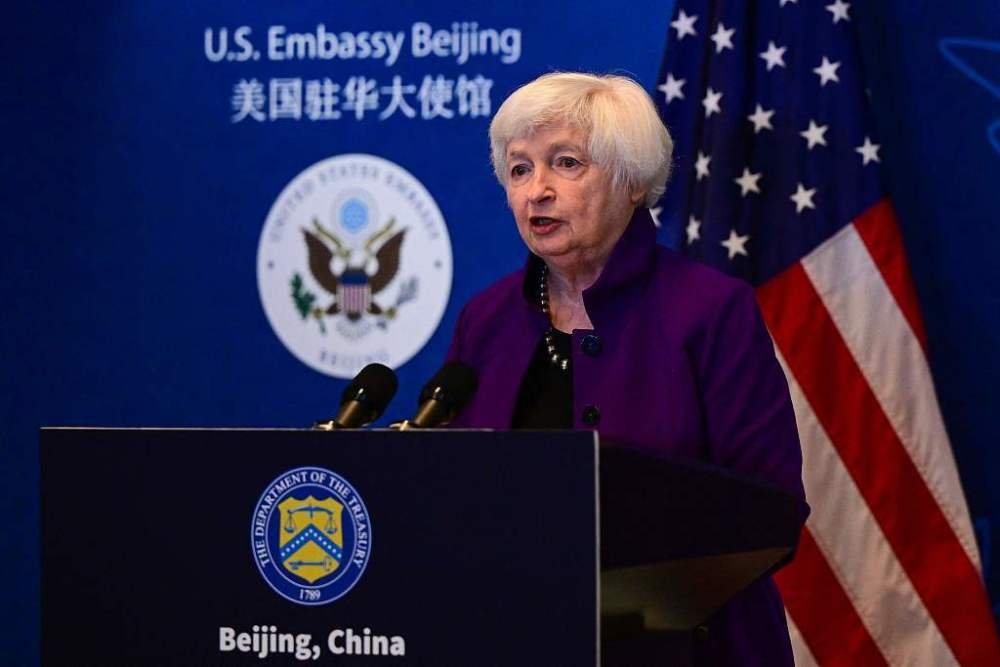

# 耶伦离开中国前重申不“脱钩”，专家：总体是务实理性、客观冷静的

【环球时报报道记者
丁雅栀赵霜】9日，美国财政部长耶伦结束了为期4天的访华行程。路透社报道称，在离开北京之前，耶伦在美国驻华使馆召开新闻发布会。她表示，与中国高层官员进行了“直接”“富有成效”的会谈，此次访问有助于使两国关系更加稳固，并重申，美国不寻求与中国经济“脱钩”。

_2023年7月9日，北京，美国财政部长耶伦在美国驻北京大使馆举行新闻发布会，重申美国不寻求与中国“脱钩”。（视觉中国）_

耶伦是继美国国务卿布林肯之后，近期第二位访华的美国政府高官。“美国和中国存在显著分歧，必须清楚且直接地进行沟通。”在新闻发布会上，耶伦表示，美国总统拜登和她都没有从“大国冲突”的框架来看待美中关系。她说，她此行的目的是和中国新的经济领导班子建立并深化联系，以期稳定两国关系、减少误解风险、探讨合作领域。

耶伦表示，美国不寻求与中国“脱钩”。她说，这“对两国都将是灾难性的，也会给世界带来不稳定”，而且“几乎不可能做到”。“我们相信，世界足够大，足以让我们两国繁荣发展，两国都有义务负责任地处理这一关系，找到共处和共享全球繁荣的途径。”

4天内，耶伦与中国高级官员进行了约10小时的会谈。8日，中国国务院副总理、中美经贸中方牵头人何立峰会见耶伦。中美双方同意就应对全球性挑战加强沟通与合作；同意继续保持交流互动。9日，中央财办副主任、财政部副部长廖岷就美财政部部长耶伦访华答媒体记者询问时表示，此次美财政部部长耶伦访华期间，中美经贸团队举行了长时间坦诚会谈。中方重申了对双边经贸关系的立场，表达了中方关切，讨论了宏观经济及全球性挑战议题。后续双方将保持沟通。

中国外交学院教授李海东9日对《环球时报》记者表示，从耶伦的总结可以看出，她对中美关系的认识总体上是务实理性、客观冷静的，有作为经济专家的独特见解和平衡视角。作为经贸领域的高层领导人，耶伦表达出彼此之间加强往来的观点，有助于双方更准确和更长远地去思考彼此之间的经贸关系。经贸是中美关系的压舱石，其对中美关系中的政治稳定、人文交流等具有非常大的影响。

美国有线电视新闻网（CNN）报道称，在经历了数月的紧张关系后，华盛顿方面正寻求“引导”中美关系重回正轨。但同时，美国对中国公司继续实施制裁，推动日本和荷兰等盟友限制向中国销售先进半导体制造设备，并煽动其他发达经济体“对抗北京的经济胁迫”。耶伦在访华最后一天表示，美国将继续采取“有针对性的行动”来保护自己及盟友的国家安全利益，同时确保这些行动“透明”“目标明确”。但中方在8日的会谈中对这种做法提出了异议，中国媒体的报道显示，中方认为，泛化国家安全不利于正常经贸往来。

路透社称，因“国家安全”、台湾问题、美国对先进技术的出口禁令等诸多因素，美中关系正处于低谷。“不过近来，华盛顿在努力修复这两个最大的经济体之间的关系。”上月，美国国务卿布林肯访问了北京，这是拜登就任总统以来美国最高外交官的首次访华。美国总统气候问题特使克里也计划在本月访问北京。自去年8月初时任众议院议长佩洛西窜访台湾后，中美之间的气候问题交流便被束之高阁。

“尽管北京和华盛顿都表示高层讨论将继续，但双边关系中最棘手的方面，尤其是在获取先进技术方面的争斗，可能会加剧两国关系的紧张。”CNN称，在耶伦出访前几天，中国宣布对两种涉及半导体制造的战略材料限制出口，此举被视为对拜登政府限制先进半导体制造设备输华的回应。在8日的会谈中，中方表达了对美方对华制裁限制措施的关切。尽管耶伦辩解称，相关的科技禁令不是为了扼杀中国的经济，但华盛顿昆西研究所东亚研究员杰克·沃纳对CNN表示，耶伦的中国同行不太可能被她的论点说服，美国和中国的领导人都认为这些技术是未来增长的基础，中国认为这些限制是试图让中国永久服从于美国的力量。

在发布会上，耶伦坦言，没有任何一次访问能在一夜之间解决中美之间的挑战，但她期望这次访华能与中国新的经济团队建立一个有韧性、有成效的沟通渠道。李海东认为，耶伦的访华能否对中美关系或者在美国现有整体对华政策的决策圈内产生更大的扩散效应，仍需观察，如果美国国内依然弥漫对华不友好的氛围，那么耶伦在这次访华过程中取得的积极成果很难持续。

