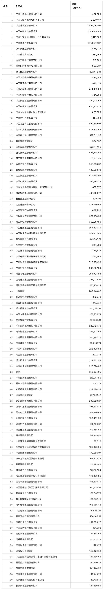
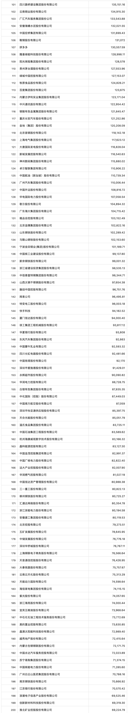
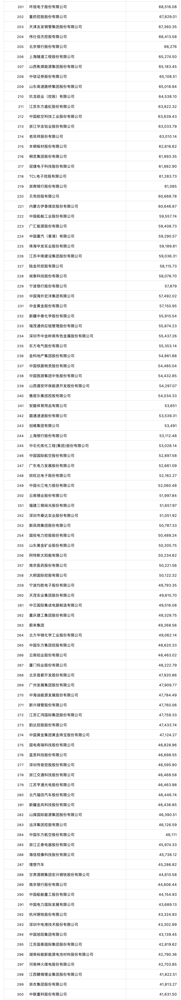
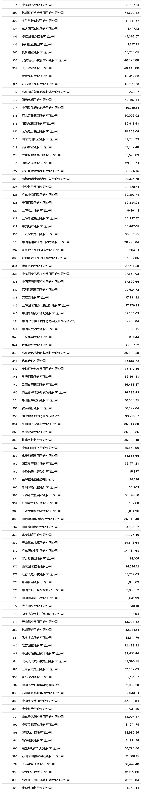
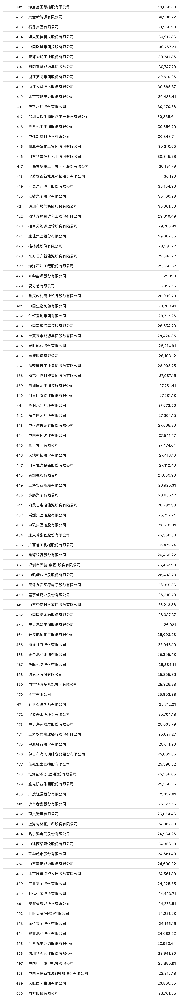

# 《财富》中国上市公司500强揭晓，中石化、中石油和中国建筑位居前三

7月11日，2023年《财富》中国上市公司500强排行榜正式发布。榜单显示，500家上榜的中国上市公司总营业收入达到65.8万亿元人民币，净利润为4.7万亿元。上榜公司的年营收门槛接近237亿元。今年榜单前三的头部公司依次是：中石化、中石油和中国建筑。中国中铁位列第四，中国平安位列第五。位列前十的还有京东和阿里巴巴，其中京东位列第7位，阿里巴巴位列第10位。造车新势力“蔚小理”均登上该榜单，蔚来集团、理想汽车和小鹏汽车在榜单中的排名分别为第263位、第287位、第450位。

